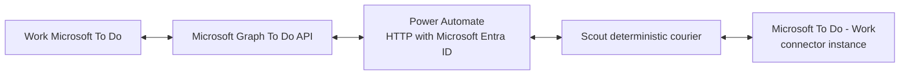

# Extended Work To Do Bridge

## Decision

The extended bridge preserves the same Mission Control user experience and
source ownership as the native Microsoft To Do connector while replacing its
direct OAuth transport with tenant-managed Power Automate calls to Microsoft
Graph.



Power Automate and Scout are transport components. Tasks must appear in MC under
a separate `Microsoft To Do - Work` connector instance, with each remote To Do
list represented by a normal MC source list. They must not appear as Scout tasks
or pass through Triage.

## Why an extended tier is necessary

The standard Microsoft To-Do (Business) Power Automate connector exposes core
task and list operations but does not expose all Graph To Do relationships and
properties. The extended tier calls Graph endpoints for parity.

| Capability | Standard To-Do connector | Extended Graph bridge |
|---|---:|---:|
| Title, status, importance, due date | Read/write | Read/write |
| Notes/body and reminders | Read/write | Read/write |
| Lists | Read/create/update/delete | Read/create/update/delete |
| Text hashtags in title/notes | Read; gated text write | Read; gated text write |
| Native categories and MC micro-status | Not exposed by current V2 actions | Read/merge/write |
| Checklist items/subtasks | Not exposed | Read/create/update/delete |
| Recurrence | Not exposed | Read/write full pattern and range |
| Linked resources | Not exposed | Read/create/delete |
| Attachment metadata | Not exposed | Read |
| Small attachment upload | Not exposed | Possible Graph JSON/base64 path; PoC required |
| Large attachment upload | Not exposed | Requires a binary-capable component |
| Delta synchronization | Not exposed | Supported per list and task collection |

## Authentication choices

### A. HTTP With Microsoft Entra ID (recommended PoC)

Power Automate's premium **HTTP With Microsoft Entra ID** connector uses a
Microsoft-owned multi-tenant application. The user creates a connection and
signs in with the work account.

- No customer-created application/client ID is entered for the normal delegated
  connection.
- Set both resource values to the tenant's Graph endpoint, normally
  `https://graph.microsoft.com`.
- The connector service principal still requires delegated Graph scopes.
- Current Microsoft guidance requires a Global Administrator to grant the
  required scopes to the connector application, using Microsoft's permission
  grant process when they are not preauthorized.
- The connection acts as the signed-in user and cannot access more data than
  that user can access.
- Power Automate classifies this connector as Premium, and tenant DLP policy may
  block it or prevent it from sharing data with the HTTP request trigger.

For this design, request only delegated `Tasks.ReadWrite`. It covers task/list
CRUD and the checklist, category, recurrence, linked-resource, and supported
attachment operations required by the bridge. Verify the exact granted scopes
and every endpoint in a sanitized tenant PoC before enabling writes.

This path avoids a customer app registration, but it does **not** avoid tenant
administrator involvement: the Microsoft connector application's delegated
permission grant, premium licensing, Conditional Access, and DLP policy still
need approval.

### B. Generic HTTP connector with OAuth

Use only if the Entra-aware connector cannot obtain the required scope or cannot
handle an endpoint.

- Requires a customer Entra application/client ID.
- Requires delegated Graph permissions and tenant consent.
- Requires an OAuth secret or certificate lifecycle.
- Makes Power Automate responsible for that connection rather than MC.

This is operationally close to registering MC directly and should be justified
by a policy requirement that Graph execution remain inside Power Platform.

### C. Custom connector

A custom connector can provide typed To Do actions, central policy, and cleaner
flow authoring. It normally requires a customer Entra application/client ID and
delegated Graph consent. Choose it if multiple flows or makers will reuse the
extended API surface; do not build it merely to avoid several HTTP actions.

### D. Service-specific Graph actions

There is no unrestricted, general-purpose "Microsoft Graph" connector that
automatically grants arbitrary Graph access. Some Microsoft 365 connectors
offer **Send an HTTP request** actions, but their scopes are service-specific
and documented as limited. The Office 365 Groups action is not an appropriate
To Do transport.

## Graph flow design

### Extended pull

The source-controlled recipe is
`flows/extended-pull.flow.recipe.json`.

1. Accept a request validated by
   `schemas/extended-pull-request.schema.json`, containing the connector ID and
   opaque per-list delta links. Never log those links.
2. When `listDeltaLink` is null, call
   `GET /v1.0/me/todo/lists/delta`; otherwise call the supplied opaque delta
   link exactly as returned by Graph.
3. For each selected list, call
   `GET /v1.0/me/todo/lists/{listId}/tasks/delta` when its token is null, or its
   supplied opaque task delta link on subsequent runs. Do not use `$expand` for
   To Do sub-resources on the delta collection; fetch them separately.
4. Follow every `@odata.nextLink` for list delta, task delta, checklist items,
   linked resources, and attachment metadata. Never label a partial page
   complete.
5. Store the final `@odata.deltaLink` per collection only after MC accepts the
   whole response.
6. Fetch checklist items, linked resources, and attachment metadata for changed
   tasks when those capabilities are enabled.
7. Return a response validated by
   `schemas/extended-pull-response.schema.json`. Include attachment metadata
   only; never put `contentBytes` in the Scout envelope.

The first delta traversal is effectively a full baseline. Later traversals
return changed entities and deletion tombstones rather than rereading the
entire account. Treat Graph delta links as opaque and sensitive: do not parse,
edit, log, summarize, or expose them in UI. If Graph invalidates a token, mark
the connector as requiring a reset and rebuild the affected baseline; do not
silently continue from a partial state.

Power Automate must honor `Retry-After` on Graph 429 responses and apply bounded
retry for transient 5xx responses. A run advances no delta link until all pages
and sub-resource calls succeed and MC acknowledges the complete ingest.

### Extended write-back

The source-controlled recipe is
`flows/extended-writeback.flow.recipe.json`.

Supported operation classes:

- Task create/update/complete/delete
- List create/rename/delete
- Category merge/remove
- Checklist item create/update/delete
- Recurrence update/clear
- Linked-resource create/delete
- Attachment metadata refresh and delete

Every operation carries an idempotency key and returns an independent result.
Use sequential execution initially. Persist destructive-operation keys in
Dataverse or another tenant-approved durable store before enabling delete,
move, attachment, or list mutations.

## Attachment boundary

The Entra HTTP connector documentation warns that raw binary requests are not
supported and that binary content can be corrupted. Graph supports attachment
creation below 3 MB through JSON `contentBytes`, but this must be proven with a
sanitized file before use. Files over 3 MB require an upload session and binary
chunk PUTs, which are not compatible with the documented connector limitation.

Therefore:

1. Phase 1 synchronizes attachment metadata and deep links only.
2. Small JSON/base64 upload remains disabled until a tenant PoC proves exact
   byte round-tripping and DLP approval.
3. Large uploads require a binary-capable tenant component such as an approved
   Azure Function, Logic App path, or custom connector implementation.
4. Attachment bytes never pass through Scout or appear in Power Automate run
   summaries.

## Field and action gates

| Field/action | Policy |
|---|---|
| Title, status, importance, due date, reminder | Normal merge/write-back policy |
| Notes/body | Size-limited; conflict-check `bodyLastModifiedDateTime` |
| Text hashtags | Parse from title/body; write only explicitly source-owned hashtags |
| Categories | Merge by default; do not replace unrelated corporate categories |
| MC micro-status category | Modify only MC-owned category names |
| Checklist items | Correlate by stable remote child ID |
| Recurrence | Preserve complete Graph pattern/range; reject lossy display strings |
| Move between lists | Treat returned task ID as a new source ID and reconcile atomically |
| Task/list/checklist deletion | Dual MC request plus tenant environment gate |
| Shared-list mutation | Require explicit confirmation |
| Attachments | Metadata-only by default; bytes remain tenant-managed |
| Created/modified timestamps | Read-only |
| My Day state/order | Unsupported by the public Graph bridge |

## MC capability negotiation

The work connector instance records its transport and enabled capabilities:

```json
{
  "transport": "power-automate-graph",
  "capabilityProfile": "extended-v1",
  "capabilities": {
    "categories": true,
    "checklistItems": true,
    "recurrence": true,
    "linkedResources": true,
    "attachmentMetadata": true,
    "attachmentUpload": false,
    "delete": false
  }
}
```

MC must hide or make read-only any operation not advertised by the deployed
flow. A standard bridge can later be upgraded to extended transport without
changing connector identity, source list IDs, or task ownership.

### Hashtags are not Graph categories

Mission Control's native To Do transformer extracts `#tag` tokens from task
titles and notes. The standard bridge retains this behavior because those text
fields are synchronized. This provides useful tag parity without Graph category
access, but it is not the same source primitive:

- A hashtag is part of user-authored text and has no Outlook category color or
  category identity.
- A native category is a Graph `categories` collection entry.
- MC must not write local hub, project, or AI-inferred tags into corporate task
  text.
- An explicitly confirmed source hashtag can be added or removed through a
  conflict-checked title/body edit.
- Category-backed micro-status and native category management remain extended
  capabilities.

## Required tenant PoC

1. Confirm premium connector licensing.
2. Confirm DLP allows Microsoft Graph data to cross the selected trigger/action
   boundary.
3. Grant the HTTP-with-Entra connector application delegated
   `Tasks.ReadWrite` to one test user.
4. Verify list/task delta pagination and replay behavior.
5. Verify categories, checklist items, recurrence, and linked resources.
6. Verify 401/403 handling after consent or Conditional Access changes.
7. Verify write idempotency and per-item partial failure.
8. Verify small attachment bytes only if attachment upload is requested.
9. Document national-cloud Graph endpoints when applicable.
10. Keep all destructive capabilities disabled until the PoC and audit review
    pass.

## Official references

- [HTTP With Microsoft Entra ID connector](https://learn.microsoft.com/en-us/connectors/webcontentsv2/)
- [HTTP with Microsoft Entra ID (preauthorized)](https://learn.microsoft.com/en-us/connectors/webcontents/)
- [Microsoft Graph To Do overview](https://learn.microsoft.com/en-us/graph/api/resources/todo-overview?view=graph-rest-1.0)
- [todoTask resource](https://learn.microsoft.com/en-us/graph/api/resources/todotask?view=graph-rest-1.0)
- [Power Platform data policies](https://learn.microsoft.com/en-us/power-platform/admin/prevent-data-loss)
