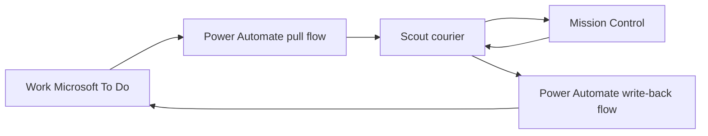

# Work Microsoft To Do Power Automate Bridge

This kit defines the tenant-side half of the fallback sync path:



Use this only when the work tenant will not approve Mission Control's direct
Microsoft Graph connector. Direct Graph remains simpler and more reliable.

Two bridge tiers are defined:

1. **Standard:** Microsoft To-Do (Business) actions for core fields.
2. **Extended:** delegated Graph calls from Power Automate for categories,
   checklist items, recurrence, linked resources, attachment metadata, and
   delta sync. See [EXTENDED-BRIDGE.md](EXTENDED-BRIDGE.md).

## What is included

- `flows/pull.flow.recipe.json` describes the pull flow action by action.
- `flows/writeback.flow.recipe.json` describes the write-back flow.
- `schemas/` contains the HTTP request and response contracts.
- `config.example.json` lists values that must be supplied per environment.
- `scout/work-todo-bridge-sync.template.json` is the disabled Scout courier
  schedule and prompt template.

The flow recipes are source-controlled build specifications, not Power Automate
export packages. Power Automate does not accept arbitrary workflow JSON as an
import. See [Import and export](#import-and-export).

## Prerequisites

- A work Power Automate environment where you are an Environment Maker.
- A Microsoft To-Do (Business) connection under the intended work identity.
- Permission to use the HTTP request trigger. Tenant licensing and DLP policy
  may classify HTTP actions or triggers as premium or block cross-boundary use.
- A reachable Mission Control HTTPS MCP endpoint.
- The `mc_todo_sync_pull_request`, `mc_todo_sync_ingest`,
  `mc_todo_sync_changes`, and `mc_todo_sync_ack` MCP tools deployed in Mission
  Control. Do not enable the Scout automation until these tools are reachable.

## Flow A: pull snapshot

Build a cloud flow named `MC - Work Todo Pull`.

This standard flow intentionally performs a **full snapshot on every run**. The
current Microsoft To-Do (Business) actions do not expose the Graph delta-link
contract needed for reliable create/update/delete deltas. A timestamp-only
filter would miss deletions and can create an incomplete authoritative view.

1. Add **When an HTTP request is received**.
2. Use `schemas/pull-request.schema.json` as its request schema.
3. Validate `connectorInstanceId` against the expected value. Reject any other
   value with HTTP 403.
4. Add **List all to-do lists (V2)** from Microsoft To-Do (Business).
5. Initialize an array variable named `lists`.
6. For each returned list:
   1. Add **List to-do's by folder (V2)** with Top Count `999`.
   2. Use a Select action to retain only fields in
      `schemas/pull-response.schema.json`.
   3. Append the list and selected tasks to `lists`.
7. Return HTTP 200 with:

```json
{
  "schemaVersion": "1.0",
  "connectorInstanceId": "work-todo",
  "syncTimestamp": "2026-08-07T18:00:00Z",
  "isFullSnapshot": true,
  "lists": []
}
```

The connector supports at most 999 tasks per list in this action. If a list can
exceed that limit, fail the flow rather than returning an incomplete full
snapshot; use direct Graph with pagination for that tenant.

The standard action does not expose caller-managed task page links. Receiving
999 tasks is therefore treated as ambiguous and fails safely, even when the
list happens to contain exactly 999 items. Configure connector retry/backoff for
429 responses and process lists sequentially to stay within the documented
connector throttling limit.

For incremental synchronization, use the extended Graph tier. Its first delta
request establishes a complete baseline; later requests return only changes and
deletion tombstones.

## Flow B: write back changes

Build a cloud flow named `MC - Work Todo Writeback`.

1. Add **When an HTTP request is received**.
2. Use `schemas/writeback-request.schema.json` as its request schema.
3. Validate `connectorInstanceId`.
4. Initialize `results` as an array.
5. For each change, switch on `operation`:
   - `update`: call **Update to-do (V2)**.
   - `complete`: call **Update to-do (V2)** with status `completed`.
   - `delete`: reject unless `allowDelete` is true, then call
     **Delete to-do (V2)**.
6. Append one result for every input item. Do not stop the whole batch after one
   task fails.
7. Return HTTP 200 when all items succeed, or HTTP 207 when results are mixed.

Each update carries an `idempotencyKey`. Power Automate does not provide durable
idempotency automatically; for production, persist processed keys in a
tenant-approved store such as Dataverse. Reapplying the same To Do field values
is safe, but a delete must never be retried without a durable key check.

## Mission Control presentation and fidelity

The bridge is represented as a separate `Microsoft To Do - Work` connector
instance. Corporate To Do lists become ordinary MC source lists, and their tasks
participate in Today, My Day, Kanban, Timeline, search, projects, and tags. The
transport must not surface as a Scout source.

| Field or relationship | Standard bridge | Extended bridge |
|---|---:|---:|
| Title, status, importance, due date | Read/write | Read/write |
| Notes/body | Read/write | Read/write |
| Reminder | Read | Read |
| Lists | Read | Read |
| Text hashtags in title/notes | Read; write through explicit text edits | Read; write through explicit text edits |
| Native To Do categories and MC micro-status | No | Read; advanced write currently gated |
| Checklist items | No | Read-only until checklist operations ship |
| Recurrence | No | Read-only until recurrence operations ship |
| Linked resources | No | Read-only until linked-resource operations ship |
| Attachment metadata | No | Read |
| Attachment bytes | No | Gated; separate binary-safe path |

MC must derive editability from the connector instance's advertised capability
profile. Unsupported fields remain visible only when available in source data
and are read-only; MC must never claim successful synchronization for a field
that the installed bridge cannot write.

MC already recognizes `#tag` tokens embedded in a To Do title or notes body.
Those textual hashtags survive the standard bridge because it transports both
fields. They are distinct from native Microsoft To Do/Outlook categories:

- Reading hashtags requires no Graph category operation.
- MC may offer an explicit "write as hashtag" action by editing title or notes,
  but must not automatically serialize every MC tag. Hub tags, AI-inferred tags,
  and project tags remain local.
- Removing a hashtag is a text edit and must preserve unrelated user content.
- Native categories, category colors, and category-backed MC micro-status still
  require the extended Graph tier.

## Security

- Treat each generated HTTP trigger URL as a secret. Its signature grants
  invocation rights.
- Prefer the trigger's tenant authentication option when available. Otherwise,
  rotate signed URLs after accidental disclosure.
- Do not put trigger URLs, connection IDs, access tokens, or MC API keys in this
  repository or in Scout summaries.
- Apply request-size limits and restrict `connectorInstanceId`.
- Enable Power Platform run history retention and audit logging.
- Put Microsoft To-Do and the HTTP trigger in DLP groups approved by the tenant.
- Start with `allowDelete: false`.

## Import and export

Yes, a flow configuration can be uploaded, but Power Automate expects one of
these Microsoft-generated formats:

1. **Solution ZIP (preferred):** create both flows inside a Power Platform
   solution, use connection references and environment variables, export the
   solution, then import it through **Solutions > Import**.
2. **Legacy package ZIP:** export each non-solution flow with **My flows >
   Export > Package (.zip)**, then upload it with **Import Package (Legacy)**.
   This supports one flow per package and has weaker lifecycle management.

The reliable bootstrap process is:

1. Build the two flows once from the recipes in a development tenant.
2. Put them in a solution with a Microsoft To-Do connection reference.
3. Add environment variables for the connector ID and delete policy.
4. Export the unmanaged solution ZIP.
5. Import that ZIP into the corporate environment and bind the connection
   reference to the intended work identity.
6. Copy the generated pull and write-back trigger URLs into Scout's protected
   configuration.
7. After the `mc_todo_sync_pull_request`, `mc_todo_sync_ingest`,
   `mc_todo_sync_changes`, and `mc_todo_sync_ack` tools are deployed, copy the
   Scout template into the installed automation directory and set `enabled` to
   true.

The `MC Work Todo Allow Delete` environment variable must default to false. The
write-back flow permits deletion only when both that protected environment
setting and the individual MC request set `allowDelete` to true.

Power Platform CLI can pack a valid unpacked solution source tree, but it does
not turn these action recipes into cloud-flow components. A tenant-authored seed
solution (or access to a development environment where the flows can be created)
is still required to obtain Microsoft-valid workflow component metadata,
connection-reference logical names, and environment-variable definitions. Once
that seed exists, this repository can retain the unpacked source and
deterministically build an unmanaged import ZIP. The importer will still require
the user to bind its connection references; no ZIP can embed or transfer the
corporate user's authenticated connection safely.

## Smoke test

1. Invoke the pull URL with the example request.
2. Validate the response against `schemas/pull-response.schema.json`.
3. Confirm Scout passes the response unchanged to MC.
4. Edit one imported task in MC.
5. Run write-back with one `update` operation.
6. Confirm the work To Do task changed and MC acknowledged only that successful
   result.
7. Retry the same update and confirm it has no additional side effect.
