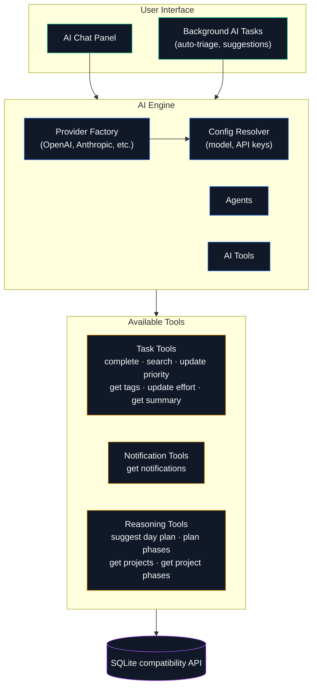
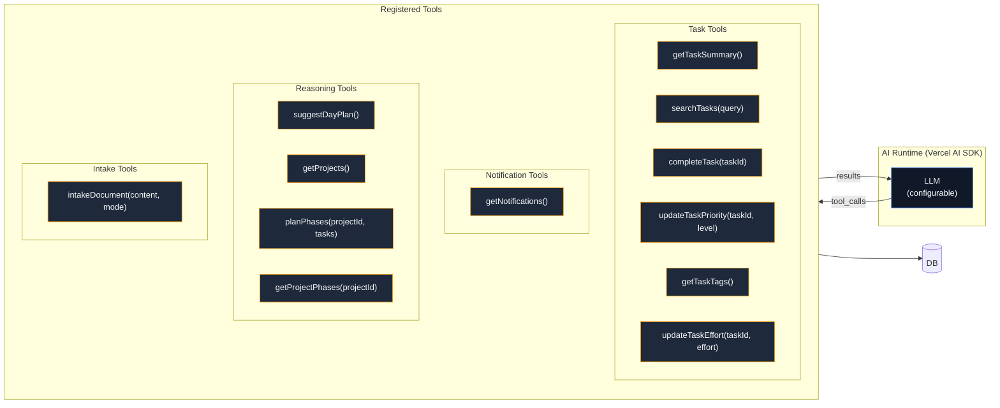

# AI Engine — Detail Architecture

> Multi-provider AI with tool-calling agents for task management.

---

## AI System Overview

---

## AI Capabilities

| Feature | Description |
|---------|-------------|
| **Chat** | Interactive assistant with streaming responses |
| **Tool Calling** | AI can complete tasks, search, update priorities |
| **Phase Planning** | AI groups tasks into execution phases |
| **Document Intake** | AI extracts structured findings from arbitrary document formats |
| **Background Tasks** | Auto-triage, daily suggestions, pattern analysis |
| **Multi-Provider** | Supports OpenAI, Anthropic, and others via Vercel AI SDK |

---

## Tool Architecture

---

## Configuration

PostgreSQL is the approved production target and is implemented for the core
persistence composition. The AI paths shown here still use the legacy SQLite
compatibility API, including direct Drizzle and `better-sqlite3` access. They
fail explicitly rather than falling back or mixing backends when PostgreSQL is
selected. Port each required AI workflow behind a backend-neutral repository
before enabling it in the PostgreSQL deployment. See the
[database scaling and migration strategy](../design/active/database-scaling-strategy.md).

AI config is resolved from `app_settings` in the database:

- **Provider** — which LLM service (openai, anthropic, etc.)
- **Model ID** — specific model within the provider
- **API Key** — stored in env vars or settings
- **Max steps** — limits tool-calling loops (default: 5)

## Synchronous and durable execution

Mission Control uses a hybrid contract. Existing bounded inference stays synchronous
when it has no resumable provider session or durable side effects and is expected to
finish within the request's timeout. Work must use a durable run when it can outlive
the browser or iOS process, needs reconnectable progress, owns a provider session,
or performs retryable side effects. Moving a short request to the durable path is an
explicit feature decision, not a provider default.

`ai_runs` is the provider-neutral source of truth. It records the feature,
sensitivity, execution route, requested and actual provider/model, fallback state,
correlation ID, attempts, lease, timeout, status, and redacted failure. `ai_run_events`
is an append-only, idempotent progress stream addressed by a durable cursor.
`ai_provider_sessions` contains the optional provider session reference encrypted
with AES-256-GCM. The provider reference is never a run identifier and is never
returned by an API.

The current durable AI worker is a SQLite compatibility workflow. It claims
runs with an immediate transaction and a renewable lease. Completion, failure,
retry, cancellation, timeout, and cleanup mutations are revision/owner guarded.
Retry commands and events carry idempotency keys. An expired worker lease either
requeues the same MC run for resume or records a terminal timeout/failure; it
never creates a second MC run. Provider adapters receive `cancel` and `cleanup`
seams and can load or atomically attach the run's protected session reference.

The long-lived worker runtime always starts the provider-neutral retention loop.
Workers reclaim expired execution leases only for routes backed by their registered
executors, so an unregistered route is never recovered or claimed by the wrong
provider. Provider cleanup is abortable and bounded by
`MC_AI_RUN_CLEANUP_TIMEOUT_MS`.

The direct Copilot SDK spike plugs into this boundary through
`DurableCopilotRunStore` and `DurableCopilotEventSink`. Its lifecycle checkpoint and
content-free Houston events are persisted by MC, while the SDK session ID remains
encrypted and revocable. Copilot is an executor, not the persistence boundary.
No production Copilot route is enabled by this foundation.

### Reconnect API

| Endpoint | Purpose |
|---|---|
| `GET /api/ai/runs` | Redacted run history; pass its returned `nextBefore` cursor to continue |
| `GET /api/ai/runs/:runId` | Current run status and route metadata |
| `GET /api/ai/runs/:runId/events?after=<cursor>` | Ordered progress after a durable cursor |
| `POST /api/ai/runs/:runId/cancel` | Idempotent cooperative cancellation |
| `POST /api/ai/runs/:runId/retry` | Idempotent explicit retry; requires `Idempotency-Key` |

Mutation routes use the existing same-origin or `MC_API_KEY` trust policy. Responses
never include executor checkpoints, leases, request fingerprints, prompts, results,
or provider session references. The AI settings screen polls the history API so a
new browser or resumed PWA can reconnect by MC run ID. Executors can opt into the
existing notification system with `notifyOnCompletion` and
`notifyDurableAiRunCompletion`.

### Retention and redaction

Terminal run and event metadata defaults to 30 days for `standard`, 7 days for
`restricted`, and 1 day for `local-only`; environment overrides are documented in
`.env.example`. Provider session references expire after at most 24 hours or the run
retention deadline, whichever comes first. Pruning revokes expired encrypted
references before deleting terminal runs and their events.

Event payloads use explicit per-kind field allowlists with bounded nested schemas;
unknown event kinds persist an empty payload. Content aliases, prompts, responses,
results, reasoning, tool arguments, credentials, session IDs, stacks, and unknown
keys cannot reach persistence or reconnect responses. Error text is length-limited
and redacts authorization headers, common token formats, and assigned secret values.
Features that need durable output must add a separately reviewed storage contract
instead of placing full prompts or results in run metadata.
