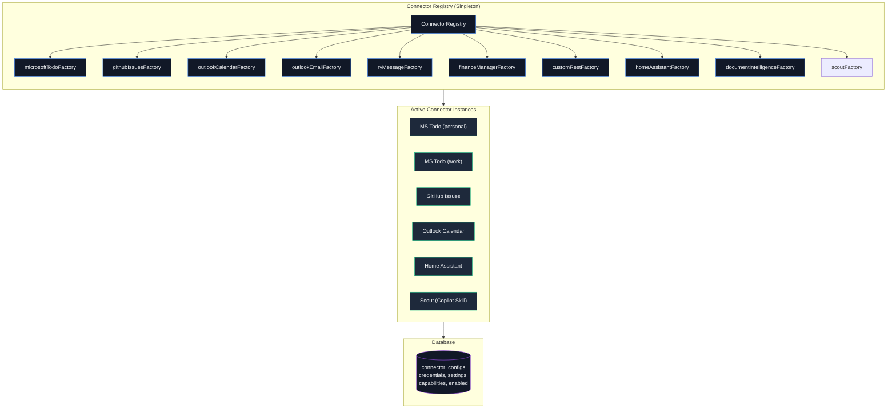
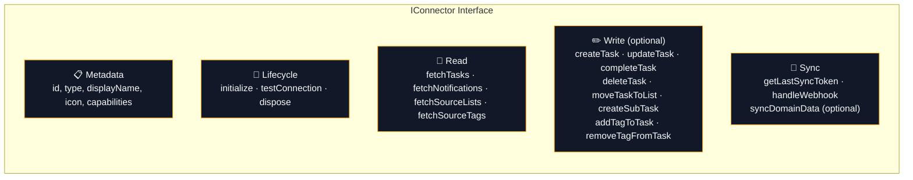
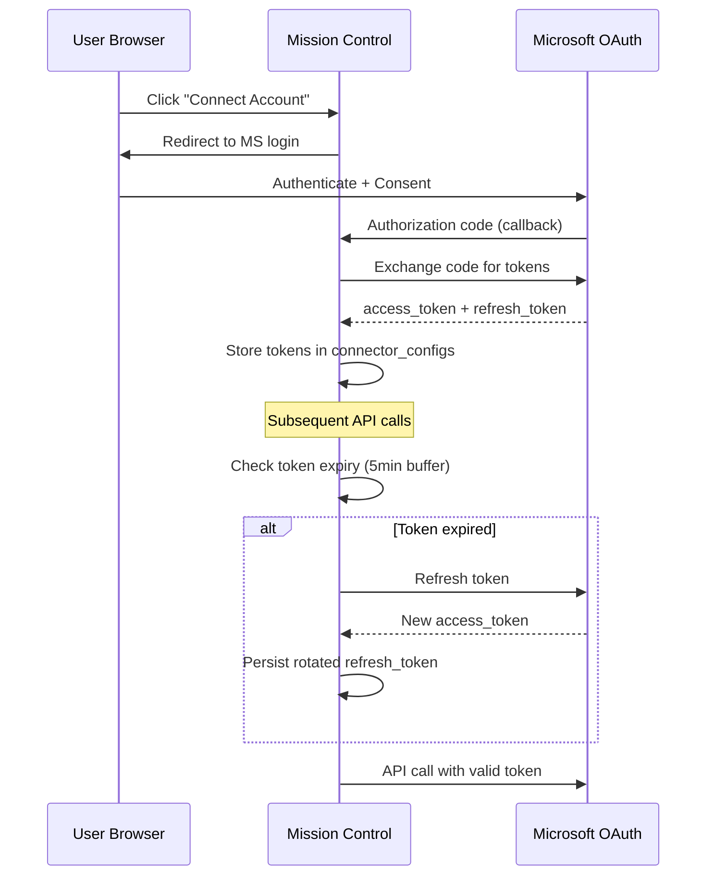

# Connectors — Detail Architecture

> Each connector is a self-contained adapter implementing `IConnector`.

## GitHub entity identity (permanent)

The GitHub Issues connector is permanently NodeID-first. Identity is
`external_entities.stable_id` (the GitHub NodeID), resolved through
`external_entity_bindings` and `external_entity_locators`.

`tasks.source_id`, `source_lists.source_id`, and `task_linked_sources.source_id`
are **mutable locators** used for API addressing and display. They change on
rename and transfer and are never identity, never a matching fallback, and never
the thing to edit when identity looks wrong. Missing or unverified NodeID
evidence blocks the affected surface instead of falling back to a locator; every
GitHub mutation must run inside a NodeID write-fence authorization.

See [GitHub NodeID Identity Operations](../operations/github-nodeid-identity.md)
and [Stable GitHub Entity Identity](../design/active/github-entity-identity.md).

---

## Connector System Overview

---

## IConnector Interface

Every connector implements these capabilities:

---

## Task production and authority matrix

`src/lib/connectors/task-source-profiles.ts` is the runtime source of truth.
Every registered connector is classified exactly once. Notification-only
connectors are excluded from task field-policy and mutation surfaces.

| Connector | Production | Task source model | Source-controlled or merged fields | MC-local fields | Write-back |
|---|---|---|---|---|---|
| Microsoft Todo | Tasks | `remote-managed` | Title, description, lifecycle, priority, due date, recurrence, micro-status | Effort, estimate, reminders, snooze, organization, Kanban | Direct |
| GitHub Issues | Tasks | `remote-managed` | Title, description, lifecycle, priority, micro-status, dependencies | Due date, recurrence, effort, estimate, reminders, snooze, organization, Kanban | Direct |
| Custom REST | Tasks | Per instance: `remote-managed` when `updateEndpoint` is configured; otherwise `remote-mirror` | Title, description, lifecycle, priority, due date | Remaining planning and organization fields | Direct only with `updateEndpoint` |
| OWL (Paperless-ngx) | Tasks | `remote-managed` hybrid | Title, description, lifecycle, priority, due date, and source snooze are source-controlled; lifecycle is writable through supported outcomes | Status reason, micro-status, effort, estimate, recurrence, reminders, organization, dependencies, Kanban | Direct for To Do, Done, Won't do, and task-scoped outcome actions |
| Scout | Tasks | `ingested` | Title, description, priority, and due date use override-aware inbound merge | Lifecycle and all other ordinary task fields | Pull-based lifecycle feed; no direct connector call |
| Outlook Calendar | Notifications only | — | — | — | — |
| Outlook Email | Notifications only | — | — | — | — |
| RyMessage | Experimental notification webhook now; task candidates/materializations proposed | Provider-owned bridge | RyMessage owns extraction; the selected provider owns task fields and lifecycle | Provenance-aware planning overlays only after correlation | Through selected provider; future relationship lifecycle through a dedicated Companion integration boundary |
| Home Assistant | Notifications only | — | — | — | — |
| Tyrion | Notifications only | — | — | — | — |
| Monarch Money | Notifications only | — | — | — | — |

Notification-only classifies ordinary task production; it does not prohibit a
connector-owned domain mirror. Finance uses optional `syncDomainData` to persist
derived transaction context without creating connector-owned tasks. Mission
Control may separately project an authoritative local Finance exception into an
`mc-owned` task under the `mission-control` connector identity. This does not
change Tyrion's notification-only capability and must not restore generic Finance
`create_task` notification actions. The `finance`, `finance-manager`, and
`monarch-money` aliases are all excluded from generic task destinations; provider
resolution omits and action execution rejects `create_task` for each alias.

RyMessage is a transitional exception to the notification-only runtime
classification. Its current connector emits notifications, while the proposed
bridge contract allows RyMessage to produce task candidates and materialize
them in a selected provider. When Microsoft To Do is selected, MC imports the
provider task through `microsoft-todo` and attaches RyMessage provenance; it
must not create a second task under the `rymessage` identity. See
[RyMessage Task Materialization](../design/proposed/rymessage-task-materialization.md).

### Tyrion snapshot contract

The Tyrion connector talks to the Tyrion Monarch Bridge v1 API with
server-side service authentication. Monarch remains the source of truth. Mission
Control stores connector-scoped transaction identity, source fields, provenance,
pending state, and lifecycle state while preserving local attribution, triage,
and confirmed-category fields during source upserts. Category write-back is
recorded in `finance_mutation_audit`; local confirmation occurs only after the
bridge acknowledges success.

Each normalized snapshot page is separately submitted to Tyrion's protected
batch attribution v2 service. Mission Control sends only deterministic opaque
connector-scoped source and required account references, date, normalized
merchant, observation time, and a structured existing manual decision. Raw
Monarch account IDs and card masks never cross the boundary. Mission Control
authenticates
with the finance-manager bearer token over private service DNS; Tyrion fixes the
service actor and household scope server-side. Tyrion remains the sole policy
and engine runtime.

The connector stores a random identity namespace beside its token in protected,
browser-redacted connector credentials. Ordinary SHA-256 derivation produces
stable connector-scoped transaction, recurring, category, category-group,
account, and tag references for both attribution and Finance Insight
publication. The namespace is identity state, not authentication key material;
the bearer token remains authentication only.

Finance connector creation requires an exact uppercase ISO-4217
`settings.householdCurrency`. It is non-secret application state shared by
connector setup and Finance Insight publication validation. Existing connectors
without it remain editable, preserve unrelated settings, and report
`needs-configuration` until an operator selects a supported currency.

Attribution metadata is persisted beside the transaction mirror. Current review
exceptions are unique by connector and transaction, with idempotent manual
resolution audit history. Manual decisions always take precedence over later
sync or re-attribution results. Attribution service, policy, timeout, or contract
failures mark only attribution unavailable and update the exception projection;
they do not fail, tombstone, or roll back a completed transaction generation.

#### Finance attention routing

`FinanceManagerConnector.syncDomainData()` reconciles privacy-safe attention after
the source projections and Finance Insight occurrence refresh. The routing matrix
follows [`octo-org/tyrion#175`](https://github.com/octo-org/tyrion/pull/175):

| Authoritative signal | Mission Control route |
|---|---|
| Large transaction or material recurring increase insight | Notification only |
| Category or merchant variance | High-confidence members in one bounded monthly digest; medium confidence remains status only |
| Open human-reviewable attribution exception (`no-match`, confidence ambiguity, rule conflict, historical tie, or manual-decision conflict) | Actionable notification while unresolved for less than 24 hours; one `mc-owned` task and My Day item at 24 hours when the latest authoritative observation is no more than 24 hours old |
| Attribution configuration, authentication, service, policy, timeout, contract, or system failure | Connector/Finance status only; settle any prior actionable projection |
| Failed `finance_mutation_audit` write-back | Status only while retries remain; one `mc-owned` task and My Day item after at least three failed attempts while the authoritative failure is no more than 60 minutes old |
| Resolved or superseded exception | Complete or cancel the projected task and settle the notification |
| Stale source state | Preserve existing work with stale metadata; never create, escalate, or reopen attention |

Finance Insight occurrences never create tasks or My Day items. Insight source
lifecycle remains independent from local read, dismiss, snooze, and handled state.
Stable connector-scoped SHA-256 identities deduplicate notification, task, and My
Day projection across replay, restart, and concurrent attempts. Source settlement
removes automatic My Day projection; a same-day user exclusion is respected.
Eligible source rows are read in indexed 500-row keyset pages and fully drained in
one immediate transaction. Page size bounds each query, not total routable work;
sets above 5,000 rows remain atomic and cannot starve newer attention behind
historical, stale, status-only, settled, or already-routed rows.
Routing metadata contains opaque local references and stable codes only, never
mutation error text or upstream identifiers.

Historical `attribution_not_configured` projections can be repaired only through
the trusted, audited, dry-run-gated operator endpoint documented in
[`Finance Attention Projection Repair`](../operations/finance-attention-repair.md).
The repair leaves authoritative attribution exceptions intact so a later
configured sync can replace them with genuine review work. The repair is fenced
to the August 11-12, 2026 MC producer window and does not infer Tyrion policy
state, outbox state, or fingerprint-key parity.

Scheduler quarantine, one-shot canary sync, and exact-generation Finance Insight
cutover procedures are documented in
[`Tyrion Recovery and Finance Insight Readiness`](../operations/tyrion-recovery-readiness.md).

Duplicate signal detection remains owned by Tyrion
([`octo-org/tyrion#174`](https://github.com/octo-org/tyrion/pull/174)).
Tyrion also owns connector-health normalization; Mission Control owns the local
outage attention lifecycle described below. Due/overdue reconciliation remains
deferred because Tyrion has no authoritative reconciliation event DTO/API and
Mission Control has no `/finance/reconciliation` producer route. Neither signal
is inferred locally.

Tyrion owns reusable Monarch session material and exposes only normalized
connector health to Mission Control. Mission Control persists one outage episode
per connector and polls the authenticated health contract every five minutes.
Transient degraded or unavailable health is suppressed before 15 minutes. At
15 minutes it produces one high actionable notification; verified expired or
unauthenticated health produces one critical actionable notification
immediately. Either episode promotes to one local task and My Day item at four
hours. Episode timing, notification identity, and task identity survive restart.

The primary notification action is always **Reconnect Monarch**. Mission Control
constructs its destination from the allowlisted server-side Tyrion operations
root and adds only `source=mission-control`; producer-provided URLs and reusable
authentication material are rejected. Returning from Tyrion does not prove
recovery. Mission Control independently requires connected live health, a
successful bounded `POST /sync?days=30`, and a second connected live health
check before resolving the notification and task. Until then, Finance settings
and the Finance overview show one persistent stale-data warning.

Web and worker processes resolve the same canonical Bridge API base URL from the
connector's persisted settings. Production defaults to the protected,
backend-only `https://tyrion.example/api/connector/v1` gateway. Deployments can
select another validated HTTPS base path or a safe private/local HTTP bridge.
The gateway exposes only the bounded connector contract and does not expose
browser-proxy, raw bridge, authentication, session, or internal routes.
The same services reach attribution at
`http://tyrion-operations-ui:3000/api/internal/v2/attribution/batch`.
`https://tyrion.example` is the bounded operational UI and is intentionally not
the bridge API origin.

The current bridge exposes bounded `GET /transactions` snapshots, not a durable
change feed. Its opaque page cursor is used only while reading one attempt and is
never persisted as a delta cursor. Initial backfill is bounded to 365 days.
Incremental runs replay a configurable overlap from the last successful window.
Only a fully fetched generation advances the watermark or tombstones records
absent from that authoritative window. Failed and cancelled generations retain
partial idempotent upserts but cannot delete records or advance success state.
Historical edits or deletions older than the overlap require an explicit full
backfill covering the affected date.

#### Tyrion reference and current-snapshot projections

Mission Control also synchronizes six complete normalized bridge datasets:
accounts, category groups, categories, transaction tags, recurring obligations,
and current-month budgets. This contract depends on
[`octo-org/tyrion#154`](https://github.com/octo-org/tyrion/pull/154). Account balances
are intentionally excluded.

Reference datasets use connector-scoped upstream identity and soft-deactivate rows
missing from a complete fetch. Recurring and budget data publish as atomic
generations. Consumers read only the current generation; the immediately previous
successful generation is retained for comparison or recovery. A failed, malformed,
oversized, or interrupted fetch cannot deactivate references or replace a snapshot.

`finance_dataset_sync_state` records each dataset independently. Freshness derives
from bridge `provenance.fetchedAt`, not the local completion time. The default
freshness window is 24 hours for reference sets and 6 hours for recurring and budget
snapshots. An authoritative empty generation is `fresh`; no successful generation
is `unavailable`; an expired successful generation is `stale`; mixed required
dataset states or a later failed attempt produce aggregate `partial` status.

`/finance` is the bounded operator-facing consumer of this health contract. It
shows aggregate and per-dataset observability while keeping transaction snapshot
health separate. It does not expose dataset contents, balances, upstream or
generation identifiers, raw errors, or finance-management mutations.

Finance connector health, connection tests, recovery, scheduler operations,
attribution review, manual KID decisions, and Finance Insight cutover now use
the backend-selected core and `FinanceWorkerPersistence` compositions in both
web and worker processes. The `finance.operator` sub-port owns bounded
health/test/cutover persistence, while the attribution, dataset, recovery, and
sync-operator sub-ports retain their existing domain ownership. SQLite and
PostgreSQL expose the same public responses, trusted Finance authorization,
redaction, compare-and-swap and generation fences, idempotency, and recovery
semantics. Bridge and Tyrion calls, bounded recovery sync, retry scheduling,
and dispatcher wakes remain outside database transactions.

The remaining end-user Finance APIs use the backend-selected
`FinanceWorkerPersistence.web` sub-port for kids and spending, transactions,
summaries, finance notifications, dismissal, and operations-overview reads.
Category write-back keeps provider I/O between a durable claim and a
claim-token-fenced completion/failure update. PostgreSQL uses native finance
tables and never falls back to SQLite.

See [Monarch dataset sync operations](../operations/monarch-dataset-sync.md) for
ordering, retries, status fields, and recovery.

Local and legacy `mission-control` task identities are explicit `mc-owned`
sources. Generic inbound-webhook tasks are explicit `ingested` sources.

Custom REST creation, update, and deletion are independent instance
capabilities. `createEndpoint` permits creating a task but does not make
existing mirrored tasks writable; only `updateEndpoint` does that.
`deleteEndpoint` permits an explicit upstream deletion even when the instance
otherwise remains a read-only remote mirror. Generic webhook ingestion consults
this catalog, so notification-only connectors cannot create tasks from
task-shaped notification payloads. Task creation requests identify the selected
`connectorInstanceId`; type-only fallback is accepted only when exactly one
enabled instance of that connector type exists.

OWL's general connector `write` capability must not be interpreted as full-field
write access. Its field profile permits lifecycle write-back to its
Paperless-ngx-backed workflow; Paperless-ngx remains the system of record for
documents. OWL exposes only `todo`, `done`, and `cancelled` through the generic
task lifecycle UI, labelled **To Do**, **Done**, and **Won't do**. These map to
OWL `pending`, `completed`, and `dismissed`. `in_progress` and `blocked` are not
valid OWL source states; working or blocked context remains MC-local in
`microStatus` and `statusReason`.

OWL is also the authority for whether an Action Queue item is trusted.
`action_ready=true` is required for modern records to become MC tasks or triage
items; explicit false records become Needs Review notifications linked to the
exact OWL item. Missing readiness fields are treated as legacy responses and
retain pre-readiness behavior. MC keeps its cross-source Do Next model and uses
the dedicated OWL workspace only as a deadline-first projection for lightweight
execution. It does not duplicate OWL's document correction or pipeline
administration. See the
[OWL/MC integration contract](../design/proposed/INTEGRATION-API-CONTRACT.md).

OWL pulls request every lifecycle state and every page. Inbound states normalize
as follows:

| OWL state | MC lifecycle | Additional state |
|---|---|---|
| `pending` | `todo` | Clears source snooze |
| `completed` or legacy `done` | `done` | Completion time comes from `updated_at` |
| `dismissed` | `cancelled` | `metadata.owlDisposition = dismissed` |
| `not_an_action` | `cancelled` | `metadata.owlDisposition = not_an_action` |
| `snoozed` | `todo` | `snoozedUntil` and `metadata.owlSnoozedUntil` preserve the source deadline |

`updated_at` is the source freshness timestamp and is also retained as
`metadata.owlUpdatedAt`; `metadata.owlStatus` preserves the unnormalized source
state. A complete OWL pull does not treat absence as deletion, because terminal
outcomes are represented explicitly by the all-status feed.

Source snooze and classifier/extraction feedback use the task-scoped
`POST /api/tasks/{taskId}/owl` route. The server resolves both task and connector
instance, validates the allowlisted payload, writes OWL first, and updates local
status, snooze, priority, and metadata only after OWL succeeds. Upstream errors
are returned to the UI and are not recorded as local success.

Scout does not accept direct task writes; Mission
Control persists Scout lifecycle locally and Scout observes it through the
status-change feed.

### Remote-mirror disposition

Read-only remote mirrors keep upstream status source-authoritative. They expose
the separate MC-local `localDisposition` field:

| Value | Meaning |
|---|---|
| `active` | Included in normal task queries; the backward-compatible default |
| `handled` | Hidden from active views because the user handled it locally |
| `dismissed` | Hidden from active views because the user dismissed it locally |

Disposition changes never call a connector, invoke connector deletion, or set
`pending_push`. Inbound sync and webhook refreshes preserve the local value.
If instance configuration later changes the source model, a preserved
non-active disposition can still be restored to `active` locally; it is never
reinterpreted as upstream status.
Queries default to `active`; callers can request `localDisposition=handled`,
`localDisposition=dismissed`, `localDisposition=all`, a comma-separated
`localDispositions`, or the structured `disposition:` filter token.

> **⚠️ Field sync safety:** When adding priority or effort support to a connector, follow the [Field Sync Patterns](field-sync-patterns.md) guide to avoid overwriting locally-set values.

---

## Auth Flow (Microsoft Connectors)

---

## Adding a New Connector

1. Create folder: `src/lib/connectors/<name>/`
2. Implement `IConnector` interface
3. Export a `ConnectorFactory` from an `index.ts`
4. Register in `src/lib/connectors/index.ts` → `registerDefaultConnectorFactories()`
5. Classify it in `task-source-profiles.ts` as task-producing or notification-only
6. For a task producer, define a complete field profile and source model
7. Add capabilities to the database schema if needed
8. **Follow the [Field Sync Patterns](field-sync-patterns.md) guide** — especially the checklist for priority, effort, tags, and status mapping to avoid data-loss bugs

---

## Effort Level Mapping

The `effort` field on tasks is a **numeric 1–5 scale** (nullable). Connectors should map it when the source platform supports an equivalent concept.

### Display Measures (User-Configurable)

The stored value is always 1–5. The display label is determined by user setting:

| Value | T-shirt | Simple | Effort Label | Time Bucket |
|-------|---------|--------|-------------|-------------|
| 1     | XS      | 1      | Trivial     | <1hr        |
| 2     | S       | 2      | Easy        | Half-day    |
| 3     | M       | 3      | Medium      | Full-day    |
| 4     | L       | 4      | Hard        | Multi-day   |
| 5     | XL      | 5      | Epic        | Week+       |

### Connector Mapping Guide

| Source Platform | Source Field | Mapping Strategy |
|----------------|-------------|-----------------|
| **GitHub Issues** | Labels (`effort:xs`, `size/m`, etc.) | Pattern match on label names; see `issue-transformer.ts` → `inferEffort()` |
| **Jira** (future) | Story Points field | Map numeric ranges: 1→1, 2→2, 3–5→3, 8→4, 13+→5 |
| **Azure DevOps** (future) | Story Points / Effort field | Same numeric range mapping as Jira |
| **Microsoft Todo** | *(no native field)* | Leave as `null`; users set manually |
| **Todoist** (future) | Labels (convention) | Match `@effort-*` label patterns |
| **Linear** (future) | Estimate field (T-shirt sizes) | Direct 1:1 map: 0→null, 1→1, 2→2, 3→3, 5→4, 8→5 |

When implementing a new connector, export an `inferEffort()` function in your transformer that returns `number | undefined`. The field is optional — returning `undefined` leaves effort unset.
