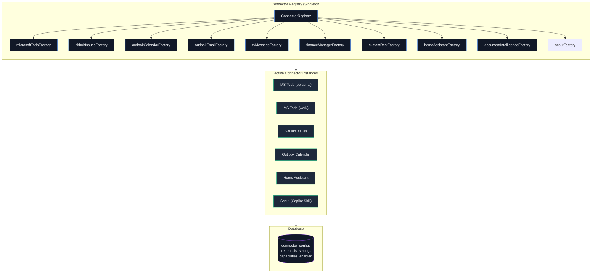
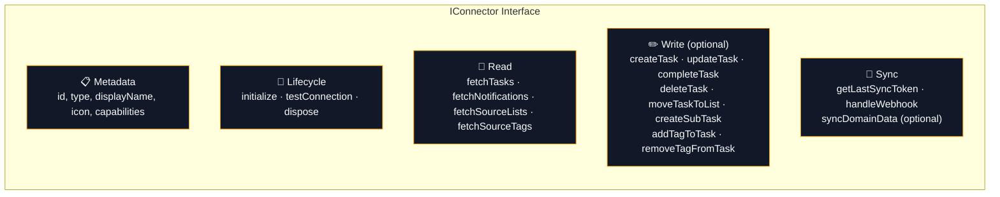
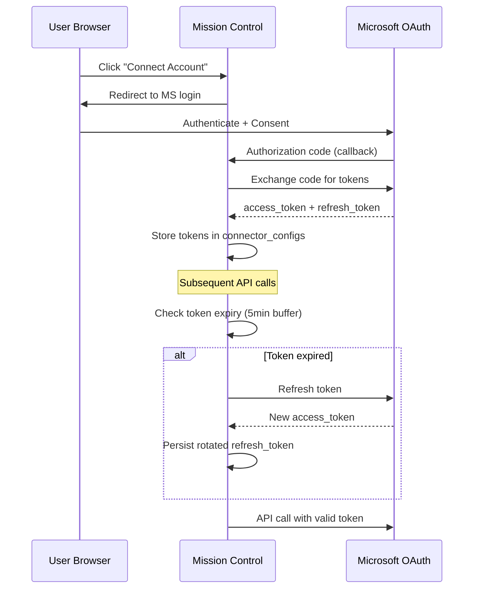

# Connectors — Detail Architecture

> Each connector is a self-contained adapter implementing `IConnector`.

---

## Connector System Overview

---

## IConnector Interface

Every connector implements these capabilities:

---

## Task production and authority matrix

`src/lib/connectors/task-source-profiles.ts` is the runtime source of truth.
Every registered connector is classified exactly once. Notification-only
connectors are excluded from task field-policy and mutation surfaces.

| Connector | Production | Task source model | Source-controlled or merged fields | MC-local fields | Write-back |
|---|---|---|---|---|---|
| Microsoft Todo | Tasks | `remote-managed` | Title, description, lifecycle, priority, due date, recurrence, micro-status | Effort, estimate, reminders, snooze, organization, Kanban | Direct |
| GitHub Issues | Tasks | `remote-managed` | Title, description, lifecycle, priority, micro-status, dependencies | Due date, recurrence, effort, estimate, reminders, snooze, organization, Kanban | Direct |
| Custom REST | Tasks | Per instance: `remote-managed` when `updateEndpoint` is configured; otherwise `remote-mirror` | Title, description, lifecycle, priority, due date | Remaining planning and organization fields | Direct only with `updateEndpoint` |
| OWL (Paperless-ngx) | Tasks | `remote-managed` hybrid | Title, description, status reason, priority, and due date are source-read-only; status is writable | Effort, estimate, recurrence, reminders, snooze, micro-status, organization, dependencies, Kanban | Direct for status only |
| Scout | Tasks | `ingested` | Title, description, priority, and due date use override-aware inbound merge | Lifecycle and all other ordinary task fields | Pull-based lifecycle feed; no direct connector call |
| Outlook Calendar | Notifications only | — | — | — | — |
| Outlook Email | Notifications only | — | — | — | — |
| RyMessage | Notifications only | — | — | — | — |
| Home Assistant | Notifications only | — | — | — | — |
| Tyrion | Notifications only | — | — | — | — |
| Monarch Money | Notifications only | — | — | — | — |

Notification-only classifies ordinary task production; it does not prohibit a
connector-owned domain mirror. Finance uses optional `syncDomainData` to persist
derived transaction context without creating connector-owned tasks. Mission
Control may separately project an authoritative local Finance exception into an
`mc-owned` task under the `mission-control` connector identity. This does not
change Tyrion's notification-only capability and must not restore generic Finance
`create_task` notification actions. The `finance`, `finance-manager`, and
`monarch-money` aliases are all excluded from generic task destinations; provider
resolution omits and action execution rejects `create_task` for each alias.

### Tyrion snapshot contract

The Tyrion connector talks to the Tyrion Monarch Bridge v1 API with
server-side service authentication. Monarch remains the source of truth. Mission
Control stores connector-scoped transaction identity, source fields, provenance,
pending state, and lifecycle state while preserving local attribution, triage,
and confirmed-category fields during source upserts. Category write-back is
recorded in `finance_mutation_audit`; local confirmation occurs only after the
bridge acknowledges success.

Each normalized snapshot page is separately submitted to Tyrion's protected
batch attribution v1 service. Mission Control sends only opaque keyed source
references, date, normalized merchant, an irreversible instrument fingerprint,
observation time, and a structured existing manual decision. Mission Control
authenticates with the finance-manager bearer token over private service DNS;
Tyrion fixes the service actor and household scope server-side. Tyrion remains
the sole policy and engine runtime.

Attribution metadata is persisted beside the transaction mirror. Current review
exceptions are unique by connector and transaction, with idempotent manual
resolution audit history. Manual decisions always take precedence over later
sync or re-attribution results. Attribution service, policy, timeout, or contract
failures mark only attribution unavailable and update the exception projection;
they do not fail, tombstone, or roll back a completed transaction generation.

#### Finance attention routing

`FinanceManagerConnector.syncDomainData()` reconciles privacy-safe attention after
the source projections and Finance Insight occurrence refresh. The routing matrix
follows [`octo-org/tyrion#175`](https://github.com/octo-org/tyrion/pull/175):

| Authoritative signal | Mission Control route |
|---|---|
| Large transaction or material recurring increase insight | Notification only |
| Category or merchant variance | High-confidence members in one bounded monthly digest; medium confidence remains status only |
| Open attribution exception | Actionable notification while unresolved for less than 24 hours; one `mc-owned` task and My Day item at 24 hours when the latest authoritative observation is no more than 24 hours old |
| Failed `finance_mutation_audit` write-back | Status only while retries remain; one `mc-owned` task and My Day item after at least three failed attempts while the authoritative failure is no more than 60 minutes old |
| Resolved or superseded exception | Complete or cancel the projected task and settle the notification |
| Stale source state | Preserve existing work with stale metadata; never create, escalate, or reopen attention |

Finance Insight occurrences never create tasks or My Day items. Insight source
lifecycle remains independent from local read, dismiss, snooze, and handled state.
Stable connector-scoped SHA-256 identities deduplicate notification, task, and My
Day projection across replay, restart, and concurrent attempts. Source settlement
removes automatic My Day projection; a same-day user exclusion is respected.
Eligible source rows are read in indexed 500-row keyset pages and fully drained in
one immediate transaction. Page size bounds each query, not total routable work;
sets above 5,000 rows remain atomic and cannot starve newer attention behind
historical, stale, status-only, settled, or already-routed rows.
Routing metadata contains opaque local references and stable codes only, never
mutation error text or upstream identifiers.

Duplicate and connector-health signal detection, identity, and lifecycle remain
owned by Tyrion ([`octo-org/tyrion#174`](https://github.com/octo-org/tyrion/pull/174)).
Mission Control does not invoke those handlers because no approved authenticated
cross-process transport exists. Due/overdue reconciliation is also deferred:
Tyrion has no authoritative reconciliation event DTO/API and Mission Control has
no `/finance/reconciliation` producer route. Neither signal is inferred locally.

Web and worker processes resolve the same canonical Bridge API base URL from the
connector's persisted settings. Production defaults to the protected,
backend-only `https://tyrion.example/api/connector/v1` gateway. Deployments can
select another validated HTTPS base path or a safe private/local HTTP bridge.
The gateway exposes only the bounded connector contract and does not expose
browser-proxy, raw bridge, authentication, session, or internal routes.
The same services reach attribution at
`http://tyrion-operations-ui:3000/api/internal/v1/attribution/batch`.
`https://tyrion.example` is the bounded operational UI and is intentionally not
the bridge API origin.

The current bridge exposes bounded `GET /transactions` snapshots, not a durable
change feed. Its opaque page cursor is used only while reading one attempt and is
never persisted as a delta cursor. Initial backfill is bounded to 365 days.
Incremental runs replay a configurable overlap from the last successful window.
Only a fully fetched generation advances the watermark or tombstones records
absent from that authoritative window. Failed and cancelled generations retain
partial idempotent upserts but cannot delete records or advance success state.
Historical edits or deletions older than the overlap require an explicit full
backfill covering the affected date.

#### Tyrion reference and current-snapshot projections

Mission Control also synchronizes six complete normalized bridge datasets:
accounts, category groups, categories, transaction tags, recurring obligations,
and current-month budgets. This contract depends on
[`octo-org/tyrion#154`](https://github.com/octo-org/tyrion/pull/154). Account balances
are intentionally excluded.

Reference datasets use connector-scoped upstream identity and soft-deactivate rows
missing from a complete fetch. Recurring and budget data publish as atomic
generations. Consumers read only the current generation; the immediately previous
successful generation is retained for comparison or recovery. A failed, malformed,
oversized, or interrupted fetch cannot deactivate references or replace a snapshot.

`finance_dataset_sync_state` records each dataset independently. Freshness derives
from bridge `provenance.fetchedAt`, not the local completion time. The default
freshness window is 24 hours for reference sets and 6 hours for recurring and budget
snapshots. An authoritative empty generation is `fresh`; no successful generation
is `unavailable`; an expired successful generation is `stale`; mixed required
dataset states or a later failed attempt produce aggregate `partial` status.

`/finance` is the bounded operator-facing consumer of this health contract. It
shows aggregate and per-dataset observability while keeping transaction snapshot
health separate. It does not expose dataset contents, balances, upstream or
generation identifiers, raw errors, or finance-management mutations.

See [Monarch dataset sync operations](../operations/monarch-dataset-sync.md) for
ordering, retries, status fields, and recovery.

Local and legacy `mission-control` task identities are explicit `mc-owned`
sources. Generic inbound-webhook tasks are explicit `ingested` sources.

Custom REST creation, update, and deletion are independent instance
capabilities. `createEndpoint` permits creating a task but does not make
existing mirrored tasks writable; only `updateEndpoint` does that.
`deleteEndpoint` permits an explicit upstream deletion even when the instance
otherwise remains a read-only remote mirror. Generic webhook ingestion consults
this catalog, so notification-only connectors cannot create tasks from
task-shaped notification payloads. Task creation requests identify the selected
`connectorInstanceId`; type-only fallback is accepted only when exactly one
enabled instance of that connector type exists.

OWL's general connector `write` capability must not be
interpreted as full-field write access. Its field profile permits only status
write-back to its Paperless-ngx-backed workflow; Paperless-ngx remains the
system of record for documents. Scout does not accept direct task writes; Mission
Control persists Scout lifecycle locally and Scout observes it through the
status-change feed.

### Remote-mirror disposition

Read-only remote mirrors keep upstream status source-authoritative. They expose
the separate MC-local `localDisposition` field:

| Value | Meaning |
|---|---|
| `active` | Included in normal task queries; the backward-compatible default |
| `handled` | Hidden from active views because the user handled it locally |
| `dismissed` | Hidden from active views because the user dismissed it locally |

Disposition changes never call a connector, invoke connector deletion, or set
`pending_push`. Inbound sync and webhook refreshes preserve the local value.
If instance configuration later changes the source model, a preserved
non-active disposition can still be restored to `active` locally; it is never
reinterpreted as upstream status.
Queries default to `active`; callers can request `localDisposition=handled`,
`localDisposition=dismissed`, `localDisposition=all`, a comma-separated
`localDispositions`, or the structured `disposition:` filter token.

> **⚠️ Field sync safety:** When adding priority or effort support to a connector, follow the [Field Sync Patterns](field-sync-patterns.md) guide to avoid overwriting locally-set values.

---

## Auth Flow (Microsoft Connectors)

---

## Adding a New Connector

1. Create folder: `src/lib/connectors/<name>/`
2. Implement `IConnector` interface
3. Export a `ConnectorFactory` from an `index.ts`
4. Register in `src/lib/connectors/index.ts` → `registerDefaultConnectorFactories()`
5. Classify it in `task-source-profiles.ts` as task-producing or notification-only
6. For a task producer, define a complete field profile and source model
7. Add capabilities to the database schema if needed
8. **Follow the [Field Sync Patterns](field-sync-patterns.md) guide** — especially the checklist for priority, effort, tags, and status mapping to avoid data-loss bugs

---

## Effort Level Mapping

The `effort` field on tasks is a **numeric 1–5 scale** (nullable). Connectors should map it when the source platform supports an equivalent concept.

### Display Measures (User-Configurable)

The stored value is always 1–5. The display label is determined by user setting:

| Value | T-shirt | Simple | Effort Label | Time Bucket |
|-------|---------|--------|-------------|-------------|
| 1     | XS      | 1      | Trivial     | <1hr        |
| 2     | S       | 2      | Easy        | Half-day    |
| 3     | M       | 3      | Medium      | Full-day    |
| 4     | L       | 4      | Hard        | Multi-day   |
| 5     | XL      | 5      | Epic        | Week+       |

### Connector Mapping Guide

| Source Platform | Source Field | Mapping Strategy |
|----------------|-------------|-----------------|
| **GitHub Issues** | Labels (`effort:xs`, `size/m`, etc.) | Pattern match on label names; see `issue-transformer.ts` → `inferEffort()` |
| **Jira** (future) | Story Points field | Map numeric ranges: 1→1, 2→2, 3–5→3, 8→4, 13+→5 |
| **Azure DevOps** (future) | Story Points / Effort field | Same numeric range mapping as Jira |
| **Microsoft Todo** | *(no native field)* | Leave as `null`; users set manually |
| **Todoist** (future) | Labels (convention) | Match `@effort-*` label patterns |
| **Linear** (future) | Estimate field (T-shirt sizes) | Direct 1:1 map: 0→null, 1→1, 2→2, 3→3, 5→4, 8→5 |

When implementing a new connector, export an `inferEffort()` function in your transformer that returns `number | undefined`. The field is optional — returning `undefined` leaves effort unset.
