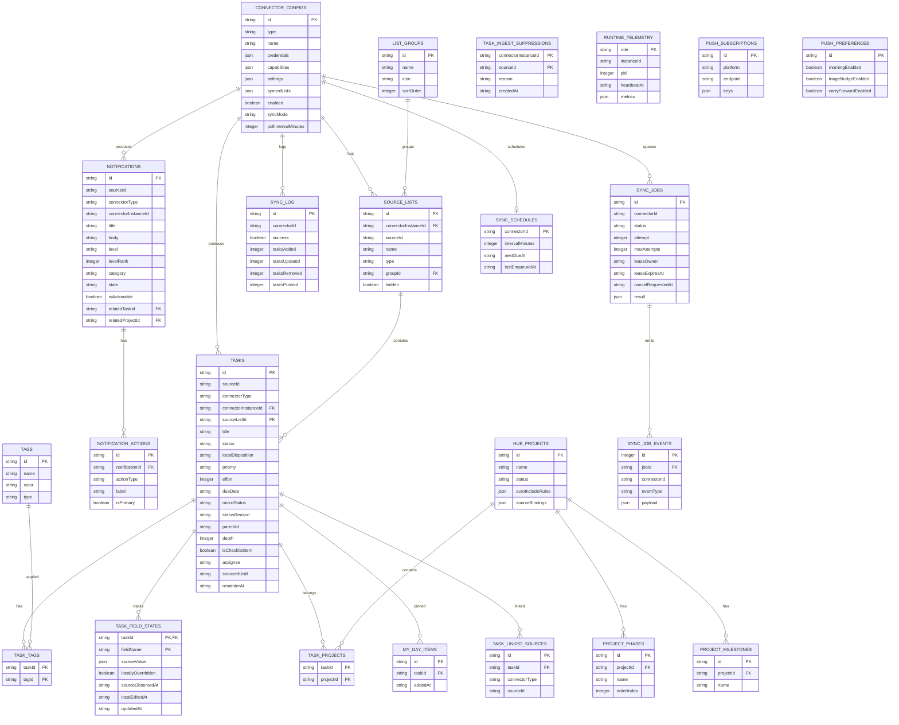

# Data Model — Detail Architecture

> SQLite with Drizzle ORM (better-sqlite3 driver). Schema split into domain modules.

---

## Entity Relationship Overview



---

## Schema Modules

The schema is split into domain files under `src/db/schema/`:

| Module | Tables |
|--------|--------|
| `connectors.ts` | connector_configs, list_groups, source_lists, sync_log, sync_jobs, sync_job_events, runtime_telemetry, sync_schedules, sync deletion/reconciliation tables, outbound_webhooks, integration_configs, inbound_webhooks, inbound_webhook_log, list_fix_audit_log, app_settings |
| `tasks.ts` | tasks, task_field_states, task_ingest_suppressions, task_schedules, tags, task_tags, task_projects, my_day_items, my_day_exclusions, focus_items, weekly_one_thing, priority_sync_log, subtask_templates, priority_entities, source_rankings, smart_score_settings, routines, routine_completions, energy_checkins, resets, quick_sort_log, task_linked_sources, task_attachments |
| `notifications.ts` | notifications, notification_actions |
| `push.ts` | push_subscriptions, push_preferences, notification_push_rules, notification_delivery_events |
| `native.ts` | native_installation_credentials, native_share_credentials, native_share_capture_requests, apns_registrations, native_push_requests |
| `triage.ts` | triage_content_types, triage_items, triage_sync_state, triage_action_claims |
| `projects.ts` | hub_projects, project_tags, project_milestones, project_phases, project_phase_items |
| `finance-schema.ts` | finance_transactions, kid_profiles, kid_card_rules, kid_merchant_rules, finance_alert_configs |

---

## Key Relationships

- **Tasks** → belong to a connector + source list (provenance)
- **Tasks** → can be in multiple **Hub Projects** (many-to-many)
- **Tasks** → can have multiple **Tags** (many-to-many, with tag `type`: source/hub/ai-inferred)
- **Tasks** → can be linked to additional sources via **Task Linked Sources**
- **Task Ingest Suppressions** → prevent a hard-deleted ingested source item from being recreated or cross-source linked; the durable key is connector instance plus source ID
- **Tasks** → support hierarchy via `parentId`/`depth` for subtasks and checklist items
- **Tasks** → store `localDisposition` (`active`, `handled`, or `dismissed`) as an MC-only overlay for read-only remote mirrors; it defaults to `active` and inbound refreshes do not replace it
- **Hub Projects** → have **Phases** → have **Phase Items** (ordered execution)
- **Hub Projects** → have **Milestones** for tracking progress
- **Connectors** → produce both **Tasks** and **Notifications**
- **Notifications** → have **Notification Actions** (actionable buttons/links)
- **Notifications** → have lifecycle states: `unread` → `read` → `dismissed`/`resolved`/`archived`
- **Source Lists** → can be grouped into **List Groups** for sidebar organization
- **Sync Log** → audit trail per connector per sync run
- **Sync Jobs** → durable queue, lease ownership, cancellation, retries, and terminal results
- **Sync Job Events** → monotonic cross-process progress cursor for SSE replay
- **Runtime Telemetry** → latest web and worker heartbeat plus process, event-loop, host, and cgroup metrics
- **Sync Schedules** → expected connector cron due times for missed-schedule detection
- **Push Subscriptions** → Web Push (VAPID) endpoints for browser notifications
- **Push Preferences** → per-user notification timing (morning, triage nudge, carry-forward)

## Type ownership and transport boundaries

- `src/types/index.ts` owns canonical domain models used by connectors and domain
  services, including `TaskItem`, `HubProject`, `ProjectPhase`, and
  `ProjectPhaseItem`.
- `src/types/api.ts` owns serialized HTTP DTOs. DTO names end in `Dto`, preserve
  wire-level nullability, and use `Pick` from canonical models for fields whose
  meaning is shared.
- `src/types/dashboard.ts` owns dashboard view models. View-model names end in
  `ViewModel`; the current task and project view models are explicit projections
  of their API DTOs rather than independent domain definitions.
- Feature-local presentation types follow the same convention, for example
  `KanbanTaskViewModel` and `ProjectTaskViewModel`.

API routes construct DTOs from database/domain records. Client fetch functions
name the DTO they deserialize, then feature code converts or projects that DTO
into its view model. Domain services must not import dashboard or feature-local
view models.

The connector relationships for `sync_log`, `sync_jobs`, and `sync_schedules`
are logical relationships through `connector_id`; only
`sync_job_events.job_id` has a database foreign key. A partial unique index on
`sync_jobs.connector_id` where status is `queued` or `running` enforces one
active job per connector. Enqueue, cancellation, lease recovery, and claim
operations use `BEGIN IMMEDIATE` transactions so both processes agree on queue
ownership.

---

## Migrations

Managed with Drizzle Kit (SQLite dialect):

```bash
# Generate migration from schema changes
npx drizzle-kit generate

# Apply migrations
npx drizzle-kit migrate
```

Config: `drizzle.config.ts` at project root.

At migration `0047_isolate_sync_worker`, its Drizzle snapshot represents all
current tables (70 at that migration). The snapshot includes the four
worker-boundary tables
`sync_jobs`, `sync_job_events`, `runtime_telemetry`, and `sync_schedules`; this
keeps later schema generation based on the complete current database rather
than a worker-only partial snapshot.

> **Note:** In development, migrations run automatically on first DB connection via `src/db/index.ts`. Each migration is applied individually (not in a single transaction) to handle idempotency gracefully.
