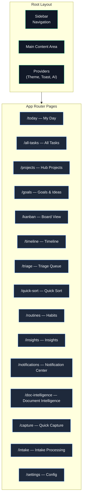
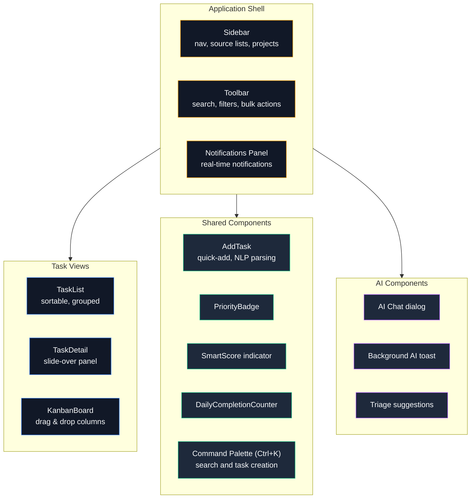

# Frontend — Detail Architecture

> Next.js App Router with React components, dark-first design.

---

## Page Structure

---

## Component Hierarchy

---

## Client State Management

| Concern | Approach |
|---------|----------|
| Server data | React Server Components + fetch |
| Client data fetching | React Query (TanStack Query) |
| View preferences | Zustand stores (dashboard view) |
| Optimistic updates | Immediate UI → confirm on response |
| Real-time | Sync Event Bus → revalidation |
| Forms | React Hook Form (where needed) |

---

## Key UI Patterns

- **Dark-first** — Slate color scale, surface layering for depth
- **Dense information** — tight typography, minimal whitespace
- **Keyboard-driven** — Ctrl+K palette, shortcuts for common actions
- **Shared task parsing** — Quick Add and Ctrl+K creation use the same date, tag, priority, effort, and project grammar
- **Source indicators** — colored icons show data provenance
- **Skeleton loading** — no spinners, placeholder shapes during fetch
- **PWA** — Service Worker (Serwist) for offline support
- **Share Target** — Web Share Target API for receiving shared content
- **Push Notifications** — Web Push (VAPID) for timed reminders and nudges
