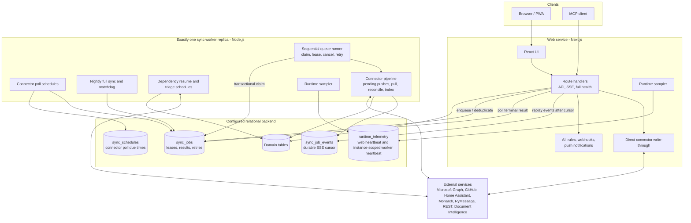
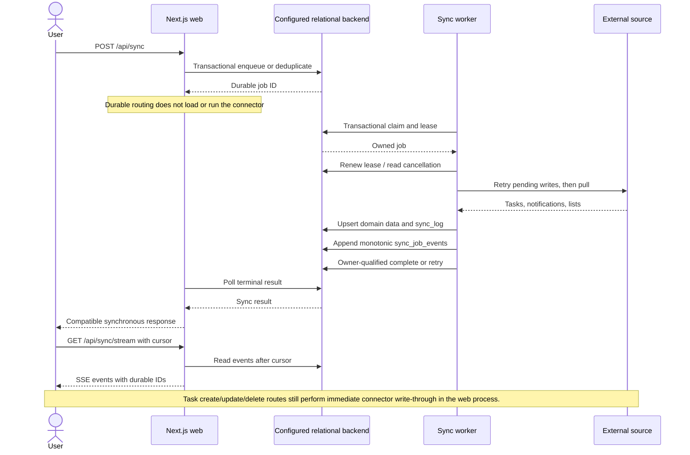

# Mission Control — Architecture Overview

> Living architecture documentation. Update as the system evolves.

---

## High-Level System Architecture

This is the "30,000 foot" view — major subsystems as single blocks.

PostgreSQL is the approved production target and is implemented as an explicit
runtime backend. SQLite remains the default compatibility backend and the
documented homelab backend until the maintenance-window cutover is completed.
See the
[database scaling and migration strategy](../design/active/database-scaling-strategy.md)
for the decision and deployment status.

Production sets `MC_SYNC_EXECUTION_MODE=worker`. The web and worker services use
the same image and database, but they are separate Node processes. Next.js owns
the API, UI, synchronous task write-through, and non-connector web features. The
worker owns connector polling and long-running connector work so event-loop or
CPU pressure in a sync cannot starve HTTP handling. Development defaults to the
legacy inline mode unless worker mode is explicitly enabled.

The supported production topology has exactly one sequential worker replica.
Lease ownership fences durable queue updates, but it cannot stop external
connector side effects that may still be running in a stalled predecessor after
takeover. Fixed Compose container names prevent scaling, and worker startup
rejects `MC_SYNC_WORKER_REPLICA_COUNT` values other than `1`.

---

## Data Flow — Sync Cycle

How data moves between external sources and the configured relational backend.

---

## Key Subsystems (Detail Diagrams)

| Subsystem | Purpose | Detail Doc |
|-----------|---------|------------|
| Connectors | Adapters for external data sources | [connectors.md](./connectors.md) |
| Sync Engine | Durable connector scheduling and execution | [sync-engine.md](./sync-engine.md) |
| AI Engine | Chat, agents, background tasks | [ai-engine.md](./ai-engine.md) |
| Frontend | Pages, components, client state | [frontend.md](./frontend.md) |
| Data Model | Schema, tables, relationships | [data-model.md](./data-model.md) |

---

## Technology Stack

| Layer | Technology |
|-------|-----------|
| Framework | Next.js (App Router) |
| Language | TypeScript |
| UI | React, Tailwind CSS, Lucide Icons |
| Database | PostgreSQL (approved production target) or SQLite (default compatibility backend), selected explicitly at runtime |
| AI | Vercel AI SDK (multi-provider) |
| Auth | Microsoft OAuth2 (multi-tenant) |
| Scheduling | node-cron; connector sync schedules run in the worker, push-notification schedules in the web process |
| Testing | Vitest + Playwright |
| Deployment | Docker / Docker Compose |
| PWA | Serwist (Service Worker) |
| MCP | stdio-based MCP server (tsx) |
