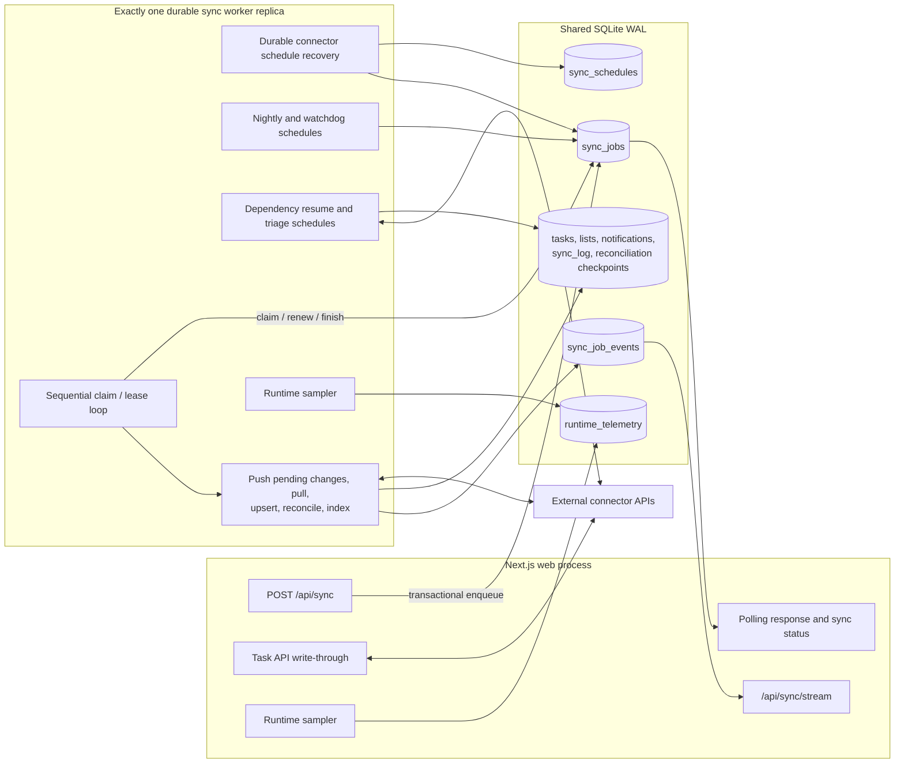
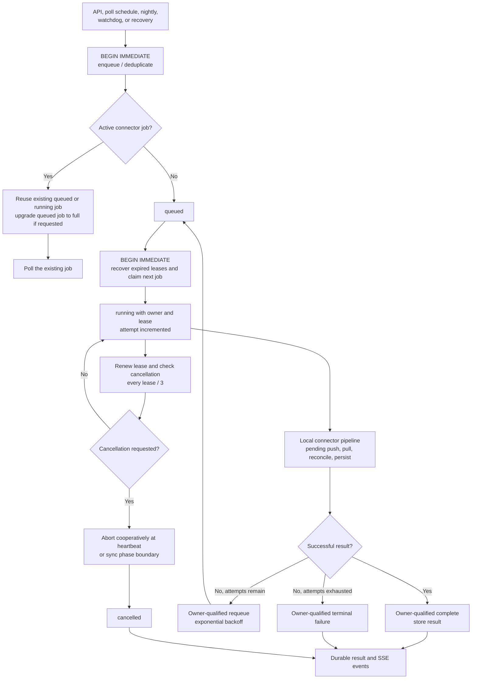

# Sync Engine — Detail Architecture

> Bi-directional sync: pull from sources, push local changes back.

---

## Sync System Components

---

## Sync Modes

| Mode | Behavior | Config |
|------|----------|--------|
| `poll` | Cron-scheduled pull at interval | `pollIntervalMinutes` |
| `webhook` | Source pushes changes to MC | Inbound webhook endpoint |
| `manual` | User-triggered only | No auto-scheduling |

## Process Isolation and Durable Jobs

Production Compose deployments set `MC_SYNC_EXECUTION_MODE=worker` and run two
containers from the same image:

- `mission-control` serves Next.js requests, performs immediate task
  write-through, enqueues sync requests, polls durable results, and serves SSE.
- `mission-control-worker` owns connector schedules and executes connector
  pulls, retries pending pushes, nightly syncs, checkpointed dependency
  reconciliation resume, watchdog recovery, and triage auto-sync. It has a
  lower CPU share, an explicit CPU quota, and a memory limit so connector spikes
  cannot monopolize the request-serving cgroup.

The worker service must run exactly one replica. Queue owner qualification
prevents an expired predecessor from committing a durable terminal update, but
it cannot fence external connector side effects that the predecessor may still
be executing. Horizontal worker scaling could therefore duplicate remote
writes after lease takeover. Compose uses a fixed worker container name, and
worker startup rejects a configured replica count other than `1`.

Both processes share the SQLite WAL database. `sync_jobs` is the process
boundary:

1. Connector polling uses `sync_schedules` as a durable clock. The worker checks
   due rows before each queue claim, enqueues one recovery job per connector,
   and advances `next_due_at` to the next future cadence boundary. This catches
   up after event-loop stalls or container restarts without creating a backlog
   for every elapsed interval.
2. Enqueue and claim use `BEGIN IMMEDIATE` transactions. A partial unique index
   permits only one queued or running job per connector; a duplicate full
   request upgrades a queued incremental job.
3. A worker atomically claims one job, increments its attempt, records its
   owner, and renews an expiring lease. Renew, complete, fail, and graceful
   release are qualified by both job ID and lease owner. The duration budget is
   also a hard execution boundary: the worker aborts the connector when it is
   reached.
4. Worker loss leaves the job `running` until its lease expires. The next claim
   transaction immediately requeues it with the same ID and `recovery` source,
   or marks it failed when the bounded attempt count is exhausted. Connector
   failures use exponential backoff capped at 15 minutes. A terminal failure
   has `result = NULL`; it is never represented as a successful sync.
5. `DELETE /api/sync` requests cooperative cancellation by `jobId` or
   `connectorId`. Queued work transitions immediately and returns `200`;
   running work returns `202` with `cancellationRequested` and checks
   cancellation at lease heartbeats and sync phase boundaries.
6. `SIGTERM` stops new claims and schedules, allows the active job to finish
   within `MC_SYNC_WORKER_SHUTDOWN_GRACE_MS`, then releases its lease for
   retry if the grace period expires.
7. After cancellation, lease loss, or duration timeout, the worker allows
   `MC_SYNC_WORKER_ABORT_GRACE_MS` for cooperative cleanup. If the connector
   promise still does not settle, that connector remains fenced in memory while
   the worker resumes claims for other connectors. The abandoned execution
   cannot complete its durable job after losing ownership, and its connector is
   not reclaimed until the promise settles.
8. Worker sync events are written to `sync_job_events`. The existing
   `/api/sync/stream` SSE endpoint emits event IDs, accepts `Last-Event-ID` (or
   a `cursor` query parameter), and replays from that durable cursor.
   Observability-write failures are logged but never fail connector work.
9. After pending task pushes and before ordinary task/notification pulls, the
   scheduler invokes optional connector-owned `syncDomainData`. This phase uses
   the same durable job, lease heartbeat, retry, cancellation, and terminal
   result boundary as the rest of the connector run. Finance transaction
   snapshots therefore cannot bypass queue deduplication or worker recovery.
10. Connector persistence bounds synchronous SQLite work. Task pages use small
   mutation batches, source-list discovery chunks bulk inserts, and retention
   yields between independent records while keeping each archive/delete
   transaction atomic. Task-owned relationship columns used during archival
   are indexed in both dependency directions so deletion does not repeatedly
   scan relationship and notification tables.

For the issue #2449 query-plan validation, 100 archive-style deletes against a
100,000-row dependency table took 364.6 ms with a full table scan and 0.4 ms
after adding the reverse dependency index. The regression test asserts the
indexed `MULTI-INDEX OR` plan rather than a machine-specific timing threshold.

Finance domain sync maintains a separate successful-window watermark rather
than persisting an upstream page cursor. A retry starts the incomplete window at
page one. Page upserts are replay-safe, and authoritative absence is applied
only in the final transaction after every page validates. Failure or
cancellation records the attempt but leaves the last successful window
unchanged.

The worker intentionally claims one job at a time. This isolates request
serving from connector load while keeping connector ordering and SQLite write
pressure predictable.

Development remains inline unless `MC_SYNC_EXECUTION_MODE=worker` is set. To
exercise worker mode outside Compose, run Next.js and `npm run worker` as
separate processes against the same `MC_DB_PATH`.

In worker mode, `SyncScheduler.requestSync` in the web process performs only
durable enqueue/deduplication and result polling; it does not initialize or load
the connector. Connector initialization and local execution occur only after
the worker claims the job. The task write-through routes remain the intentional
exception described below.

## Production Telemetry and Degradation Signals

The web and worker processes sample telemetry independently and persist their
latest heartbeat in `runtime_telemetry`. `GET /api/health` returns:

- event-loop delay p50/p95/p99/max, timer drift, and sustained-lag state;
- bounded SQLite read/write/transaction latency percentiles, slow operations,
  successful writer-lock wait time, terminal busy failures, and timeout
  exhaustion for each process;
- WAL bytes, passive-checkpoint results and age, pending frames, and checkpoint
  starvation indicators. WAL size is captured before checkpoint probes, which
  run at a bounded interval or when growth crosses a configured threshold;
- process CPU, RSS, heap, PID, and uptime;
- host CPU count, load average, and free/total memory;
- cgroup v2 CPU usage, throttled time/events, CPU quota, and memory
  current/limit when `/sys/fs/cgroup` is available;
- optional `MC_CONTAINER_RESTART_COUNT` when deployment automation can inject
  a restart count;
- sync queue depth, retries, oldest age, missed schedules, expired leases, and
  over-budget running jobs;
- liveness handler latency and whether the first Docker health probe missed
  its configured startup deadline.

Health changes to `attention` for sustained event-loop lag, SQLite latency or
contention, abnormal WAL growth with frames still awaiting checkpoint,
checkpoint starvation, stale/missing worker telemetry, a missed schedule, an
expired lease, an over-budget sync, or a missed startup probe. A large WAL that
has been fully checkpointed remains visible in telemetry without degrading
health. Busy failures that consume the configured five-second timeout and
checkpoint starvation are marked `critical` in degradation reasons.
`/api/health/live` intentionally remains a minimal
always-200 process-liveness probe. Docker's end-to-end probe latency and
restart count are controlled by the Docker daemon and are not available
inside an unprivileged container; operators should correlate the app fields
with `docker inspect`/daemon metrics rather than mounting the Docker socket.

### Stuck connector recovery

Lease loss, cancellation, and duration timeout recover automatically after the
abort grace period: unrelated connectors continue while the affected connector
stays fenced. An expired lease is reported as `action required` even when worker
telemetry is fresh.

If the abandoned connector promise does not eventually settle, restart only the
worker process after confirming the affected job lease has expired. In Compose,
use `docker compose restart mission-control-worker`. Durable recovery requeues
the expired job without restarting the web container. Do not scale up a second
worker to recover it; concurrent worker replicas cannot fence remote connector
side effects.

Structured logs mark event-loop degradation/recovery, lease recovery, job
attempts, duration-budget violations, worker shutdown recovery, and missing
startup probes. Database logs contain operation and category names, durations,
error codes, and thresholds, but never SQL text or bound values.

`sync_schedules.next_due_at` is advanced by each actual cron callback. Missed
schedule alerts compare that durable due time with the configured grace
period, rather than treating normal time spent behind another sequential job
as a scheduler miss.

The worker Docker probe has an additional startup boundary. Each worker writes
its generated telemetry instance ID to a container-local marker after telemetry
starts. The probe requires a fresh `runtime_telemetry` row for that exact
instance ID, so a heartbeat left by a prior container cannot make a replacement
healthy before it starts successfully. Unless explicitly overridden,
staleness is derived as the greater of the sync duration budget plus 60 seconds
or twice the job lease; the homelab deployment does not pin a separate value.

---

## Sync Execution Flow

`POST /api/sync` preserves the existing synchronous API contract by polling the
durable job row for a terminal result. The work nevertheless continues in the
worker if the HTTP request disconnects. UI progress is independent: the worker
appends monotonic event IDs to `sync_job_events`, and the web process replays
events after `Last-Event-ID` or a `cursor` query parameter.

### UI Refresh Pattern

Terminal sync completion cancels active query reads and then invalidates active
TanStack Query data once at the sync-stream boundary. Cancelling first prevents
an initial request that started before sync from winning the cache race.
Query-backed screens keep existing cached data rendered while replacement
queries refetch in the background. New client-side data surfaces should use
stable query keys and this cache invalidation path rather than calling
`router.refresh()`, reloading the window, or replacing existing content with an
initial-load skeleton.

Legacy stateful screens may consume `SyncProgress.refetchKey` until they move to
TanStack Query. Their sync handler must fetch in background mode: preserve
rendered data and local UI state, reserve full loading states for the first load
when no usable data exists, and surface refresh failures without discarding the
last successful result.

Direct task create, update, completion, move, and delete write-through still
runs in the web request path. A failed immediate write marks local data
`pending_push`; the worker's connector pipeline retries those pending changes
before pulling remote state.

---

## Audit Trail

Every sync produces a `SyncAuditEntry[]` recording individual actions:

| Action | Meaning |
|--------|---------|
| `added` | New task from source |
| `updated` | Existing task modified |
| `removed` | Task no longer in source |
| `pushed` | Local change written to source |
| `push_failed` | Write-back failed |
| `protected` | Skipped deletion (protection rules) |
| `conflict_resolved` | Merge conflict auto-resolved |

Results are stored in `sync_log` with full audit entries. Durable worker
operations also record the job ID, trigger, scheduled and actual start times,
and attempt count so Sync History can explain lateness and distinguish manual,
scheduled, and interruption-recovery work.

## GitHub Dependency Reconciliation

Native GitHub blocking relationships have an independent correctness loop.
Enabled dependency-capable GitHub connectors are checked at most every 15
minutes and receive a complete relationship poll when their last successful
generation is due. This poll drains the normal paged GitHub task query into a
durable dependency generation but does not upsert or enumerate local tasks.
Full task syncs can still create the same kind of generation.

1. Collection stages deterministic edge pages, verified blocked issue IDs,
   discovery mode, page count, and overflow request count. Only a fully
   collected generation becomes eligible for reconciliation.
2. Reconciliation consumes staged edges in bounded batches. The resume
   scheduler continues `ready` or `reconciling` generations after failures or
   restarts using persisted cursor and backoff state.
3. Scheduler ticks and ordinary syncs share the connector operation lease and
   active-generation uniqueness constraint. A busy connector defers the poll;
   overlapping ticks coalesce rather than creating parallel generations.
4. Incremental task syncs reuse relationship observations already present in
   the changed-issue stream. Additions and verified removals are restricted to
   returned source IDs; they never scan all connector tasks or replace the
   latest complete generation. If any blocker for a changed issue cannot be
   resolved locally, removals for that issue are skipped.
5. Partial collection remains import-safe and never drives absence-based
   deletion. Up to ten terminal generations are retained, always preserving
   the latest successful completion and its staged graph.

Startup first resumes durable reconciliation and then performs the due check.
Shutdown stops the due timer and drains an active poll. The connector entry in
`GET /api/health` reports collection and reconciliation phase, current progress,
last successful verification, age/duration inputs, page and edge counts,
overflow requests, discovery mode, terminal outcome, and consecutive failed
generations. Relationship state degrades health when it is stale, the latest
generation is partial, or at least two polls fail consecutively. A failed
ordinary task sync remains `error` and takes precedence over relationship
degradation.

| Environment variable | Default | Purpose |
|---|---:|---|
| `MC_DEPENDENCY_RECONCILIATION_BATCH_SIZE` | `25` | Source tasks read per persisted batch |
| `MC_DEPENDENCY_RECONCILIATION_RESUME_MINUTES` | `15` | Resume scheduler cadence |
| `MC_DEPENDENCY_RECONCILIATION_RETRY_BASE_MS` | `900000` | Initial retry backoff; doubles up to six hours |
| `MC_DEPENDENCY_SNAPSHOT_TIMEOUT_MS` | `240000` | Maximum duration of one batch request |
| `MC_GITHUB_DEPENDENCY_POLL_INTERVAL_MINUTES` | `1440` | Independent complete relationship verification interval |
| `MC_GITHUB_DEPENDENCY_STALE_MINUTES` | twice the poll interval | Age at which relationship health becomes degraded |

## Architecture tradeoffs

| Decision | Rationale |
|---|---|
| SQLite WAL instead of a message broker | The supported production shape is one host with a shared volume. Durable tables avoid another service while retaining restart recovery and cross-process coordination. |
| Exactly one sequential worker replica | Sequential execution bounds connector CPU and memory pressure and keeps SQLite write contention predictable. Multiple replicas are unsafe because queue leases cannot fence remote side effects in a stalled predecessor. |
| Polling for the API response | Existing callers receive the same synchronous result shape while execution moves across a durable process boundary. |
| Durable SSE events | Monotonic IDs let the web process replay progress after reconnects or process restarts. |
| Checkpointed per-issue GitHub REST reads | REST cancellation and partial-result behavior are proven; GraphQL parity for errors, permissions, deletion, pagination, and aborts is not. |

## Worker and telemetry configuration

| Environment variable | Default | Purpose |
|---|---:|---|
| `MC_SYNC_EXECUTION_MODE` | inline | Set to `worker` to enqueue connector syncs |
| `MC_SYNC_JOB_LEASE_MS` | `120000` | Ownership lease renewed by the worker |
| `MC_SYNC_JOB_MAX_ATTEMPTS` | `3` | Maximum attempts after worker/connector failure |
| `MC_SYNC_JOB_RETRY_BASE_MS` | `30000` | Exponential retry base, capped at 15 minutes |
| `MC_SYNC_API_WAIT_TIMEOUT_MS` | `900000` | Compatibility wait for `/api/sync` |
| `MC_SYNC_DURATION_BUDGET_MS` | `300000` | Hard connector execution budget and over-budget alert threshold |
| `MC_SYNC_WORKER_POLL_MS` | `500` | Queue poll interval |
| `MC_SYNC_WORKER_ABORT_GRACE_MS` | `30000` | Cooperative cleanup grace after cancellation, lease loss, or duration timeout |
| `MC_SYNC_WORKER_SHUTDOWN_GRACE_MS` | `30000` | Graceful active-job drain budget |
| `MC_SYNC_WORKER_REPLICA_COUNT` | `1` | Required single-worker deployment invariant |
| `MC_TELEMETRY_STALE_MS` | `30000` | Worker heartbeat age before automatic sync requires operator attention |
| `MC_SYNC_JOB_RETENTION_DAYS` | `14` | Terminal job/event retention |
| `MC_SYNC_JOB_PRUNE_INTERVAL_MS` | `21600000` | Steady-state retention cleanup cadence |
| `MC_EVENT_LOOP_LAG_THRESHOLD_MS` | `200` | Per-process lag threshold |
| `MC_EVENT_LOOP_LAG_SUSTAINED_SAMPLES` | `3` | Consecutive samples before degradation |
| `MC_TELEMETRY_INTERVAL_MS` | `10000` | Runtime heartbeat/sample interval |
| `MC_HEALTHCHECK_START_DEADLINE_MS` | `60000` | First liveness-probe deadline |
| `MC_DB_BUSY_TIMEOUT_MS` | `5000` | SQLite lock wait limit; exhaustion is critical |
| `MC_DB_BUSY_WAIT_WARNING_MS` | `100` | Successful writer acquisition delay that degrades health |
| `MC_DB_SLOW_OPERATION_MS` | `100` | Slow-operation report threshold |
| `MC_DB_LATENCY_P95_WARNING_MS` | `100` | Per-category p95 degradation threshold |
| `MC_DB_LATENCY_P99_CRITICAL_MS` | `500` | Per-category p99 critical threshold |
| `MC_DB_WAL_WARNING_BYTES` | `67108864` | WAL size degradation threshold |
| `MC_DB_WAL_CRITICAL_BYTES` | `268435456` | WAL size critical threshold |
| `MC_DB_CHECKPOINT_STARVATION_MS` | `60000` | Pending/busy checkpoint age before critical health |
| `MC_DB_CHECKPOINT_PENDING_FRAMES` | `1000` | Pending frames required for starvation detection |
| `MC_DB_CHECKPOINT_PROBE_INTERVAL_MS` | `60000` | Minimum interval between routine passive-checkpoint probes |
| `MC_DB_OBSERVATION_WINDOW_MS` | `300000` | Rolling latency/contention health window |
| `MC_DB_MAX_SAMPLES` | `1000` | Maximum in-process operation samples retained |
| `MC_DB_MAX_SLOW_OPERATIONS` | `10` | Maximum slow operations returned per process |
