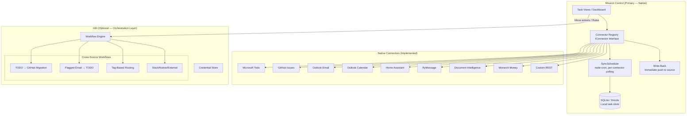
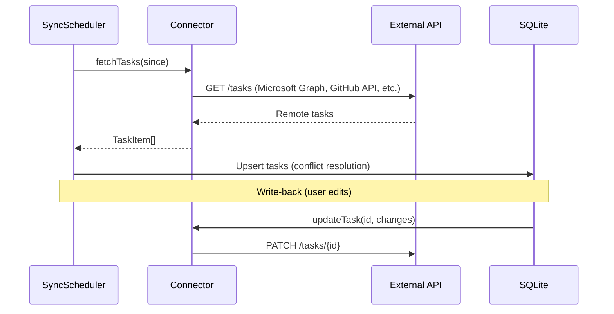

# Task Sync & Integration Architecture

## Mission Control — Hybrid Sync Model

> **Objective**: Mission Control uses a **hybrid architecture** — native connectors for core data aggregation and write-back, with n8n available as an **optional orchestration layer** for cross-source workflows, complex routing rules, and external integrations that don't warrant hand-built connectors.

---

## Executive Summary

### What We Built (Native Layer — ✅ Implemented)

Mission Control has a fully functional **native sync engine**:

- **10 connectors** built on the `IConnector` interface (Microsoft Todo, GitHub Issues, Outlook Email, Outlook Calendar, Home Assistant, RyMessage, Document Intelligence, Monarch Money, Custom REST, Scout)
- **SyncScheduler** — node-cron based, per-connector polling with configurable intervals
- **Write-through** — Edits (status, title, priority) push back to source immediately
- **Conflict resolution** — Detects and resolves concurrent edits
- **Unified UI** — Settings page for connector config, sync status, health indicators

### What n8n Was Originally Designed For

The original `TASK-SYNC-INTEGRATION.md` (v1) envisioned n8n as the **primary execution engine** for all sync. That approach was superseded during implementation because:

1. **Native connectors are simpler** for read/write — no external process, no Docker dependency
2. **Latency** — Direct API calls are faster than routing through n8n
3. **Auth** — We already handle OAuth/token refresh natively
4. **Single process** — No operational overhead of running n8n alongside the app

### Revised Architecture: n8n as Optional Orchestration Layer

n8n's value is now scoped to **cross-source workflows** — things native connectors can't do alone:

| Layer | Engine | Use Cases |
|-------|--------|-----------|
| **Data aggregation** (read) | Native connectors | Poll sources, sync to local DB, unified task view |
| **Write-back** (single edits) | Native connectors | Update status/title/priority back to source |
| **Cross-source orchestration** | n8n (optional) | Move tasks between systems, tag-based routing, chained workflows |
| **External integrations** | n8n (optional) | Slack notifications, Notion sync, Jira bridge — anything without a native connector |

### When to Use Which

| Scenario | Use Native | Use n8n |
|----------|-----------|---------|
| "Show me all my tasks from Todo + GitHub" | ✅ | |
| "Mark this task done" (write-back) | ✅ | |
| "Move this task from Todo to GitHub" | | ✅ |
| "When I tag a Todo with #github, create a GitHub issue" | | ✅ |
| "Send Slack message when task is overdue" | | ✅ |
| "Sync flagged Outlook emails to Todo" | | ✅ |
| "Extract action items from RyMessage → create tasks" | | ✅ |

---

## Architecture



---

## Native Connector Architecture (Implemented)

### How It Works

Each connector implements the `IConnector` interface and is registered in the connector registry. The `SyncScheduler` polls each connector on its configured interval and upserts tasks/notifications into the local SQLite DB.

### IConnector Interface

```typescript
interface IConnector {
  // Metadata
  readonly id: string;
  readonly type: string;
  readonly displayName: string;
  readonly icon: string;
  readonly capabilities: ConnectorCapabilities;

  // Lifecycle
  initialize(config: ConnectorConfig): Promise<void>;
  testConnection(): Promise<{ success: boolean; message: string }>;
  dispose(): Promise<void>;

  // Read
  fetchTasks(since?: Date): Promise<TaskItem[]>;
  fetchNotifications(since?: Date): Promise<InboundNotification[]>;
  fetchSourceLists(): Promise<SourceList[]>;
  fetchSourceTags?(): Promise<{ id: string; name: string; color?: string }[]>;

  // Write (optional based on capabilities)
  createTask?(task: Partial<TaskItem>): Promise<TaskItem>;
  updateTask?(id: string, changes: Partial<TaskItem>): Promise<void>;
  deleteTask?(id: string): Promise<void>;
  moveTask?(id: string, destListId: string): Promise<void>;
}
```

### Sync Flow



### Connectors Implemented

| Connector | Source | Capabilities | Auth |
|-----------|--------|-------------|------|
| `microsoft-todo` | Microsoft Graph API | Read, Write, Move, Tags, Subtasks (steps) | OAuth2 (MSAL) |
| `github-issues` | GitHub REST API | Read, Write, Labels, Sub-issues | OAuth2 / PAT |
| `outlook-email` | Microsoft Graph API | Read (flagged → tasks), Notifications | OAuth2 (MSAL) |
| `outlook-calendar` | Microsoft Graph API | Read (events → timeline) | OAuth2 (MSAL) |
| `home-assistant` | HA REST API | Notifications (device states) | Long-lived token |
| `rymessage` | Experimental webhook today; transport-independent durable ingress proposed | Notifications today; provider-owned task materialization bridge proposed | LAN trust today; dedicated scoped integration principal required before production |
| `document-intelligence` | Azure AI | Read (extracted action items) | API key |
| `monarch-money` | Monarch API | Notifications (finance) | Session token |
| `custom-rest` | Any REST API | Configurable | Configurable |
| `scout` | Copilot Skill | Read, Write (via MCP) | Skill token |

### Known Issues & Workarounds

#### Microsoft Todo: Hidden/Legacy Lists (Wunderlist Migration)

**Discovery date:** July 2026  
**Impact:** ~20-30+ lists invisible to standard Graph API  

**Problem:** Microsoft Graph API's `/me/todo/lists` endpoint does NOT return all lists for accounts with legacy data. Lists migrated from Wunderlist (shut down May 2020) or created via older Microsoft To Do clients exist in the backend but are invisible to the public Graph API enumeration. Both `v1.0` and `beta` endpoints exhibit this behavior. There is **no distinguishing metadata** on these hidden lists — they have the same schema, same fields (FolderType, SyncStatus, etc.) as visible lists.

**Root cause (hypothesis):** These lists were never properly indexed into the Graph API catalog during the Wunderlist → To Do migration. Microsoft has acknowledged this class of issue but hasn't resolved it. The native To Do app uses internal Substrate APIs that DO have access.

**Our workaround (implemented):**
1. Fetch visible lists normally via Graph API `/me/todo/lists`
2. Scan ALL tasks via Substrate `/tasks` endpoint (both incomplete + completed)
3. Identify `ParentFolderId` values not present in the Graph API response
4. Resolve hidden folder names individually via Substrate `/taskfolders/{id}`
5. Fall back to Graph API direct access (`/me/todo/lists/{id}`), then placeholder name

**APIs involved:**
- `https://graph.microsoft.com/v1.0/me/todo/lists` — Primary list enumeration (incomplete)
- `https://substrate.office.com/todob2/api/v1/tasks` — All tasks (discovers hidden folder IDs)
- `https://substrate.office.com/todob2/api/v1/taskfolders/{id}` — Individual folder metadata

**Limitations:**
- Lists with **zero tasks** (no incomplete OR completed) remain undetectable via task scanning
- The Substrate API can be rate-limited with aggressive polling
- The Substrate token requires the `https://outlook.office.com/Tasks.ReadWrite` scope (separate from Graph token)
- No way to differentiate "migrated from Wunderlist" vs "just hidden" — no provenance metadata exists

**Result:** Went from 56 → 76 discovered lists for the test account.

**Possible future improvement:** If Microsoft ever exposes a `/me/todo/listGroups` or fixes the Graph enumeration, we can remove the Substrate scan. Alternatively, a one-time manual registration flow could capture truly-empty hidden lists.

### Data Model (Implemented)

The sync engine uses these core tables (Drizzle ORM):

- `tasks` — Unified task store (all sources merge here)
- `tags` / `taskTags` — Labels/tags with source colors
- `syncLog` — Per-connector sync history
- `notifications` / `notificationActions` — Notifications from all sources with actionable buttons
- `connectorConfigs` — Per-connector settings and credentials
- `sourceLists` — Available lists/repos/folders per connector
- `integrationConfigs` — External service configs (including n8n)
- `pushSubscriptions` / `pushPreferences` — Web Push notification endpoints and timing

---

## n8n Orchestration Layer (Future — Optional)

### Role

n8n handles **cross-source workflows** that go beyond simple read/write-back. These are operations that involve moving data between systems, applying rules/transforms, or integrating with services we don't have native connectors for.

### When n8n Gets Activated

n8n is **not required** for basic Mission Control usage. It becomes relevant when:

1. **"Move" feature** — User wants to move a task from Todo → GitHub (or vice versa)
2. **Tag-based routing** — "When I tag a Todo with #github, auto-create a GitHub issue"
3. **External notifications** — "Slack me when a task is overdue"
4. **Services without native connectors** — Notion, Jira, Linear, Trello, etc.

### n8n Integration Design

Mission Control communicates with n8n via its [REST API](https://docs.n8n.io/api/):

| MC Action | n8n API Call | Purpose |
|-----------|-------------|---------|
| Trigger "Move" | `POST /workflows/{id}/execute` | Execute cross-source workflow |
| List available workflows | `GET /workflows` | Show orchestration options |
| View run history | `GET /executions?workflowId={id}` | Audit trail |
| Enable/disable rule | `PATCH /workflows/{id}` | Toggle automation |

### Workflow Templates (Deploy When Needed)

| Template | Trigger | Action |
|----------|---------|--------|
| **TODO → GitHub Migration** | Manual (via "Move" button) or tag-based | Create GitHub issue from Todo task, mark Todo complete |
| **GitHub → TODO Backfill** | Scheduled (every 2hr) | Sync assigned issues to a "GitHub Tasks" Todo list |
| **Flagged Email → TODO** | Scheduled (every 10min) | Create Todo from Outlook flagged messages |
| **RyMessage → TODO** | Webhook | Extract action items, create Todo tasks |
| **Overdue → Slack** | Scheduled (daily) | Notify on overdue tasks via Slack |

### n8n Deployment Options

| Option | Setup | Notes |
|--------|-------|-------|
| **Docker (self-hosted)** | `docker run -d -p 5678:5678 n8nio/n8n` | Recommended for local dev |
| **Docker Compose** | Both MC + n8n in one compose file | Production setup |
| **n8n Cloud** | n8n.cloud ($20/mo) | Zero ops |
| **Skip entirely** | Don't run n8n | All native features still work |

### Configuration

```bash
# .env.local (optional — only if n8n is running)
N8N_URL=http://localhost:5678
N8N_API_KEY=n8n_api_...
```

Mission Control already stores n8n connection state in `integrationConfigs` table via `src/lib/integrations/n8n.ts`.

---

## Implementation Status

### ✅ Completed (Native Layer)

| Component | Status | Files |
|-----------|--------|-------|
| IConnector interface | ✅ Done | `src/lib/connectors/index.ts` |
| Microsoft Todo connector | ✅ Done | `src/lib/connectors/microsoft-todo/` |
| GitHub Issues connector | ✅ Done | `src/lib/connectors/github-issues/` |
| Outlook Email connector | ✅ Done | `src/lib/connectors/outlook-email/` |
| Outlook Calendar connector | ✅ Done | `src/lib/connectors/outlook-calendar/` |
| Home Assistant connector | ✅ Done | `src/lib/connectors/home-assistant/` |
| RyMessage notification connector | ✅ Done | `src/lib/connectors/rymessage/` |
| RyMessage task materialization bridge | 🔲 Proposed | `docs/design/proposed/rymessage-task-materialization.md` |
| Document Intelligence connector | ✅ Done | `src/lib/connectors/document-intelligence/` |
| Monarch Money connector | ✅ Done | `src/lib/connectors/monarch-money/` |
| Custom REST connector | ✅ Done | `src/lib/connectors/custom-rest/` |
| Scout connector | ✅ Done | `src/lib/connectors/scout/` |
| SyncScheduler (cron-based) | ✅ Done | `src/lib/sync/index.ts` |
| Conflict resolution | ✅ Done | `src/lib/sync/conflict-resolution.ts` |
| Write-through (status, title, priority) | ✅ Done | `src/app/api/tasks/[id]/route.ts` |
| Effort level field (1–5 scale) | ✅ Done | `src/db/schema/tasks.ts`, `src/lib/connectors/github-issues/issue-transformer.ts` |
| Settings UI (connector cards) | ✅ Done | `src/app/settings/page.tsx` |
| Sync button + health indicator | ✅ Done | `src/components/toolbar/SyncButton.tsx` |
| n8n config stub | ✅ Done | `src/lib/integrations/n8n.ts` |

### 🔲 Not Yet Implemented

| Feature | Priority | Depends On |
|---------|----------|------------|
| "Move" task between sources | High | n8n or native move API |
| Tag-based routing rules | Medium | n8n workflows |
| n8n API client | Low (until Move is needed) | n8n running |
| Sync Jobs dashboard (n8n workflows) | Low | n8n integration |
| External integrations (Slack, Notion) | Low | n8n |

---

## Go-Forward Implementation Plan

### Phase 1: "Move" Feature (Next Priority)

The "Move" feature allows a user to move a task from one source to another (e.g., Todo → GitHub). This is the primary trigger for n8n integration.

**Option A: Native Move (simpler, no n8n)**
- Connector interface already has `createTask` and `deleteTask`
- Move = create in destination + delete from source (or mark complete)
- Works for the connectors we already have

**Option B: n8n Move (more flexible)**
- n8n workflow handles the transform, enrichment, and post-action
- Supports complex rules (label mapping, body formatting, backlinks)
- Required if we want no-code customization of move behavior

**Recommendation**: Start with **Option A** (native move) for Todo↔GitHub since we have both connectors. Add n8n later for complex rules or external services.

### Phase 2: n8n Orchestration (When Needed)

Only activate when cross-source rules or external integrations are requested:

| # | Task | Estimate |
|---|------|----------|
| 2.1 | n8n API client (`src/lib/n8n/client.ts`) | 2hr |
| 2.2 | n8n connection settings in Settings UI | 1hr |
| 2.3 | "Move" workflow template (TODO→GitHub with transforms) | 2hr |
| 2.4 | Trigger n8n workflow from "Move" button | 1hr |
| 2.5 | Execution monitor + alert on failure | 2hr |

### Phase 3: Rules & Automation

| # | Task | Estimate |
|---|------|----------|
| 3.1 | Tag-based routing rules UI | 3hr |
| 3.2 | Deploy rules as n8n workflows | 2hr |
| 3.3 | Sync Jobs dashboard (list, trigger, logs) | 3hr |
| 3.4 | "Open in n8n" deep links for power users | 0.5hr |

---

## Key Design Decisions (Revised)

| Decision | Rationale |
|----------|-----------|
| **Native connectors for read/write** | Simpler, faster, no Docker dependency. Already working. |
| **n8n for cross-source orchestration only** | Avoids over-engineering. n8n adds value for rules & transforms, not basic CRUD. |
| **n8n is optional** | App works fully without it. Users who want automation rules can add it. |
| **"Move" starts native, graduates to n8n** | Ship faster. Add no-code flexibility when needed. |
| **No n8n for data aggregation** | Native polling is simpler, lower latency, fewer failure modes. |

---

## File Structure

### Implemented (Native)

```
src/lib/connectors/
├── index.ts                    # IConnector interface + registry
├── capabilities.ts             # Capability type definitions
├── field-mapper.ts             # Cross-connector field mapping
├── shared/                     # Shared utilities
├── microsoft-todo/index.ts     # Microsoft Graph API
├── github-issues/index.ts      # GitHub REST API
├── outlook-email/index.ts      # Microsoft Graph (mail)
├── outlook-calendar/index.ts   # Microsoft Graph (calendar)
├── home-assistant/index.ts     # HA REST API
├── rymessage/index.ts          # Webhook/REST
├── document-intelligence/index.ts  # Azure AI
├── monarch-money/index.ts      # Finance API
├── custom-rest/index.ts        # Generic REST adapter
└── scout/index.ts              # Copilot Skill connector

src/lib/sync/
├── index.ts                    # SyncScheduler (node-cron)
├── pull-manager.ts             # Pull tasks from source
├── push-manager.ts             # Push local changes to source
├── list-manager.ts             # Sync source lists + folders
├── deletion-detector.ts        # Detect removed items
├── search-indexer.ts           # Full-text indexing
├── conflict-resolution.ts      # Edit conflict detection
└── events.ts                   # Sync event bus

src/lib/integrations/
└── n8n.ts                      # n8n config read/write (stub)
```

### Planned (n8n Layer — build when "Move" feature is requested)

```
src/lib/n8n/
├── client.ts                   # n8n REST API client
├── types.ts                    # API response types
└── templates/
    ├── todo-to-github.json     # Pre-built workflow
    └── github-to-todo.json

src/app/api/sync-jobs/          # Only if Sync Jobs dashboard is built
├── route.ts
└── [id]/
    ├── route.ts
    └── run/route.ts
```

---

## References

- **IConnector interface**: `src/lib/connectors/index.ts`
- **SyncScheduler**: `src/lib/sync/index.ts`
- **n8n config**: `src/lib/integrations/n8n.ts`
- **n8n REST API docs**: https://docs.n8n.io/api/
- **todo-github-sync (legacy n8n workflow)**: `experiments/personal-automation/todo-github-sync/`
- **Mission Control**: `experiments/personal-automation/mission-control/`
