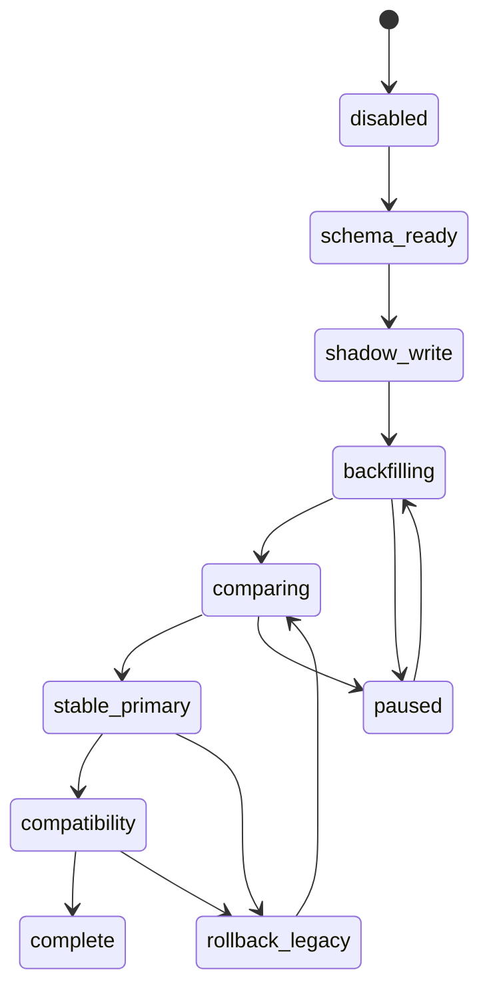

# Stable GitHub Entity Identity and Migration Safety

## Decision summary

Mission Control will identify GitHub entities by immutable, host-scoped node IDs:

- issue identity: `{provider: "github", hostKey, entityType: "issue", nodeId}`;
- repository identity:
  `{provider: "github", hostKey, entityType: "repository", nodeId}`.

Repository path, issue number, API URL, and web URL are mutable locators. They
must never be used to decide that two records are the same entity once a stable
identity is available.

Stable identities and locator history will live in additive, connector-neutral
identity tables rather than replacing `tasks.source_id`, embedding the contract
in JSON metadata, or adding GitHub-specific columns to `tasks`. A task binding
associates the stable entity with a Mission Control task and connector instance.
This preserves the existing rule that two connector instances may independently
mirror the same upstream entity.

`sourceId` remains populated with the `owner/repo:issueNumber` locator, and it
stays **mutable by design**: it is an API-addressing and display locator that
keeps changing on rename or transfer. It is not identity, it is never a
fallback for identity, and APIs and MCP tools continue to expose it unchanged.
The same applies to `source_lists.source_id` and `task_linked_sources.source_id`.

## Cutover status: permanent

**The GitHub NodeID cutover is complete and permanent.** There is no identity
mode to select, no comparison mode, and no rollback to locator identity:

- every GitHub connector resolves task, source-list, dependency, sub-issue,
  linked-source, deletion, project-association, and write-route identity through
  `external_entities.stable_id` (the GitHub NodeID) via
  `external_entity_bindings` and `external_entity_locators`;
- missing, unverified, colliding, inaccessible, or partial NodeID evidence
  **blocks** the affected surface and fails closed; it never falls back to the
  locator. A local row that matches by locator but has no active NodeID binding
  is an `unbound_local_row` block, not an adoption and not a duplicate;
- the comparison runtime, comparison evidence tables, post-cutover attestation,
  and rollback commands have been removed. Migration
  `0105_github_nodeid_permanent_cutover` drops
  `github_identity_comparison_runs`, `github_identity_comparison_records`, and
  `github_identity_sub_issue_population_members` and removes every
  `comparison_run_id` dependency from the operational write-fencing tables;
- task hierarchy is authoritative in `tasks.parent_id`, `tasks.depth`, and
  `tasks.metadata`. The dropped sub-issue population table was cutover evidence
  only and its removal cannot change a single parent/child relationship;
- `github_identity_controls.mode_revision` survives as the durable identity
  epoch that fences in-flight write cycles, write leases, deletion snapshots,
  and queued sync jobs. It no longer selects a mode.

This document keeps the historical staged-migration narrative below for
provenance. Sections describing comparison mode, stage gates, and rollback
describe how the cutover was reached, not behaviour that still exists.

## Context

The GitHub Issues connector currently constructs task identity as
`owner/repo:issueNumber`. It also uses `owner/repo` as repository list identity.
Those values are readable and useful for routing, but they change when a
repository is renamed or transferred. A different repository can later occupy
the old path, making path equality unsafe.

GraphQL issue node IDs are already retained as `metadata.nodeId`. REST types
include `node_id`, but the REST transformer does not retain it. Repository API
responses include stable IDs, but source-list discovery persists only
`full_name`. This partial retention is not sufficient because generic sync code
matches, deduplicates, deletes, and writes through by `sourceId`.

The migration must preserve `tasks.id`. Project membership, phases, schedules,
tags, dependencies, history, My Day state, focus state, attachments, linked
sources, and local field state all attach to that ID and must not be copied to a
replacement task.

## Goals

- Survive repository rename and owner transfer without changing task IDs.
- Distinguish a renamed repository from a different repository at the old path.
- Namespace identities safely across GitHub.com and GitHub Enterprise hosts.
- Run legacy and stable matching concurrently and compare their decisions.
- Backfill incrementally without making missing node IDs destructive.
- Keep pending writes, deletion quarantine, dependencies, and recovery safe.
- Make every migration transition idempotent, restartable, observable, and
  reversible without restoring the database.
- Bound storage, lookup, transaction, and sync overhead before cutover.

## Non-goals

- Performing the production cutover in #2369.
- Retiring or changing the public meaning of `sourceId`.
- Automatically repointing tasks between different repository node IDs.
- Automatically treating a transferred issue with a changed issue node ID as
  the original issue.
- Treating a clean public repository as the same entity as a private archive.
- Merging tasks created by separate connector instances.
- Rewriting immutable audit history to use new identifiers.

## Terminology

### Stable identity

The tuple `{provider, hostKey, entityType, stableId}`. For GitHub,
`stableId` is the opaque GraphQL node ID (`node_id` in REST).

### Locator

Mutable data needed to display or address an entity: repository owner/name,
issue number, canonical API URL, and canonical web URL.

### Binding

The association between one stable external entity, one connector instance,
and one Mission Control task or source list.

### Legacy identity

The current path-derived issue `sourceId` or repository `sourceId`.

### Identity disagreement

A case where stable and legacy resolution select different Mission Control
records, or where either identity maps to more than one candidate.

## Canonical host namespace

`hostKey` is derived from the connector's configured API origin, never from an
HTTP `Host` header, issue URL text, repository name, or user-facing label.

Normalization must:

1. Parse the configured origin with the platform URL parser.
2. Require HTTPS except for explicitly permitted loopback development origins.
3. Convert the hostname to lower-case ASCII/IDNA form.
4. Remove a trailing dot.
5. Retain a non-default port.
6. Reject credentials, path components other than the configured API base, and
   ambiguous or invalid hostnames.
7. Map GitHub.com's API origins to the single key `github.com`.
8. Preserve each GitHub Enterprise authority as its own key; aliases are not
   merged automatically.

Examples:

| API origin | `hostKey` |
|---|---|
| `https://api.github.com` | `github.com` |
| `https://github.example.com/api/v3` | `github.example.com` |
| `https://github.example.com:8443/api/v3` | `github.example.com:8443` |

Node IDs are opaque and may coincide across hosts. Every unique key and lookup
must therefore include `provider`, `hostKey`, and `entityType`. Logs and metrics
may include the normalized host and a digest of the node ID, but must not log
credentials, tokens, raw API responses, or configured URLs containing secrets.

## Persistence model

### `external_entities`

One row per stable entity known to the installation:

| Column | Contract |
|---|---|
| `id` | Mission Control UUID primary key; never derived from external data |
| `provider` | `github` for this migration |
| `host_key` | Normalized authority described above |
| `entity_type` | `repository` or `issue` |
| `stable_id` | Opaque node ID; exact, case-sensitive comparison |
| `identity_version` | `1` for the node-ID contract |
| `next_locator_revision` | Transactionally allocated monotonic locator revision |
| `first_seen_at`, `last_seen_at` | Observation timestamps |

Required unique index:

```sql
UNIQUE(provider, host_key, entity_type, stable_id)
```

### `external_entity_bindings`

Associates an entity with a connector-owned local record:

| Column | Contract |
|---|---|
| `id` | UUID primary key |
| `external_entity_id` | Foreign key to `external_entities` |
| `connector_instance_id` | Connector instance that owns this mirror |
| `binding_type` | `task` or `source_list` |
| `local_id` | `tasks.id` or `source_lists.id` |
| `state` | `shadow`, `active`, `collision`, or `retired` |
| `verified_at` | Last time stable and locator evidence agreed |
| `created_at`, `updated_at` | Audit timestamps |

Required indexes:

```sql
UNIQUE(connector_instance_id, binding_type, local_id)
UNIQUE(connector_instance_id, external_entity_id)
INDEX(external_entity_id)
INDEX(connector_instance_id, state)
```

The first constraint prevents one task from acquiring two issue identities
without entering an explicit collision flow. The second preserves current
connector-instance isolation while preventing duplicate tasks for one stable
entity inside an instance.

### `task_linked_source_entities`

GitHub linked sources use a role-specific association to the same
`external_entities` and `external_entity_locators` records. They do not copy raw
node IDs into `task_linked_sources` and do not consume
`external_entity_bindings`, whose connector/entity uniqueness represents the
primary task or source-list mirror.

| Column | Contract |
|---|---|
| `linked_source_id` | Primary key and cascade foreign key to the legacy linked-source row |
| `connector_instance_id` | Owning connector; must match the linked-source row |
| `external_entity_id` | Host-scoped GitHub issue in `external_entities` |
| `verified_at` | Last trusted observation that verified identity and current locator |
| `created_at`, `updated_at` | Audit timestamps |

The unique `(connector_instance_id, external_entity_id)` index prevents one
connector from attaching the same upstream issue to multiple linked-source
rows. The legacy unique connector/source constraint remains unchanged, so
public `sourceId` compatibility is preserved. A first association requires
trusted connector evidence whose canonical locator matches the legacy
`sourceId`; subsequent repository rename or transfer observations follow the
same entity through locator revisions. A different entity at an old path is
path reuse and never causes reassignment.

Binding state transitions are:

| From | To | Actor and required evidence |
|---|---|---|
| none | `shadow` | Shadow writer/backfill after one unambiguous stable observation |
| `shadow` | `active` | Cutover gate after comparison soak and verified locator |
| `shadow` or `active` | `collision` | Resolver when stable/legacy evidence becomes ambiguous; writes and deletion stop |
| `collision` | `shadow` or `active` | Authenticated operator resolution with an audit record; target depends on connector phase |
| `shadow`, `active`, or `collision` | `retired` | Explicit operator/migration action after the local record is intentionally detached |

Rollback changes the connector's applied resolver; it does not demote or delete
bindings. `active` bindings remain available for comparison while legacy
matching applies. `retired` is terminal except for a separate audited recovery
operation. No sync or backfill worker may choose a collision winner.

### `external_entity_locators`

Maintains current and historical locators:

| Column | Contract |
|---|---|
| `id` | UUID primary key |
| `external_entity_id` | Stable entity |
| `repository_entity_id` | Repository entity for issue locators; null for repositories |
| `provider` / `host_key` | Immutable namespace copied from the entity for indexed locator lookup |
| `owner` / `repository` | Case-preserving display values |
| `owner_key` / `repository_key` | Lowercase locator comparison values |
| `issue_number` | Present for issues |
| `api_url` / `web_url` | Canonical URLs from the trusted API response |
| `valid_from` / `valid_to` | Non-overlapping observation interval |
| `last_seen_at` | Most recent identical locator observation |
| `observation_source` | `graphql`, `rest`, `backfill`, or `operator` |
| `locator_revision` | Monotonic integer per entity |

Required indexes:

```sql
UNIQUE(external_entity_id, locator_revision)
UNIQUE(external_entity_id) WHERE valid_to IS NULL
UNIQUE(provider, host_key, owner_key, repository_key)
  WHERE valid_to IS NULL AND issue_number IS NULL
UNIQUE(provider, host_key, owner_key, repository_key, issue_number)
  WHERE valid_to IS NULL AND issue_number IS NOT NULL
INDEX(repository_entity_id, issue_number, valid_to)
```

Only one locator per entity may have `valid_to IS NULL`. A new path closes the
old locator and inserts a revision in one transaction. Historical rows are not
matching authority; they support diagnostics, write routing recovery, and
rollback analysis.

`external_entities` also stores `next_locator_revision`, initialized to `1`.
Locator mutation runs in a SQLite `BEGIN IMMEDIATE` transaction: read and
increment that counter, close the current locator, and insert the allocated
revision. A retry first compares the proposed locator with the current row; an
identical observation only updates `last_seen_at`. This serializes revision
allocation and makes replay idempotent. The single durable sync worker remains
the normal writer, but correctness does not depend on that topology.

### `github_identity_migrations`

Stores one restartable state machine per connector instance:

| Column | Contract |
|---|---|
| `connector_instance_id` | Primary key |
| `phase` | State defined below |
| `task_cursor` | Last fully committed task ID in binary lexical order |
| `source_list_cursor` | Last fully committed source-list ID in binary lexical order |
| `batch_size` | Current bounded batch size |
| `started_at`, `updated_at`, `completed_at` | Progress |
| `last_error` | Actionable terminal error, not source payload |
| `counters` | Bounded JSON counts only |

Backfill queries use `ORDER BY id COLLATE BINARY` and `id > cursor`. IDs are
immutable, so retries have a deterministic boundary. New rows are shadow-written
at ingest; before declaring backfill complete, an anti-join sweep must find no
eligible local row without either a binding or a backfill-item disposition.

### `github_identity_backfill_items`

Tracks the outcome for every eligible local record, including records that
cannot have an external entity binding:

| Column | Contract |
|---|---|
| `connector_instance_id`, `binding_type`, `local_id` | Composite primary key |
| `state` | `pending`, `bound`, `legacy_only`, `collision`, or `inaccessible` |
| `external_entity_id` | Nullable; populated only for an unambiguous identity |
| `attempt_count`, `next_attempt_at` | Bounded retry state |
| `reason_code` | Non-sensitive machine-readable disposition |
| `observed_at`, `updated_at` | Progress timestamps |

`legacy_only` therefore describes a backfill item with no stable entity; it is
not an invalid binding without an entity.

### `github_identity_collisions`

Durably records ambiguous evidence:

| Column | Contract |
|---|---|
| `id` | UUID primary key |
| `connector_instance_id` | Owning connector |
| `category` | One of the collision categories defined below |
| `fingerprint` | Deterministic digest of category and sorted candidate identities |
| `binding_type` | `task` or `source_list` |
| `local_ids` | Bounded, sorted JSON array of candidate Mission Control IDs |
| `external_entity_ids` | Bounded, sorted JSON array of candidate entity IDs |
| `legacy_identity_digest` | Digest only; never credentials or source payload |
| `state` | `open`, `resolved`, or `accepted_legacy_only` |
| `resolution` | Nullable bounded JSON with selected local/entity IDs and rationale |
| `first_seen_at`, `last_seen_at` | Observation interval |
| `resolved_at`, `resolved_by` | Authenticated operator audit fields |

Required indexes:

```sql
UNIQUE(connector_instance_id, category, fingerprint)
INDEX(connector_instance_id, state, last_seen_at)
```

Collision rows are operational blockers. A resolver may choose an existing task
binding, mark a stale duplicate for separate operator handling, or declare a
legacy-only exception. The migration never merges or deletes tasks itself.
Resolution updates the collision row and then performs the permitted binding
transition in one transaction. A worker can reopen the same fingerprint if new
evidence contradicts a prior resolution.

### `task_source_write_leases`

The current push lease is encoded in `tasks.sync_status` and
`tasks.last_synced_at`, so it cannot fence an identity-mode or locator change.
Before stable-primary, GitHub source writes move to a durable generic lease:

| Column | Contract |
|---|---|
| `id` / `token` | Durable lease ID and random opaque claim token; tokens are never operator output |
| `connector_instance_id` | Connector used for the attempt |
| `task_id` / `operation` | Mission Control subject and exact write operation |
| `task_version` | Local version/idempotency input captured at claim |
| `idempotency_key` | Mission Control task/version operation key; never derived from a mutable locator |
| `effective_mode` / `mode_revision` | Frozen connector identity context |
| `comparison_run_id` / `write_cycle_id` | Frozen observation and cycle ownership |
| `identity_route` | `legacy` or `stable` route selected by the frozen mode |
| `state`, `cycle_observed_at`, `cycle_outcome` | Claim, observation, dispatch, and terminal lifecycle |
| `intent_kind`, `intent_digest`, `result_digest` | Additive immutable proof material for supported current/future outcome recovery |
| `dispatched_at`, `finalized_at`, `expires_at` | Dispatch boundary and lease lifecycle |

`task_source_write_lease_targets` freezes each binding revision, locator revision,
host, role, and a digest of the legacy locator. Raw stable node IDs remain in the
identity tables and are not returned by operator inspection.

Required indexes:

```sql
UNIQUE(lease_token)
INDEX(connector_instance_id, lease_expires_at)
```

Claim, heartbeat, completion, and failure remain token-qualified. Stage 1 may
create the table without routing writes through it; Stage 3 cannot begin until
all GitHub source-write paths use it.

### `github_write_outcome_events`

Post-dispatch resolution writes one append-only event per lease. The event binds
the connector, cycle, lease, task, operation, task version, expected mode
revision, proof kind/digest, safe outcome, actor, reason, and operator
idempotency key. Accepted outcomes are only `proven_applied` and
`proven_not_applied_retryable`; accepted proof kinds are authoritative issue
state and strict durable local finalization. There is no asserted-success or
asserted-failure outcome. The lease and event unique indexes make repeated
resolution idempotent and conflicting reuse fail closed.

### Why not explicit columns on `tasks`

Columns would be simple for the initial issue lookup, but they mix provider
semantics into the core task schema, do not naturally model repositories or
locator history, and make future external identities repeat the migration.

### Why not JSON metadata

Metadata is not a safe uniqueness or lookup boundary. It lacks enforceable
constraints, requires JSON scans or expression indexes, is inconsistently
hydrated between REST and GraphQL, and is exposed to unrelated metadata merge
behavior. Existing `metadata.nodeId` is backfill evidence, not canonical state.

## Runtime compatibility contract

### Before cutover

- Legacy `sourceId` remains the only applied task match and write locator.
- Stable identities are shadow-written and backfilled.
- The comparison resolver calculates stable and legacy results, records
  agreement or disagreement, and applies only the legacy result.
- A missing stable ID leaves the record `legacy_only`; it never means absent.

### During connector-scoped cutover

The resolver order is:

1. Resolve `{provider, hostKey, entityType, stableId}` within the connector
   instance.
2. If exactly one active binding exists, use its existing `tasks.id`.
3. If no stable binding exists, try the legacy key.
4. If legacy finds one task, attach a shadow binding only after repository and
   issue evidence agree; otherwise record a collision.
5. If neither identity resolves and a stable ID is present, create a new task
   and binding atomically.
6. If the stable ID is missing, use legacy behavior but mark the record
   `legacy_only`.
7. If either identity is ambiguous or the two identities disagree, do not
   create, delete, rebind, or write through. Record a collision and fail that
   entity safely while the rest of the sync continues.

The task row's `sourceId`, `sourceListId`, and source display values continue to
be refreshed as mutable locator fields. `tasks.id` is never updated.

### API and MCP compatibility

- Existing task API responses and `mc_search_tasks` structured content continue
  to include the legacy `sourceId` as they do today.
- Search by source ID continues to search the legacy value.
- Existing callers may submit Mission Control task IDs only where that is the
  current contract; no endpoint begins accepting node IDs implicitly.
- An additive future `externalIdentity` response field must be structured and
  versioned. It must not expose internal binding IDs or make node IDs writable.
- Connector methods may keep their string `sourceId` signatures during the
  compatibility period, but runtime code must resolve write locators through the
  binding service before calling GitHub after stable-primary cutover.

### Historical records

Audit logs, task history, deletion snapshots, and completed sync events describe
what happened at that time. They are not rewritten merely to replace a legacy
identifier. New records may include both the Mission Control task ID and a
stable-identity digest. Recovery records retain enough locator and binding
revision information to restore safely.

## Affected-surface inventory

### Persistence and indexes

| Surface | Current dependency | Required migration treatment |
|---|---|---|
| `src/db/schema/tasks.ts` — `tasks` | Unique `(source_id, connector_instance_id)`; `source_list_id`; optional node ID in metadata | Keep legacy unique index through compatibility; bind by `tasks.id`; never rewrite IDs in backfill |
| `task_ingest_suppressions` | Connector/source pair | Inventory only; GitHub hard-delete policy must resolve both identities before any future use |
| `task_linked_sources` | Unique connector/source identity | Keep legacy identity and add `task_linked_source_entities` associations to shared entities/locators; compare both decisions while legacy remains authoritative |
| `src/db/schema/connectors.ts` — `source_lists` | Repository path is `source_id` | Bind source-list row to repository node ID; path remains locator/display |
| `connector_configs.settings` / `synced_lists` | Selected repositories are path strings | Preserve settings compatibility; resolve each configured path to a repository identity and block path-reuse ambiguity |
| `sync_deletion_candidates` | Candidate key is connector/source ID | Carry task ID and stable binding revision; clear or translate stale legacy candidates before cutover |
| `sync_deletion_snapshots` | Stores source ID and full task JSON | Preserve snapshots; include binding/locator snapshot for new deletions; rollback does not rewrite old snapshots |
| dependency reconciliation items/edges | Persist source IDs for resumable snapshots | Finish, cancel, or rebuild snapshots at cutover; never resume a snapshot across identity mode changes |
| `sync_log.details`, `sync_job_events.payload` | Audit payloads can contain source IDs | Preserve history; add mode and stable digest to new events |
| task history provenance/metadata | May retain source context | Preserve immutable events; use task ID plus stable digest in new events |
| `list_fix_audit_log` | `original_source_id` records repository list identity during fixes/migrations | Preserve as historical audit; never rewrite the original path; new operations also record stable entity/binding revision |

`notification_writeback_jobs`, notification identity, triage source identity,
and Work To Do outbound tables also contain fields named `source_id`, but they
do not store GitHub issue task identity today. They are explicitly out of this
migration unless a future GitHub task flow writes to them.

### GitHub connector

| File or component | Identity use | Required treatment |
|---|---|---|
| `github-client.ts` | GraphQL issue ID and optional REST `node_id`; fixed GitHub.com endpoints | Retain REST node ID, add repository node ID, and introduce validated host-aware origins before Enterprise support |
| `issue-transformer.ts` | Builds/parses `owner/repo:number`; GraphQL-only metadata node ID | Emit structured stable identity evidence for both API modes; keep legacy source ID |
| `index.ts` initialization | Configured repositories are path strings | Resolve path to repository entity and retain selected stable identity |
| `fetchSourceLists` | Source-list identity and row ID derive from repo path | Shadow-bind repository node ID; never delete/recreate the list solely because its path changed |
| `fetchTasks` / repository pagination | Path selects repository and constructs every issue source ID | Carry trusted host, repository node ID, issue node ID, and locator together |
| Projects V2 association cache | `metadataBySourceId` and `taskSourceIds` use path identity | Stage 2 emits parallel legacy-keyed and stable-keyed maps (or a typed translation result) so comparison covers associations; Stage 3 consumes stable keys; retain draft issue identity separately |
| create/update/complete/comment/tag methods | Parse source ID into write route | Resolve current verified locator at dispatch time after cutover |
| dependency read/write | Source-ID maps, persisted snapshots, REST routing | Compare and persist stable issue bindings; fence snapshots across mode changes |
| sub-issue creation | Fetches REST node IDs ad hoc | Reuse stable binding evidence; missing IDs remain non-destructive |
| issue transfer | Returns a new path-derived source ID, currently with `#` although the parser requires `:` | #2370 must fix the malformed separator and verify repository/issue identity before changing locators |
| `sourceIdFromRestIssue` | Parses repository URLs and assumes github.com | Replace with trusted response/context evidence; do not infer host namespace from arbitrary URL text |

### Generic sync and recovery

| File or component | Identity use | Required treatment |
|---|---|---|
| `pull-manager.ts` | In-memory existing/remote maps, page dedup, adoption, insert/update all key by source ID | Add batch stable-identity prefetch; compare both resolvers; preserve task ID on locator change |
| `push-manager.ts` / `push-lease.ts` | Pending task selection and connector calls use `tasks.sourceId` | Capture identity mode and locator revision in the lease; resolve latest verified locator immediately before each remote call |
| `deletion-detector.ts` | Remote presence, quarantine candidates, and clearing key by source ID | Stable presence is authoritative only for backfilled entities; legacy-only entities are protected from deletion |
| `deletion-recovery.ts` | Archives/restores source ID and relationships | Snapshot bindings and locator revision; restore local relationships to the original task ID when available |
| `list-manager.ts` | Source-list upsert/stale deletion maps by repository path | Match by repository entity binding; path rename updates locator/name instead of deleting the list |
| `task-dependency-manager.ts` | Calls connectors with task source IDs and persists source-ID snapshots | Do not cross cutover with an active snapshot; rebuild under the selected identity mode |
| sync scheduler orchestration | Push-before-pull ordering | Drain active leases, freeze mode for one job, and stamp each job with identity mode |
| search indexer and duplicate detection | May index or compare source IDs | Continue legacy search compatibility; stable identity exact-match is separate from fuzzy duplicate logic |

### API, MCP, and UI

| Surface | Current dependency | Required treatment |
|---|---|---|
| Task list/detail APIs | Return source fields; PATCH write-through eventually passes source ID | Preserve response compatibility; route writes through identity resolver |
| task tag/subtask/move routes | Pass task or list source IDs to connector methods | Resolve stable binding and current locator before source mutation |
| `move-to-list` and move execution | May replace task `sourceId` after transfer | #2370 owns transactional locator/binding update; never infer sameness from returned path |
| source-list APIs and GitHub repository settings | Repository path is selection/filter value | Keep path display; carry internal source-list ID and stable binding |
| `/api/connectors/github-repos` | Deduplicates selected/configured repos by path | Surface rename/replacement state and do not coalesce different repository node IDs |
| sync deletion/recovery APIs | Display and restore source IDs | Add stable status and collision diagnostics without changing existing identifiers |
| `src/mcp/tools/tasks.ts` | Search description and structured task results expose `sourceId` indirectly | Preserve legacy field; only add a versioned structured identity later |
| task detail, filters, sidebar, add/move controls | Source-list IDs and names drive selection/display | Use local source-list row ID for UI selection; display mutable path without treating it as identity |
| logs and metrics | Audit entries include task source ID | Add identity mode, host, entity type, and hashed stable ID; do not emit raw credentials or payloads |

### Caches and transient state

- GitHub project association maps and connector repository arrays.
- Pull-manager `existingBySourceId`, `remoteSourceIds`, page deduplication, and
  recurring/adoption maps.
- List-manager repository-path maps.
- Deletion detector candidate and local-task maps.
- Dependency reconciliation snapshots and in-memory task maps.
- UI query caches containing source-list path/name.

All caches must include identity mode in their generation. A mode change
invalidates or rebuilds them; no cache created under legacy-primary may be
reused by stable-primary matching.

### Linked-source producer and consumer inventory

The complete in-repository producer inventory is Scout cross-source dedup
ingestion, task move/copy execution, deletion-snapshot restore, and demo seed
data. The complete consumer/mutator inventory is linked-source API and task
detail reads, GitHub repository repointing, deletion archive/restore, and
local/Scout lifecycle deletion. The normalized association is internal; none
of these public reads changes the legacy `sourceId` contract.

Only GitHub pull observations create or refresh normalized associations.
Seeded and pre-migration rows remain valid legacy-only rows until trusted
connector evidence observes them. An initial association is written only when
the prospective stable decision selects the same task as legacy and the
host-scoped entity owns the matching current locator; disagreement and
collision paths do not write it. Moving a task transfers its existing
linked-source row, preserving both linked-source and task relationship identity.
Copying a task leaves globally unique linked provenance on the source rather
than manufacturing a duplicate upstream relationship. Deletion snapshots
preserve linked-source row IDs and any valid association; snapshots created
before the additive association field remain restorable.

## Entity behavior matrix

| Event | Stable evidence | Required behavior |
|---|---|---|
| Repository rename | Same host and repository node ID; new path | Update locator revision and display values; preserve source-list and task IDs |
| Owner transfer | Same host and repository node ID; new owner/path | Treat as locator change; require connector access at new path before enabling writes |
| Path reused | Same host/path, different repository node ID | Create a distinct repository entity; block adoption of old tasks; protect old tasks from deletion until replacement is acknowledged |
| Repository deleted | Known repository ID becomes inaccessible/not found | Mark inaccessible; do not infer replacement or delete tasks from a failed/empty fetch |
| Permission loss | API returns authorization/not-found ambiguity | Mark access loss, fail open for deletion, pause writes, retain bindings |
| Legacy REST response lacks node ID | No stable issue evidence | Keep task `legacy_only`; permit legacy match; prohibit stable-only deletion or cutover for that record |
| GraphQL falls back to REST | Existing sub-issues may be absent from the REST result | Mark the repository fetch partial for sub-issue coverage and protect known sub-issues from deletion while their parent is observed |
| Issue transfer, node ID unchanged | Same issue ID, verified target repository ID and locator | Update locator only; automated production use belongs to #2370 |
| Issue transfer, node ID changed | Different issue ID | Do not rebind automatically; record successor/transfer collision for explicit tooling |
| Repository replacement at configured path | Config path resolves to a new repository ID | Stop sync for that selection and require explicit operator choice; never repoint old tasks |
| Clean public repository vs private archive | Different repository ID regardless of similar content/path | Always different entities |

## Collision and partial-backfill contract

### Collision categories

1. Multiple local tasks in one connector resolve to one stable issue.
2. One local task is observed with multiple stable issue IDs.
3. Stable and legacy resolution select different tasks.
4. A configured repository path resolves to a different repository ID than its
   binding.
5. The same issue ID is observed under two host keys.
6. Locator history would overlap or regress without verified evidence.

For every category:

- write a durable collision record idempotently;
- leave all task IDs and relationships unchanged;
- suppress creation, deletion, rebinding, and write-back for affected entities;
- continue unrelated entities where safe;
- expose counts and bounded diagnostics;
- require an explicit resolution recorded with actor, timestamp, and rationale.

No migration code chooses a winner based on recency, title similarity, URL,
issue number, or arbitrary row order.

### Partial backfill

- Backfill commits complete batches and advances its cursor in the same
  transaction.
- A task without stable evidence remains `legacy_only` and is counted.
- Re-running a batch upserts identical entity, binding, and locator rows.
- New issues arriving during backfill are shadow-written immediately and may
  appear ahead of the cursor.
- Stable-primary cutover can target only a connector whose eligible active
  records are backfilled or explicitly approved legacy-only exceptions.
- Legacy-only records continue using legacy matching and are excluded from
  stable-authoritative deletion.
- A rate limit, timeout, permission failure, process restart, or deployment
  interruption leaves the last committed cursor restartable.

## Migration state machine

Each connector moves through these durable phases:



| Phase | Applied matching | Allowed mutations |
|---|---|---|
| `disabled` | Legacy | None to identity tables |
| `schema_ready` | Legacy | Schema/control row only |
| `shadow_write` | Legacy | Additive identity observations |
| `backfilling` | Legacy | Bounded idempotent backfill |
| `comparing` | Legacy | Shadow stable resolution and metrics |
| `stable_primary` | Stable then legacy fallback | Connector-scoped runtime bindings and locators |
| `compatibility` | Stable then legacy fallback | Same; legacy data retained |
| `complete` | Stable then documented fallback | No legacy retirement implied |
| `paused` | Legacy | No backfill progress; existing shadow data retained |
| `rollback_legacy` | Legacy | Stable tables retained read-only for diagnosis |

The phase and revision are read and stamped atomically when a sync job is
enqueued, including legacy mode. Claim, recovery, and execution validate that
frozen context and never reinterpret queued work after a mode change.

## Implementation sequence and gates

### Stage 0 — Design (#2369)

Deliver this ADR and inventory.

**Go:** schema, compatibility, rollback, performance, security, and test
contracts are approved.

**No-go:** an affected identity consumer is unowned or any safety property
depends on rewriting task IDs.

### Stage 1 — Shadow persistence (#2372)

1. Add identity, binding, locator, migration, and collision tables.
2. Add trusted host normalization.
3. Capture repository and issue node IDs from GraphQL and REST.
4. Shadow-write new observations while legacy behavior remains authoritative.
5. Backfill active tasks and source lists in bounded batches.

**Go:** migration is idempotent in a legacy-only database; backup/restore drill
passes; zero task IDs or relationship rows change; all collisions are durable.

**No-go:** missing IDs create tasks or deletions, backfill needs an unbounded
transaction, or index plans scan all tasks per entity.

### Stage 2 — Compare identities (#2371)

1. Run both resolvers for every GitHub pull.
2. Apply legacy decisions only.
3. Emit agreement, fallback, missing-ID, collision, path-reuse, and lookup
   latency metrics by connector.
4. Soak through at least two successful full syncs and one pending-write cycle.

**Go:** zero unexplained disagreements; all selected repositories have stable
bindings; no active collision; benchmark gates pass; dependency and deletion
snapshots are idle.

**No-go:** any stable resolver would create, update, or delete a different task
than legacy without an approved rename/transfer explanation.

The production observe-mode implementation covers source lists, task pages,
Projects V2 issue associations, linked sources, dependency endpoints,
parent/sub-issue relationship endpoints, and deletion decisions. Linked
sources persist both legacy and stable decisions with `surface=linked_source`.
Projects V2 projects remain connector-scoped Hub Projects identified by project
number; they are not `external_entities`. The existing Hub Project ID remains
`gh-project:<connector>:<number>`, while metadata binds it to a digest of the
opaque Projects V2 node ID so title/URL changes are harmless and number reuse by
a different project or owner fails closed. Project ownership lookup uses that
node ID because project numbers are owner-scoped. Each association comparison is
scoped by connector, validated project identity, project number, and issue candidate. One issue node may therefore
produce one agreement for each distinct project membership. The stable issue
lookup is deduplicated across those memberships, while duplicate observations
for the same project-and-issue candidate, conflicting locator evidence, multiple
applicable issue bindings, and connector or host namespace mismatches remain
blocking. Project membership pagination must complete before reconciliation;
partial, inaccessible, or unknown membership observations cannot remove or
replace existing associations or project draft tasks. Redacted and malformed
item content makes the membership observation partial.
Missing or partial evidence, inaccessible repositories, collisions, path
reuse, and unexplained disagreement make the run ineligible and cannot create,
reassign, delete, rebind, or route a write by stable evidence. Existing
legacy-only rows upgrade lazily after a trusted observation.

Every comparison write freezes the connector mode/revision, current locator,
and owning non-empty write cycle, records both decisions, and dispatches only
the agreeing legacy route. Lease observation and cycle counter advancement are
one transaction; losing the cycle compare-and-swap rolls back observation and
blocks authorization. Dispatch atomically rechecks the current mode revision,
task version, bindings, locators, and linked running/current cycle. Unknown
post-dispatch outcomes are quarantined, not retried. Snapshot recovery preserves
original task IDs and quarantines stale, ambiguous, or conflicting identity
evidence. The implementation packages the standalone operator documented in
[GitHub shadow identity migration](../../operations/github-identity-shadow-migration.md),
including audited terminal-inaccessible exception events. Dependency and
parent/sub-issue comparison freeze mode/revision, use bounded endpoint lookups,
and keep repository-qualified legacy relationship application authoritative.
Write-route/pending-write comparison
and deletion-recovery binding fencing are implemented for all direct GitHub
mutation callers and recovery routes: comparison applies only an agreeing
legacy route, pending writes require non-empty complete cycle evidence, and
recovery preserves the original task ID behind binding/locator/mode validation.
Stage 2 remains ineligible and this does not expose or enable stable-primary.

The relationship drift reconciliation work in #2407 adds durable bulk
dependency generations, targeted incremental refresh, and explicit
collection/reconciliation health. Dependency generations now compare both
stable endpoints while continuing to apply repository-qualified legacy source
IDs. Complete GraphQL hierarchy observations compare every synchronized issue as a
potential child and compare a parent endpoint only when an actual parent
relationship is present. The run persists its complete-generation flag and the
expected child and parent cardinalities before completion. Stage 2 requires one
non-blocking child record per synchronized issue and one non-blocking parent
record per actual relationship; child and parent counts are not expected to be
equal. Missing evidence for any actual endpoint, including a relationship
removal whose child was not scanned, remains blocking. Cross-repository and
renamed parents do not rewrite task or source IDs. Static uncovered gates are
empty, but operational Stage 2 soak and blocker checks remain mandatory and
stable-primary is not exposed or enabled.

### Stage 3 — Connector-scoped cutover (#2371)

1. Select one connector explicitly.
2. Drain active push leases and finish/cancel resumable dependency snapshots.
3. Verify no unresolved deletion candidates use an obsolete locator.
4. Enable stable-primary behind a reversible feature flag.
5. Run incremental sync, pending writes, full sync, deletion comparison, and
   recovery verification.

**Go:** no duplicate/missing tasks, wrong-repository writes, false deletion
candidates, or unexplained disagreements for the soak window.

**No-go:** rollback flag is unavailable, a pending write lacks a verified
locator, or health/latency thresholds regress.

### Stage 4 — Default stable identity (#2371)

Expand connector by connector. Keep dual writes and legacy fallback for the
documented compatibility window.

**Go:** every enabled connector passes Stage 3 and operational runbooks are
published.

**No-go:** an installation cannot upgrade from legacy-only data or rollback
without database restore.

### Parallel workstream — Rename/transfer tooling (#2370)

Provide dry-run, verified repository-ID comparison, backup gate, transactional
locator updates, post-checks, and per-operation rollback. Production tooling
must reject repository replacement and changed issue IDs by default.

This workstream may proceed once stable repository identity exists, but it does
not advance or replace a numbered migration stage. Production use remains
subject to its own backup, verification, and rollback gates.

### Stage 5 — Legacy retirement

Stage 5 is explicitly outside the initial migration and is not authorized for
execution by this ADR. Dropping legacy columns, indexes, fallback, or history
requires a separate ADR and migration after all supported installations no
longer depend on rollback.

## Pending pushes and deletion safety

### Pending writes

- Backfill may attach identity to a `pending_push` or `push_error` task but does
  not clear or execute the pending change.
- Cutover waits for active push leases to drain.
- Each new lease records the task ID, external entity ID, identity mode, and
  locator revision.
- Immediately before a remote call, write routing loads the latest current
  locator and verifies that its repository entity is still bound to the
  configured connector.
- A locator revision change may safely reroute a retry only when the stable
  repository and issue IDs are unchanged. Otherwise the write is blocked and a
  collision is recorded.
- Idempotency remains based on Mission Control task/version semantics, not a
  mutable path.
- Each non-legacy write lease is linked to its non-empty write cycle.
  Route-observation persistence and the cycle counter advance atomically. A
  lost counter update is authorization failure, not evidence.
- Dispatch atomically requires the linked connector-scoped cycle to remain
  running/current and to match the lease's mode revision and comparison run,
  in addition to task-version and binding/locator checks. A stale finisher may
  update only a still-running cycle and cannot overwrite an interrupted or
  replacement cycle.
- Empty pending passes do not create a cycle. A new pass cannot replace a cycle
  with an unexpired claimed/authorized, dispatched, or unknown lease. A safe
  abandoned cycle is completed from strict local terminal evidence; otherwise
  only a cycle with no dispatch-capable lease can be interrupted. The partial
  unique index remains connector-scoped, so unrelated connectors do not block
  one another.
- An interrupted current-revision cycle is removable from the Stage 2 blocker
  only by the explicit audited reconciliation command. The command atomically
  proves that all related leases are expired and undispatched, the comparison
  records identify those leases, lease idempotency matches task/version
  semantics, and each task is still pending or has a later durable successful
  retry. Proven pre-dispatch leases expire and remain normally retryable;
  successful later retries mark the old cycle superseded.
- `--confirm-pre-dispatch` is invalid whenever any lease has `dispatched_at` or
  dispatch/unknown state. Such a lease is inspected and resolved only through
  the audited outcome procedure.
- A hard process failure may leave a dispatched lease linked to a `running`
  cycle. Outcome resolution rejects it while any owner/write lease is live. An
  operator may fence the orphan only after stopping every connector-capable app
  and worker process, preventing restarts, waiting for all durable leases to
  expire, and supplying `--confirm-owner-stopped`. That attestation changes only
  cycle ownership state; it never asserts the remote outcome. Lease expiry alone
  is not owner-death proof. Post-dispatch finalizers also require the linked
  cycle to remain running, so a stale local finisher cannot overwrite quarantine.
- A strict local `succeeded` plus matching `cycle_outcome` and finalization can
  repair operations that do not require a missing returned locator. Strict
  local `failed` with no dispatch timestamp proves non-application. Local
  success for create, transfer, and sub-issue operations is insufficient because
  the returned binding/locator may have been lost.
- An unknown/dispatched `complete` lease may use authoritative GitHub issue-state
  readback outside the transaction: closed or authoritative absence proves the
  persisted terminal intent applied; open proves non-application and restores
  one normal pending retry. Authentication/not-found ambiguity, timeout, remote
  identity mismatch, or any context change remains quarantined.
- Unsupported historical operations remain quarantined. Manual observations are
  not assertions. Resolution requires immutable authenticated request/result or
  GitHub audit evidence suitable for a dedicated additive proof flow.
- A cycle becomes `resolved` only when every candidate has matching comparison
  evidence and a durable non-ambiguous terminal outcome. A crash may leave fewer
  leases than the cycle's durable candidate count; because dispatch cannot occur
  without a lease, the missing count is safely undispatched. Such a repaired
  cycle retains its observed/pending mismatch and never counts as soak.
  `post_dispatch_retryable` remains a Stage 2 blocker until the normal retry
  succeeds and marks the old cycle `superseded`. Old mode revisions remain
  isolated.

### Deletion detection

- Failed, partial, empty, rate-limited, or unauthorized repository fetches are
  never authoritative absence.
- During shadow/comparison, legacy presence remains authoritative.
- During stable-primary, stable presence is authoritative only for tasks with an
  active verified binding.
- Legacy-only, collision, inaccessible, and path-replacement tasks are excluded
  from deletion.
- Existing two-full-sync quarantine remains in force.
- Before cutover, legacy deletion candidates are cleared if the same bound
  entity was observed at a new locator; candidates cannot be carried blindly
  across identity modes.
- Deletion snapshots created after Stage 1 include the external entity and
  locator revision so recovery can validate the original source.

## Rollback procedure (removed)

Rollback to locator identity **no longer exists**. GitHub identity is
permanently NodeID-first, so there is no `rollback_legacy` phase, no
stable-primary flag to disable, and no locator-primary resolution to restore.
Historical rollback tooling was removed with the permanent cutover.

Incident response is now forward-only:

1. Stop connector jobs and let active work reach a phase boundary; never revoke
   a write lease while its remote side effect is unknown.
2. Reconcile unresolved write cycles and unknown outcomes with
   `github-identity-operator write-cycle-reconcile` and `write-outcome-resolve`.
3. Repair identity itself — not routing — with the repoint, bulk-transfer, and
   `transfer-reconcile` tooling, or by re-running the NodeID backfill.
4. Retain identity, binding, locator, and collision rows for diagnosis; they are
   the authoritative record.

A database backup remains mandatory defense in depth, but it is not a routing
switch: restoring it restores NodeID identity too.

## Observability

Per connector and identity mode, record:

- eligible, stable-bound, legacy-only, inaccessible, and collision counts;
- stable/legacy agreements, disagreements, fallbacks, and path replacements;
- backfill cursor, batches, retries, rate-limit pauses, and age;
- identity lookup p50/p95/p99 and batch query count;
- locator revisions and blocked write routes;
- deletion candidates excluded by identity state;
- active push leases and dependency snapshots at gate evaluation.
- interrupted write-cycle reconciliation counts and a bounded audit sample,
  including only machine reason codes, bounded actor, and digests of operator
  reason/idempotency fields.

Logs identify a task by Mission Control task ID and stable-ID digest. Raw node
IDs may be present in the database and trusted operator diagnostics, but routine
logs use a keyed or cryptographic digest to reduce unnecessary external
identifier exposure.

An operator view must explain why a connector cannot advance and list bounded
collision records without displaying credentials or complete source payloads.

## Performance and storage bounds

### Online matching

- Resolve incoming stable IDs in one indexed query per network page, not one
  query per issue.
- Query chunks are at most 500 stable IDs to stay below SQLite parameter limits
  with room for fixed predicates.
- The required unique index makes stable entity lookup logarithmic.
- Bindings are prefetched for the connector/page and joined in memory.
- Legacy maps remain the current one-query connector prefetch during the
  compatibility period.
- No JSON scan or unindexed `LIKE` search is permitted for identity matching.

### Backfill

- Default batch: 100 tasks or source lists.
- Maximum batch: 500 after measurement.
- One transaction commits entity, binding, locator, collision, and cursor rows
  for a batch.
- Network requests run outside database transactions.
- Yield between batches using the sync worker's responsiveness pattern.
- A batch transaction must remain below 100 ms p95 and 500 ms p99, matching the
  database scaling review thresholds.

### Storage

For each GitHub issue, the steady state is bounded to one entity, one binding,
and one current locator plus locator revisions caused by actual renames or
transfers. Initial migration growth must remain below 2 KiB per bound issue on a
representative database, excluding SQLite page-allocation rounding. Historical
locator retention is bounded by event count, not sync count; unchanged
observations update `last_seen_at` rather than insert rows.

### Go/no-go measurements

Before stable-primary:

- `EXPLAIN QUERY PLAN` must show the stable unique index and binding unique
  index for exact matching.
- Connector sync p95 duration and task API write-through p95 must regress by no
  more than 10% against the same fixture and API mock.
- Identity persistence must add no more than two database queries per fetched
  page after prefetch, independent of tasks in the page.
- The mixed workload must show no new busy-timeout exhaustion, checkpoint
  starvation, or event-loop health degradation.
- Backfill must restart from every batch boundary without duplicate rows or
  changed task IDs.

Failure of any bound is a no-go, not a reason to raise the threshold without a
new measurement and review.

### Stage 0 design benchmark

On 2026-08-08, the proposed entity, binding, locator, and index layout was
measured in a disposable SQLite 3.50.4 database with 10,000 synthetic legacy
GitHub tasks. The run used WAL mode, `synchronous=NORMAL`, 100-record
transactions, 2,000 exact legacy lookups, and 2,000 exact stable-identity
lookups on the development host.

| Measurement | Result | Stage 0 bound |
|---|---:|---:|
| Identity storage growth | 8,413,184 bytes | Less than 20,480,000 bytes |
| Growth per bound issue | 841.32 bytes | Less than 2 KiB |
| 100-record batch p50 / p95 / p99 | 1.292 / 8.318 / 13.515 ms | p95 below 100 ms; p99 below 500 ms |
| Stable exact lookup p50 / p95 / p99 | 0.0044 / 0.0072 / 0.0084 ms | No absolute latency breach |
| Legacy exact lookup p50 / p95 / p99 | 0.0036 / 0.0061 / 0.0070 ms | Baseline only |

`EXPLAIN QUERY PLAN` selected
`idx_external_entities_identity` for the host-scoped stable lookup and
`idx_external_bindings_entity` for the connector binding. No table scan was
reported.

This synthetic design measurement satisfies the epic's Stage 0 requirement to
measure index and backfill impact. It does not replace Stage 1 fixture-backed
testing with `better-sqlite3`, realistic node IDs/URLs, concurrent application
load, WAL/checkpoint telemetry, or the Stage 2 end-to-end sync latency gate.

## Security review

### Threats and controls

| Threat | Control |
|---|---|
| Same node ID from different GitHub hosts | Host is mandatory in every entity key and unique index |
| Host spoofing through API payload or request header | Derive `hostKey` only from validated connector configuration |
| Unicode/case hostname aliases | URL parser, IDNA ASCII conversion, lowercase, trailing-dot removal |
| Enterprise host alias accidentally merged with GitHub.com | No automatic host aliases; explicit operator migration required |
| Path reuse routes writes to attacker-controlled replacement | Verify repository node ID before locator update or write |
| Malicious URL in issue payload changes namespace | URLs are locators only and must agree with trusted request context |
| Node ID logged broadly | Routine logs use a digest and never include tokens or raw responses |
| Collision resolution used to hijack tasks | Explicit authenticated operator action with audit record; no heuristic winner |
| HTTP Enterprise endpoint exposes credentials | HTTPS required except explicit loopback development |
| Cross-connector data leak | Resolution is qualified by connector instance even though entity rows are globally deduplicated |

Node IDs are identifiers, not authorization. Every read or write still uses the
connector's credentials and validates access to the current repository. A
stable binding must not bypass repository scope or connector capability checks.

## Test matrix

| Scenario | Required assertion |
|---|---|
| Repository rename | Same repository/issue IDs update locator; task, list, project, schedule, tag, and dependency IDs remain unchanged |
| Owner transfer | Same repository ID updates owner/path; writes use new verified locator only |
| Old path reused | Different repository ID creates replacement warning and never adopts/deletes old tasks |
| Issue number reused in replacement repo | Different repository and issue IDs remain separate despite identical legacy path/number over time |
| GraphQL ingestion | Issue and repository IDs shadow-write with correct host |
| REST ingestion | `node_id` parity with GraphQL; missing `node_id` remains legacy-only |
| GraphQL to REST fallback | Existing sub-issue tasks remain protected from deletion while their observed parent remains present |
| GitHub Enterprise | Same node ID on two hosts creates distinct entities |
| Invalid/ambiguous host | Connector cannot enable stable identity; no fallback namespace is invented |
| Repository deletion | Inaccessible state protects tasks and blocks writes |
| Permission loss/404 ambiguity | No authoritative absence or deletion candidate |
| Issue transfer with same ID | Verified locator update preserves task ID |
| Issue transfer with changed ID | Collision/successor state; no automatic rebind |
| Backfill interruption | Restart from committed cursor; no duplicates or task changes |
| Rate limit during backfill | Pause with retry time; committed batches remain valid |
| New issue during backfill | Shadow write succeeds and cursor replay remains idempotent |
| Multiple legacy rows to one node ID | Durable collision; no merge/delete |
| One legacy row to multiple node IDs | Durable collision; task remains unchanged |
| Stable/legacy disagreement | Legacy applies before cutover; affected entity blocks after cutover |
| Missing issue ID | Legacy match allowed; stable deletion prohibited |
| Pending push during shadow backfill | Binding added without clearing or executing pending state |
| Active push at cutover | Gate blocks until lease drains |
| Locator changes before retry | Retry reroutes only if stable IDs agree; otherwise blocks |
| Full sync during comparison | Legacy deletion result applies; differences are metrics only |
| Full sync after cutover | Stable-bound presence prevents false quarantine after rename |
| Existing deletion candidate at rename | Candidate clears or translates; it is not incremented against old path |
| Dependency snapshot at cutover | Gate blocks or snapshot is cancelled/rebuilt under one mode |
| Sub-issue and Projects V2 association | Stable issue binding selects the existing task |
| Sub-issue complete generation | One child record exists per synchronized issue; parent records exist only for actual relationships, including shared parents and removals |
| Interrupted write before dispatch | Expired lease remains pending and retryable exactly once after audited reconciliation |
| Interrupted write after dispatch | Lease becomes unknown and cycle stays quarantined; no blind retry |
| Later successful write retry | Old interrupted cycle becomes superseded without changing the task/source ID |
| Deletion recovery | Snapshot restores relationships and validates binding/locator revision |
| Feature-flag rollback | Legacy matching resumes without schema reversal or task-ID changes |
| Legacy-only database upgrade | Schema/backfill is additive and app remains functional at every restart point |
| API/MCP compatibility | Existing `sourceId` values and search behavior remain unchanged |
| Performance | Index plans, query/page bound, latency, storage, WAL, and event-loop gates pass |

Tests must include migration SQL tests against a legacy-only in-memory database,
unit tests for normalization and resolution, connector tests for REST/GraphQL
parity, sync integration tests for push/pull/deletion/dependency behavior, and a
fixture-backed performance test that records the baseline and candidate result.

## Required operator artifacts

Before #2371 can enable production cutover, the workstream must publish:

- preflight and dry-run commands;
- SQLite-safe backup and integrity verification steps;
- backfill progress and collision-resolution instructions;
- connector-scoped cutover and rollback procedures;
- pending-write and deletion-candidate drain checks;
- rename/transfer runbook from #2370;
- incident response for wrong-repository write risk or identity disagreement;
- measured performance report and soak results.

## Consequences

### Positive

- Repository paths become mutable display/routing data rather than identity.
- Task IDs and all local relationships survive supported renames/transfers.
- Path replacement is detectable instead of silently destructive.
- Rollback is an immediate connector-scoped mode change.
- The persistence model can support other providers without adding core-task
  columns for each one.

### Costs

- Compatibility requires dual resolution and additional indexed tables.
- Write routing must load a verified locator rather than parse `sourceId`
  forever.
- Partial backfill and collisions become explicit operational states.
- Legacy identity cannot be retired until a later, separately approved change.

## Approval record

Accepted through PR #2378 on 2026-08-09. Acceptance authorizes only Stage 1
additive implementation in #2372. It does not authorize stable-primary
matching, production repointing, or legacy retirement. Those remain gated by
#2371, #2370, and epic #2373.
