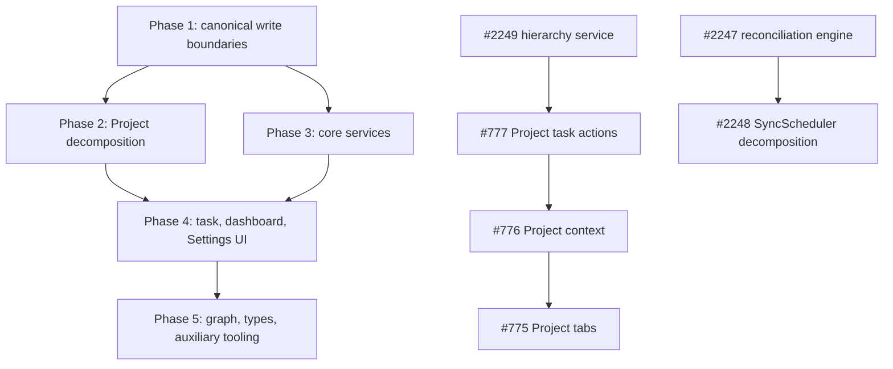

# Modularity and Architecture Hardening

## Decision summary

Mission Control will reduce architectural risk through incremental,
behavior-preserving extraction rather than broad rewrites.

The program prioritizes:

1. correctness where duplicated write paths have already drifted;
2. stable application-service boundaries around complex workflows;
3. thin route and page composition roots;
4. focused hooks and components with narrow contracts;
5. pure domain and layout code that can be tested without framework runtime; and
6. explicit package, type, and public API boundaries.

The implementation is tracked by
[the modularity epic](https://github.com/rsocko/mission-control/issues/2243)
and organized in the Mission Control project **Modularity & Architecture
Hardening** under the **Mission Control** category.

## Context

A repository-wide audit reviewed production code in:

- `src/app`;
- `src/components`;
- `src/lib`;
- `src/db`;
- `src/mcp`;
- `src/types`;
- `runtime`;
- `clients`; and
- maintained build and release scripts.

The audit found that Project detail remains the largest feature-level UI
monolith, but the pattern is systemic. The most consequential examples are:

- Project hierarchy writes implemented through multiple inconsistent paths;
- two task-move implementations with different reference-repoint behavior;
- large orchestration classes for sync and Copilot session lifecycle;
- page, component, and hook modules with dozens of unrelated state values and
  mutation handlers;
- Settings workflows copied across connector and list variants;
- graph modules that combine data access, layout algorithms, and rendering; and
- scripts and runtime packages that bypass intended public boundaries.

File size alone is not the criterion for this program. A large cohesive parser
or declarative schema can remain intact. Work is prioritized when a module
mixes independently changing responsibilities, duplicates correctness-sensitive
logic, or prevents focused testing.

## Goals

- Establish one canonical implementation for each correctness-sensitive write
  workflow.
- Make high-risk orchestration testable without mounting a full page or starting
  the complete runtime.
- Reduce change blast radius and repeated business logic.
- Preserve current user behavior and public contracts during migration.
- Give each domain a clear owner and import boundary.
- Support incremental delivery through independently reviewable pull requests.

## Non-goals

- Rewriting features solely to reduce line counts.
- Replacing working libraries or frameworks.
- Introducing a global application state container for all features.
- Combining unrelated refactors into one pull request.
- Changing product behavior unless a documented inconsistency or correctness
  defect requires it.
- Migrating away from SQLite as part of this program.

## Architectural rules

### Thin composition roots

Pages, API routes, workers, and package entry points should:

1. parse or receive inputs;
2. invoke a focused application service or hook;
3. map the result to the framework contract; and
4. compose independently owned modules.

They should not contain the complete business workflow.

### Canonical write workflows

Every business capability that mutates multiple tables or external systems must
have one canonical orchestration boundary. Compatibility routes may delegate to
it, but must not maintain separate table inventories or policy rules.

### Stable strangler facades

Existing broad APIs such as `SyncScheduler`, `useDashboardData`, and
`CopilotSessionLifecycleManager` may remain temporarily as facades. Their
implementation should move behind focused collaborators while consumers migrate
incrementally.

### State ownership

State belongs at the narrowest feature boundary that needs it. Scoped contexts
may coordinate a feature, but a context must not merely replace one god
component with one god state object.

### Pure cores

Parsing, normalization, layout, policy, state transition, and ranking logic
should be framework-independent where practical. Database, network, React, and
Next.js adapters should wrap those cores.

### Compatibility and observability

High-risk extractions must preserve logging, trace context, idempotency,
transaction boundaries, retries, cancellation, and error contracts.

## Delivery plan

### Phase 1: Safety and canonical boundaries

Correctness-sensitive consolidation lands before large UI extraction.

| Issue | Work item | Notes |
|---|---|---|
| [#2249](https://github.com/rsocko/mission-control/issues/2249) | Canonicalize Project hierarchy mutations and placement authorization | Must precede adoption of the existing Project task-actions hook. |
| [#2244](https://github.com/rsocko/mission-control/issues/2244) | Consolidate task move orchestration and reference repointing | Related to, but does not duplicate, attachment bounding in #2193. |
| [#2246](https://github.com/rsocko/mission-control/issues/2246) | Split database bootstrap, schema safety nets, and repairs | Complements the portable persistence work in #2107. |

### Phase 2: Project feature decomposition

This phase reuses the three existing Project modularization issues rather than
creating duplicates.

| Issue | Work item | Dependency |
|---|---|---|
| [#777](https://github.com/rsocko/mission-control/issues/777) | Adopt `useProjectTaskActions` in the live page | After #2249 so the hook uses the canonical hierarchy path. |
| [#776](https://github.com/rsocko/mission-control/issues/776) | Create scoped Project page context | After the action contract is reconciled. |
| [#775](https://github.com/rsocko/mission-control/issues/775) | Extract Project page tabs | After #776; tab-local state stays within each tab. |
| [#2253](https://github.com/rsocko/mission-control/issues/2253) | Share Project AI phase-planning and update contracts | May proceed in parallel with UI extraction. |
| [#2254](https://github.com/rsocko/mission-control/issues/2254) | Decompose the Project document intake wizard | Lower-risk, independent Project workflow. |

The intended Project detail structure is:

```text
src/app/projects/[id]/
  page.tsx
  context/
  hooks/
  tabs/
    ProjectOverviewTab.tsx
    ProjectPhasesTab.tsx
    ProjectTasksTab.tsx
    ProjectSettingsTab.tsx
  phase-list/
  phase-assign/
```

`page.tsx` remains responsible for route identity and feature composition, not
for every tab's rendering and mutations.

### Phase 3: Core service boundaries

| Issue | Work item |
|---|---|
| [#2248](https://github.com/rsocko/mission-control/issues/2248) | Decompose `SyncScheduler` into timing, queue, and execution services |
| [#2245](https://github.com/rsocko/mission-control/issues/2245) | Split Copilot run lifecycle, lease reaping, and telemetry |
| [#2250](https://github.com/rsocko/mission-control/issues/2250) | Decompose `CopilotRuntime` and establish its package API |
| [#2251](https://github.com/rsocko/mission-control/issues/2251) | Split GitHub connector issue, project, and notification capabilities |
| [#2252](https://github.com/rsocko/mission-control/issues/2252) | Split the triage facade into focused domain modules |
| [#2247](https://github.com/rsocko/mission-control/issues/2247) | Extract a reusable resumable reconciliation engine |
| [#2258](https://github.com/rsocko/mission-control/issues/2258) | Split AI feature implementations out of the AI barrel |

These changes should retain compatibility facades until all consumers have
migrated.

### Phase 4: Task, dashboard, and Settings UI

| Issue | Work item |
|---|---|
| [#2259](https://github.com/rsocko/mission-control/issues/2259) | Decompose `TaskDetailPanel` |
| [#2261](https://github.com/rsocko/mission-control/issues/2261) | Extract the Quick Add submission workflow and picker state |
| [#2264](https://github.com/rsocko/mission-control/issues/2264) | Decompose dashboard state and standardize task actions |
| [#2257](https://github.com/rsocko/mission-control/issues/2257) | Decompose Settings tag review |
| [#2255](https://github.com/rsocko/mission-control/issues/2255) | Consolidate Settings connector and triage-source administration |
| [#2256](https://github.com/rsocko/mission-control/issues/2256) | Extract list-group rename behavior and Settings primitives |

The first extraction from each large UI module should be its orchestration or
state-machine boundary. Presentational splitting follows once behavior has
focused characterization tests.

### Phase 5: Graph, types, and auxiliary tooling

| Issue | Work item |
|---|---|
| [#2263](https://github.com/rsocko/mission-control/issues/2263) | Separate graph feature data, layout, and rendering |
| [#2262](https://github.com/rsocko/mission-control/issues/2262) | Clarify canonical domain and dashboard view-model types |
| [#2260](https://github.com/rsocko/mission-control/issues/2260) | Deduplicate browser-extension capture and importer orchestration |
| [#2265](https://github.com/rsocko/mission-control/issues/2265) | Modularize Copilot comparison, evidence, and worker scripts |

## Dependency graph



The phase ordering controls program risk, but independent work within a phase
may proceed concurrently when files and contracts do not overlap.

## Testing strategy

### Characterization first

Before extracting a high-risk workflow, capture its observable behavior:

- accepted inputs and validation failures;
- transaction and external side-effect order;
- error and rollback mapping;
- retry, timeout, cancellation, and idempotency behavior;
- optimistic UI transitions and undo behavior; and
- accessibility and keyboard interactions.

### Test layers

- Pure unit tests for policies, normalization, state transitions, layout, and
  reference inventories.
- Component tests for extracted UI sections and scoped hooks.
- Route/service integration tests for database and connector orchestration.
- Existing end-to-end smoke tests for Project, task detail, Quick Add, Settings,
  sync, and graph flows.

### Pull request constraints

- One architectural seam per pull request where practical.
- No behavior changes hidden inside mechanical file moves.
- Compatibility facades remain until all call sites migrate.
- Dead duplicate implementations are removed in the same phase that replaces
  them.

## Completion measures

The program is complete when:

- Project, task move, and hierarchy mutations each have one canonical workflow;
- target pages and routes are composition roots rather than workflow owners;
- core orchestrators have independently testable collaborators;
- implementation barrels contain only exports;
- duplicated Settings and extension workflows have one implementation;
- graph layout algorithms are DOM-independent;
- same-named incompatible domain types no longer coexist; and
- all tracked GitHub issues are complete or explicitly descoped in the epic.

Line-count reduction is an expected consequence, not the acceptance metric.

## Deduplication record

The planning pass searched existing open and closed GitHub issues by title and
body before creating work.

- Existing Project modularization issues #775, #776, and #777 were retained.
- #2193 remains the owner of task-move attachment resource bounds.
- #2107 remains the owner of portable persistence/repository boundaries.
- Existing feature requests for Project, graph, Quick Add, and Tag Review were
  not repurposed because they change product behavior rather than module
  ownership.

All implementation items in this program are GitHub-backed issues. Mission
Control is used only to group and phase those issues; no MC-local implementation
tasks are part of the project.
