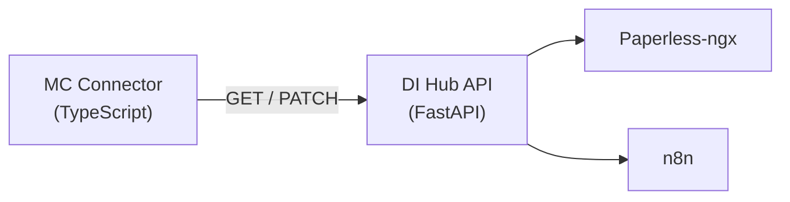

# Document Intelligence ↔ Mission Control: API Integration Contract

*This document is the single source of truth for the DI ↔ MC API interface.*

---

## 1. Overview

Mission Control (MC) consumes the Document Intelligence Hub (DI) API via the `DocumentIntelligenceConnector`. DI is a FastAPI/Python service that processes documents from Paperless-ngx, generating actions, alerts, and insights. MC is a Next.js/TypeScript application that aggregates these into its unified task/alert/triage system.

OWL owns document interpretation, Needs Review, the trusted Action Queue, and
Paperless lifecycle. MC owns cross-system prioritization and lightweight
execution. MC does not reproduce OWL correction, pipeline health, dry-run,
backfill, or custom-run administration.

### Architecture



### Base Configuration

| Setting | Default | Environment Variable |
|---------|---------|---------------------|
| Base URL | `http://localhost:8200` | `DOC_INTELLIGENCE_URL` |
| API Key | *(optional)* | `DOC_INTELLIGENCE_API_KEY` |
| Paperless URL | *(optional)* | `PAPERLESS_BASE_URL` |

---

## 2. Authentication

All requests include the following headers when an API key is configured:

```http
Accept: application/json
Authorization: Bearer {apiKey}
X-API-Key: {apiKey}
```

When no API key is configured, only `Accept: application/json` is sent. DI must accept unauthenticated requests in homelab mode.

---

## 3. Endpoints

### 3.1 Action Queue

#### `GET /api/action-queue/actions`

Fetch document-derived actions that MC maps to TaskItems.

**Query Parameters:**

| Parameter | Type | Required | Description |
|-----------|------|----------|-------------|
| `status` | `string` | No | MC sends `all`; individual values are `pending`, legacy `acknowledged`, `completed`, `dismissed`, `snoozed`, and `not_an_action` |
| `limit` | `number` | No | MC requests pages of 100 |
| `offset` | `number` | No | Zero-based offset; MC advances it by the returned row count |
| `updated_since` | ISO 8601 timestamp | No | Inclusive source-update filter supported by OWL |
| `include_not_ready` | `boolean` | No | Defaults to `false`. MC uses `true` only when fetching Needs Review notifications. |

**Response:** `200 OK`

```typescript
interface DocAction {
  id: string;
  document_id: number;
  document_title: string;
  action_type: 'pay' | 'respond' | 'file' | 'archive' | 'review' | 'sign' | 'schedule';
  category?: string | null;
  urgency: 'critical' | 'high' | 'medium' | 'low';
  due_date?: string | null;        // ISO 8601 date string
  amount?: number | null;           // Dollar amount (for 'pay' actions)
  correspondent?: string | null;    // Entity name (for 'pay' actions)
  summary: string;                  // AI-generated action summary
  action_ready: boolean;            // Authoritative MC task-ingestion gate
  review_state: 'ready' | 'needs_review' | 'resolved_no_action';
  needs_review_url: string | null;   // Exact OWL review item
  recommended_cta: {
    id: string;
    label: string;
    url?: string | null;
    phone?: string | null;
    metadata?: Record<string, unknown>;
    [safeField: string]: unknown;
  } | null;
  source_actions: Array<{
    id: string;
    label: string;
    method: 'POST';
    url: string;
  }>;
  status: 'pending' | 'acknowledged' | 'completed' | 'done' | 'dismissed' | 'snoozed' | 'not_an_action';
  created_at: string;               // ISO 8601 timestamp
  updated_at: string;               // ISO 8601 source freshness timestamp
  snoozed_until?: string | null;     // Present for snoozed actions
  document_url?: string;            // Paperless document URL
  document_type?: string | null;
  preview_url?: string | null;       // Embeddable OWL/Paperless preview URL
  preview_type?: 'pdf' | 'iframe' | 'image' | 'external' | null;
  thumbnail_url?: string | null;     // Used when no richer preview is available
}
```

**Response body:** OWL returns a flat `DocAction[]`, ordered deterministically by
`created_at DESC, id DESC`. MC requests successive offsets until a page contains
fewer than 100 rows. For backward compatibility, MC also accepts an envelope
whose records are named `actions`, `items`, or `results`, with cursor or page
metadata. Repeating a page is treated as an upstream error.

**MC Mapping:** MC maps only supported actions where `action_ready === true`.
For legacy OWL instances that omit readiness fields, MC preserves the prior
behavior. Explicit `false` is never inferred away from urgency, confidence,
status, or review state. MC requests `include_not_ready=true` separately and
maps `needs_review` records to compact notifications with
`needs_review_url`; they are not tasks or triage recommendations.

MC orders OWL work by deadline: overdue, today, next 7 days, later, then no due
date. Action type and category are filters and tie-breakers. PAY, RESPOND, SIGN,
and SCHEDULE outrank FILE and ARCHIVE only when deadlines tie. This ordering is
an OWL projection inside MC and does not replace MC's cross-source Do Next
intelligence.

---

#### `PATCH /api/action-queue/actions/{id}`

Update an action's status (task completion / alert dismissal writeback).

**Path Parameters:**

| Parameter | Type | Description |
|-----------|------|-------------|
| `id` | `string` | Action ID (matches `DocAction.id`) |

**Request Body:**

```typescript
interface ActionStatusUpdate {
  status: 'pending' | 'completed' | 'done' | 'dismissed';
}
```

**Response:** `200 OK` (empty body or updated action)

**MC Usage:**
- `completeTask(sourceId)` → sends `{ status: 'completed' }`
- `reopenTask(sourceId)` → sends `{ status: 'pending' }`
- `updateTask(sourceId, { status: 'cancelled' })` → sends `{ status: 'dismissed' }`
- `dismissAlert(sourceId)` → sends `{ status: 'dismissed' }` (for `eob-*` and `action-*` prefixed IDs)

OWL performs the corresponding Paperless-aware mutation before reporting
success.

---

#### `POST /api/action-queue/actions/{id}/snooze`

Snooze an action in OWL and its Paperless-backed workflow.

```typescript
interface ActionSnooze {
  until: string; // Future ISO 8601 timestamp
}
```

**Response:** `200 OK` or another 2xx response after the source mutation
succeeds.

---

#### `POST /api/action-queue/actions/{id}/feedback`

Record classifier or extraction feedback.

```typescript
type ActionFeedback =
  | { feedback_type: 'not_an_action' }
  | { feedback_type: 'misclassified'; corrected_action_type: DocAction['action_type'] }
  | { feedback_type: 'wrong_urgency'; corrected_urgency: DocAction['urgency'] }
  | { feedback_type: 'wrong_amount'; corrected_amount: number | null };
```

`not_an_action` is a false-positive terminal source disposition, not a
reclassification shortcut. MC clears rejected action metadata while retaining
durable document facts. The correction variants update the extracted value and
return the corrected action, including its current contextual CTA, without
changing lifecycle.

---

#### Discovered source actions

MC renders `source_actions` generically and invokes only declared same-origin
`POST` actions through its server-side OWL connector. A ready action may expose:

- `send_to_review` → `POST /api/action-queue/actions/{id}/review`
- `file_document` → `POST /api/action-queue/actions/{id}/file`

Each endpoint returns the updated connector item. MC refreshes source-controlled
fields and CTA immediately. FILE/ARCHIVE mutation remains atomic and
Paperless-aware in OWL; MC never removes Paperless tags itself. A non-2xx
response is surfaced as failure and is not recorded locally.

`recommended_cta` remains distinct from lifecycle and source actions. Opening a
safe URL or calling a phone number never marks the action complete. Done and
Snooze remain explicit source mutations. Complex review/correction always
deep-links to the exact OWL item.

---

### 3.2 Statement Tracking

#### `GET /api/statements/missing`

Fetch statements that are overdue based on expected frequency.

**Query Parameters:** None

**Response:** `200 OK`

```typescript
interface MissingStatement {
  id: string | number;
  correspondent: string;             // e.g. "Chase Sapphire"
  correspondent_id?: string | number;
  expected_period: string;           // e.g. "July 2026", "Q2 2026"
  frequency: string;                 // e.g. "monthly", "quarterly"
  last_received_date?: string | null; // ISO 8601 date
  days_overdue: number;              // Days past expected receipt
}
```

**Response body:** `MissingStatement[]`

**MC Mapping:** Each missing statement is mapped to an `AlertItem` via `mapMissingStatementToAlert()`.

**Note:** Statement alerts are informational — there is no dismissal writeback endpoint. MC treats `stmt-*` sourceIds as read-only.

---

### 3.3 EOB Matching

#### `GET /api/eob/unmatched`

Fetch Explanation of Benefits documents that have no matching bill.

**Query Parameters:** None

**Response:** `200 OK`

```typescript
interface UnmatchedEob {
  id: string | number;
  provider: string;                  // e.g. "Dr. Ana Martinez"
  amount: number;                    // Total EOB amount
  date_of_service: string;           // ISO 8601 date
  patient_responsibility: number;    // Patient owes amount
  document_url?: string;             // Paperless document URL
  created_at?: string;               // ISO 8601 timestamp
}
```

**Response body:** `UnmatchedEob[]`

**MC Mapping:** Each unmatched EOB is mapped to an `AlertItem` via `mapUnmatchedEobToAlert()`.

**Dismissal:** EOB alerts can be dismissed via `PATCH /api/action-queue/actions/{id}` with `{ status: 'dismissed' }`. MC strips the `eob-` prefix before calling.

---

### 3.4 Documents *(Deferred — Paperless-ngx is the primary document browser)*

> **Note:** After product review, the MC `/doc-intelligence` hub page will not include a Documents tab.
> Users browse documents directly in Paperless-ngx. MC links out via `metadata.previewUrl` on task items.
> This endpoint may be revisited if a document gallery is needed in MC in the future.

#### `GET /api/documents`

Browse the document corpus from Paperless-ngx.

**Query Parameters:**

| Parameter | Type | Required | Description |
|-----------|------|----------|-------------|
| `type` | `string` | No | Filter by document type: `invoice`, `statement`, `eob`, `contract`, `receipt`, `misc` |
| `has_action` | `boolean` | No | Filter to documents with pending actions |
| `limit` | `number` | No | Pagination limit (default: 50) |
| `offset` | `number` | No | Pagination offset (default: 0) |
| `sort` | `string` | No | Sort field: `date_added`, `title`, `type` (default: `date_added`) |
| `order` | `string` | No | Sort order: `asc`, `desc` (default: `desc`) |

**Response:** `200 OK`

```typescript
interface Document {
  id: number;
  title: string;
  document_type: 'invoice' | 'statement' | 'eob' | 'contract' | 'receipt' | 'misc';
  correspondent?: string | null;
  date_added: string;                // ISO 8601 timestamp
  date_created?: string | null;      // Document creation date
  amount?: number | null;
  thumbnail_url?: string | null;     // Paperless thumbnail URL
  document_url: string;              // Full document URL in Paperless
  pending_action?: {
    id: string;
    action_type: DocAction['action_type'];
    urgency: DocAction['urgency'];
  } | null;
  tags: string[];
}

interface DocumentListResponse {
  items: Document[];
  total: number;
  limit: number;
  offset: number;
}
```

---

#### `GET /api/documents/{id}`

Fetch a single document's details.

**Response:** `200 OK` — returns a `Document` object with additional fields:

```typescript
interface DocumentDetail extends Document {
  content_preview?: string;          // First ~500 chars of OCR text
  page_count?: number;
  file_size_bytes?: number;
  ocr_quality_score?: number;        // 0.0–1.0
  related_actions: DocAction[];
  paperless_id: number;
}
```

---

### 3.5 Stats / Insights *(Planned — Phase 3)*

#### `GET /api/stats`

Aggregate statistics across all DI modules.

**Query Parameters:**

| Parameter | Type | Required | Description |
|-----------|------|----------|-------------|
| `period` | `string` | No | Time period: `week`, `month`, `quarter` (default: `month`) |

**Response:** `200 OK`

```typescript
interface DISummaryStats {
  actions: {
    pending: number;
    critical: number;
    completed_this_period: number;
  };
  documents: {
    total_processed: number;
    added_this_period: number;
  };
  statements: {
    tracked: number;
    missing: number;
  };
  eob: {
    matched: number;
    unmatched: number;
    unresolved_amount: number;
  };
  modules: ModuleStatus[];
}

interface ModuleStatus {
  name: 'action-queue' | 'statements' | 'eob-matching';
  status: 'healthy' | 'degraded' | 'down';
  last_sync: string;                 // ISO 8601 timestamp
  item_count: number;
  detail?: string;                   // Human-readable status detail
}
```

---

## 4. Error Handling

### Standard Error Response

All endpoints return errors in this format:

```typescript
interface APIError {
  detail: string;                    // Human-readable error message
  status_code: number;               // HTTP status code
}
```

### Error Codes

| Code | Meaning | MC Behavior |
|------|---------|-------------|
| `200` | Success | Process response |
| `400` | Bad request | Log warning, skip |
| `401` | Unauthorized | Mark connector as "auth failed" in settings |
| `404` | Not found | Log warning, skip individual item |
| `500` | Server error | Throw, surface as sync error |
| `502/503` | DI unavailable | See "DI Offline" behavior below |
| Network error | Connection refused / timeout | See "DI Offline" behavior below |

### DI Offline Behavior

When DI Hub is unreachable:

1. **MC sync continues** — other connectors are unaffected
2. **Stale data persists** — previously synced tasks/alerts remain in MC's database with their last known state
3. **Error surfaces** in connector settings as "Connection failed: {error}"
4. **No automatic retry** during the same sync cycle — next scheduled sync will retry
5. **`testConnection()`** returns `{ success: false, message: "Connection failed: ..." }`

---

## 5. MC Connector Source ID Conventions

MC prefixes source IDs to distinguish item types during writeback:

| Prefix | Source | Writeback |
|--------|--------|-----------|
| *(none)* | Action Queue actions | `PATCH /api/action-queue/actions/{sourceId}` |
| `stmt-` | Missing statements | No writeback (informational) |
| `eob-` | Unmatched EOBs | `PATCH /api/action-queue/actions/{rawId}` (prefix stripped) |
| `action-` | Action Queue alerts | `PATCH /api/action-queue/actions/{rawId}` (prefix stripped) |

---

## 6. MC Connector Tags

The connector exposes these tags for filtering in MC:

| Tag ID | Display Name | Color | Mapping |
|--------|-------------|-------|---------|
| `docintel:action-queue` | Action Queue | `#3b82f6` | Module source |
| `docintel:statements` | Statement Tracking | `#8b5cf6` | Module source |
| `docintel:eob-matching` | EOB Matching | `#ec4899` | Module source |
| `docintel:pay` | Pay | `#ef4444` | Action type |
| `docintel:respond` | Respond | `#f97316` | Action type |
| `docintel:sign` | Sign | `#eab308` | Action type |
| `docintel:schedule` | Schedule | `#22c55e` | Action type |
| `docintel:file` | File | `#06b6d4` | Action type |
| `docintel:review` | Review | `#6366f1` | Action type |

---

## 7. MC Connector Modules

The connector supports enabling/disabling individual DI modules:

```typescript
interface ConnectorModules {
  actionQueue: boolean;   // default: true  — fetches tasks from action queue
  statements: boolean;    // default: true  — fetches missing statement alerts
  eobMatching: boolean;   // default: true  — fetches unmatched EOB alerts
}
```

When a module is disabled, the connector skips the corresponding API call entirely.

---

## 8. Task Mapping Reference

### Action → TaskItem

| DocAction Field | TaskItem Field | Transform |
|----------------|---------------|-----------|
| `id` | `sourceId` | Direct |
| — | `id` | `docintel-{id}` |
| `action_type` + fields | `title` | `buildTaskTitle()` — e.g. "Pay: PG&E — $143.22" |
| `summary` | `description` | Direct |
| `status` | `status` | `pending` → `todo`; `completed`/legacy `done` → `done`; `dismissed`/`not_an_action` → `cancelled`; `snoozed` → `todo` |
| `snoozed_until` | `snoozedUntil` | Preserved only while OWL status is `snoozed` |
| `updated_at` | `updatedAt` | Source freshness timestamp; falls back to `created_at` |
| `status` | `metadata.owlStatus` | Original OWL lifecycle value |
| `dismissed`/`not_an_action` | `metadata.owlDisposition` | Preserves the terminal source outcome |
| `snoozed_until` | `metadata.owlSnoozedUntil` | Preserves the source snooze deadline |
| `updated_at` | `metadata.owlUpdatedAt` | Preserves source freshness for diagnostics |
| `urgency` | `priority` | `critical` → `critical`, `high` → `high`, `medium` → `medium`, `low` → `low` |
| `due_date` | `dueDate` | Direct (ISO string) |
| `created_at` | `createdAt` | Direct (ISO string) |
| `document_url` | `metadata.documentUrl` | Direct |
| `preview_url` | `metadata.previewUrl` | Preferred rich preview when supplied |
| `thumbnail_url` | `metadata.previewUrl` | Used when no rich preview is supplied |
| `document_url` | `metadata.previewUrl` | External fallback; MC previews it through OWL's authenticated document proxy |
| `preview_type` | `metadata.previewType` | Direct when `preview_url` is supplied; otherwise inferred |
| — | `metadata.previewLabel` | `'View in Paperless'` |
| `amount` | `metadata.amount` | Direct |
| `correspondent` | `metadata.correspondent` | Direct |
| `action_type` | `tags[1]` | Tag with `docintel:{action_type}` |
| — | `tags[0]` | Tag with `docintel:action-queue` |

### MissingStatement → AlertItem

| MissingStatement Field | AlertItem Field | Transform |
|-----------------------|----------------|-----------|
| `id` | `sourceId` | `stmt-{id}` |
| `correspondent` + `expected_period` | `title` | `"Missing: {correspondent} — {expected_period}"` |
| — | `message` | Human-readable overdue description |
| `days_overdue` | `severity` | `>14 → high`, `>7 → medium`, `≤7 → low` |
| `days_overdue` | `metadata.daysOverdue` | Direct |
| `frequency` | `metadata.frequency` | Direct |

### UnmatchedEob → AlertItem

| UnmatchedEob Field | AlertItem Field | Transform |
|-------------------|----------------|-----------|
| `id` | `sourceId` | `eob-{id}` |
| `provider` + `amount` | `title` | `"Unmatched EOB: {provider} — ${amount}"` |
| — | `severity` | `medium` (default) |
| `document_url` | `metadata.documentUrl` | Direct |
| `patient_responsibility` | `metadata.patientResponsibility` | Direct |

---

## 9. Versioning Strategy

### Current Version: v1 (implicit)

All current endpoints are unversioned (e.g., `/api/action-queue/actions`). This is acceptable for the homelab deployment where both services are co-deployed.

### Future Versioning (if needed)

When breaking changes are required:

1. **URL prefix**: New endpoints use `/api/v2/...`
2. **Deprecation period**: v1 endpoints remain functional for ≥30 days after v2 launch
3. **MC connector**: Must support configurable API version in connector settings
4. **Response header**: DI should include `X-API-Version: 1` in all responses

### Breaking vs Non-Breaking Changes

| Change Type | Breaking? | Action |
|------------|-----------|--------|
| Adding new fields to response | No | MC ignores unknown fields |
| Adding new optional query params | No | Backwards compatible |
| Adding new `action_type` values | No | MC filters via `TASK_ACTION_TYPES` Set |
| Removing or renaming fields | **Yes** | Requires version bump |
| Changing field types | **Yes** | Requires version bump |
| Changing URL paths | **Yes** | Requires version bump |

---

## 10. Changelog

| Date | Version | Change |
|------|---------|--------|
| 2026-07-23 | 1.0 | Initial contract — documents existing + planned endpoints |
