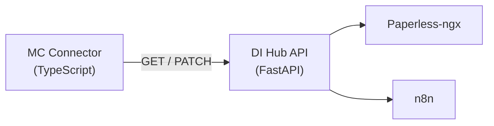

# Document Intelligence ↔ Mission Control: API Integration Contract

*This document is the single source of truth for the DI ↔ MC API interface.*

---

## 1. Overview

Mission Control (MC) consumes the Document Intelligence Hub (DI) API via the `DocumentIntelligenceConnector`. DI is a FastAPI/Python service that processes documents from Paperless-ngx, generating actions, alerts, and insights. MC is a Next.js/TypeScript application that aggregates these into its unified task/alert/triage system.

### Architecture



### Base Configuration

| Setting | Default | Environment Variable |
|---------|---------|---------------------|
| Base URL | `http://localhost:8200` | `DOC_INTELLIGENCE_URL` |
| API Key | *(optional)* | `DOC_INTELLIGENCE_API_KEY` |
| Paperless URL | *(optional)* | `PAPERLESS_BASE_URL` |

---

## 2. Authentication

All requests include the following headers when an API key is configured:

```http
Accept: application/json
Authorization: Bearer {apiKey}
X-API-Key: {apiKey}
```

When no API key is configured, only `Accept: application/json` is sent. DI must accept unauthenticated requests in homelab mode.

---

## 3. Endpoints

### 3.1 Action Queue

#### `GET /api/action-queue/actions`

Fetch document-derived actions that MC maps to TaskItems.

**Query Parameters:**

| Parameter | Type | Required | Description |
|-----------|------|----------|-------------|
| `status` | `string` | No | Filter by status: `pending`, `in_progress`, `done`, `dismissed` |

**Response:** `200 OK`

```typescript
interface DocAction {
  id: string;
  document_id: number;
  document_title: string;
  action_type: 'pay' | 'respond' | 'file' | 'review' | 'sign' | 'schedule';
  urgency: 'critical' | 'high' | 'medium' | 'low';
  due_date?: string | null;        // ISO 8601 date string
  amount?: number | null;           // Dollar amount (for 'pay' actions)
  correspondent?: string | null;    // Entity name (for 'pay' actions)
  summary: string;                  // AI-generated action summary
  status: 'pending' | 'in_progress' | 'done' | 'dismissed';
  created_at: string;               // ISO 8601 timestamp
  document_url?: string;            // Paperless document URL
}
```

**Response body:** `DocAction[]`

**MC Mapping:** Each action where `action_type ∈ {pay, respond, file, review, sign, schedule}` is mapped to a `TaskItem` via `mapActionToTask()`.

---

#### `PATCH /api/action-queue/actions/{id}`

Update an action's status (task completion / alert dismissal writeback).

**Path Parameters:**

| Parameter | Type | Description |
|-----------|------|-------------|
| `id` | `string` | Action ID (matches `DocAction.id`) |

**Request Body:**

```typescript
interface ActionStatusUpdate {
  status: 'done' | 'dismissed';
}
```

**Response:** `200 OK` (empty body or updated action)

**MC Usage:**
- `completeTask(sourceId)` → sends `{ status: 'done' }`
- `dismissAlert(sourceId)` → sends `{ status: 'dismissed' }` (for `eob-*` and `action-*` prefixed IDs)

---

### 3.2 Statement Tracking

#### `GET /api/statements/missing`

Fetch statements that are overdue based on expected frequency.

**Query Parameters:** None

**Response:** `200 OK`

```typescript
interface MissingStatement {
  id: string | number;
  correspondent: string;             // e.g. "Chase Sapphire"
  correspondent_id?: string | number;
  expected_period: string;           // e.g. "July 2026", "Q2 2026"
  frequency: string;                 // e.g. "monthly", "quarterly"
  last_received_date?: string | null; // ISO 8601 date
  days_overdue: number;              // Days past expected receipt
}
```

**Response body:** `MissingStatement[]`

**MC Mapping:** Each missing statement is mapped to an `AlertItem` via `mapMissingStatementToAlert()`.

**Note:** Statement alerts are informational — there is no dismissal writeback endpoint. MC treats `stmt-*` sourceIds as read-only.

---

### 3.3 EOB Matching

#### `GET /api/eob/unmatched`

Fetch Explanation of Benefits documents that have no matching bill.

**Query Parameters:** None

**Response:** `200 OK`

```typescript
interface UnmatchedEob {
  id: string | number;
  provider: string;                  // e.g. "Dr. Ana Martinez"
  amount: number;                    // Total EOB amount
  date_of_service: string;           // ISO 8601 date
  patient_responsibility: number;    // Patient owes amount
  document_url?: string;             // Paperless document URL
  created_at?: string;               // ISO 8601 timestamp
}
```

**Response body:** `UnmatchedEob[]`

**MC Mapping:** Each unmatched EOB is mapped to an `AlertItem` via `mapUnmatchedEobToAlert()`.

**Dismissal:** EOB alerts can be dismissed via `PATCH /api/action-queue/actions/{id}` with `{ status: 'dismissed' }`. MC strips the `eob-` prefix before calling.

---

### 3.4 Documents *(Deferred — Paperless-ngx is the primary document browser)*

> **Note:** After product review, the MC `/doc-intelligence` hub page will not include a Documents tab.
> Users browse documents directly in Paperless-ngx. MC links out via `metadata.previewUrl` on task items.
> This endpoint may be revisited if a document gallery is needed in MC in the future.

#### `GET /api/documents`

Browse the document corpus from Paperless-ngx.

**Query Parameters:**

| Parameter | Type | Required | Description |
|-----------|------|----------|-------------|
| `type` | `string` | No | Filter by document type: `invoice`, `statement`, `eob`, `contract`, `receipt`, `misc` |
| `has_action` | `boolean` | No | Filter to documents with pending actions |
| `limit` | `number` | No | Pagination limit (default: 50) |
| `offset` | `number` | No | Pagination offset (default: 0) |
| `sort` | `string` | No | Sort field: `date_added`, `title`, `type` (default: `date_added`) |
| `order` | `string` | No | Sort order: `asc`, `desc` (default: `desc`) |

**Response:** `200 OK`

```typescript
interface Document {
  id: number;
  title: string;
  document_type: 'invoice' | 'statement' | 'eob' | 'contract' | 'receipt' | 'misc';
  correspondent?: string | null;
  date_added: string;                // ISO 8601 timestamp
  date_created?: string | null;      // Document creation date
  amount?: number | null;
  thumbnail_url?: string | null;     // Paperless thumbnail URL
  document_url: string;              // Full document URL in Paperless
  pending_action?: {
    id: string;
    action_type: DocAction['action_type'];
    urgency: DocAction['urgency'];
  } | null;
  tags: string[];
}

interface DocumentListResponse {
  items: Document[];
  total: number;
  limit: number;
  offset: number;
}
```

---

#### `GET /api/documents/{id}`

Fetch a single document's details.

**Response:** `200 OK` — returns a `Document` object with additional fields:

```typescript
interface DocumentDetail extends Document {
  content_preview?: string;          // First ~500 chars of OCR text
  page_count?: number;
  file_size_bytes?: number;
  ocr_quality_score?: number;        // 0.0–1.0
  related_actions: DocAction[];
  paperless_id: number;
}
```

---

### 3.5 Stats / Insights *(Planned — Phase 3)*

#### `GET /api/stats`

Aggregate statistics across all DI modules.

**Query Parameters:**

| Parameter | Type | Required | Description |
|-----------|------|----------|-------------|
| `period` | `string` | No | Time period: `week`, `month`, `quarter` (default: `month`) |

**Response:** `200 OK`

```typescript
interface DISummaryStats {
  actions: {
    pending: number;
    critical: number;
    completed_this_period: number;
  };
  documents: {
    total_processed: number;
    added_this_period: number;
  };
  statements: {
    tracked: number;
    missing: number;
  };
  eob: {
    matched: number;
    unmatched: number;
    unresolved_amount: number;
  };
  modules: ModuleStatus[];
}

interface ModuleStatus {
  name: 'action-queue' | 'statements' | 'eob-matching';
  status: 'healthy' | 'degraded' | 'down';
  last_sync: string;                 // ISO 8601 timestamp
  item_count: number;
  detail?: string;                   // Human-readable status detail
}
```

---

## 4. Error Handling

### Standard Error Response

All endpoints return errors in this format:

```typescript
interface APIError {
  detail: string;                    // Human-readable error message
  status_code: number;               // HTTP status code
}
```

### Error Codes

| Code | Meaning | MC Behavior |
|------|---------|-------------|
| `200` | Success | Process response |
| `400` | Bad request | Log warning, skip |
| `401` | Unauthorized | Mark connector as "auth failed" in settings |
| `404` | Not found | Log warning, skip individual item |
| `500` | Server error | Throw, surface as sync error |
| `502/503` | DI unavailable | See "DI Offline" behavior below |
| Network error | Connection refused / timeout | See "DI Offline" behavior below |

### DI Offline Behavior

When DI Hub is unreachable:

1. **MC sync continues** — other connectors are unaffected
2. **Stale data persists** — previously synced tasks/alerts remain in MC's database with their last known state
3. **Error surfaces** in connector settings as "Connection failed: {error}"
4. **No automatic retry** during the same sync cycle — next scheduled sync will retry
5. **`testConnection()`** returns `{ success: false, message: "Connection failed: ..." }`

---

## 5. MC Connector Source ID Conventions

MC prefixes source IDs to distinguish item types during writeback:

| Prefix | Source | Writeback |
|--------|--------|-----------|
| *(none)* | Action Queue actions | `PATCH /api/action-queue/actions/{sourceId}` |
| `stmt-` | Missing statements | No writeback (informational) |
| `eob-` | Unmatched EOBs | `PATCH /api/action-queue/actions/{rawId}` (prefix stripped) |
| `action-` | Action Queue alerts | `PATCH /api/action-queue/actions/{rawId}` (prefix stripped) |

---

## 6. MC Connector Tags

The connector exposes these tags for filtering in MC:

| Tag ID | Display Name | Color | Mapping |
|--------|-------------|-------|---------|
| `docintel:action-queue` | Action Queue | `#3b82f6` | Module source |
| `docintel:statements` | Statement Tracking | `#8b5cf6` | Module source |
| `docintel:eob-matching` | EOB Matching | `#ec4899` | Module source |
| `docintel:pay` | Pay | `#ef4444` | Action type |
| `docintel:respond` | Respond | `#f97316` | Action type |
| `docintel:sign` | Sign | `#eab308` | Action type |
| `docintel:schedule` | Schedule | `#22c55e` | Action type |
| `docintel:file` | File | `#06b6d4` | Action type |
| `docintel:review` | Review | `#6366f1` | Action type |

---

## 7. MC Connector Modules

The connector supports enabling/disabling individual DI modules:

```typescript
interface ConnectorModules {
  actionQueue: boolean;   // default: true  — fetches tasks from action queue
  statements: boolean;    // default: true  — fetches missing statement alerts
  eobMatching: boolean;   // default: true  — fetches unmatched EOB alerts
}
```

When a module is disabled, the connector skips the corresponding API call entirely.

---

## 8. Task Mapping Reference

### Action → TaskItem

| DocAction Field | TaskItem Field | Transform |
|----------------|---------------|-----------|
| `id` | `sourceId` | Direct |
| — | `id` | `docintel-{id}` |
| `action_type` + fields | `title` | `buildTaskTitle()` — e.g. "Pay: PG&E — $143.22" |
| `summary` | `description` | Direct |
| `status` | `status` | `pending`/`in_progress` → `todo`, `done` → `done`, `dismissed` → `cancelled` |
| `urgency` | `priority` | `critical` → `critical`, `high` → `high`, `medium` → `medium`, `low` → `low` |
| `due_date` | `dueDate` | Direct (ISO string) |
| `created_at` | `createdAt` | Direct (ISO string) |
| `document_url` | `metadata.documentUrl` | Direct |
| `document_url` | `metadata.previewUrl` | Direct |
| — | `metadata.previewType` | `'external'` |
| — | `metadata.previewLabel` | `'View in Paperless'` |
| `amount` | `metadata.amount` | Direct |
| `correspondent` | `metadata.correspondent` | Direct |
| `action_type` | `tags[1]` | Tag with `docintel:{action_type}` |
| — | `tags[0]` | Tag with `docintel:action-queue` |

### MissingStatement → AlertItem

| MissingStatement Field | AlertItem Field | Transform |
|-----------------------|----------------|-----------|
| `id` | `sourceId` | `stmt-{id}` |
| `correspondent` + `expected_period` | `title` | `"Missing: {correspondent} — {expected_period}"` |
| — | `message` | Human-readable overdue description |
| `days_overdue` | `severity` | `>14 → high`, `>7 → medium`, `≤7 → low` |
| `days_overdue` | `metadata.daysOverdue` | Direct |
| `frequency` | `metadata.frequency` | Direct |

### UnmatchedEob → AlertItem

| UnmatchedEob Field | AlertItem Field | Transform |
|-------------------|----------------|-----------|
| `id` | `sourceId` | `eob-{id}` |
| `provider` + `amount` | `title` | `"Unmatched EOB: {provider} — ${amount}"` |
| — | `severity` | `medium` (default) |
| `document_url` | `metadata.documentUrl` | Direct |
| `patient_responsibility` | `metadata.patientResponsibility` | Direct |

---

## 9. Versioning Strategy

### Current Version: v1 (implicit)

All current endpoints are unversioned (e.g., `/api/action-queue/actions`). This is acceptable for the homelab deployment where both services are co-deployed.

### Future Versioning (if needed)

When breaking changes are required:

1. **URL prefix**: New endpoints use `/api/v2/...`
2. **Deprecation period**: v1 endpoints remain functional for ≥30 days after v2 launch
3. **MC connector**: Must support configurable API version in connector settings
4. **Response header**: DI should include `X-API-Version: 1` in all responses

### Breaking vs Non-Breaking Changes

| Change Type | Breaking? | Action |
|------------|-----------|--------|
| Adding new fields to response | No | MC ignores unknown fields |
| Adding new optional query params | No | Backwards compatible |
| Adding new `action_type` values | No | MC filters via `TASK_ACTION_TYPES` Set |
| Removing or renaming fields | **Yes** | Requires version bump |
| Changing field types | **Yes** | Requires version bump |
| Changing URL paths | **Yes** | Requires version bump |

---

## 10. Changelog

| Date | Version | Change |
|------|---------|--------|
| 2026-07-23 | 1.0 | Initial contract — documents existing + planned endpoints |
