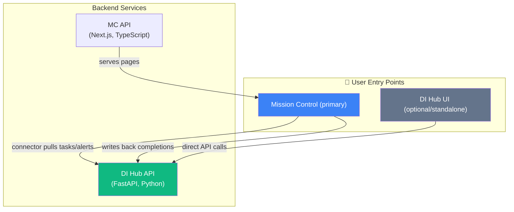

# Document Intelligence ↔ Mission Control: Integration Design Review

*Date: 2026-07-23*

---

## 1. Conflicts, Overlaps, and Duplication

### 🔴 UI Duplication — Two Competing "Primary Dashboards"

| Surface | Doc Intelligence Hub (DI) | Mission Control (MC) |
|---------|---------------------------|----------------------|
| **Dashboard home** | Unified stats across all DI modules (actions pending, EOBs unmatched, statements missing) | Unified stats across ALL systems (tasks, alerts, triage, from 10 connectors) |
| **Action queue** | Full triage view: filter → select → detail panel → document preview | Doc Intelligence Hub page → Action Queue tab (same concept, same layout) |
| **Alert feed** | Cross-module alerts (unified `alerts` table in SQLite) | Centralized alerts panel (alerts from all connectors including DI) |
| **Triage/inbox** | Action Queue is literally a triage inbox for documents | Triage Queue includes `document` content type alongside Reddit/GitHub/YouTube |

**Diagnosis:** Both systems independently designed full self-contained UIs for the *same user workflow* — "see what documents need attention, act on them." The DI Hub has a richer document-specific UX (PDF preview, OCR quality, document gallery) while MC has a richer cross-system UX (unified with tasks from GitHub, Todo, email, calendar).

### 🟡 Alert System Duplication

- **DI side:** Writes to its own `alerts` SQLite table, routes through n8n for notifications
- **MC side:** Connector pulls these same alerts into MC's `alertItems` table (Drizzle/Postgres)
- **Conflict:** Two "sources of truth" for alert state. If you dismiss in MC, is it dismissed in DI? The connector currently has no write-back for alert dismissal.

### 🟡 Task Completion Writeback

- **DI side:** `PATCH /api/action-queue/actions/:id` marks actions complete
- **MC side:** Connector maps DI actions → TaskItems. MC's "complete" button should write back to DI.
- **Status:** MC connector has `write: true` capability. ~~`file` and `review` actions were noted as missing from `TASK_ACTION_TYPES`~~ — **resolved**: both `file` and `review` are now implemented in `document-parser.ts` with full title builders and tag mappings. Partial writeback exists.

### 🟢 Finance ↔ DI ↔ MC Triangle

The `CROSS-SYSTEM-INTEGRATION.md` design envisions bill-to-transaction matching across Paperless + Monarch + MC. This is well-architected and doesn't duplicate — it's genuinely additive. MC is the presentation layer; DI + Monarch Bridge are data engines.

---

## 2. What's Missing

### Critical Gaps

| # | Gap | Where it should live | Severity |
|---|-----|---------------------|----------|
| 1 | **No `/api/documents` endpoint on DI** | DI backend | 🔴 Blocks MC Document Gallery tab & Hub page Documents tab |
| 2 | **No `/api/stats` endpoint on DI** | DI backend | 🟡 Blocks MC Insights tab |
| 3 | **No alert dismissal writeback** | MC connector → DI API | 🟡 Creates dual-state confusion |
| 4 | **No document preview/thumbnail URL in DI API responses** | DI backend | 🟡 Blocks `metadata.previewUrl` in MC |
| 5 | **MC connector missing `fetchTriageItems()`** | MC connector code | 🟡 Blocks Gallery view integration |
| 6 | **No shared auth between MC and DI** | Both | 🟢 OK for homelab; needed if ever exposed externally |
| 7 | **DI has no SPA frontend yet** | DI codebase | 🟡 Statement Tracker has basic HTML; no unified SPA shell |
| 8 | **No widget/embed API from DI** | DI backend | 🟡 Would enable iframe or web component embedding |
| 9 | **Integration contract doc** | Shared/both repos | 🔴 No single document defines the API contract between them |

### Design Gaps in Current Docs

- **No mockup for how DI content looks *inside* Mission Control** — the MC `doc-intelligence.md` design describes it textually but references mockups that may not cover all scenarios
- **No mockup for the "focus" workflow** — user is in MC, sees alert, wants to drill into full DI document context, then return to MC. What does this navigation look like?
- **No error/offline handling** — what happens in MC when DI Hub is down? Stale data? Error states?

---

## 3. Primary Surface & UI Ownership

### Recommendation: **Mission Control is the primary surface; DI is a headless service + optional standalone UI**

### Why MC should own the primary UI:

1. **MC is already the unified view** — users shouldn't need 5 tabs open (MC + DI Hub + Monarch + HA + n8n)
2. **MC has a mature design system** (shadcn/ui, Tailwind, dark-first) with existing components for cards, badges, lists, filters
3. **MC's connector architecture already anticipates this** — `documentIntelligenceFactory` is registered
4. **DI's frontend is effectively unbuilt** — no SPA shell exists; only static HTML dashboards

### What DI Hub should own:

- **Document-specific deep experiences**: Full OCR quality viewer, side-by-side match comparison, statement gap timeline visualization
- **Admin/configuration**: Paperless connection, scanning schedules, scoring weight tuning
- **Power-user workflows**: Batch re-OCR, manual match override, extraction debugging

### Integration Surface Options

| Approach | Pros | Cons | Recommendation |
|----------|------|------|----------------|
| **API-only (headless DI)** | Cleanest separation; MC fully owns UX | Lose DI's rich document views; high MC effort to rebuild | ⭐ Primary approach |
| **iframe embed** | DI keeps its own UI; MC frames it | Janky UX; no shared state; double nav bars; mobile-hostile | ❌ Avoid |
| **Web Components from DI** | DI exports embeddable components; MC hosts them | Cross-framework complexity (Python templates vs React); version coupling | ❌ Over-engineered |
| **Deep links + portal pattern** | MC links out to DI for document-specific views; DI has "back to MC" button | Users leave MC context; two bookmarks needed | ✅ Good for Phase 1 admin/power workflows |
| **MC plugin page with DI API** | MC builds a `/doc-intelligence` page calling DI's API directly | Most work but best UX; already designed in `doc-intelligence.md` | ⭐ Target state |

### Recommended Hybrid:

1. **MC owns all task/alert/triage rendering** (via connector, already working)
2. **MC builds a `/doc-intelligence` hub page** with Action Queue, Documents, Insights tabs (calling DI API)
3. **DI Hub standalone UI** remains as a secondary admin/power-user tool accessible via deep link
4. **"Open in Document Hub"** buttons in MC for document-specific deep workflows (OCR, match debugging)

### How Much UI to Push Into MC (Extensibility)?

MC should be extensible enough that DI doesn't need bespoke `if` statements. The `doc-intelligence.md` design already nails this:

- ✅ `metadata.previewUrl` — generic contract any connector can use
- ✅ `fetchTriageItems()` — optional interface method
- ✅ Alert card renderer keyed on `connectorType` — acceptable for visual formatting
- ✅ Document content type in Triage — extends existing framework

**What MC should NOT do:** Build a full Paperless document browser with OCR controls inside MC. That's DI's domain.

---

## 4. Outstanding Design Decisions & Mockup Needs

### Decisions Still Needed

| # | Decision | Options | Impact |
|---|----------|---------|--------|
| 1 | **Should DI have its own frontend at all?** | (a) Yes, standalone + MC integration (b) No, MC-only surface | High — determines DI's scope. Recommend (a) for admin/power tools |
| 2 | **Real-time vs polling for DI → MC sync** | (a) MC polls DI on schedule (b) DI pushes via webhook to MC (c) Both | Medium — webhook for urgency, poll for completeness |
| 3 | **Document preview in MC: external link vs embedded** | (a) "Open in Paperless" button (b) Inline PDF viewer (c) Thumbnail + link | Medium — ✅ **Decided: (c)** with upgrade path to (b). Document-oriented detail panel everywhere a DI task is selected, inspired by Triage `RichPreviewEmbed` |
| 4 | **Who renders document gallery?** | (a) MC Triage page (b) MC `/doc-intelligence` page (c) DI standalone | High — ✅ **Decided: Paperless owns document browsing**. MC links out via previewUrl. `/api/documents` endpoint deferred. |
| 5 | **Bill-payment confirmation flow** | MC marks task complete → DI API → Paperless custom field? Or MC matches to Monarch transaction? | High — the CROSS-SYSTEM doc envisions both |
| 6 | **Notification routing** | DI → n8n → push? Or DI → MC → MC's notification system → push? | Medium — avoid double-notification |
| 7 | **OCR pipeline UI surface** | MC doesn't need it; DI-only admin tool? | Low — defer to DI standalone |

### Mockups Needed

| # | Mockup | What it should show | Repo |
|---|--------|--------------------|----- |
| 1 | **MC → DI Hub page (Action Queue tab)** | Already exists as `mockup-doc-intelligence-hub.html` — verify it matches current MC design system | mission-control |
| 2 | **MC → DI Hub page (Documents tab)** | Document gallery with type filters, action badges, "Open in Paperless" links | mission-control |
| 3 | **MC → DI Hub page (Insights tab)** | Stats cards, statement timeline, health indicators | mission-control |
| 4 | **MC Task Detail Panel with document preview** | How `metadata.previewUrl` renders for a DI task; PDF thumbnail or external link button | mission-control |
| 5 | **MC Triage Gallery with `document` cards** | Already referenced as `mockup-doc-intelligence-gallery-cards.html` — verify | mission-control |
| 6 | **DI standalone: admin/config view** | Paperless connection, scan schedules, OCR settings, scoring weights | ideation (DI) |
| 7 | **Cross-system flow: Bill Payment confirmation** | User marks "Pay Electric Bill" done in MC → what happens in DI and Monarch | ideation (DI) or mission-control |
| 8 | **Mobile view of DI tasks in MC** | Action cards, swipe actions, document preview on mobile | mission-control |

### Mockups to Review/Adjust

- `mission-control/docs/mockups/mockup-doc-intelligence-hub.html` — does it use the latest design tokens from `DESIGN.md`? Does the 3-tab layout match current MC nav patterns?
- `mission-control/docs/mockups/mockup-doc-intelligence-gallery-cards.html` — does it work within the current Triage Gallery component structure?
- `ideation/experiments/document-intelligence/mockups/action-queue/dashboard.html` — this is the DI-standalone version. Should it be deprecated in favor of MC's rendering? Or repurposed as the admin view?
- `ideation/experiments/document-intelligence/mockups/eob-matching/` (3 mockups) — these show rich match comparison UX. Should these live only in DI standalone, or does MC need a simplified version?

---

## 5. Phased Approach

### Phase 0: API Contract & Cleanup (1 week)
> *Prerequisite for all integration work*

- [x] Write a shared `INTEGRATION-API-CONTRACT.md` in both repos defining the exact endpoints, schemas, and behaviors
- [x] Close 11 duplicate issues in ideation repo (#721–#731)
- [x] Add `file` and `review` to MC connector's `TASK_ACTION_TYPES`
- [x] DI: Add `previewUrl` field (Paperless document URL) to action queue API responses
- [x] DI: Deploy Statement Tracker to homelab, validate live Paperless connectivity
- [x] **Decision: Confirm DI keeps standalone UI for admin/power workflows**

### Phase 1: Connector Completeness (1–2 weeks)
> *MC can fully represent all DI data*

- [ ] MC connector: populate `metadata.previewUrl`, `previewType`, `previewLabel` on all tasks
- [ ] MC connector: add alert dismissal writeback (`PATCH /api/action-queue/actions/:id`)
- [ ] MC: Add generic `TaskDetailPanel` document preview section (benefits all connectors)
- [ ] MC: Rich alert cards for DI (statement overdue progress bar, EOB amount badge)
- [ ] DI: Validate EOB matching with real Paperless docs (Phase 2 of CURRENT-STATE-ASSESSMENT)
- [ ] **Mockup review:** Verify `mockup-doc-intelligence-hub.html` aligns with current MC

### Phase 2: MC Hub Page (2–3 weeks)
> *Dedicated DI experience within Mission Control*

- [ ] MC: Create `/doc-intelligence` route with 3 tabs (Action Queue, Documents, Insights)
- [ ] DI: Build `/api/documents` endpoint (list documents with filters)
- [ ] DI: Build `/api/stats` endpoint (module health, processing counts)
- [ ] MC: Sidebar nav item with pending-action count badge
- [ ] MC: Action Queue tab — filtered task list + detail pane (reuses existing components)
- [ ] MC: Insights tab — stats cards + alert lists
- [ ] **New mockups:** Documents tab, Insights tab, mobile views
- [ ] **Decision: Real-time vs polling frequency**

### Phase 3: Triage Integration (1–2 weeks)
> *DI documents appear in MC's Triage Gallery*

- [ ] MC: Add `document` to `TriageContentType`, `document-intelligence` to sources
- [ ] MC connector: Implement `fetchTriageItems()` mapping DI actions → TriageItems
- [ ] MC: Document gallery card component in `TriageGalleryView.tsx`
- [ ] MC: Triage actions for documents (complete_action, open_document, defer_action)
- [ ] **Mockup review:** Verify gallery cards mockup works in current Triage component

### Phase 4: Cross-System Intelligence (3–4 weeks)
> *The bill-payment matching vision from CROSS-SYSTEM-INTEGRATION.md*

- [ ] DI: Wire bill-to-transaction matching (DI extracts bill, Monarch Bridge confirms payment)
- [ ] MC: "Payment confirmed" status on DI tasks when Monarch match is found
- [ ] MC: AI assistant context — "Was my electric bill paid?" query can span DI + Monarch data
- [ ] DI: Expose match confidence in API responses
- [ ] **Decision: Bill payment confirmation flow UX**
- [ ] **New mockup:** Payment confirmation flow

### Phase 5: Polish & Admin (2 weeks)
> *DI standalone UI for power users*

- [ ] DI: Build lightweight admin SPA (settings, OCR controls, match overrides)
- [ ] MC: "Open in Document Hub" deep links for admin workflows
- [ ] Notification dedup (DI alerts via n8n vs MC notification system — pick one path)
- [ ] DI: OCR pipeline (if needed; may remain deprioritized per CURRENT-STATE-ASSESSMENT)
- [ ] End-to-end testing with real documents across full flow

---

## Summary of Key Recommendations

1. **Mission Control is the primary user surface.** DI Hub is a headless API + optional admin UI.
2. **No iframes.** Use API integration via the existing connector pattern.
3. **Generic contracts over source-specific logic.** `metadata.previewUrl` is the right pattern.
4. **Write the API contract first.** Both repos reference each other's endpoints but no single doc defines the interface.
5. **DI needs 2 new endpoints** (`/api/documents`, `/api/stats`) to fully support the MC Hub page.
6. **Resolve the alert/notification path** — either DI → n8n → push, OR DI → MC → MC notifications. Not both.
7. **The existing MC design (`doc-intelligence.md`) is excellent** — it's the right architecture. Execute it.
8. **DI's standalone UI scope should be limited** to: admin config, OCR management, match debugging, document deep-dive.
