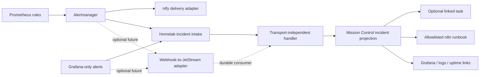

# Homelab Incident Notifications

## Decision

Mission Control should be the homelab **human action and ownership plane**, not a
replacement monitoring plane.

- Prometheus and Grafana evaluate signals.
- Alertmanager owns alert grouping, inhibition, and firing/resolved delivery.
- Grafana, Loki, Tempo, Dozzle, and Uptime Kuma remain the diagnostic surfaces.
- ntfy remains the immediate human notification channel.
- n8n owns remediation workflow execution.
- Mission Control stores an idempotent incident projection, local disposition,
  linked work, and safe remediation entry points.

The first transport should be a direct authenticated Alertmanager webhook.
Alertmanager supports bearer/basic authentication and mTLS but does not natively
produce the HMAC body signature required by Mission Control's generic inbound
webhook route. The dedicated intake must therefore add a scoped bearer or mTLS
mode, or receive traffic through a signing relay. It must not permit an unsigned
production exception.

NATS JetStream is an optional future transport adapter, not a prerequisite and
not the public domain contract.

## Current homelab boundary

The checked-in homelab configuration already deploys Prometheus, Alertmanager,
Grafana, Loki, Tempo, Dozzle, Uptime Kuma, ntfy, Home Assistant, n8n, and Mission
Control. Alertmanager currently sends firing and resolved notifications through
an `alertmanager-ntfy` adapter. No NATS or JetStream deployment is checked in.

This means the existing Alertmanager is the component labeled "Alert manager" in
the architecture. Mission Control does not need to build one, and ntfy should
not be promoted into that role.

## Architecture



ntfy stays parallel to Mission Control so urgent paging does not depend on
Mission Control availability. If JetStream is introduced, ntfy may become an
independent consumer, but ntfy messages must never be the canonical event feed.

## Domain contract

The handler consumes a versioned contract independent of HTTP, JetStream, n8n,
or any future transport:

```ts
interface HomelabAlertLifecycleEventV1 {
  schemaVersion: 1;
  eventId: string;
  occurredAt: string;
  source: 'alertmanager' | 'grafana';
  fingerprint: string;
  status: 'firing' | 'resolved';
  startsAt: string;
  endsAt?: string;
  severity: 'critical' | 'warning' | 'info';
  type: string;
  summary: string;
  description?: string;
  service?: string;
  node?: string;
  site?: string;
  actionRequired?: boolean;
  metrics?: Array<{
    label: string;
    value: string;
    tone?: 'neutral' | 'info' | 'warning' | 'danger' | 'success';
  }>;
  links?: Array<{
    kind: 'dashboard' | 'logs' | 'uptime' | 'runbook';
    url: string;
  }>;
  runbookKey?: string;
}
```

Payloads must be bounded and label-allowlisted. They must not include raw logs,
credentials, arbitrary Prometheus labels, or unbounded query results.

Alertmanager sends grouped webhook batches containing multiple alerts. The
transport adapter must validate and normalize every member, then commit the
batch receipts and projections in one transaction. A malformed member rejects
the complete batch with a non-retriable 4xx response; a storage failure returns
5xx so Alertmanager retries the complete batch. Per-fingerprint uniqueness makes
that retry safe.

## Identity and lifecycle

- Incident identity is `{integration}:{source}:{fingerprint}`.
- Delivery is at least once. A database uniqueness constraint remains mandatory
  even if JetStream duplicate suppression is enabled.
- An event receipt and its incident projection commit atomically before HTTP or
  broker acknowledgement.
- Repeated firing updates the same projection. It does not create another task.
- Ordering is required only per fingerprint. Source timestamps and lifecycle
  state prevent stale firing deliveries from regressing a resolved incident.
- A new source occurrence may reopen a locally handled incident according to the
  existing notification reopen policy.
- Upstream `resolved` settles source state while preserving local history.
- Completing a Mission Control task does not claim that the source recovered.

Alertmanager remains authoritative for firing/resolved truth. Mission Control is
authoritative only for its local read, snooze, handle, assignment, notes, linked
task, and workflow state.

The dedicated adapter should reuse the generic inbound route's bounded-body,
rate-limit, audit, and replay-protection primitives, but not its create-only
mapping behavior. Generic payload-hash replay protection is insufficient:
Alertmanager repeat deliveries can occur hours later with changed timestamps.
All deliveries must call the fingerprint-aware domain handler.

## Notification taxonomy

Retain the existing Mission Control levels:

| Source meaning | Mission Control level |
|---|---|
| Critical and requires immediate human response | `urgent` |
| Persistent failure requiring owned work | `action_needed` |
| Degradation worth monitoring | `heads_up` |
| Informational state transition | `fyi` |
| Periodic aggregate | `digest` |

Use stable notification types rather than adding infrastructure-specific levels:

- `homelab_service_unavailable`
- `homelab_site_outage`
- `homelab_backup_failed`
- `homelab_backup_missed`
- `homelab_storage_critical`
- `homelab_filesystem_read_only`
- `homelab_automation_failed`
- `homelab_security_incident`
- `homelab_capacity_sustained`
- `homelab_device_intervention`
- `homelab_maintenance_digest`

Add `infrastructure`, `backup`, and `automation` categories. Continue using
`security`, `home`, and `system` where those meanings are more accurate.

Register these types in the connector notification catalog with conservative
push defaults. Urgent and action-needed types may be user-enabled; digest types
default off.

## Card and action contract

The existing generic rich notification presentation is sufficient. A homelab
provider should produce:

- a service/condition title;
- node or site plus firing/resolved state as the subtitle;
- up to four metadata chips, such as duration, owner, environment, and
  occurrence count;
- up to four bounded metric snapshots;
- links to Grafana, logs, Uptime Kuma, and an approved runbook;
- one verb-specific primary action.

Do not embed charts, raw logs, or time-series history. Those remain in Grafana
and Loki. Common actions are `Open dashboard`, `View logs`, `Create task`, and
`Run recovery`.

Remediation must call only allowlisted n8n runbooks. Destructive or service
affecting actions require confirmation, an idempotency key, and an audit record.
Alertmanager silence support is deferred; if added, it must be an explicit,
audited silence with a TTL rather than a permanent disable.

## Intake policy

Only alerts explicitly labeled `action_required=true`, or included in a local
allowlist, are eligible for task promotion.

High-value initial events include:

- whole-site DNS failure;
- read-only or critically full filesystems;
- missed or failed backups;
- sustained critical endpoint outages;
- repeated automation failure affecting multiple nodes;
- sustained Mission Control queue saturation;
- printer or device failures requiring physical intervention; and
- persistent safety faults requiring human work.

Keep transient resource warnings, success notifications, routine resolved
events, raw Home Assistant state changes, package summaries, and inhibited child
alerts out of the action queue.

## JetStream adoption gates

Direct Alertmanager delivery remains preferred until at least one of these is
measured:

- consumers must recover events after outages beyond Alertmanager retry
  tolerance;
- several independent consumers require the same canonical event;
- controlled replay is an operational requirement;
- bursts materially exceed Mission Control intake capacity; or
- producer and consumer deployments need independent release timing.

If adopted:

- deploy a webhook-to-JetStream adapter rather than coupling Alertmanager to a
  Mission Control-specific subject layout;
- use durable consumers with explicit acknowledgement after the Mission Control
  transaction commits;
- retain events for a bounded outage/replay objective, generally days to a few
  weeks, while keeping long-term history in Mission Control;
- define max delivery and a dead-letter subject with observable depth and
  operator-controlled replay;
- monitor consumer lag, redelivery, poison events, storage, and stream limits;
- keep subjects, streams, and consumer names as deployment configuration.

Introducing continuous or burst-heavy NATS ingestion is also a database scaling
review gate. It does not automatically require replacing SQLite, but the mixed
workload must satisfy the existing queue, WAL, latency, backup, and restore SLOs.

## Delivery sequence

1. Remove duplicate alert rules and label the initial actionable set.
2. Define fixtures for the versioned event and idempotent domain handler.
3. Implement authenticated direct Alertmanager intake and lifecycle projection.
4. Add provider presentation, saved Homelab view, and deep links.
5. Add manual task promotion, then narrowly allowlisted automatic promotion.
6. Add confirmed and audited n8n runbooks.
7. Introduce JetStream only after an adoption gate is demonstrated.

## Success criteria

- Replayed and concurrent duplicate deliveries create one incident projection.
- Firing and resolved events update one stable lifecycle without stale
  regression.
- ntfy paging remains independent and unchanged during the first release.
- Mission Control stores bounded operational context and no raw telemetry.
- Task completion cannot fabricate upstream recovery.
- Direct and future JetStream adapters pass the same contract fixtures.
