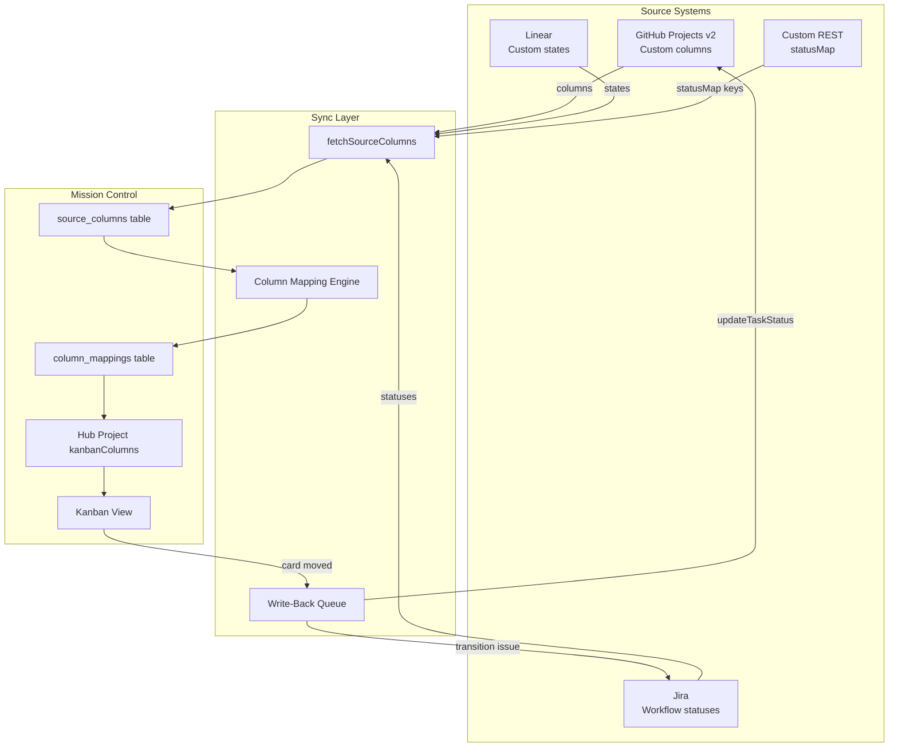
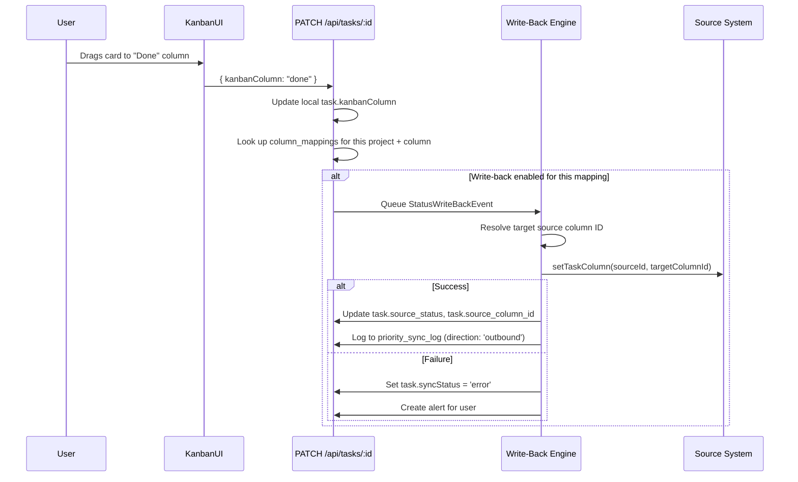

# Kanban Column Mapping & Status Write-Back Design

> **Objective**: Allow Mission Control to import, display, map, and write back custom Kanban columns/statuses from external source systems (GitHub Projects v2, Jira, Linear, etc.), enabling true bi-directional board synchronization.

---

## Problem Statement

Currently, Mission Control:

1. **Flattens all source statuses** into 4 internal values (`todo | in_progress | done | cancelled`) at sync time, losing the source's custom columns (e.g., "In Review", "Ready for Deploy", "Blocked").
2. **Does not import source board columns** — GitHub Projects v2, Jira workflows, Linear cycles all have rich custom states that we discard.
3. **Has no write-back for status/column changes** — dragging a card on our Kanban board updates only the local `kanbanColumn` field; the source is never notified.
4. **Cannot round-trip** — if a user moves a card from "In Review" → "Done" in Mission Control, that change doesn't propagate back to the GitHub Project board.

---

## Architecture Overview



---

## Data Model Changes

### New Table: `source_columns`

Stores the raw column/status definitions fetched from each source system.

```sql
CREATE TABLE source_columns (
  id TEXT PRIMARY KEY,                          -- UUID
  connector_instance_id TEXT NOT NULL,          -- FK → connector_configs.id
  source_list_id TEXT,                          -- nullable: board/project-scoped columns
  
  -- Source column identity
  source_column_id TEXT NOT NULL,               -- The source system's ID for this column
  name TEXT NOT NULL,                           -- Display name (e.g., "In Review")
  color TEXT,                                   -- Hex color from source
  position INTEGER NOT NULL DEFAULT 0,          -- Order in source board
  
  -- Classification
  category TEXT NOT NULL DEFAULT 'active',      -- 'not_started' | 'active' | 'done' | 'cancelled'
  is_default INTEGER NOT NULL DEFAULT 0,        -- Is this the source's default column?
  is_closed INTEGER NOT NULL DEFAULT 0,         -- Does this represent a "closed/done" state?
  
  -- Metadata
  description TEXT,                             -- Source-provided description
  metadata TEXT NOT NULL DEFAULT '{}',          -- JSON: source-specific extras (e.g., Jira transition IDs)
  
  last_synced_at TEXT NOT NULL,
  UNIQUE(connector_instance_id, source_column_id)
);
```

### New Table: `column_mappings`

Maps source columns → Hub Project kanban columns. This is the user-configurable "bridge" between external and internal boards.

```sql
CREATE TABLE column_mappings (
  id TEXT PRIMARY KEY,
  hub_project_id TEXT NOT NULL,                 -- FK → hub_projects.id
  kanban_column_id TEXT NOT NULL,               -- FK → the Hub Project's kanbanColumn.id
  
  -- Source side
  connector_instance_id TEXT NOT NULL,          -- Which connector
  source_column_id TEXT NOT NULL,               -- Which source column maps here
  
  -- Write-back config
  write_back_enabled INTEGER NOT NULL DEFAULT 0, -- Should moving TO this column update source?
  write_back_target_column_id TEXT,             -- Which source column to set on write-back
                                                -- (may differ from source_column_id for many-to-one maps)
  
  created_at TEXT NOT NULL,
  updated_at TEXT NOT NULL,
  UNIQUE(hub_project_id, connector_instance_id, source_column_id)
);
```

### Schema Changes to Existing Tables

#### `tasks` table — add `source_status` field

```sql
ALTER TABLE tasks ADD COLUMN source_status TEXT;           -- Raw status string from source
ALTER TABLE tasks ADD COLUMN source_column_id TEXT;        -- FK to source_columns.source_column_id
```

Preserves the original value so we can round-trip without lossy conversion.

#### `connector_configs` — capabilities extension

No schema change needed (capabilities is already JSON), but the shape expands:

```ts
export interface ConnectorCapabilities {
  read: boolean;
  write: boolean;
  delete: boolean;
  sync: boolean;
  subtasks: boolean;
  lists: boolean;
  tags: boolean;
  tagWriteBack: boolean;
  priority?: boolean;
  priorityWriteBack?: boolean;
  
  // NEW: Column/status support
  columns?: boolean;              // Source has custom columns/statuses
  columnWriteBack?: boolean;      // Can update status/column in source
  columnWriteBackMethod?: 'direct' | 'transition';  // Jira needs transitions, GitHub is direct
}
```

#### `hub_projects.kanban_columns` — extend shape

The existing JSON array gets an additional field to link to source mappings:

```ts
export interface KanbanColumn {
  id: string;
  name: string;
  color: string;
  order: number;
  statusMapping?: TaskStatus[];   // existing: maps to internal status enum
  wipLimit?: number;              // existing
  
  // NEW
  sourceMappings?: SourceColumnRef[];  // which source columns feed into this column
  writeBackDefault?: boolean;          // when card lands here, trigger write-back?
}

export interface SourceColumnRef {
  connectorInstanceId: string;
  sourceColumnId: string;
}
```

---

## Type Changes (`src/types/index.ts`)

```ts
// ─── SOURCE COLUMNS ─────────────────────────────────────────────────────────

export type SourceColumnCategory = 'not_started' | 'active' | 'done' | 'cancelled';

export interface SourceColumn {
  id: string;
  connectorInstanceId: string;
  sourceListId?: string;
  sourceColumnId: string;
  name: string;
  color?: string;
  position: number;
  category: SourceColumnCategory;
  isDefault: boolean;
  isClosed: boolean;
  description?: string;
  metadata: Record<string, unknown>;
  lastSyncedAt: string;
}

// ─── COLUMN MAPPINGS ────────────────────────────────────────────────────────

export interface ColumnMapping {
  id: string;
  hubProjectId: string;
  kanbanColumnId: string;
  connectorInstanceId: string;
  sourceColumnId: string;
  writeBackEnabled: boolean;
  writeBackTargetColumnId?: string;
  createdAt: string;
  updatedAt: string;
}

// ─── WRITE-BACK EVENT ───────────────────────────────────────────────────────

export interface StatusWriteBackEvent {
  taskId: string;
  sourceId: string;
  connectorInstanceId: string;
  previousSourceColumnId?: string;
  targetSourceColumnId: string;
  triggeredBy: 'kanban_drag' | 'status_change' | 'rule';
  timestamp: string;
}
```

---

## Connector Interface Extensions

```ts
export interface IConnector {
  // ... existing methods ...

  // ─── Column/Status Operations (optional based on capabilities.columns) ────

  /** Fetch available columns/statuses from the source board */
  fetchSourceColumns?(sourceListId?: string): Promise<SourceColumn[]>;

  /** Update a task's column/status in the source system */
  setTaskColumn?(sourceId: string, targetColumnId: string, metadata?: Record<string, unknown>): Promise<void>;
}
```

### GitHub Connector: `fetchSourceColumns` Implementation

```ts
// Uses GitHub Projects v2 GraphQL API
async fetchSourceColumns(projectId?: string): Promise<SourceColumn[]> {
  const query = `
    query($owner: String!, $number: Int!) {
      user(login: $owner) {
        projectV2(number: $number) {
          field(name: "Status") {
            ... on ProjectV2SingleSelectField {
              options {
                id
                name
                color
              }
            }
          }
        }
      }
    }
  `;
  // Map options → SourceColumn[]
}

// Uses GitHub Projects v2 item mutation
async setTaskColumn(sourceId: string, targetColumnId: string): Promise<void> {
  const mutation = `
    mutation($projectId: ID!, $itemId: ID!, $fieldId: ID!, $optionId: String!) {
      updateProjectV2ItemFieldValue(input: {
        projectId: $projectId
        itemId: $itemId
        fieldId: $fieldId
        value: { singleSelectOptionId: $optionId }
      }) { projectV2Item { id } }
    }
  `;
}
```

---

## Write-Back Flow



### Write-Back Rules

| Scenario | Behavior |
|----------|----------|
| Card moved to column with `writeBackDefault: true` | Auto write-back |
| Card moved to column with mapping but `writeBackEnabled: false` | Local only |
| Card moved to column with no mapping for that source | Local only, no error |
| Source task from connector without `columnWriteBack` capability | Skip silently |
| Multiple sources mapped to same column | Write back only to the task's own source |
| Conflict: source changed while local write-back queued | Use conflict resolution (LWW or prompt user) |

---

## Column Auto-Import & Mapping Suggestions

When a connector with `capabilities.columns = true` syncs for the first time (or columns change):

1. **Fetch source columns** → store in `source_columns` table
2. **Auto-classify** into categories using heuristics:
   - Names containing "backlog", "new", "to do" → `not_started`
   - Names containing "progress", "active", "doing", "review" → `active`  
   - Names containing "done", "complete", "closed", "shipped" → `done`
   - Names containing "cancel", "won't", "wont" → `cancelled`
3. **Suggest mappings** to the user when they configure a Hub Project:
   - If Hub Project has no custom columns yet, offer to **auto-create columns** matching the source
   - If Hub Project already has columns, suggest which source columns map to which

### Settings UI Addition

In Hub Project settings → "Column Mapping" tab:

```
┌─────────────────────────────────────────────────────────┐
│  Column Mapping — Mission Control Project               │
├─────────────────────────────────────────────────────────┤
│                                                         │
│  Hub Column        ←→  Source Columns        Write-Back │
│  ─────────────────────────────────────────────────────  │
│  📋 Backlog        ←   GH: "Backlog"         [ ]       │
│                    ←   Todo: "Not Started"    [ ]       │
│                                                         │
│  🔵 In Progress    ←   GH: "In Progress"     [✓]       │
│                    ←   GH: "In Review"        [ ]       │
│                    ←   Todo: "In Progress"    [✓]       │
│                                                         │
│  ✅ Done           ←   GH: "Done"            [✓]       │
│                    ←   Todo: "Completed"      [✓]       │
│                                                         │
│  [+ Add Column]    [Auto-detect from sources]           │
└─────────────────────────────────────────────────────────┘
```

---

## Migration Plan

### Phase 1: Capture (read-only)
- Add `source_status` and `source_column_id` to tasks table
- Add `source_columns` table
- Extend connectors to implement `fetchSourceColumns()`
- Store raw status during sync (no behavior change)

### Phase 2: Mapping UI
- Add `column_mappings` table
- Build column mapping settings UI
- Auto-classify imported columns
- Use mappings for Kanban column assignment (instead of only `statusMapping`)

### Phase 3: Write-Back
- Add `setTaskColumn()` to connector interface
- Implement write-back queue (debounced, batched)
- Add `columnWriteBack` capability flag
- Wire Kanban drag → write-back trigger
- Add write-back log entries to `priority_sync_log` (rename to `sync_change_log`?)

### Phase 4: Conflict Handling
- Extend conflict resolution for column changes
- Handle race conditions (source changed while write-back queued)
- Add "last moved by" attribution for audit

---

## Drizzle Schema Addition (`src/db/schema.ts`)

```ts
// ─── SOURCE COLUMNS ─────────────────────────────────────────────────────────

export const sourceColumns = sqliteTable('source_columns', {
  id: text('id').primaryKey(),
  connectorInstanceId: text('connector_instance_id').notNull(),
  sourceListId: text('source_list_id'),
  sourceColumnId: text('source_column_id').notNull(),
  name: text('name').notNull(),
  color: text('color'),
  position: integer('position').notNull().default(0),
  category: text('category').notNull().default('active'),
  isDefault: integer('is_default', { mode: 'boolean' }).notNull().default(false),
  isClosed: integer('is_closed', { mode: 'boolean' }).notNull().default(false),
  description: text('description'),
  metadata: text('metadata', { mode: 'json' }).notNull().default('{}'),
  lastSyncedAt: text('last_synced_at').notNull(),
});

// ─── COLUMN MAPPINGS ────────────────────────────────────────────────────────

export const columnMappings = sqliteTable('column_mappings', {
  id: text('id').primaryKey(),
  hubProjectId: text('hub_project_id').notNull(),
  kanbanColumnId: text('kanban_column_id').notNull(),
  connectorInstanceId: text('connector_instance_id').notNull(),
  sourceColumnId: text('source_column_id').notNull(),
  writeBackEnabled: integer('write_back_enabled', { mode: 'boolean' }).notNull().default(false),
  writeBackTargetColumnId: text('write_back_target_column_id'),
  createdAt: text('created_at').notNull(),
  updatedAt: text('updated_at').notNull(),
});
```

---

## API Endpoints

| Method | Path | Purpose |
|--------|------|---------|
| GET | `/api/source-columns?connectorId=X` | List source columns for a connector |
| POST | `/api/source-columns/sync` | Trigger fresh fetch from source |
| GET | `/api/column-mappings?projectId=X` | Get mappings for a Hub Project |
| PUT | `/api/column-mappings` | Upsert column mappings |
| POST | `/api/column-mappings/auto-detect` | Auto-suggest mappings for a project |
| POST | `/api/tasks/:id/write-back-status` | Manually trigger status write-back |

---

## Open Questions

1. **Many-to-one vs. one-to-one mapping** — Should multiple source columns be allowed to map to one Hub column? (Current design: yes, with separate write-back targets per source.)

2. **Auto-sync columns on schedule?** — Should we periodically re-fetch source columns to detect new ones added externally? Or only on manual refresh?

3. **Column ordering on write-back** — If a source supports ordered columns (position), should we sync `kanbanOrder` back as well, or just the column identity?

4. **Cross-source column unification** — If GitHub has "In Review" and Jira has "Code Review", should the system suggest they map to the same Hub column? (AI-assisted matching?)

5. **Rename to `sync_change_log`?** — The current `priority_sync_log` table tracks priority write-backs. Should we generalize it to cover all bidirectional field syncs (status, priority, tags)?

---

## Implementation Notes (July 2026)

### Connector-Specific Reality Check

The original design assumes all connectors have rich column/status systems. In practice:

| Connector | Status Model | Write-Back Viability |
|-----------|-------------|---------------------|
| **Microsoft Todo** | Binary (open / completed) | Kanban columns are **local-only** in MC's DB. Only the "Done" column can write back (→ mark complete). Other columns (Backlog, In Progress, etc.) are purely local state with no upstream meaning. |
| **GitHub Projects v2** | Custom columns/status fields | Full write-back makes sense — moving a card → update project item status via GraphQL API. This is the primary target for this design. |
| **GitHub Issues** | Open / Closed (+ labels) | Binary like Todo. Could map "Done" → close issue. Labels could map to columns but that's a stretch. |
| **Jira** | Workflow transitions | Rich statuses, but requires transition-based API (not direct set). `columnWriteBackMethod: 'transition'` handles this. |
| **Linear** | Custom states | Direct status set. Good fit for full write-back. |

### Revised Strategy

1. **Phase 1**: Local-only kanban columns stored in MC's DB (`kanban_column` field on tasks). Dragging cards between columns updates local state only. No connector dependency.
2. **Phase 2**: For connectors with `columns: true` capability (GitHub Projects, Jira, Linear), implement `fetchSourceColumns()` and populate `source_columns` table.
3. **Phase 3**: Column mapping UI + write-back for rich-column connectors. Binary connectors (Todo, GitHub Issues) only get write-back on the terminal "Done" column → mark complete/close upstream.

### Key Insight

The kanban board in Mission Control should work **independently of source capabilities**. Users should be able to organize ANY task into local kanban columns regardless of whether the source supports statuses. Write-back is an optional enhancement that only activates for capable connectors.
