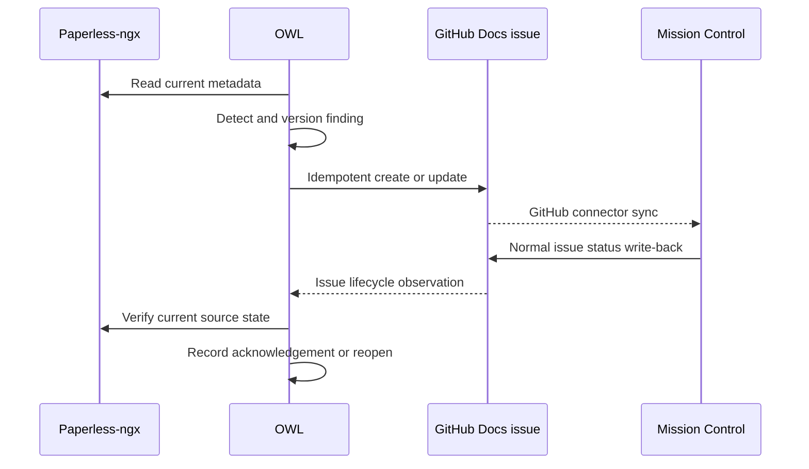

# OWL Metadata Quality Findings as Docs Work Items

## Decision summary

OWL projects actionable Paperless-ngx metadata-quality findings into the
existing **Docs** work queue as GitHub issues. Mission Control discovers those
issues through its GitHub Issues connector and presents them as
connector-backed, `remote-managed` work items.

This design does **not** create Mission Control-owned local tasks, Triage
records, or a second OWL task projection. In particular:

- OWL owns finding detection, finding identity, recommended and applied
  mutations, lifecycle reconciliation, and audit history.
- Paperless-ngx remains the system of record for documents and document
  metadata.
- GitHub owns the durable Docs issue used to coordinate human work.
- Mission Control owns only local planning overlays on the GitHub connector
  projection and uses normal GitHub write-back for issue lifecycle changes.
- Closing a GitHub issue acknowledges a finding; it does not by itself
  authorize an OWL metadata mutation.

The existing OWL action-queue integration remains available for other
document actions. Metadata-quality findings covered here take exactly one
route: OWL to GitHub to the Mission Control GitHub connector.

## Goals

- Put OWL findings in the existing Docs workflow without creating duplicate
  work records.
- Give each finding a stable, versioned identity that survives retries,
  restarts, and GitHub issue edits.
- Keep issue titles, summaries, labels, logs, and Mission Control cards safe
  for routine display.
- Provide authenticated deep links to the exact OWL review surface and, from
  there, to the authoritative Paperless document.
- Make acknowledgement, mutation, verification, supersession, and failures
  explicit and auditable.
- Support both per-document and aggregate findings without allowing the same
  occurrence to produce both.

## Non-goals

- Reimplementing OWL detection or mutation logic in Mission Control.
- Making Mission Control a Paperless document browser or metadata editor.
- Copying Paperless documents, OCR text, medical details, account identifiers,
  or other sensitive source content into GitHub or Mission Control.
- Creating `mc-owned` tasks, Triage items, notifications, or My Day items for
  these findings.
- Replacing the existing GitHub Issues connector or its NodeID-first identity
  contract.
- Treating issue closure as permission to apply a suggested mutation.

## Ownership and trust boundaries

| Concern | Owner | Contract |
|---|---|---|
| Document bytes and metadata | Paperless-ngx | Authoritative current state |
| Detection rules and confidence | OWL | Versioned evaluation against Paperless |
| Finding/action identity | OWL | Stable ID plus monotonic version |
| Mutation execution | OWL | Explicit action, precondition check, and audit |
| Human work record | GitHub Docs issue | Durable collaboration and lifecycle |
| Unified task presentation | Mission Control GitHub connector | Remote-managed projection only |
| Local planning fields | Mission Control | Overlay that never changes Paperless |

OWL must read the latest Paperless state before proposing or applying a
mutation. A successful OWL mutation is complete only after Paperless accepts
the change and OWL verifies the resulting state. GitHub and Mission Control
never become authoritative for document metadata.

## Finding contract

Each OWL finding exposed to the projection has this logical envelope:

```json
{
  "actionId": "owl:metadata-quality:v1:missing-metadata:doc_01J...",
  "actionVersion": 4,
  "kind": "missing_metadata",
  "cardinality": "per_document",
  "state": "open",
  "safeSummary": "A document is missing required metadata.",
  "reviewUrl": "https://owl.example/review/act_01J...?version=4",
  "observedAt": "2026-08-18T20:00:00Z"
}
```

The example values are synthetic. Production payloads must use opaque,
non-guessable public references rather than Paperless IDs in browser URLs.

### Stable action IDs

`actionId` identifies the logical finding across scans. It is immutable and
must not contain a title, correspondent, person, account, provider, filename,
or raw Paperless document ID.

OWL derives it from a namespaced rule version and an opaque, stable scope:

```text
owl:metadata-quality:v1:<kind>:<opaque-scope>
```

The namespace version changes only when identity semantics change. Changing
copy, severity, or a proposed value does not create a new action ID.

For per-document findings, the scope is OWL's opaque binding for the Paperless
document plus any field needed to distinguish independently resolvable
findings. For aggregate findings, the scope is a stable cluster or policy
binding owned by OWL, never a concatenation of member titles or IDs.

### Action versions

`actionVersion` is a positive, monotonically increasing integer for an
`actionId`. OWL increments it when a material fact changes, including:

- the set of aggregate members;
- the conflicting or missing field set;
- the proposed mutation;
- the source document revision used as a mutation precondition; or
- resolution followed by recurrence of the same logical finding.

Cosmetic copy and retry counters do not increment the version. All
acknowledgement and mutation requests include both `actionId` and
`actionVersion`. OWL rejects stale requests and returns the current version and
safe state.

### GitHub persistence

OWL stores its GitHub issue binding and last projected version in its own
durable state. The issue body includes one machine-readable HTML comment:

```html
<!-- owl-work-item {"schema":1,"actionId":"owl:metadata-quality:v1:missing-metadata:doc_01J...","actionVersion":4} -->
```

The marker contains no secrets or sensitive document data. It is not the
source of truth; OWL uses it to recover a lost binding and verifies it against
its own records. Mission Control treats the issue as an ordinary GitHub issue
and relies on the connector's permanent NodeID-first identity rules.

## Supported issue kinds

| Kind | Default cardinality | Safe title | Review intent |
|---|---|---|---|
| `missing_metadata` | Per document and missing-field set | `Docs: Complete required document metadata` | Add required fields after review |
| `duplicate_correspondent` | Aggregate duplicate cluster | `Docs: Resolve a duplicate correspondent group` | Select or merge canonical correspondents |
| `record_other_review` | Per document | `Docs: Review Record/Other classification` | Confirm or replace a low-value classification |
| `manual_storage_path` | Per document | `Docs: Review a Manual storage path` | Select an approved automatic path |
| `eob_identity_conflict` | Per document | `Docs: Resolve an EOB metadata conflict` | Resolve missing person/account or conflicting values |

`eob_identity_conflict` covers both a missing person/account association and a
conflict between observed associations. The issue and card must not say which
person, account, provider, diagnosis, amount, or service date is involved.
Those details remain behind the authenticated OWL review link.

Kinds are extensible only through a contract change that defines cardinality,
safe copy, sensitivity, resolution evidence, and idempotency behavior.

## Aggregate versus per-document work

Cardinality is part of the finding kind contract, not a runtime UI preference.
One source occurrence must never appear simultaneously in an aggregate issue
and a per-document issue.

Per-document issues are used when each document can be reviewed, mutated, and
acknowledged independently. This applies to missing metadata,
Record/Other review, Manual storage paths, and EOB identity conflicts.

Duplicate correspondents use one aggregate issue per stable OWL cluster
because the resolution is a single canonicalization decision spanning the
members. OWL increments the action version as members enter or leave the
cluster. The GitHub issue shows only the safe member count; names and member
details remain in OWL.

If a cluster is split or merged, OWL supersedes the obsolete action before
opening or updating replacement actions. A bulk scan outage, rule failure, or
connector failure is operational health, not a metadata finding, and must not
be converted into either kind of Docs issue by this design.

## Safe issue projection

### Title, body, and labels

The GitHub issue contains:

- the kind-specific safe title;
- a bounded safe summary;
- a count for aggregate findings;
- the observed time and current action version;
- an authenticated `Review in OWL` link;
- a statement that Paperless is authoritative;
- the machine-readable identity marker; and
- allowlisted labels such as `docs`, `owl`, `metadata-quality`, and exactly one
  `owl-kind:*` label.

The issue must not contain document titles, filenames, OCR excerpts,
correspondent names, person or account names, provider names, financial
amounts, service dates, Paperless numeric IDs, source URLs, or mutation
credentials. OWL logs and GitHub comments follow the same restriction.

### Sensitivity

OWL assigns an internal sensitivity classification to every finding. GitHub
receives only the safe projection defined for that kind. Unknown kinds,
unknown fields, or a failed redaction check block projection rather than
falling back to raw values.

Mission Control displays only GitHub-provided safe content. It must not call
OWL or Paperless to enrich list cards with sensitive details.

## Deep links

Every issue has one HTTPS `Review in OWL` URL. It targets the configured,
allowlisted OWL origin and contains an opaque action reference and expected
version. It contains no bearer token, signed credential, source filename,
Paperless ID, or sensitive query parameter.

OWL authenticates the viewer, authorizes the household or workspace scope,
loads the current action, and shows a clear stale-version state when needed.
Only the OWL review surface may reveal sensitive context or propose a
mutation. Its `Open in Paperless` control uses the configured Paperless origin
and authoritative document binding after authorization.

Mission Control renders the GitHub issue URL as its normal source link and may
render the allowlisted OWL review URL as a secondary action when the GitHub
connector exposes it as structured safe metadata. Unknown hosts and schemes
are rejected; there is no generic arbitrary-link fallback.

## Lifecycle, acknowledgement, and write-back



There are two distinct write paths:

1. **Metadata mutation:** A user explicitly confirms an action in OWL. OWL
   verifies the requested action version and Paperless revision, applies the
   mutation to Paperless, verifies the result, records the audit event, and
   then updates or closes the GitHub issue.
2. **Work-item acknowledgement:** A user closes the GitHub issue directly or
   marks the connector-backed task done in Mission Control. Mission Control
   uses normal GitHub connector write-back. OWL observes the issue transition
   and treats it as an acknowledgement request for the projected action
   version.

For acknowledgement, OWL re-reads Paperless:

- if the finding is resolved, OWL records `acknowledged_resolved`;
- if the finding is still present but dismissal is allowed, OWL records a
  scoped dismissal for that exact action version;
- if dismissal is not allowed or the version is stale, OWL reopens the issue
  with safe status copy and the current version.

Reopening a GitHub issue similarly requests reactivation; OWL remains
authoritative for whether the finding is current. Mission Control never calls
Paperless and never marks an OWL audit record successful based only on a local
database write.

## Idempotency and reconciliation

GitHub create/update operations use an idempotency key derived from the
`actionId`, `actionVersion`, target repository, and operation. Retries after a
timeout search OWL's durable binding first, then the safe identity marker,
before creating anything.

OWL enforces:

- at most one active GitHub issue binding per `actionId`;
- compare-and-set projection by `actionVersion`;
- no-op updates when the desired safe projection hash already matches;
- ordered lifecycle processing by GitHub issue NodeID and event identity;
- replay-safe mutation and acknowledgement audit records; and
- periodic reconciliation among Paperless state, OWL finding state, and the
  bound GitHub issue.

Repository transfer or rename updates the GitHub locator without changing the
issue NodeID or creating a replacement Mission Control task. A deleted issue
is a recoverable projection failure: OWL may create a replacement only after
recording the old binding as lost and confirming no live issue has the marker.

## Failure and stale states

| State | Meaning | GitHub and Mission Control behavior |
|---|---|---|
| `open` | Current actionable finding | Open issue and active connector-backed task |
| `mutation_pending` | Explicit OWL mutation accepted but not verified | Keep open; show safe pending status |
| `retrying` | Transient Paperless or GitHub failure | Keep current issue; bounded retry with backoff |
| `blocked` | Authorization, contract, or validation prevents progress | Keep open with safe blocked reason |
| `stale` | Requested action version or Paperless revision is obsolete | Disable old action; refresh issue to current version |
| `resolved` | Paperless verification proves finding absent | Close issue and record audit |
| `dismissed` | Exact version was explicitly acknowledged without mutation | Close issue; recurrence creates a higher version |
| `superseded` | Aggregate membership or identity moved to replacement actions | Close old issue with safe replacement references |
| `projection_failed` | GitHub create/update could not be confirmed | Do not create a local fallback task or Triage item |

Failure messages use allowlisted reason codes and safe copy. Raw HTTP bodies,
Paperless responses, document details, and credentials remain in protected OWL
operations logs. Permanent failures require operator attention in OWL's
health surface; they do not fork the work into another Mission Control record.

## Mission Control filtering and cards

These work items use existing generic task surfaces:

- source filter: GitHub Issues;
- repository or source-list filter: the configured Docs repository;
- labels: `docs`, `owl`, `metadata-quality`, and `owl-kind:*`;
- lifecycle: normal open/closed GitHub issue state; and
- project membership: the existing Docs project assignment supplied by
  GitHub, when configured.

Cards show the safe GitHub title, bounded safe summary, GitHub source badge,
priority derived by the existing GitHub label policy, action version, finding
kind label, and `Review in OWL`. Aggregate cards may show only the safe member
count.

The UI must not add an OWL-specific local card store or query Paperless for
card enrichment. Generic GitHub issue card and filtering behavior should be
extended only where structured link or label presentation is missing. A card
links to both the GitHub issue and the authenticated OWL review surface while
preserving the GitHub issue as the connector-backed work item.

## Explicit duplicate-prevention rule

For every metadata-quality `actionId` covered by this design:

- OWL creates or updates one GitHub issue.
- The GitHub Issues connector may materialize one remote-managed Mission
  Control task projection for that issue.
- OWL and Mission Control must not create an `mc-owned` local task for it.
- OWL and Mission Control must not create a Triage item for it.
- Notification actions must not offer `create_task` for it.
- A projection failure must not fall back to any local record.

The GitHub connector projection is not a duplicate local task; it is the
Mission Control view of the same GitHub work item. Direct inserts using an OWL
source ID, Triage promotion, webhook task creation, and local fallback tasks
are prohibited.

## Phased delivery

### Phase 1 - OWL finding and GitHub projection contract

- Implement the finding kinds, stable action IDs, versions, cardinality, safe
  projections, and durable GitHub binding in OWL.
- Upsert issues into the configured Docs repository/project with synthetic
  contract tests for redaction and idempotency.
- Verify that Mission Control discovers them only through the GitHub connector.

### Phase 2 - Mutation, acknowledgement, and reconciliation

- Implement explicit OWL mutation preconditions and Paperless verification.
- Observe GitHub close/reopen events as versioned acknowledgement requests.
- Add audit records, retry states, stale handling, supersession, and periodic
  reconciliation.

### Phase 3 - Mission Control presentation safeguards

- Confirm generic GitHub filtering and card presentation for the Docs labels.
- Expose only the allowlisted OWL review link and safe aggregate count.
- Add regression coverage proving no Triage item or `mc-owned` task is created.

## Acceptance criteria

- Every projected issue has one stable `actionId`, a monotonic
  `actionVersion`, a safe projection, and a durable OWL-to-GitHub binding.
- All five finding kinds follow their declared cardinality and sensitivity
  contracts.
- Paperless remains authoritative and every mutation is executed, verified,
  and audited by OWL.
- Mission Control completion writes only to the GitHub issue through the
  GitHub connector.
- Stale acknowledgement and mutation requests cannot affect a newer finding
  version.
- Retries and reconciliation do not create duplicate GitHub issues.
- Cards and filters expose no sensitive Paperless metadata.
- No metadata-quality finding creates a Triage record, notification-created
  task, or Mission Control-owned local task.
