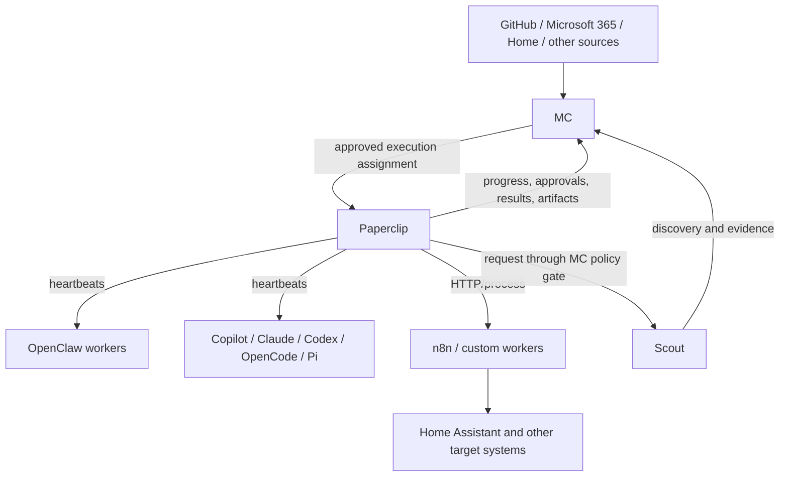

# Paperclip Adoption and Integration

## Decision summary

Adopt Paperclip incrementally as the **agent organization and execution
governance layer beneath Mission Control**.

- **Mission Control (MC)** remains the personal work control plane: capture,
  prioritization, source reconciliation, human ownership, and the durable view
  of outcomes.
- **Paperclip** owns its companies, agent org charts, internal issue
  decomposition, budgets, approvals, heartbeat runs, and execution artifacts.
- **OpenClaw, Scout, Copilot, Claude, Codex, OpenCode, Pi, n8n, and custom
  workers** remain execution runtimes or specialized workers.
- **Homelab infrastructure** runs the Paperclip control plane and, initially,
  trusted workers. Riskier execution moves to an isolated worker or sandbox.

Do not create a bidirectional task synchronization system. An MC task delegates
to a Paperclip issue/run and retains references to it. Paperclip may decompose
that work internally without creating an MC task for every child issue.

Houston remains the user-facing assistant rather than becoming a Paperclip
agent by default. Houston may dispatch directly to one executor or select
Paperclip when work benefits from durable multi-agent orchestration. An
optional Paperclip **Mission Control Coordinator** may consume explicitly
delegated work and return proposals/results, but it receives no ambient
authority to pull, reprioritize, or mutate arbitrary MC work.

## Product boundaries

| System | Owns | Does not own |
|---|---|---|
| Mission Control | Personal tasks, priorities, projects, human decisions, source provenance, dispatch policy, consolidated notifications | Paperclip's internal work breakdown or runtime sessions |
| Houston | Conversational intent, recommendations, explanation, and policy-aware delegation through MC | Durable dispatch persistence or Paperclip's internal organization |
| Paperclip | Agent companies, teams, issue decomposition, budgets, approvals, runs, artifacts, agent governance | The user's canonical cross-source task list |
| Scout | M365 discovery, evidence, and narrowly authorized M365 actions | General orchestration or canonical task planning |
| OpenClaw | Persistent general-purpose agent sessions, tools, memory, and channels | Portfolio/task authority or organization-wide governance |
| Copilot and coding harnesses | Repository-scoped implementation and verification | Personal work prioritization |
| n8n | Deterministic workflow execution and system bridges | Human prioritization or autonomous organization |
| Home Assistant | Home state and device/service actions | Reasoning-agent identity |

## Source-of-truth and identity model

An MC task remains visible and authoritative for the user's outcome even while
Paperclip executes it. Store an execution assignment with:

- provider and Paperclip company;
- Paperclip issue, run, and artifact identifiers;
- destination locality and disclosed fields;
- current execution state and responsible Paperclip agent or team;
- pending approval, blocker, and latest-progress summary;
- returned pull requests, checks, artifacts, and completion receipt.

Paperclip child issues are not imported by default. If a Paperclip issue must be
shown independently in MC, classify it as `remote-mirror`; Paperclip remains
authoritative for its lifecycle. This follows the existing
[task-source ownership](task-source-ownership-and-editability.md) model.

MC's user-facing assignment concepts should remain distinct:

| Concept | Example |
|---|---|
| Human owner | The person accountable for the outcome |
| Source assignee | GitHub assignee or Microsoft task owner |
| Execution target | Paperclip, Copilot Cloud, Scout, or n8n |
| Active executor | Paperclip agent currently responsible for the run |

Use **Delegate** or **Execution target** for Paperclip rather than overloading
the ordinary task assignee field.

## Guardrails

Paperclip-to-Scout actions pass through MC rather than calling Scout directly:

1. Paperclip restricts which agents may request the capability.
2. MC creates a destination-bound dispatch preview with field allowlists,
   classification, disclosed fields, allowed actions, and an exact payload
   hash.
3. A human confirms the dispatch unless a later, narrowly scoped policy
   explicitly permits it.
4. Scout independently validates tenant, identity, tool, and action authority.
5. Microsoft or source-system permissions remain the final boundary.
6. MC and Paperclip retain correlated audit records and execution receipts.

Paperclip's MCP gateway may additionally govern tools used through it, but it
cannot protect calls that a runtime makes directly outside the gateway.
The implemented request, authentication, claim, result, and configuration
contract is documented in
[`docs/features/paperclip-scout-bridge.md`](../../features/paperclip-scout-bridge.md).

Default policies:

- `local-only` data never leaves MC's configured local boundary.
- Restricted payloads require explicit confirmation.
- Destructive, financial, messaging, identity, and home-control actions always
  require human approval during the pilot.
- Approval completion is recorded only after the authoritative system accepts
  the action.
- Credentials are scoped per worker/company and are never embedded in prompts.

## Homelab deployment

### Initial topology

Run the Paperclip control plane as another managed stack on the existing Docker
host. Use the existing reverse proxy, authentication, monitoring, backup, and
private-network conventions.

Do not give Paperclip or its agents:

- the Docker socket;
- privileged containers;
- host networking without a demonstrated requirement;
- broad host bind mounts;
- unrestricted access to management, storage, or IoT networks;
- shared administrator credentials.

Persist and back up both Paperclip's database/storage and its local-encryption
master key. Paperclip does not require an external secrets manager. Infisical
or Azure Key Vault can inject deployment secrets, but neither is currently a
first-class Paperclip per-agent secret provider.

### Execution isolation progression

1. **Trusted pilot:** control plane and a small number of tightly scoped,
   trusted workers on the current Docker host.
2. **Dedicated worker:** move command-running and repository workers to a
   separate VM or Docker host with narrow mounts and network policy.
3. **Managed sandbox:** use a supported sandbox provider for untrusted,
   internet-sourced, or bursty work.
4. **Kubernetes isolation:** adopt only if workload volume or multi-tenant
   isolation justifies the operational cost.

Control-plane placement and execution placement are separate decisions. The
Paperclip UI/database can remain in the homelab even when a run executes in a
remote sandbox.

## Companies and initial team

Treat a Paperclip company as a mission, trust, credential, visibility, audit,
and budget boundary. Teams and reporting lines are organizational, not strong
privacy boundaries.

Start with one company for trusted software and homelab work only if those
workers can safely share context and credentials. Create separate companies
for materially different boundaries, such as:

- personal/financial or sensitive household operations;
- experimental or untrusted agents;
- work/employer information;
- independently budgeted or separately administered activities.

Begin with a small functional team:

| Role | Initial runtime | Purpose |
|---|---|---|
| Coordinator | OpenClaw or a conservative general runtime | Accept parent outcomes, decompose work, escalate blockers |
| Researcher | OpenClaw or Pi | Gather evidence and produce bounded recommendations |
| Engineer | Direct MC-to-Copilot Cloud initially; Paperclip coding harness later | Implement repository work |
| Reviewer | Separate coding harness/session | Verify requirements, tests, and artifacts |

CEO/CTO labels and catalog teams are instruction and organization templates,
not intrinsic skills. Capability comes from the selected runtime, model,
tools, credentials, skills, budget, and approval policy.

## Mission Control integration

Implement Paperclip as a concrete provider over the existing external-agent
control plane, not as a conventional task connector.

### Dispatch

MC creates a confirmed external-agent dispatch and Paperclip creates or updates
a parent issue with:

- the requested outcome and acceptance criteria;
- bounded source-task and repository context;
- MC correlation identifiers and callback information;
- allowed result and action types;
- execution-locality and disclosure metadata.

Use Paperclip's REST/OpenAPI surface first. MCP is useful for interactive tool
use, but REST provides a simpler durable dispatch and reconciliation contract.

The implemented provider registers an API origin, server-only credential
reference, company UUID, assignee-agent UUID, optional Paperclip project UUID,
and optional required adapter type. Registration verifies `/api/health` and
the configured assignee before persistence. A confirmed dispatch creates one
parent issue with `idempotencyKey: mission-control:{dispatchId}` and assigns it
to the configured Paperclip agent. Assignment is Paperclip's execution trigger;
MC does not checkout the issue, invoke the runtime directly, or import child
issues.

The contract is pinned to `paperclipai/paperclip` commit
`0d3e7bf6ac69c6a41995e62e7a38ca99dcbc8dfd`. The generated OpenAPI document is
served by Paperclip at `GET /api/openapi.json`; the provider uses these concrete
routes:

- `GET /api/health` and `GET /api/agents/{agentId}` for registration;
- `POST /api/companies/{companyId}/issues` for idempotent parent creation;
- `GET /api/issues/{issueId}`, `GET /api/issues/{issueId}/active-run`,
  `GET /api/heartbeat-runs/{runId}`, and
  `GET /api/issues/{issueId}/approvals` for reconciliation;
- `POST /api/heartbeat-runs/{runId}/cancel` followed by an authoritative
  `PATCH /api/issues/{issueId}` to `cancelled`.

Paperclip cancellation of an active run is board-only in the pinned contract.
A bearer agent key that receives `403` therefore leaves the MC dispatch active
and reports the provider error; local state never pretends the provider stopped.
Deployments that require remote cancellation must supply a Paperclip principal
with that authority or use `local_trusted` only inside the configured local
boundary.

### Reconciliation

MC periodically reconciles or receives events for:

- Paperclip issue and run state;
- current responsible agent;
- progress and blockers;
- pending approvals;
- costs within a deliberately coarse summary;
- returned artifacts, pull requests, checks, and completion receipts.

Use idempotency keys and stable correlation identifiers. Do not infer success
from an accepted request or a UI navigation.

MC persists the Paperclip issue ID as `providerTaskId` and the heartbeat run ID,
issue identifier, current executor/adapter, progress, liveness, blockers,
pending approvals, run usage/cost summary, and work products in bounded
provider detail. Pull-request, branch, commit, preview, document, and artifact
work products are projected into MC's existing result references. Paperclip
does not expose a first-class check-run resource in the pinned API, so MC does
not synthesize check results. Terminal MC records fence later polling and
provider results remain subject to the external-agent digest/replay rules.

### Coding runtime boundary

Paperclip owns runtime selection through the configured assignee. MC may pin an
expected adapter type and refuses registration when the assignee differs. This
allows a Paperclip-managed GitHub Copilot Web/GitHub-hosted adapter when a
Paperclip deployment actually provides and qualifies one, without routing back
through MC's direct `copilot-cloud` adapter.

At the pinned upstream revision, Paperclip does **not** ship a qualified
GitHub-hosted Copilot adapter. Its `paperclip_runner` documentation explicitly
lists GitHub Copilot as awaiting qualification. Therefore this integration
does not invent a Copilot endpoint or claim that upstream can currently run
it. Direct MC-to-Copilot Cloud remains available for single-repository work;
Paperclip can use Copilot only after the Paperclip instance reports the
configured adapter on the selected assignee.

### Contracts for follow-up issues

- **#2013:** consume `providerTaskId`, `providerDetail.issueIdentifier`,
  `providerDetail.runId`, `executor`, `progress`, `blockers`, `costs`,
  `pendingApprovals`, `workProducts`, and existing code/artifact references.
  Keep the action provider-neutral and do not materialize child issues.
- **#2014:** use `pendingApprovals` only as a task-level summary here. The
  notification bridge must deduplicate by Paperclip approval ID and continue to
  read authoritative approval state from Paperclip.
- **#2015:** create a separate inbound, authenticated policy boundary. It must
  not reuse the Paperclip provider credential as Scout authority or bypass MC's
  disclosure preview, confirmation, claim, and result fencing.

### Approvals and notifications

Paperclip remains authoritative for Paperclip approvals. MC mirrors pending
approvals as actionable notifications with the company, requester, risk,
related MC task/Paperclip issue, expiry, and deep link.

The first version opens Paperclip to decide. A later version may approve or
reject through MC only after adding narrowly scoped API authority, explicit
confirmation, concurrency protection, and authoritative response handling.

### Human work

Paperclip may assign issues to a human, but the user should retain one human
identity. Roles such as Finance, Home, or Executive should be represented by
projects, labels, queues, and required authority rather than duplicate human
accounts. Human-required actions should surface in MC.

## Runtime choices

Use more than one runtime when it provides a real capability or trust
advantage:

| Need | Preferred route |
|---|---|
| One repository coding task | MC directly to Copilot Cloud |
| Multi-agent decomposition, budgets, or recurring execution | MC to Paperclip |
| Persistent cross-system worker | Paperclip to OpenClaw Gateway |
| M365 discovery or authorized action | Scout, through MC's policy boundary |
| Deterministic workflow | Paperclip/MC to n8n |
| Lightweight embedded coding agent | Paperclip Pi adapter |
| Multi-provider coding harness | Paperclip OpenCode adapter |
| Targeted home action | Agent or n8n invoking Home Assistant as a tool |

Bifrost or Azure OpenAI may supply inference to a compatible harness, but they
do not replace the runtime, tool loop, workspace, or execution adapter. Do not
make that integration a prerequisite for the pilot.

The community Copilot CLI adapter is alpha and is not Copilot Desktop or
GitHub-hosted Copilot Cloud. Keep direct MC-to-Copilot Cloud for the initial
coding path.

## Repository and project ownership

### Canonical documentation

| Location | Store there |
|---|---|
| `mission-control` | This architecture, MC/Paperclip contracts, source authority, dispatch/reconciliation design, UI behavior, and MC implementation |
| `homelab-config` | Paperclip stack manifests, ingress, network policy, volumes, backup/restore, secrets injection, monitoring, worker placement, and runbooks |
| `ideation` | Raw exploration, alternatives, screenshots, product ideas, and experiments that are not yet accepted decisions |
| Paperclip configuration repository or directory, if introduced | Versioned company/team/agent definitions that are safe to store outside Paperclip |

Do not duplicate this full design in every repository. Each repository should
contain a short local document linking to this canonical decision and defining
only its own responsibilities and acceptance criteria.

### Mission Control project

The cross-repository MC project is **Adopt Paperclip Agent Orchestration**
(`proj-adopt-paperclip-agent-orchestration`). MC projects already span GitHub
repositories and task sources, so it coordinates the whole outcome without
moving every task into the MC repository.

Recommended phases:

1. **Pilot and deploy**
2. **Validate operating model**
3. **Integrate Mission Control**
4. **Add guarded workers**
5. **Harden and expand**

Use tasks or GitHub issues in the repository that owns the deliverable:

- `homelab-config`: deploy stack, ingress, persistence, backups, monitoring,
  network isolation, and worker VM;
- `mission-control`: provider registration, dispatch, delegation UI,
  reconciliation, approval notifications, result review, and Scout guardrails;
- `ideation`: optional visualization experiments and future agent-team concepts.

Link those tasks to the single MC project. Avoid one MC project per repository;
create a second project only when an effort has an independently meaningful
outcome, schedule, or security boundary.

## Phased adoption plan

### Phase 0: Record and prepare

- Accept this boundary and name the canonical owners.
- Create the cross-repository MC project and phases.
- Add linked local implementation notes in `homelab-config`.
- Select the initial Paperclip company boundary and service identity.
- Define success measures and a rollback procedure.

**Exit:** architecture accepted, owners clear, no runtime deployed.

### Phase 1: Reversible homelab pilot

- Deploy Paperclip privately on the existing Docker host.
- Configure authentication, persistent storage, backup/restore, health checks,
  logs, resource limits, and least-privilege networking.
- Use local encrypted secrets initially and protect the master key.
- Create one company and a minimal coordinator/researcher team.
- Connect the existing OpenClaw Gateway with minimal permissions.
- Run only synthetic or low-sensitivity work.

**Exit:** restore tested; an agent completes a bounded issue; logs, costs,
failure, cancellation, and approval behavior are understood.

### Phase 2: Validate useful work before MC integration

- Delegate several real but low-risk research, documentation, or homelab
  planning outcomes manually.
- Compare Paperclip decomposition and governance against direct Copilot or
  OpenClaw use.
- Record where Paperclip adds value and where direct execution remains simpler.
- Establish budgets, timeout defaults, escalation rules, and operator runbooks.

**Exit:** repeated use demonstrates value beyond novelty and identifies a
stable minimum integration contract.

### Phase 3: Minimum Mission Control integration

- Register Paperclip as an external-agent execution provider.
- Add a provider-neutral **Delegate...** action with Paperclip as an execution
  target, using the existing dispatch preview and confirmation.
- Store MC task-to-Paperclip issue/run correlations.
- Reconcile state, blockers, results, PRs, and artifacts into the parent task.
- Add cancellation/revocation and explicit failure states.
- Keep Paperclip child issues out of MC by default.

#### Task delegation surface

Mission Control evaluates enabled execution targets against the task's source
classification and each target's locality/data policy on the server. The task
detail surface lists only eligible targets, then creates the existing durable
dispatch preview. Confirmation shows the exact destination, locality,
classification, disclosed field paths, authorized actions, and payload before
the existing preview hash is confirmed.

The original task remains canonical. Task details show the execution target and
active executor separately from the task's human owner and source assignee,
including Paperclip company, issue/run links, canonical dispatch state, coarse
progress, blockers, pending approvals, and returned pull request, commit, check,
and artifact references. Task and project lists carry a compact execution badge
without importing Paperclip child issues.

Cancellation/revocation is shown only for active dispatch states. Re-dispatch is
shown only for failed, timed-out, dead-letter, or cancelled states; both actions
are revalidated by the authoritative dispatch state machine on the server.

**Exit:** one MC task can be delegated, observed, completed, and reconciled
without copy/paste or duplicate task authority.

### Phase 4: Approval and Scout bridge

- Mirror Paperclip approvals into MC notifications with deep links.
- Add Paperclip requests for Scout capabilities through MC's confirmed
  pull-queue dispatch boundary.
- Enforce classifications, disclosure previews, action allowlists, tenant
  scoping, idempotency, and correlated audit receipts.
- Keep sensitive write actions human-approved.

**Exit:** Paperclip can request a narrowly scoped Scout action, but cannot
bypass MC or Scout policy.

### Phase 5: Harden execution and broaden runtimes

- Move command-running workers to a dedicated VM or sandbox as risk warrants.
- Add a Paperclip coding harness only when multi-agent coding provides value;
  retain direct Copilot Cloud for simple tasks.
- Evaluate n8n workers and governed Home Assistant tools.
- Integrate external secret resolution only if deployment injection becomes
  insufficient.
- Add operational alerts, capacity limits, incident procedures, and periodic
  access review.

**Exit:** worker compromise has a bounded blast radius and each runtime has a
clear reason to exist.

### Phase 6: Optional experience enhancements

- Experiment with an OpenClaw or generic pixel-office dashboard.
- Build a read-only Paperclip plugin/view only if the visualization improves
  situational awareness.
- Consider MC inline approval actions after the deep-link workflow is proven.
- Consider additional companies or catalog teams only as boundaries and
  workload justify them.

Visualization is not on the critical path and must not become another source of
task or approval truth.

## Success measures

The pilot succeeds when:

- MC users can always find the canonical parent outcome.
- No duplicate task needs manual lifecycle reconciliation.
- Every execution identifies its provider, locality, disclosed context, and
  result.
- Paperclip improves at least one recurring multi-step workflow compared with
  direct agent use.
- Human approval is unavoidable for the configured high-risk actions.
- A failed or abandoned run is visible and recoverable.
- Paperclip can be restored from backup and disabled without losing MC tasks.
- Agent execution has no unnecessary access to Docker or homelab management
  infrastructure.

## Explicitly deferred

- Full bidirectional MC/Paperclip issue synchronization
- Replacing MC projects or tasks with Paperclip projects/issues
- Direct Paperclip-to-Scout authority
- Broad autonomous email, financial, identity, or home-control actions
- Kubernetes solely to host the initial pilot
- Native Azure AI, Bifrost, Infisical, or Azure Key Vault integration
- Copilot Desktop automation
- Production dependence on the community alpha Copilot CLI adapter
- Custom animated-office development before operational value is proven

## Tracked backlog

| Phase | Work | Authority |
|---|---|---|
| Pilot and deploy | Private, reversible Paperclip stack, backup/restore, and least-privilege network design | `rsocko/homelab-config#633` |
| Validate operating model | Two-to-four-week low-risk manual pilot and go/no-go decision | MC-owned project task |
| Integrate Mission Control | Paperclip provider and correlation contract | #2012 |
| Integrate Mission Control | Delegation state and result presentation | #2013 |
| Integrate Mission Control | Approval notifications | #2014 |
| Add guarded workers | Paperclip-to-MC-to-Scout request path | #2015 |
| Harden and expand | Worker-isolation and runtime-expansion review | MC-owned project task |

The MC project contains an explicit coordination pointer for the authoritative
`homelab-config` issue because that repository is not currently represented by
the active GitHub task connector. Replace the pointer with the synced remote
task if that connector scope is expanded; do not retain both.
