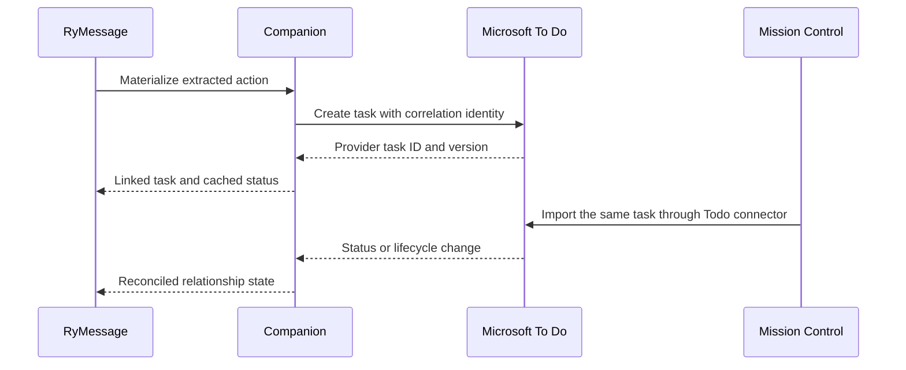

# RyMessage Task Materialization

## Decision

RyMessage is a first-class producer of task candidates and materialization
events, not only a notification source. It owns conversation evidence and
action extraction. The selected task provider owns the materialized task.

Microsoft To Do is the preferred configurable default destination because
RyMessage can display a linked To Do task and its current status beside the
originating message. Mission Control consumes that same task through its
Microsoft To Do connector and must not create a duplicate RyMessage or local
task.

Notifications remain the correct representation for non-task signals such as
security codes, delivery updates, and travel alerts, and for uncertain task
candidates that still require review.

## Materialization policy

RyMessage should expose account-level defaults with narrower overrides:

| Setting | Behavior |
|---|---|
| Default destination | `microsoft-todo`, `mission-control`, or `ask` |
| Default To Do list | Persist the immutable provider list ID, plus a display-name cache |
| Automatic creation | Confidence threshold and eligible action types |
| Overrides | Per-conversation and per-action destination or review requirement |
| Provider failure | Durably queue and retry while surfacing pending/failed state |

Microsoft To Do is the recommended default. Mission Control local task creation
must be an explicit selection, not a silent fallback when To Do is unavailable.
Fallback would change the system of record during an error and can create a
duplicate when the original provider request later succeeds.

## Authority model

Authority is assigned per entity rather than to one global system:

| Entity or field | Authority |
|---|---|
| Message, thread, sender context | RyMessage and its local message provider |
| Extracted action, evidence, confidence, recommendation | RyMessage |
| Materialization policy and action-to-task relationship | RyMessage Companion |
| Microsoft To Do task fields and lifecycle | Microsoft To Do |
| Mission Control local task fields and lifecycle | Mission Control, only when explicitly selected as destination |
| MC planning overlays on a remote task | Mission Control, according to the connector field-policy matrix |

RyMessage may cache task status for presentation beside a message, but that
cache is not authoritative. Provider changes must reconcile back into the
relationship state.

## Provenance and identity

Companion owns a durable relationship record containing at least:

```typescript
interface RyMessageTaskMaterialization {
  actionId: string;
  correlationId: string;
  provider: 'microsoft-todo' | 'mission-control';
  providerListId?: string;
  providerTaskId?: string;
  providerVersion?: string;
  policy: 'automatic' | 'user-approved' | 'manual';
  state:
    | 'pending'
    | 'rejected'
    | 'linked'
    | 'completed'
    | 'cancelled'
    | 'reopened'
    | 'link-broken';
  createdAt: string;
  updatedAt: string;
  lastObservedStatus?: string;
}
```

`actionId` and `correlationId` are stable, opaque, and account-scoped. Raw chat
GUIDs, message GUIDs, participant identifiers, and message snippets stay on the
desktop by default. A separately authorized capability may provide a safe link
back to the conversation without making message content part of the task
contract.

Where Microsoft Graph supports it, the To Do task should carry an external
linked resource containing the opaque correlation identity. A minimal,
machine-readable marker is the fallback. Do not encode identity only in the
title, mutable list name, or user-visible description.

Mission Control stores:

- `microsoft-todo` as the task source and the provider task ID as `sourceId`;
- RyMessage `actionId` and `correlationId` as provenance;
- a safe source link when available; and
- MC-owned planning overlays allowed by the Microsoft To Do source profile.

It does not create another task from the corresponding RyMessage event.

## Lifecycle reconciliation

The integration is bidirectional but not multi-master:



Supported relationship transitions include pending, accepted/linked, rejected,
completed, cancelled, reopened, and link-broken. Every create and transition is
idempotent and carries enough identity/version information to suppress replay
duplicates and feedback loops.

If a provider task is deleted or becomes inaccessible, Companion marks the
relationship `link-broken` and offers explicit recovery. It does not
automatically recreate the task.

Edits to task title, priority, due date, list, and lifecycle follow the selected
provider's concurrency and version rules. RyMessage can suggest a refinement,
but it cannot silently overwrite provider-owned user edits.

## Companion boundary

Mission Control must not register as a Companion device or consume the frozen
`/v1/sync/*` personalization contract. The production boundary is a dedicated,
versioned Companion integration API and durable outbox with:

- integration-specific principals, scopes, rotation, and revocation;
- event IDs, aggregate IDs, schema versions, causal ordering, and timestamps;
- acknowledgements, replay, retry, retention, backpressure, and dead-letter
  behavior;
- bounded and privacy-filtered payloads; and
- contract fixtures and a compatibility matrix.

The existing direct desktop webhook remains an experimental/private adapter.
Its handler should share the transport-independent contract with the future
Companion adapter. NATS or another broker may carry events internally, but its
subjects are not the public domain contract.

## Delivery sequence

1. Define fixtures and implement idempotent correlation in Mission Control.
2. Harden the direct webhook as an explicitly experimental adapter.
3. Complete and promote Companion Phase 1 before adding external domains.
4. Freeze the Companion action/task domain and integration authentication.
5. Dual-deliver and compare direct and Companion paths.
6. Cut over only after no-loss, replay, privacy, outage, and rollback canaries.
