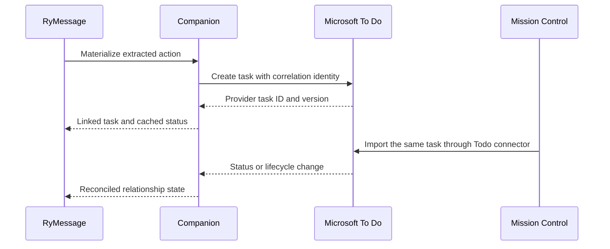

# RyMessage Task Materialization

## Decision

RyMessage is a first-class producer of task candidates and materialization
events, not only a notification source. It owns conversation evidence and
action extraction. The selected task provider owns the materialized task.

Microsoft To Do is the preferred configurable default destination because
RyMessage can display a linked To Do task and its current status beside the
originating message. Mission Control consumes that same task through its
Microsoft To Do connector and must not create a duplicate RyMessage or local
task.

Notifications remain the correct representation for non-task signals such as
security codes, delivery updates, and travel alerts, and for uncertain task
candidates that still require review.

## Current implementation status

Mission Control currently has an experimental, LAN-trusted RyMessage webhook
that maps Action Center events directly to notifications. It does not require
authentication, persist transport-level event receipts, implement the
materialization relationship contract, or run a NATS/JetStream client. There is
**no NATS runtime in Mission Control today**.

Issue [#524](https://github.com/rsocko/mission-control/issues/524) tracks the
transport-independent durable handler and possible broker deployment. Generic
webhook idempotency, replay protection, and request limits remain owned by
[#1027](https://github.com/rsocko/mission-control/issues/1027); this proposal
cross-references that work instead of duplicating it.

## Materialization policy

RyMessage should expose account-level defaults with narrower overrides:

| Setting | Behavior |
|---|---|
| Default destination | `microsoft-todo`, `mission-control`, or `ask` |
| Default To Do list | Persist the immutable provider list ID, plus a display-name cache |
| Automatic creation | Confidence threshold and eligible action types |
| Overrides | Per-conversation and per-action destination or review requirement |
| Provider failure | Durably queue and retry while surfacing pending/failed state |

Microsoft To Do is the recommended default. Mission Control local task creation
must be an explicit selection, not a silent fallback when To Do is unavailable.
Fallback would change the system of record during an error and can create a
duplicate when the original provider request later succeeds.

## Authority model

Authority is assigned per entity rather than to one global system:

| Entity or field | Authority |
|---|---|
| Message, thread, sender context | RyMessage and its local message provider |
| Extracted action, evidence, confidence, recommendation | RyMessage |
| Materialization policy and action-to-task relationship | RyMessage Companion |
| Microsoft To Do task fields and lifecycle | Microsoft To Do |
| Mission Control local task fields and lifecycle | Mission Control, only when explicitly selected as destination |
| MC planning overlays on a remote task | Mission Control, according to the connector field-policy matrix |

RyMessage may cache task status for presentation beside a message, but that
cache is not authoritative. Provider changes must reconcile back into the
relationship state.

## Provenance and identity

Companion owns a durable relationship record containing at least:

```typescript
interface RyMessageTaskMaterialization {
  actionId: string;
  correlationId: string;
  provider: 'microsoft-todo' | 'mission-control';
  providerListId?: string;
  providerTaskId?: string;
  providerVersion?: string;
  policy: 'automatic' | 'user-approved' | 'manual';
  state:
    | 'pending'
    | 'rejected'
    | 'linked'
    | 'completed'
    | 'cancelled'
    | 'reopened'
    | 'link-broken';
  createdAt: string;
  updatedAt: string;
  lastObservedStatus?: string;
}
```

`actionId` and `correlationId` are stable, opaque, and account-scoped. Raw chat
GUIDs, message GUIDs, participant identifiers, and message snippets stay on the
desktop by default. A separately authorized capability may provide a safe link
back to the conversation without making message content part of the task
contract.

The event envelope's `operationId` identifies one requested state transition
and remains stable across retries and transports. Its separate stable `eventId`
identifies one published fact. Replaying the same event or operation must return
the persisted outcome without repeating its side effects.

Where Microsoft Graph supports it, the To Do task should carry an external
linked resource containing the opaque correlation identity. A minimal,
machine-readable marker is the fallback. Do not encode identity only in the
title, mutable list name, or user-visible description.

Mission Control stores:

- `microsoft-todo` as the task source and the provider task ID as `sourceId`;
- RyMessage `actionId` and `correlationId` as provenance;
- a safe source link when available; and
- MC-owned planning overlays allowed by the Microsoft To Do source profile.

It does not create another task from the corresponding RyMessage event.

## Event families

Generic Action Center notifications and task materialization are separate event
families even when they refer to the same extracted action:

| Family | Purpose | Mission Control projection |
|---|---|---|
| Action notification | Informational, uncertain, or reviewable Action Center signal | Notification only |
| Task materialization | Relationship between an extracted action and an authoritative provider task | Provider-owned task plus RyMessage provenance |

An action notification must not be promoted merely because it is actionable.
A materialization event must include the Companion-owned relationship identity,
selected provider identity, and immutable provider task identity when linked.
Mission Control deduplicates on that relationship/provider tuple and enriches
the task imported through the selected provider connector. It never creates a
second task from the generic notification event.

## Transport-independent event handler

All ingress adapters call one idempotent domain handler. HTTP status codes,
webhook headers, NATS subjects, stream sequence numbers, and JetStream
acknowledgements remain adapter concerns and are not part of the public domain
contract.

The versioned envelope contains at least:

- stable opaque `eventId`, `operationId`, `aggregateId`, and account/integration
  identity;
- `eventType`, `schemaVersion`, aggregate version, occurred-at timestamp, and
  optional causal predecessor;
- a bounded action-notification or task-materialization payload; and
- producer identity plus a loop-prevention origin and propagation chain.

Before applying side effects, the handler atomically claims the `eventId` and
`operationId`. It validates supported schema and aggregate versions, rejects
identity reuse with conflicting content, and applies a monotonic aggregate
transition. Duplicate delivery returns the stored result. Out-of-order events
are either safely applied under explicit transition rules or retained for
bounded retry/dead-letter handling; they must not silently overwrite newer
provider state.

The handler commits the receipt, relationship/task projection, and an MC
outbox record in one database transaction. An adapter acknowledges delivery
only after that commit. A crash before commit causes replay; a crash after
commit but before acknowledgement causes a harmless duplicate. Retention,
backpressure, poison-event handling, and replay observability are required for
every durable adapter.

Feedback events emitted by Mission Control carry the originating operation and
propagation chain. The handler suppresses an already-applied operation and
never reflects a provider-owned change back as a new user intent. This preserves
the authority model rather than creating a multi-master loop.

## Lifecycle reconciliation

The integration is bidirectional but not multi-master:



Supported relationship transitions include pending, accepted/linked, rejected,
completed, cancelled, reopened, and link-broken. Every create and transition is
idempotent and carries enough identity/version information to suppress replay
duplicates and feedback loops.

If a provider task is deleted or becomes inaccessible, Companion marks the
relationship `link-broken` and offers explicit recovery. It does not
automatically recreate the task.

Edits to task title, priority, due date, list, and lifecycle follow the selected
provider's concurrency and version rules. RyMessage can suggest a refinement,
but it cannot silently overwrite provider-owned user edits.

## Companion boundary

Mission Control must not register as a Companion device or consume the frozen
`/v1/sync/*` personalization contract. It must not poll, subscribe to, or adapt
that device-replication surface.

The preferred future topology is:

```text
RyMessage native outbox
  -> dedicated Companion integration API and durable outbox
  -> optional JetStream transport
  -> Mission Control durable ingress adapter and domain handler
```

The production boundary is the dedicated, versioned Companion integration API
and outbox contract, not a broker protocol. It requires:

- integration-specific principals, scopes, rotation, and revocation;
- event IDs, aggregate IDs, schema versions, causal ordering, and timestamps;
- acknowledgements, replay, retry, retention, backpressure, and dead-letter
  behavior;
- bounded and privacy-filtered payloads; and
- contract fixtures and a compatibility matrix.

The existing direct desktop webhook remains an experimental/private adapter.
Its handler should share the transport-independent contract with the future
Companion adapter and remain available only as a compatibility path during
migration.

JetStream is the preferred candidate for durable internal delivery when its
operational cost is justified. A direct authenticated pull/push integration
against the Companion outbox is also valid. NATS subjects, consumer names, and
stream layout are deployment choices, not the public domain contract.

Companion development is currently paused and the RyMessage Companion readiness
gate, `rsocko/rymessage#392`, has not been promoted. That status does not block
Mission Control from implementing the transport-independent handler,
idempotency store, contract fixtures, or optional broker infrastructure.

## Delivery sequence

1. Define versioned fixtures and implement the idempotent domain handler,
   receipt store, commit-before-ack boundary, and relationship correlation in
   Mission Control.
2. Route the existing webhook through that handler as an explicitly
   experimental compatibility adapter, coordinated with #1027.
3. Optionally deploy JetStream and an MC durable consumer under #524 without
   waiting for Companion promotion; validate replay, ordering, outage, and
   poison-event behavior with synthetic producers.
4. When Companion work resumes, freeze its dedicated integration API, outbox,
   credentials/scopes, and privacy-filtered action/materialization schemas.
5. Dual-deliver the compatibility and preferred paths and compare persisted
   outcomes, lag, duplicates, ordering, and privacy telemetry without allowing
   the shadow path to create side effects.
6. Cut over only after no-loss replay, duplicate suppression, version-skew,
   credential rotation/revocation, feedback-loop, outage, rollback, and privacy
   gates pass for the retention window. Keep a bounded rollback path until the
   old delivery route is intentionally retired.
