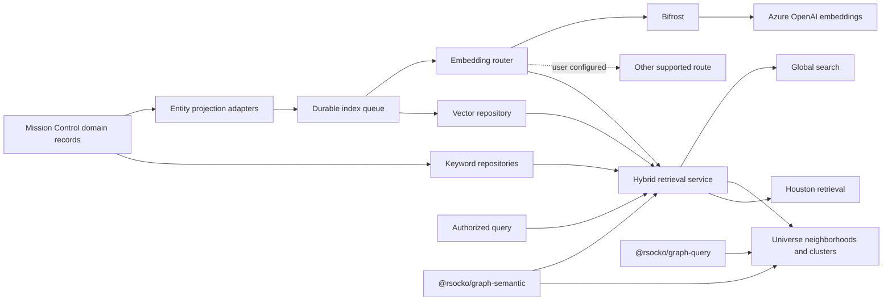

# Semantic Index and Graph Intelligence Architecture

## Summary

Mission Control will evolve its existing task and notification semantic search into
a shared semantic index serving:

1. hybrid search across tasks, projects, tags, triage items, alerts/events, and
   retained Houston conversation summaries;
2. search-first Universe exploration with bounded semantic neighborhoods;
3. transient cluster grouping that users may explicitly save; and
4. authorized retrieval for Houston.

The first product outcome is hybrid search. Graph neighborhoods and cluster grouping
follow after retrieval quality, freshness, privacy, and 100,000-entity scale have
been demonstrated.

Embeddings route through Bifrost by default to an Azure OpenAI embedding deployment.
Users may select another supported route or model independently from the completion
model. Mission Control owns provider routing, domain projections, persistence,
authorization, retention, and operational behavior.

Reusable graph algorithms and provider-neutral semantic contracts belong in the
Generic Graph toolkit in `rsocko/ideation` only after Mission Control proves them as
a second host. The toolkit must never depend on Mission Control domain or storage
types.

## Decisions

| Area | Decision |
|---|---|
| First outcome | Hybrid semantic and lexical search |
| Indexed scope | Tasks, projects, tags, triage items, alerts/events, and Houston conversation summaries |
| Embedding route | Bifrost by default, resolving to Azure OpenAI |
| Configuration | Embedding route/model independent from completion route/model |
| Target scale | 100,000 indexed entities per installation |
| Semantic edges | Computed, scored, bounded overlays |
| Canonical relationships | Persist only explicit or user-approved relationships |
| Clusters | Transient computed groupings with an explicit save action |
| Houston memory | Summaries and linked entities with user-controlled retention |
| Generic toolkit | Pure graph/query/semantic contracts extracted after second-host validation |

## Goals

- Preserve fast exact and lexical matches while adding conceptual recall.
- Give every result an understandable origin and ranking explanation.
- Keep keyword search useful when embeddings are disabled, unavailable, stale, or
  being rebuilt.
- Reuse one authorized retrieval service across global search, Universe, and Houston.
- Make semantic neighborhoods and clusters inspectable without presenting inference
  as fact.
- Support model changes, partial backfills, deletion, and retention without leaking
  stale content.
- Keep the architecture viable at 100,000 indexed entities without requiring a graph
  database.

## Non-goals

- Persisting every pairwise similarity as a graph edge.
- Replacing Mission Control relational records with a graph document or graph
  database.
- Treating raw cosine scores from different models as directly comparable.
- Indexing full Houston transcripts indefinitely.
- Allowing semantic suggestions to mutate projects, tags, or dependencies without
  user approval.
- Moving Bifrost, Azure, authorization, or Mission Control entity rules into the
  Generic Graph toolkit.
- Building a universal graph renderer.

## Current State

Mission Control already has useful foundations:

- SQLite keyword search and PostgreSQL search-document projections;
- persisted task and notification vectors in `search_embeddings`;
- staged keyword-first search with optional semantic enrichment;
- query-vector and entity-vector caches;
- provider/model provenance and stale-vector handling;
- Bifrost-aware AI request context, sensitivity policy, and route outcome metadata;
- semantic task neighbors exposed by the graph service; and
- a graph contract that distinguishes explicit, derived, and embedding provenance.

The current implementation remains task/notification-specific and scans a bounded
candidate set in application memory. Provider configuration also treats one provider
as the basis for both completion and embedding calls. Those constraints must be
removed before adding more entity kinds or claiming 100,000-entity support.

## Product Architecture



### One retrieval service, multiple consumers

Consumers call an authorized semantic retrieval service, not vector tables or
embedding providers directly. The service accepts:

- query text or an authorized source entity;
- entity kinds and domain filters;
- result and per-kind budgets;
- caller identity and sensitivity context;
- retrieval mode: `keyword`, `semantic`, or `hybrid`; and
- optional graph projection options.

It returns:

- stable entity identity and navigation target;
- lexical rank, semantic rank, and fused rank where applicable;
- match explanation and contributing fields;
- resolved provider/model and freshness metadata;
- explicit readiness/degradation state; and
- bounded result/page information.

Global search, Universe, and Houston may apply different presentation and budgets,
but they must share candidate eligibility, authorization, freshness, and ranking
semantics.

## Index Document Contract

Each indexed record is a versioned projection of an authoritative domain entity:

```typescript
interface SemanticIndexDocument {
  entityType: SemanticEntityType;
  entityId: string;
  title: string;
  body: string;
  keywords: string[];
  metadata: Record<string, string | number | boolean | null>;
  sourceRevision: string;
  contentFingerprint: string;
  projectionVersion: number;
  sensitivity: 'local-only' | 'restricted' | 'standard';
  retainUntil?: string;
}
```

The stored vector record additionally captures:

- provider, model, and vector dimensions;
- embedding creation time;
- source revision and content fingerprint;
- index job identity and status; and
- deletion or expiration state where tombstones are required.

The authoritative domain record is never reconstructed from this projection.

### Entity projections

| Entity | Initial embedding text | Important metadata |
|---|---|---|
| Task | title, description, tag labels, project name, source/list hints | status, priority, source, project, tags |
| Project | name, description, key tag labels, bounded representative task text | status, category |
| Tag | label, description/examples when present | usage count, namespace |
| Triage item | title, description, source summary | source, category, triage status |
| Alert/event | title and minimized event summary | category, severity, source, occurred time |
| Houston memory | generated summary, decisions, linked entity labels | conversation ID, linked entities, retention |

Projection builders are versioned and tested independently. Changing fields,
normalization, truncation, or weighting increments `projectionVersion` and schedules
compatible re-indexing.

## Index Lifecycle

Domain writes publish idempotent index intents after the authoritative transaction.
A durable worker:

1. reads the latest authorized entity snapshot;
2. builds the versioned projection;
3. compares its fingerprint and embedding identity;
4. requests an embedding only when necessary;
5. conditionally writes the vector against the source revision; and
6. records observable success, retry, denial, expiration, or permanent failure.

Backfills use the same path as incremental updates. They are resumable, rate-limited,
and partitioned by entity kind. Interactive queries never trigger a corpus rebuild.

Deletes and retention expiry remove keyword and vector projections. Reconciliation
detects missed writes, stale rows, incompatible dimensions, and orphaned records.

### Model change

A model, provider, dimension, or projection-version change creates a new index
identity. Old and new rows may coexist during a staged build, but retrieval reads
only one declared active identity. Cutover occurs only after readiness gates pass.
Rollback selects the prior compatible identity; it does not reinterpret vectors.

## Provider Routing

Completion and embedding configuration become separate route selections:

```text
Completion route: existing user-selected route/model
Embedding route:  Bifrost -> Azure OpenAI deployment (default)
                  or another user-selected supported route/model
```

The embedding call must reuse Mission Control request context and sensitivity policy.
Bifrost receives feature, sensitivity, allowed-route, and correlation headers.
Resolved route outcome is recorded with the vector so fallback cannot create an
unmarked mixed-model index.

The settings surface must show:

- configured route and embedding model;
- resolved provider/model;
- index identity, dimensions, and readiness by entity kind;
- connection-test results;
- rebuild/cutover status; and
- no secrets in read APIs, logs, or telemetry.

## Hybrid Retrieval and Ranking

Keyword and semantic retrieval are independent channels. Keyword results render
first. Hybrid fusion uses rank-based fusion, initially reciprocal rank fusion, rather
than mixing backend-specific raw scores:

```text
fusedScore(d) = sum(channelWeight / (rrfK + rank(channel, d)))
```

Ranking invariants:

1. exact identifiers and exact titles remain first-class;
2. title-prefix and strong lexical matches are not displaced by weak semantic hits;
3. duplicates merge by `(entityType, entityId)`;
4. filters and authorization apply to both channels;
5. deterministic tie-breaking uses entity kind, normalized title, then stable ID;
6. per-kind caps prevent a large source from flooding results; and
7. semantic-only results are labeled as related matches.

Evaluation uses a curated, synthetic query set covering exact, lexical, conceptual,
cross-source, filtered, duplicate, and no-result cases. Quality gates compare hybrid
retrieval to the existing keyword baseline.

## Storage and 100,000-Entity Scale

The storage interface must support both local SQLite and PostgreSQL deployments:

```typescript
interface VectorRepository {
  upsert(record: VectorRecord): Promise<void>;
  delete(identity: VectorIdentity): Promise<void>;
  query(input: VectorQuery): Promise<VectorCandidatePage>;
  getReadiness(identity: IndexIdentity): Promise<IndexReadiness>;
}
```

The current in-process scan remains a compatibility implementation for small local
corpora, not the 100,000-entity target. The delivery phase must benchmark and select
an indexed nearest-neighbor implementation per supported backend. PostgreSQL should
use a vector extension and ANN index when available. SQLite should use an approved
vector extension or a bounded sidecar/index implementation with deterministic
fallback behavior.

The architecture does not commit to a specific extension before a spike verifies:

- Windows and production deployment compatibility;
- dimensions and distance behavior for configured models;
- filtering before or during candidate selection;
- transactional update/delete behavior;
- backup and migration behavior; and
- p95 latency and memory limits at 100,000 entities.

If a backend cannot meet the gate, its UI must report the supported scale and
degraded behavior rather than silently scanning an unbounded corpus.

## Universe Semantic Neighborhoods

Search-first Universe exploration follows this sequence:

1. hybrid search selects one or more seed entities;
2. the graph service loads explicit and derived neighbors;
3. semantic retrieval adds bounded top-k neighbors;
4. results become transient `semantic-similarity` edges;
5. authorization and graph budgets are applied before rendering; and
6. expansion repeats only on an explicit user action.

Semantic edges include score, provider/model, freshness, and explanation. They remain
visually distinct from explicit and derived edges. They are never written to task
dependency or canonical graph tables.

## Cluster Grouping

Clusters are a projection over an authorized, bounded result set, not a new canonical
entity type. Initial clustering should use the semantic-neighborhood subgraph rather
than the full corpus:

- weighted edges derive from semantic similarity;
- explicit/derived edges may be optional algorithm inputs but retain provenance;
- the algorithm is deterministic for a fixed input and seed;
- minimum size, resolution, and outlier handling are explicit;
- each cluster receives an explainable label from representative entities/terms; and
- the UI exposes unclustered items and confidence.

Clusters may drive color, hulls, layout grouping, filters, and summaries. Recomputing
the index may change them.

Saving a cluster is an explicit promotion workflow. The user chooses the destination
semantic construct, such as a project, tag, saved graph view, or named collection,
reviews membership, and confirms. Mission Control domain services perform the
resulting mutations. The transient cluster itself is not silently persisted.

## Houston Retrieval and Retention

Houston memory is independently gated and off by default. It stores conversation
summaries and linked entities, never raw transcripts, messages, tool traces, or
reasoning. Summary generation runs through the restricted sensitivity route and
records:

- durable decisions and commitments;
- named topics;
- linked task/project/tag identifiers;
- source conversation identity; and
- sensitivity and retention deadline.

New summaries retain for 90 days by default (configurable from 1–365 days), and
each record exposes its fixed expiry. Changing the default affects new summaries
only. Disabling capture retains existing rows until their current expiry or an
explicit deletion. Users can inspect minimized content, delete a memory, and
exclude a conversation from current and future capture.

Deletion and expiry remove both lexical documents and vectors. Retrieval filters
installation authorization scope, sensitivity, exclusion, and expiry in repository
predicates before candidate ceilings, scoring, result counts, or truncation
metadata. Unauthorized and absent conversation IDs share the same not-found shape.
The worker physically deletes expired authoritative summaries in bounded batches;
semantic reconciliation removes any projection whose source disappeared before a
delete intent was published.
Reconciliation repairs missed publication intents and orphaned projections.

Houston accesses retrieval through a bounded, read-only tool/service contract. It
never queries vector tables directly and does not receive content outside the
current request's authorized scope. Results use server-generated `/ai?memory=...`,
task, project, and tag links. The service reports `disabled`, `keyword-only`,
`unavailable`, or `ready`; provider or index failure leaves normal chat successful
and does not imply that historical recall succeeded.

## Mission Control and Generic Graph Boundary

### Mission Control owns

- entity projection and field-weighting rules;
- Bifrost/Azure configuration and credentials;
- sensitivity, authorization, retention, and audit;
- SQLite/PostgreSQL adapters and index workers;
- product ranking, facets, navigation, and telemetry;
- Universe domain nodes, filters, renderers, and saved-cluster promotion; and
- all canonical project, task, tag, and relationship mutations.

### Generic Graph toolkit owns after second-host validation

Potential packages in `rsocko/ideation`:

- `@rsocko/graph-core`: graph document, schema, profiles, commands, validation,
  deterministic serialization, and history;
- `@rsocko/graph-query`: pure adjacency, neighborhood, induced-subgraph, hierarchy,
  budget, truncation, and aggregate-edge utilities; and
- `@rsocko/graph-semantic`: provider-neutral index/retrieval contracts, pure rank
  fusion, deduplication, cluster projection contracts, and conversion of semantic
  neighbors to transient graph edges.

Package dependency direction is:

```text
Mission Control domain/DB/auth/Bifrost adapters
  -> @rsocko/graph-semantic and @rsocko/graph-query
  -> @rsocko/graph-core
```

Generic packages contain no Mission Control entities, database code, HTTP routes,
provider SDKs, credentials, or authorization policy. Extraction follows Ideation
second-host validation issues rather than preceding working Mission Control behavior.

## Security and Privacy

- Minimize text before embedding, particularly alerts/events and Houston memories.
- Apply authorization and sensitivity before candidate selection, scoring, counts,
  clustering, and truncation metadata.
- Never log query text, projected bodies, raw vectors, or credentials by default.
- Treat embedding providers as data egress destinations governed by routing policy.
- Make retention and deletion observable and testable.
- Prevent mixed-provider indexes from being treated as one comparable vector space.
- Require user confirmation before inferred relationships or clusters become
  canonical domain state.

## Observability

Track without recording user content:

- queue depth, age, throughput, retries, and permanent failures;
- readiness and stale/incompatible counts by entity kind and index identity;
- embedding latency, rate-limit responses, fallback, and cost units where available;
- keyword first-result, semantic query, vector lookup, fusion, and total latency;
- aggregated candidate and exclusion counts that cannot identify a request or reveal
  unauthorized entity existence;
- query-vector cache hit rate; and
- Universe expansion and cluster size/budget metrics.

## Open Implementation Decisions

These require measured spikes rather than architectural assumptions:

1. SQLite vector index technology for the 100,000-entity gate.
2. PostgreSQL vector extension/index parameters and deployment availability.
3. The first deterministic cluster algorithm and resolution defaults.
4. Whether project embeddings include sampled tasks or a maintained project summary.
5. Retention defaults for sensitive alerts/events.
