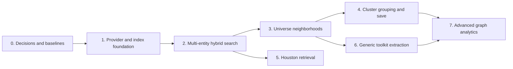

# Semantic Index and Graph Intelligence Roadmap

## Outcome Sequence

Hybrid search is the first release. Universe graph work does not block search.
Houston indexing waits for retention and authorization controls. Generic toolkit
extraction follows working Mission Control consumers and the Ideation second-host
gate.

## Phase 0: Decisions, Baselines, and Spikes

### Deliverables

- Approve the architecture and entity projection contract.
- Define a synthetic relevance evaluation set and keyword baseline.
- Benchmark current semantic scan behavior at 10,000 and 100,000 entities.
- Spike indexed vector retrieval for SQLite and PostgreSQL.
- Define provider/model/dimension compatibility and staged cutover.
- Decide Houston and alert/event retention defaults.

### Exit gates

- A vector repository choice meets the deployment and 100,000-entity performance
  gate for each supported production backend, or the backend limitation is explicit.
- Baseline relevance, p50/p95 latency, memory, and index-build measurements exist.
- No later issue depends on an unspecified vector or retention strategy.

## Phase 1: Provider and Index Foundation

### Deliverables

- Separate completion and embedding route/model configuration.
- Make Bifrost-to-Azure OpenAI the default embedding route.
- Add embedding-specific connection tests and redacted status.
- Introduce versioned index documents, fingerprints, dimensions, and source revisions.
- Add a durable, idempotent index queue, worker, reconciliation, and readiness model.
- Add staged index identity build, cutover, and rollback.
- Implement indexed vector repository adapters selected in Phase 0.

### Exit gates

- Provider/model changes cannot mix incompatible vectors.
- Backfills are resumable and do not run in interactive query paths.
- Deletes, stale writes, retries, and route denials have automated coverage.
- Search remains keyword-capable during rebuilds and provider outages.

## Phase 2: Multi-entity Hybrid Search

Roll out entity kinds in risk order:

1. tasks;
2. projects;
3. tags;
4. triage items;
5. alerts/events; and
6. Houston summaries after Phase 5 privacy prerequisites.

### Deliverables

- Versioned projection builder and lifecycle coverage for each entity kind.
- Unified result identity, navigation, metadata, and facets.
- Deterministic rank fusion, deduplication, explanations, and per-kind caps.
- Server-side authorization and filters across lexical and vector channels.
- Shared desktop/mobile progressive result behavior.
- Relevance, latency, and degraded-provider evaluation.

### Exit gates

- Hybrid relevance beats or preserves the keyword baseline on the approved dataset.
- Exact identifiers/titles remain reliable.
- Keyword first results remain within the existing search UX performance contract.
- Semantic p95 meets the measured Phase 0 budget at 100,000 entities.
- Partial readiness is visible by entity kind.

## Phase 3: Search-first Universe Neighborhoods

### Deliverables

- Seed Universe from hybrid search results.
- Expand explicit, derived, and semantic neighbors independently.
- Enforce authorization and graph budgets before projection.
- Show score, explanation, provider/model, and freshness in the inspector.
- Preserve semantic edge provenance and transient lifecycle.
- Reuse graph focus/history behavior rather than inventing a second navigation model.

### Exit gates

- No semantic edge is persisted automatically.
- Missing, stale, incompatible, denied, and unavailable states are distinguishable.
- Expansion is bounded and remains responsive at the target corpus size.
- Keyboard/list alternatives expose the same entities and explanations.

## Phase 4: Semantic Cluster Grouping and Save

### Deliverables

- Deterministic clustering over the current authorized, bounded graph projection.
- Cluster labels, outliers, confidence, visual grouping, filters, and accessible list
  representation.
- Layout grouping that does not mutate canonical entity relationships.
- Explicit save workflow with destination selection and membership review.
- Domain-command adapters for saving as a project, tag, saved view, or named
  collection where supported.

### Exit gates

- Fixed input, settings, and seed produce deterministic membership.
- Users can distinguish computed groups from saved domain state.
- Re-indexing may recompute transient clusters without corrupting saved constructs.
- Saving requires confirmation and uses existing authorization/audit paths.

## Phase 5: Houston Semantic Memory

This phase may proceed after the Phase 1 foundation but cannot enable indexing until
privacy gates are complete.

### Deliverables

- Conversation summary and linked-entity projection.
- Configurable retention, per-conversation exclusion, deletion, and reconciliation.
- Sensitivity classification before provider routing.
- Bounded Houston retrieval tool over the shared service.
- References back to source conversations and linked Mission Control entities.

### Exit gates

- Full transcripts are not retained in the semantic index by default.
- Deletion and retention expiry remove lexical and vector records.
- Unauthorized conversation existence cannot leak through rank or count metadata.
- Houston remains useful when semantic retrieval is unavailable.

## Phase 6: Generic Graph Toolkit Extraction

Mission Control is the validating second host for Ideation's Generic Graph toolkit.
Extraction begins only after concrete duplication is visible.

Mission Control may first implement narrow pure helpers behind local interfaces to
deliver Phases 2 and 3. Phase 6 moves only the proven contracts and conformance
fixtures to Ideation, then replaces the local implementations without changing
behavior. This avoids making speculative package design a prerequisite for the first
product outcomes.

### Ideation work

- Complete second-host validation and activate the existing extraction gate.
- Extract `graph-core` without changing the GraphDocument v1 wire contract.
- Add pure bounded graph query contracts and conformance fixtures.
- Add provider-neutral semantic retrieval, rank-fusion, cluster-projection, and
  transient semantic-edge contracts.

### Mission Control work

- Add domain adapters from Mission Control IDs, authorization, and records.
- Replace only proven duplicate pure helpers.
- Keep persistence, provider routing, projections, and domain mutation local.

### Exit gates

- Generic packages import no Mission Control, database, HTTP, auth, or provider code.
- Mission Control imports versioned packages in one direction.
- Existing Ideation fixtures and Mission Control behavior pass unchanged.
- Package versioning, migration, and compatibility policies are documented.

## Phase 7: Advanced Graph Analytics

Add algorithms only for named product outcomes. Candidate order:

1. connected components and orphan discovery;
2. weighted shortest-path explanations between selected entities;
3. bridge and centrality indicators within a bounded projection;
4. alternate community-detection strategies; and
5. temporal cluster drift.

Each algorithm must be pure, deterministic for declared inputs, authorization-safe,
budgeted, benchmarked, and explainable. No graph database is introduced without a
separate architecture decision backed by measured query needs.

## Work-item Map

### Existing Mission Control issues to retain

| Issue | Role in this roadmap |
|---|---|
| [#1246](https://github.com/rsocko/mission-control/issues/1246) | Existing Bifrost completion/provider hardening; embedding work should narrow or supersede its vague overlap |
| [#1136](https://github.com/rsocko/mission-control/issues/1136) | Semantic neighbors in graph service; becomes part of Phase 3 |
| [#1202](https://github.com/rsocko/mission-control/issues/1202) | Shared graph search, focus, and history used by Phase 3 |
| [#1203](https://github.com/rsocko/mission-control/issues/1203) | Saved graph views that may receive promoted cluster projections |
| [#977](https://github.com/rsocko/mission-control/issues/977) | Existing semantic clustering umbrella; refine around Phase 4 and later word/tag consumers |
| [#1328](https://github.com/rsocko/mission-control/issues/1328) | Mission Control graph domain adapters |
| [#1329](https://github.com/rsocko/mission-control/issues/1329) | Existing graph-core extraction concept; retarget or close when Ideation #1245 owns extraction |

### Existing Ideation gates

| Issue | Role in this roadmap |
|---|---|
| [#1231](https://github.com/rsocko/ideation/issues/1231) | Validate Mission Control as a second host and decide extraction boundary |
| [#1245](https://github.com/rsocko/ideation/issues/1245) | Extract reusable Generic Graph modules after validation |
| [#1253](https://github.com/rsocko/ideation/issues/1253) | Track Mission Control-inspired generic capabilities |

### New work items

| Issue | Phase and outcome |
|---|---|
| [#1668](https://github.com/rsocko/mission-control/issues/1668) | Roadmap epic and architecture gates |
| [#1661](https://github.com/rsocko/mission-control/issues/1661) | Phase 1: Bifrost-to-Azure embedding route and independent configuration |
| [#1664](https://github.com/rsocko/mission-control/issues/1664) | Phase 1: durable versioned index and vector repositories |
| [#1667](https://github.com/rsocko/mission-control/issues/1667) | Phase 2: versioned entity projections |
| [#1663](https://github.com/rsocko/mission-control/issues/1663) | Phase 2: relevance and 100,000-entity performance gates |
| [#1662](https://github.com/rsocko/mission-control/issues/1662) | Phase 3: search-first Universe semantic neighborhoods |
| [#1666](https://github.com/rsocko/mission-control/issues/1666) | Phase 4: transient cluster grouping and explicit save |
| [#1665](https://github.com/rsocko/mission-control/issues/1665) | Phase 5: Houston summary memory, retention, and retrieval |
| [rsocko/ideation#1347](https://github.com/rsocko/ideation/issues/1347) | Phase 6: bounded graph-query package |
| [rsocko/ideation#1348](https://github.com/rsocko/ideation/issues/1348) | Phase 6: provider-neutral graph-semantic package |

The epic links these focused issues and the retained existing work. Implementation
issues reference this design and state their phase dependencies explicitly.

## Rollout

Use independent feature gates for:

- semantic indexing by entity kind;
- semantic enrichment in global search;
- Universe semantic neighbors;
- Universe cluster grouping; and
- Houston semantic memory.

Roll out to synthetic/demo data first, then an opt-in local installation, then make
the Bifrost-to-Azure route the recommended configured default. Do not silently send
existing sensitive records to a newly configured provider.

## Definition of Done

The roadmap is complete when:

- all selected entity kinds participate in authorized hybrid search;
- the system meets agreed relevance and 100,000-entity performance gates;
- Universe supports bounded semantic neighborhoods and transient cluster grouping;
- users can explicitly promote selected clusters without automatic semantic mutation;
- Houston retrieves retained summaries under user-controlled retention;
- provider/model migrations are observable and reversible; and
- reusable pure graph/query/semantic contracts are owned by the Ideation toolkit with
  one-way Mission Control consumption.
