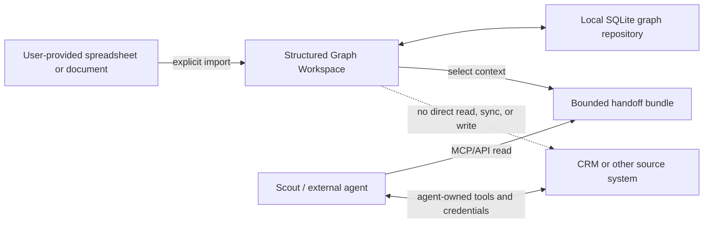
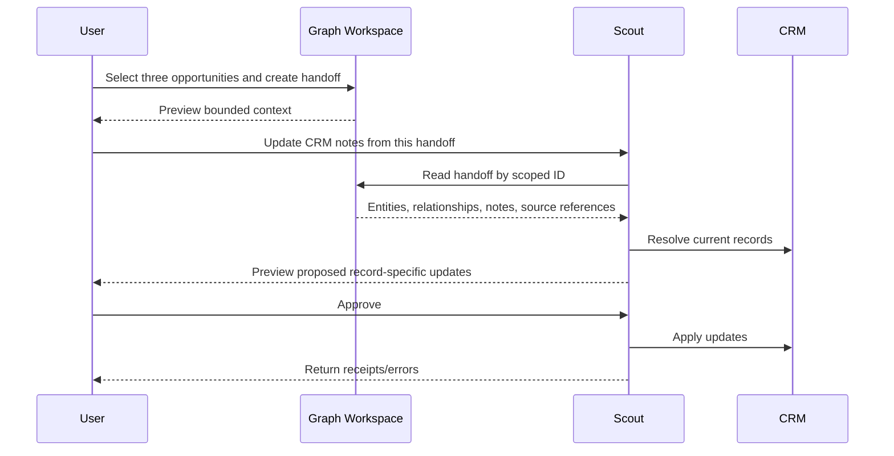

# Structured Graph Workspace — Architecture and Data Contracts

## Architecture Goals

1. Preserve the existing fast hierarchy workflow.
2. Support typed non-hierarchical relationships.
3. Keep semantic data independent of visual layout.
4. Allow the same entity to appear in multiple views.
5. Support local-only, imported-reference, and provisional entities.
6. Retain source IDs without becoming a source-system connector.
7. Produce bounded, versioned context for external agents.
8. Remain deployable within Mission Control's existing SQLite architecture.
9. Preserve an extraction path if the capability later lives adjacent to MC.

## System Boundary



The dashed boundary is intentional. The workspace knows how to retain and
export a source reference. It does not know how to authenticate to, read from,
or write to that source.

## Layered Model

```text
Source files and agent proposals
              ↓
      Import/change-set review
              ↓
Canonical local entities and typed relationships
              ↓
      Saved structured views
              ↓
Outline | Mind map | Network | Table
              ↓
       Agent handoff bundle
```

### Semantic layer

Portable and authoritative within the workspace:

- entity identity;
- entity type and lifecycle;
- properties and notes;
- typed relationships;
- external references;
- import provenance; and
- approved inference provenance.

### View layer

How semantic information is organized and rendered:

- view type and layout;
- placements and ordering;
- manual position overrides;
- view-local visual zones and annotations;
- edge routes associated with stable relationship and placement IDs;
- selected relationship dimensions;
- branch colors; and
- optional default collapse state.

### Runtime UI state

Ephemeral interaction state:

- current selection;
- active editor;
- hover and drag state;
- current pan and zoom;
- temporary collapse state;
- uncommitted drafts; and
- open menus.

Runtime state is not part of the portable graph artifact or semantic undo
history.

Visual zones are view annotations, not entities or relationships. Spatial
overlap must never create semantic containment. Semantic containers use
registered entity and relationship types or hierarchy commands.

Edge routes are also view data. Applying an automatic layout must explicitly
recompute or clear routes whose endpoint placements changed.

## Proposed Contracts

The types below describe boundaries, not final implementation syntax.

### Workspace

```typescript
interface GraphWorkspace {
  schemaVersion: 1;
  id: string;
  name: string;
  type: 'ideation' | 'account-map' | string;
  description?: string;
  createdAt: string;
  updatedAt: string;
  revision: number;
}
```

`type` remains extensible in storage. The UI exposes only registered workspace
types.

### Entity

```typescript
type EntityLifecycle =
  | 'idea'
  | 'developing'
  | 'qualified'
  | 'formalized'
  | 'active'
  | 'archived'
  | 'discarded';

interface GraphEntity {
  id: string;
  workspaceId: string;
  type: string;
  name: string;
  lifecycle: EntityLifecycle;
  properties: Record<string, unknown>;
  notes?: string;
  createdAt: string;
  updatedAt: string;
  revision: number;
}
```

Entities are stable local identities. A formal external record may later become
associated with an existing local entity.

### External reference and snapshot

```typescript
interface ExternalReference {
  id: string;
  entityId: string;
  system: string;
  recordType: string;
  externalId: string;
  externalUrl?: string;

  observedName?: string;
  alternateKeys?: Record<string, string>;
  snapshot?: Record<string, unknown>;

  importBatchId?: string;
  importedAt?: string;
  sourceFile?: string;
  sourceSheet?: string;
  sourceRow?: number;
}
```

Required uniqueness:

```text
(workspace_id, system, record_type, external_id)
```

The snapshot is reference context, not a synchronized or authoritative copy.
Local annotations stay on the entity or relationship and survive re-import.

### Relationship

```typescript
type RelationshipProvenance =
  | { kind: 'local'; createdBy?: string }
  | { kind: 'import'; importBatchId: string; sourceRow?: number }
  | {
      kind: 'inferred';
      provider?: string;
      model?: string;
      confidence: number;
      evidence?: string;
      approvalStatus: 'proposed' | 'approved' | 'rejected';
    };

interface GraphRelationship {
  id: string;
  workspaceId: string;
  sourceEntityId: string;
  targetEntityId: string;
  type: string;
  properties: Record<string, unknown>;
  provenance: RelationshipProvenance;
  createdAt: string;
  updatedAt: string;
  revision: number;
}
```

Symmetric relationships use canonical endpoint ordering. Directed relationships
preserve source and target semantics.

### Relationship registry

```typescript
interface RelationshipDefinition {
  type: string;
  sourceTypes: string[];
  targetTypes: string[];
  directed: boolean;
  sourceLabel: string;
  targetLabel: string;
  propertySchema?: Record<string, unknown>;
  allowMultiple: boolean;
}
```

The registry is code/configuration in the first release, not user-authored
schema data.

### View and placement

```typescript
type GraphViewKind = 'outline' | 'mind-map' | 'network' | 'table';
type GraphLayout =
  | 'horizontal-tree'
  | 'vertical-tree'
  | 'radial'
  | 'force'
  | 'manual'
  | 'clustered';

interface GraphView {
  id: string;
  workspaceId: string;
  name: string;
  kind: GraphViewKind;
  layout: GraphLayout;
  rootEntityId?: string;
  primaryRelationshipType?: string;
  filters?: Record<string, unknown>;
  settings?: {
    branchColors?: Record<string, string>;
    defaultCollapsedEntityIds?: string[];
    clusterDimension?: string;
  };
}

interface GraphViewPlacement {
  id: string;
  viewId: string;
  entityId: string;
  parentPlacementId?: string;
  sortOrder?: number;
  position?: { x: number; y: number };
}
```

An entity can have multiple placements in one or more views. Placement deletion
does not delete the entity.

### Hierarchy semantics

A hierarchy has two related but distinct concepts:

1. A semantic relationship such as `part-of`.
2. A placement order within a particular outline or mind-map.

When a view declares `primaryRelationshipType: 'part-of'`, hierarchy commands
may update the semantic relationship and placement order atomically. A view
that merely groups entities by business unit may update placements without
creating new canonical relationships.

Cycles are prohibited for relationship definitions marked hierarchical.

### Import batch

```typescript
interface GraphImportBatch {
  id: string;
  workspaceId: string;
  changeSetId: string;
  sourceKind: 'xlsx' | 'csv' | 'json' | 'agent';
  sourceName: string;
  sourceFingerprint: string;
  mapping: ImportMapping;
  status: 'staged' | 'validated' | 'approved' | 'applied' | 'rejected';
  summary: {
    created: number;
    matched: number;
    updated: number;
    ambiguous: number;
    invalid: number;
  };
  createdAt: string;
  appliedAt?: string;
}
```

The import batch records file-level provenance, mapping, fingerprint, and
aggregate results. Its referenced change set contains the proposed entity and
relationship operations reviewed by the user. Their lifecycles advance
together; the batch does not duplicate the operation payload.

### Unified change set

Every ingestion path produces a reviewable change set:

```typescript
interface GraphChangeSet {
  schemaVersion: 1;
  id: string;
  workspaceId: string;
  source: {
    kind: 'xlsx' | 'csv' | 'json' | 'llm' | 'mcp';
    name: string;
  };
  entityChanges: EntityChange[];
  relationshipChanges: RelationshipChange[];
  warnings: GraphChangeWarning[];
  status: 'draft' | 'validated' | 'approved' | 'applied' | 'rejected';
}
```

Imports and LLMs never write canonical data directly. Applying an approved
change set is transactional and idempotent.

### Handoff bundle

```typescript
interface GraphHandoffBundle {
  schemaVersion: 1;
  id: string;
  workspace: {
    id: string;
    name: string;
    type: string;
    revision: number;
  };
  viewId?: string;
  selectedEntityIds: string[];
  entities: GraphEntitySummary[];
  relationships: GraphRelationshipSummary[];
  externalReferences: ExternalReferenceSummary[];
  instruction?: string;
  generatedAt: string;
  expiresAt?: string;
}
```

The handoff excludes viewport coordinates and unrelated workspace data unless
the caller explicitly requests them.

## Persistence

### Recommended tables

```text
graph_workspaces
graph_entities
graph_external_refs
graph_relationships
graph_views
graph_view_placements
graph_import_batches
graph_change_sets
graph_handoffs
```

Key indexes:

```text
graph_entities(workspace_id, type, normalized_name)
graph_external_refs(workspace_id, system, record_type, external_id) UNIQUE
graph_relationships(workspace_id, source_entity_id, type)
graph_relationships(workspace_id, target_entity_id, type)
graph_view_placements(view_id, parent_placement_id, sort_order)
graph_import_batches(workspace_id, source_fingerprint)
```

Flexible properties and snapshots may use validated JSON text columns. Fields
used for identity, joins, filtering, lifecycle, ordering, and revisions remain
normal columns.

### Why SQLite

Expected initial queries are bounded:

- search entities by type or name;
- load a workspace or saved view;
- retrieve direct or one/two-hop neighbors;
- filter relationships by type;
- traverse an ordered hierarchy; and
- serialize a selected subgraph.

Indexed edge tables, recursive CTEs, and bounded application-level breadth-first
search are sufficient at the expected scale. SQLite also preserves:

- the current deployment model;
- transactional consistency with Mission Control data;
- simple backup and migration;
- local-first operation; and
- low operational burden.

### Graph database transition triggers

Reconsider graph-specific storage only if measured requirements include:

- hundreds of thousands or millions of relationships;
- frequent unknown-depth traversals;
- complex graph-pattern queries;
- shortest path, centrality, or community detection as core interactions;
- many concurrent graph users; or
- graph analytics becoming a primary product.

Access remains behind a repository contract:

```typescript
interface GraphRepository {
  getEntity(id: string): Promise<GraphEntity | null>;
  searchEntities(query: EntityQuery): Promise<GraphEntity[]>;
  getNeighbors(id: string, query: NeighborQuery): Promise<GraphSubgraph>;
  getView(id: string): Promise<GraphViewDocument>;
  validateChangeSet(input: GraphChangeSet): Promise<ValidationResult>;
  applyChangeSet(input: ApprovedGraphChangeSet): Promise<ApplyReceipt>;
}
```

This permits a later graph index or backend without exposing storage details to
the UI or agents.

## Reference Import Pipeline


### Supported input shapes

#### Explicit entity and relationship sheets

`Entities`:

| External Key | Type | Name | Lifecycle |
|---|---|---|---|
| OPP-48291 | opportunity | Member Navigation | formalized |

`Relationships`:

| Source Key | Type | Target Key | Role |
|---|---|---|---|
| jane@example.com | participant-in | OPP-48291 | Executive Sponsor |

#### Denormalized business rows

| Opportunity | CRM ID | Business Unit | Sponsor | Specialist | Priority |
|---|---|---|---|---|---|
| Member Navigation | OPP-48291 | Consumer | Jane Smith | Alex Chen | Member Experience |

A saved mapping template can produce one entity and several relationships from
each row.

### Import rules

- Explicit external IDs take precedence over names.
- Repeat import matches external references idempotently.
- Display name alone never triggers an irreversible automatic merge.
- Ambiguous matches require review.
- Empty cells do not erase local values unless the mapping explicitly opts in.
- Applying a batch preserves local notes, relationships, and placements.
- The import date remains visible so snapshot staleness is understandable.
- Raw source files need not be retained after application unless a future
  retention decision explicitly requires it.

## LLM and MCP Ingestion

LLM extraction uses the same change-set boundary as spreadsheet import.

Every inferred proposal should carry:

- confidence;
- evidence or source excerpt;
- provider/model metadata when available;
- target entity match candidates; and
- explicit approval status.

No general `write_any_graph_data` MCP tool should exist. Initial MCP tools
should be read-oriented and narrow:

```text
mc_graph_search_entities
mc_graph_get_entity
mc_graph_get_view
mc_graph_get_subgraph
mc_graph_get_handoff
```

Future proposal-only tools may use the reviewed change-set boundary:

```text
mc_graph_propose_changes
mc_graph_validate_changes
```

These proposal tools are not part of the first release. If later added, applying
their proposed changes remains a user-reviewed Mission Control action, not an
unrestricted external-agent capability.

## Scout Handoff

Preferred path:



The workspace may later store an optional handoff receipt, but it does not
become responsible for the CRM transaction.

A scoped handoff ID always represents a revocable authorization grant. The
grant may point either to a stored bundle snapshot or to a workspace revision
from which the bundle is generated. This preserves expiration and revocation
semantics while the snapshot-versus-live-projection decision remains open.

## Portable Output

### Canonical JSON

The primary portable export is a versioned JSON document containing:

- workspace metadata;
- entities;
- relationships;
- external references;
- views and placements; and
- import provenance summaries.

Runtime UI state and secrets are excluded.

### Secondary exports

| Format | Purpose | Fidelity |
|---|---|---|
| Markdown | Human-readable outline and notes | Hierarchy-focused |
| CSV/XLSX | Entities and relationships in separate sheets | Loses some view semantics |
| PNG/SVG | Visual sharing | Presentation only |
| JsonCanvas | Interchange with compatible canvas tools | Spatial graph projection |
| Mermaid | Documentation and source control | Read-only projection |
| OPML | Outline-tool interchange | Hierarchy only |

Direct XMind import/export is deferred until demonstrated demand justifies
format-specific complexity.

## UI Component Boundaries

Potential internal modules:

```text
src/components/structured-graph/
  StructuredGraphWorkspace
  GraphCanvas
  GraphOutline
  GraphInspector
  GraphCommandMenu
  GraphImportReview
  GraphHandoffDialog

src/lib/structured-graph/
  types
  relationship-registry
  hierarchy-layout
  graph-layout
  commands
  repository
  import
  export
  handoff
```

The first extraction should remain smaller than this target. Modules are added
only when a phase needs them.

Existing likely seams:

- `layoutMindMap` from `IdeationCanvas.tsx`
- `IdeationMindMap` and `MindMapCard`
- hierarchy construction and descendant checks
- selection, move, indent, outdent, and undo commands
- property parsing and `[[wiki-link]]` resolution

Domain-specific concerns remain outside the generic layer:

- idea/phase/task promotion;
- AI ideation expansion;
- Convert to Project;
- Account Map entity/relationship registry; and
- CRM-oriented source-reference mapping.

## Mission Control Record References

Account Map entities representing projects or tasks must not become unrelated
duplicates of Mission Control's own canonical records. The reference mechanism
therefore also permits:

```typescript
{
  system: 'mission-control',
  recordType: 'project' | 'task',
  externalId: '<MC record ID>'
}
```

This is an internal record link rather than a source snapshot. It carries no
import batch and resolves through Mission Control's existing data services.
Convert to Project should eventually establish this link on the originating
workspace entity. The MVP must decide whether linked MC fields are rendered
live, copied as a snapshot, or represented only by name and deep link; it must
not silently create a second project identity.

## Deployment Options

### Option A: Integrated Mission Control feature

**Recommended first.**

Benefits:

- immediate reuse of Ideation, React Flow, Zustand, SQLite, MCP, and design
  system infrastructure;
- one deployment and backup;
- direct Convert to Project flow; and
- fastest validation.

Risk:

- feature code may become coupled to MC task and project models.

Mitigation:

- keep the graph repository, contracts, layouts, and commands independent of
  task tables and connector interfaces.

### Option B: Adjacent capability package

Extract headless types, commands, layout, import/export, and rendering
primitives into an internal package consumed by Mission Control.

Appropriate when:

- Ideation and Account Map both use the same stable interfaces; or
- another local application needs the capability.

Do not package speculative APIs before those consumers exist.

### Option C: Standalone local application or service

Potential later shape:

- its own SQLite database;
- local web UI;
- versioned JSON import/export;
- read-oriented MCP server;
- optional deep links into Mission Control.

Appropriate when:

- account/research workspaces need an independent lifecycle;
- users need the tool without Mission Control;
- access control or deployment differs materially from MC; or
- another product becomes the primary consumer.

The standalone option should use the same contracts, not share a live database
with Mission Control.

### Recommended portability boundary

Design the canonical document, repository interface, change set, and handoff
bundle to stand alone. Implement their first repository and UI adapters inside
Mission Control.

## Security and Privacy Considerations

- Spreadsheet imports may contain sensitive account or person information.
- Raw upload retention must be explicit and minimal.
- Handoff bundles must be bounded to selected context.
- MCP/API reads require the same authorization policy as the containing
  workspace.
- External references may reveal internal record IDs and URLs.
- Handoffs should support expiration or revocation.
- Agent output is untrusted input and must pass schema and relationship
  validation.
- Evidence excerpts must not bypass workspace access controls.
- No source credentials are stored as part of this feature.

## Migration from Current Ideation

Migration should be incremental:

1. Keep the current `IdeationNode` and persisted local-storage document working.
2. Improve canvas editing without changing persistence.
3. Extract pure layout and hierarchy operations.
4. Introduce a versioned hierarchy document and migration adapter.
5. Move persistence to SQLite only when the graph workspace requires durable
   server-side entities and views.
6. Preserve Convert to Project behavior and existing local documents.

Do not force current ideation drafts into the account entity model before the
new contracts are validated.
