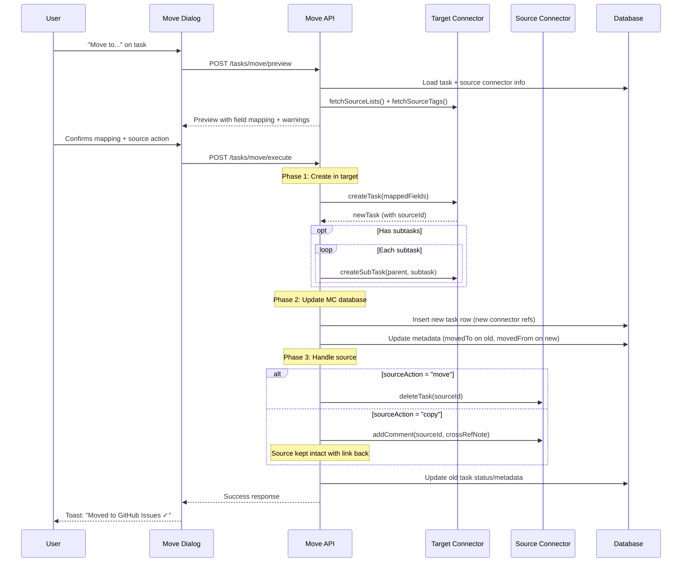

# Task Move — Cross-Source Migration

## Problem Statement

Tasks often start their life in one source (e.g. a quick-capture MS Todo item) but later need to "graduate" to a different source (e.g. a GitHub Issue for tracked development work). Today the user must manually recreate the task in the target, copy details, and close/delete the original — a tedious, error-prone process that breaks traceability.

**Core use cases:**

1. **Todo → GitHub Issue** — quick capture escalates to tracked development work
2. **Todo → Different Todo List** — re-classify across connector instances (personal → work)
3. **GitHub Issue → Todo** — de-escalate/capture a reminder without issue overhead
4. **Any writable source → Any writable source** — general-purpose migration

## Design Principles

1. **Guided, not magic** — Show the user how every field will be mapped or preserved before executing.
2. **Capability-aware** — Respect each connector's read/write/capability flags. Only offer valid targets.
3. **Preserve provenance** — Keep a cross-reference link between source and target for audit trail.
4. **Lossless by default** — Use native fields first, reversible labels or embedded metadata second, and Mission Control storage as the final fallback.
5. **Fail closed** — Create in target first and remove the source only after all metadata, attachments, and subtasks are preserved. Stop the operation if preservation fails.

---

## Scope: Cross-Source Only

**Same-source moves (e.g. MS Todo list → list, GitHub repo → repo) already work natively** via the existing `moveTaskToList` and GitHub Transfer APIs. This design covers only the **cross-source** case where a task migrates between different connector types (e.g. MS Todo → GitHub Issues). The UI should detect same-source targets and delegate directly to the native move path — no field mapping wizard needed.

---

## Capabilities & Constraints

### Connector Eligibility Matrix

| Connector | Can be SOURCE | Can be TARGET | Notes |
|-----------|:---:|:---:|-------|
| Microsoft Todo | ✅ | ✅ | Full read/write; multiple lists |
| GitHub Issues | ✅ | ✅ | Requires list (repo) selection |
| Scout | ✅ | ❌ | Ingestion-only; produces tasks from external pushes |
| Custom REST | ✅ | ✅ | If write capability enabled |
| Outlook Calendar | ✅ | ❌ | Read-only |
| Outlook Email | ✅ | ❌ | Read-only |
| RyMessage | ✅ | ❌ | Read-only |
| Home Assistant | ✅ | ❌ | Read-only |
| Document Intelligence | ✅ | ❌ | Read-only |
| Local | ✅ | ❌ | Local-only tasks; no external source lists |
| Monarch Money | ❌ | ❌ | Alerts only, no tasks |

**Rule:** A connector can be a *source* if it has `capabilities.read = true` and produces tasks. A connector can be a *target* if it has `capabilities.taskCreate = true`.

### Context Menu Visibility Rules

The "Move task to…" context menu (desktop right-click / mobile action sheet) follows these rules:

| Condition | Same-source list picker | "Move to another source…" |
|-----------|:-:|:-:|
| `canWrite` + same-source lists exist | ✅ Shown (grouped by list group, sorted by `sortOrder`) | ✅ Shown |
| `canWrite` + no same-source lists (e.g. local tasks) | ❌ Hidden | ✅ Shown |
| `!canWrite` (read-only connector, e.g. scout, outlook-email) | ❌ Hidden | ✅ Shown |
| No `onMoveToSource` action + no same-source lists | ❌ Hidden | ❌ Hidden (entire menu hidden) |

**Implementation:** The guard condition is `(hasSameSourceLists && canWrite) || !!actions.onMoveToSource`. When `canWrite` is false, same-source lists are passed as `[]` to the submenu so only the cross-source escape hatch renders.

**Task Detail Panel:** The inline "Move to list" dropdown requires `canWrite` and same-source lists. The "Move to source…" button is always visible when writable target connectors exist (no `canWrite` gate).

### Same-Source List Grouping

When the context menu shows same-source lists, they are grouped by **List Group** and sorted by:
1. Groups sorted by `sortOrder`, then `name`
2. Lists within each group sorted by `sortOrder`, then `name`
3. Ungrouped lists appear last

Group headers use uppercase, semibold styling. Grouped list items are indented further than ungrouped items. The same grouping is applied in both the desktop context menu and the mobile action sheet.

### Field Mapping Compatibility

Not all fields exist in all sources. The move flow must handle:

| Field | MS Todo | GitHub Issues | Custom REST | Behavior on Mismatch |
|-------|:---:|:---:|:---:|------|
| title | ✅ | ✅ | ✅ | Always maps 1:1 |
| description/body | ✅ (text) | ✅ (Markdown) | varies | Preserve content verbatim; rendering may differ |
| status | ✅ | ✅ (open/closed) | varies | Map to target's status model |
| priority | ✅ (1-9) | ✅ (canonical labels) | varies | Convert to a reversible label or preserve in Mission Control |
| effort | ❌ | ✅ (canonical labels) | varies | Convert to `effort:1`–`effort:5` or preserve in Mission Control |
| due date | ✅ | ❌ | varies | Preserve in Mission Control |
| subtasks | ✅ (checklist) | ✅ (sub-issues) | ❌ | Create rich subtasks or embed their metadata in the parent description |
| tags/labels | ✅ (categories) | ✅ (labels) | varies | Write remotely where supported and always preserve associations locally |
| assignee | ✅ | ✅ | varies | Apply matching identity remotely and preserve the original value locally |
| attachments | ✅ | ❌ | varies | Upload when supported; otherwise retain content in Mission Control |
| schedules/planning | ❌ | ❌ | varies | Preserve schedule, duration, recurrence, reminders, and project membership in Mission Control |

---

## User Flow

### Entry Points

1. **Task context menu** → "Move task to…" submenu (desktop right-click)
   - Shows same-source list picker (if writable + lists exist) and "Move to another source…"
   - For read-only connectors, only "Move to another source…" appears
2. **Mobile action sheet** → "Move task to…" → sub-view with same rules as above
3. **Task detail panel** → "Move to list" inline dropdown (same-source, writable only)
4. **Task detail panel** → "Move to source…" button (cross-source, always visible)
5. **AI Assistant** → "move this to GitHub" natural language command
6. **Bulk selection** → "Move N tasks to..." (batch)

### Guided Flow (Step-by-Step)

```
┌─────────────────────────────────────────────────┐
│  Step 1: Choose Destination                      │
│                                                  │
│  Moving: "Set up CI pipeline for project X"      │
│  From: Microsoft Todo (Personal)                 │
│                                                  │
│  ┌─────────────────────────────────────┐        │
│  │ 🐙 GitHub Issues                     │        │
│  │    ├── rsocko/mission-control        │        │
│  │    ├── rsocko/other-repo             │        │
│  │    └── org/team-repo                 │        │
│  │ ☑️  Microsoft Todo (Work)             │        │
│  │    ├── Development                   │        │
│  │    └── Sprint Backlog                │        │
│  └─────────────────────────────────────┘        │
│                                                  │
│  Only showing connectors that support writes     │
└─────────────────────────────────────────────────┘

┌─────────────────────────────────────────────────┐
│  Step 2: Review Field Mapping                    │
│                                                  │
│  Target: GitHub Issues → rsocko/mission-control  │
│                                                  │
│  ✅ Title: "Set up CI pipeline for project X"    │
│  ✅ Description: (converted to Markdown)         │
│  ⚠️ Priority "High" → label "priority:high"     │
│  ⚠️ Due date 2026-08-01 → dropped (no support) │
│  ✅ Tags: #devops → label "devops"              │
│  ⚠️ Subtasks (3) → created as sub-issues       │
│                                                  │
│  ⚠️ = requires confirmation or has lossy mapping │
│                                                  │
│  ┌─ Additional fields (target-specific) ──────┐ │
│  │ Assignee: [ rsocko          ▾ ]            │ │
│  │ Labels:   [ CI, devops      ▾ ]            │ │
│  │ Milestone:[ v2.0            ▾ ]            │ │
│  └────────────────────────────────────────────┘ │
└─────────────────────────────────────────────────┘

┌─────────────────────────────────────────────────┐
│  Step 3: Source Handling                         │
│                                                  │
│  What should happen to the original task?        │
│                                                  │
│  ● Move (removes from source after creation)     │
│  ○ Copy (keeps original, creates linked copy)    │
│                                                  │
│  ☑ Add cross-reference link in metadata         │
│                                                  │
│  ┌─ 💡 Suggestion ──────────────────────────── │
│  │ This task has subtasks and active comments.  │
│  │ Consider "Copy" to maintain both contexts.   │
│  └──────────────────────────────────────────── │
│                                                  │
│  [ Cancel ]                    [ Move Task → ]  │
└─────────────────────────────────────────────────┘
```

---

## Data Model Additions

### Task Metadata — Move Provenance

Stored in the existing `metadata` JSON column on the `tasks` table:

```typescript
interface TaskMoveMetadata {
  movedFrom?: {
    taskId: string;            // MC internal ID of original
    sourceId: string;          // Original source's native ID
    connectorType: string;     // e.g. 'microsoft-todo'
    connectorInstanceId: string;
    sourceListName?: string;
    movedAt: string;           // ISO timestamp
  };
  movedTo?: {
    taskId: string;            // MC internal ID of new task
    sourceId: string;          // New source's native ID
    connectorType: string;
    connectorInstanceId: string;
    sourceListName?: string;
    movedAt: string;
  };
}
```

This approach avoids schema changes — metadata is already a JSON column.

### Move History Log (optional, future)

For auditing/undo, a dedicated table could track moves:

```sql
CREATE TABLE task_moves (
  id TEXT PRIMARY KEY,
  source_task_id TEXT NOT NULL,
  target_task_id TEXT NOT NULL,
  source_connector_type TEXT NOT NULL,
  target_connector_type TEXT NOT NULL,
  source_connector_instance_id TEXT NOT NULL,
  target_connector_instance_id TEXT NOT NULL,
  field_mapping JSON NOT NULL,       -- what was mapped/dropped
  source_action TEXT NOT NULL,       -- 'move' | 'copy'
  initiated_by TEXT NOT NULL,        -- 'user' | 'ai' | 'automation'
  created_at TEXT NOT NULL
);
```

---

## API Design

### `POST /api/tasks/move/preview`

Returns a preview of what a move would look like — field mapping, warnings, target-specific options.

**Request:**
```json
{
  "taskId": "mc-task-id",
  "targetConnectorInstanceId": "gh-connector-123",
  "targetSourceListId": "rsocko/mission-control"
}
```

**Response:**
```json
{
  "task": { "title": "...", "description": "..." },
  "fieldMapping": [
    { "field": "title", "status": "mapped", "sourceValue": "...", "targetValue": "..." },
    { "field": "priority", "status": "lossy", "sourceValue": "high", "targetValue": "label:priority-high", "warning": "Priority converted to label" },
    { "field": "dueDate", "status": "dropped", "sourceValue": "2026-08-01", "warning": "GitHub Issues has no native due date" }
  ],
  "targetOptions": {
    "availableLabels": ["bug", "feature", "devops"],
    "availableMilestones": [{ "id": "1", "title": "v2.0" }],
    "availableAssignees": ["rsocko"]
  },
  "subtasks": {
    "count": 3,
    "strategy": "sub-issues",
    "warning": null
  }
}
```

### `POST /api/tasks/move/execute`

Performs the actual move operation.

**Request:**
```json
{
  "taskId": "mc-task-id",
  "targetConnectorInstanceId": "gh-connector-123",
  "targetSourceListId": "rsocko/mission-control",
  "fieldOverrides": {
    "labels": ["devops", "priority-high"],
    "assignee": "rsocko",
    "milestone": "1"
  },
  "subtaskStrategy": "move-as-sub-issues",
  "sourceAction": "move",
  "addCrossReference": true
}
```

**Response (201):**
```json
{
  "newTaskId": "mc-new-task-id",
  "newSourceId": "rsocko/mission-control#42",
  "sourceAction": "move",
  "subtasksMoved": 3,
  "warnings": ["Due date was not transferred"]
}
```

---

## Execution Logic



---

## Error Handling & Rollback

| Failure Point | Recovery Strategy |
|---------------|-------------------|
| Target `createTask` fails | Return error immediately. No data loss. |
| Subtask creation partially fails | Report which subtasks moved; let user retry remaining |
| Source `deleteTask` fails (move mode) | Target already created. Mark source action as "pending_cleanup". Show warning. Retry on next sync. |
| Network timeout during execute | Idempotency key on request. Safe to retry. |

**Key principle:** We never delete/complete the source *before* confirming the target was created successfully.

---

## Subtask Strategies

When the source task has subtasks and the target supports them:

| Strategy | Behavior |
|----------|----------|
| `move-as-sub-issues` | Each subtask becomes a sub-task/sub-issue in the target |
| `flatten-to-checklist` | Subtasks become a markdown checklist in the description |
| `move-individually` | Each subtask becomes a top-level task (batch move) |
| `drop` | Subtasks are not transferred (with explicit warning) |

When the target does NOT support subtasks:
- Default to `flatten-to-checklist`
- Warn user about the lossy conversion

---

## Format Conversion Rules

### Description/Body

| Source Format | Target Format | Conversion |
|---------------|---------------|------------|
| HTML (MS Todo) | Markdown (GitHub) | Use turndown/html-to-markdown |
| Markdown (GitHub) | HTML (MS Todo) | Use marked/markdown-to-html |
| Plain text | Any | Pass through |

### Priority Mapping

| MS Todo (1-9) | GitHub (labels) | Normalized (MC) |
|:---:|---|---|
| 1 | `priority:critical` | `urgent` |
| 3 | `priority:high` | `high` |
| 5 | `priority:medium` | `medium` |
| 7-9 | (no label) | `low` / `none` |

### Status Mapping

| MC Status | MS Todo | GitHub |
|-----------|---------|--------|
| `todo` | `notStarted` | open (no label) |
| `in_progress` | `inProgress` | open + `in-progress` label |
| `done` | `completed` | closed |

---

## UI Considerations

### Inline Preview Chip

After a successful copy, the original task shows a small chip:

```
☑ Set up CI pipeline    [→ GitHub #42]
```

Clicking the chip navigates to the moved version.

### Batch Moves

When multiple tasks are selected, the flow adapts:
- Step 1: Same (pick target connector + list)
- Step 2: Shows aggregate field warnings ("3 of 5 tasks have due dates that will be dropped")
- Step 3: Same source action applies to all

### Keyboard-Driven Quick Move

For power users, the command palette supports:
```
> move to github rsocko/mission-control
> move to todo "Sprint Backlog"
```

---

## Native Transfer: GitHub Repo → Repo

GitHub supports a native **Transfer Issue** API (`POST /repos/{owner}/{repo}/issues/{issue_number}/transfer`) that moves an issue between repos within the same owner/org. This preserves full history (comments, reactions, timeline events, cross-references) in a way our create-then-delete flow cannot replicate.

**When to use native transfer:**
- Source connector = `github-issues`
- Target connector = `github-issues` (same connector instance)
- Source and target repos share the same GitHub owner/org

**Behavior:**
- The preview step detects this scenario and shows a "Native Transfer" badge with explanation: *"GitHub will transfer this issue with full history intact."*
- Labels that don't exist in the target repo are silently dropped by GitHub — we warn about this in the preview.
- Milestones don't transfer (different per-repo) — we warn and offer to assign a target milestone.
- Assignees transfer only if they have access to the target repo.

**API integration on our connector:**

```typescript
// Added to IConnector (optional method)
transferTask?(sourceId: string, targetSourceListId: string): Promise<{ newSourceId: string }>;
```

The execute flow checks: if both source and target are GitHub repos on the same instance, call `transferTask` instead of the generic create+delete path. This gives the user a strictly better outcome with zero data loss.

**Fallback:** If repos are on different GitHub instances (e.g. personal vs. enterprise), or if the transfer API fails (permissions, cross-org), we fall back to the standard create-in-target flow with an explanatory warning.

---

## Relationship to Existing Features

| Feature | Relationship |
|---------|------|
| **Goal Promotion** | Promotion creates a *project* from a task. Move transfers a task between sources. Different intent, but similar "guided wizard" UX pattern. |
| **moveTaskToList** (IConnector) | Existing method moves within the *same* connector (e.g. MS Todo list → list). Already works natively today — this design focuses only on the **cross-source** orchestration layer above it. |
| **GitHub Transfer API** | Native repo-to-repo issue transfer. We delegate to this when both source/target are GH repos on the same owner — preserves full history, comments, and timeline. |
| **Sync Engine** | The moved task in the target connector will be picked up on next sync. Move should set `syncStatus: 'synced'` immediately since we just created it. |
| **Smart Score** | Score recomputes on the new task. Cross-reference metadata may inform scoring ("recently promoted = higher intent"). |

---

## Future Extensions

1. **Move templates** — Save common move paths (e.g. "Todo → GitHub/mission-control with devops label") as one-click actions
2. **Auto-promote rules** — "If a Todo tagged #code has been in-progress > 3 days, suggest moving to GitHub"
3. **Undo** — Reverse a move within N seconds (toast with undo button, leveraging the move history log)
4. **AI-suggested destination** — Based on task content, suggest which repo/list it belongs in
5. **Linked task view** — Show the full move chain for tasks that have migrated across sources

---

## Copy Mode (with Cross-Reference)

When the user selects **Copy** instead of Move, we create the task in the target but keep the original alive. This is a first-class mode — Move/Copy are universally understood semantics. Copy serves a real workflow: tracking the same work in two contexts (e.g. a Todo reminder + a GH issue for dev tracking).

**Default is Move.** Copy is offered but not the default. The UI proactively suggests Copy when heuristics indicate it's the better choice:
- Source task has active comments or rich history
- Source task has subtasks that are partially complete
- Source and target are both writable and the user frequently references both
- Task is tagged with a project that spans multiple sources

**Cross-reference comments on source:**

When "Link" is chosen, we automatically add a comment/note on the **source** task to create a visible breadcrumb:

| Source Type | Comment Format |
|-------------|----------------|
| MS Todo | Appends to body: `\n\n---\n🔗 Linked to GitHub Issue: rsocko/mission-control#42` |
| GitHub Issue | Posts comment: `Linked copy created in Microsoft Todo (Personal) → "Sprint Backlog" list. Tracked in both locations.` |
| Custom REST | Appends to description (if writable) |

The target task also gets a reciprocal note:
- GitHub: comment `Created from Microsoft Todo task. Original: [link if deep-linkable]`
- MS Todo: body append `🔗 Originally from GitHub: rsocko/mission-control#42`

**Linked task behavior:**
- Both tasks show a "🔗 Copied" chip in MC's task list view
- Clicking the chip shows the counterpart
- Changes are **not** auto-synced between copies (they diverge intentionally) — but a future enhancement could offer "sync status" between linked pairs

---

## Open Questions

1. **How do we handle sync conflicts?** If the source task changes between preview and execute?  
   → Proposed: re-fetch at execute time, abort if materially changed, let user re-preview.

2. **Should cross-referenced tasks be visually grouped in list views?**  
   → Lean toward a subtle chip/icon rather than grouping to avoid clutter.

3. **Batch move limit?** Moving 50+ tasks at once could hit API rate limits.  
   → Propose queued execution with progress indicator for >10 tasks.

4. **Copied task staleness** — Should we surface a warning if copied tasks drift significantly (one completed, other still open)?  
   → Lean toward a periodic "copy health" check in the insights feed.
