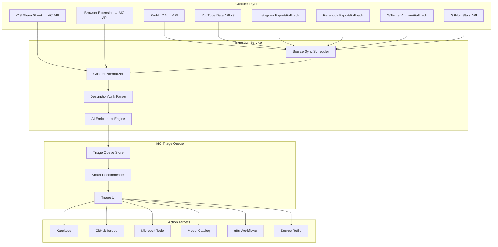
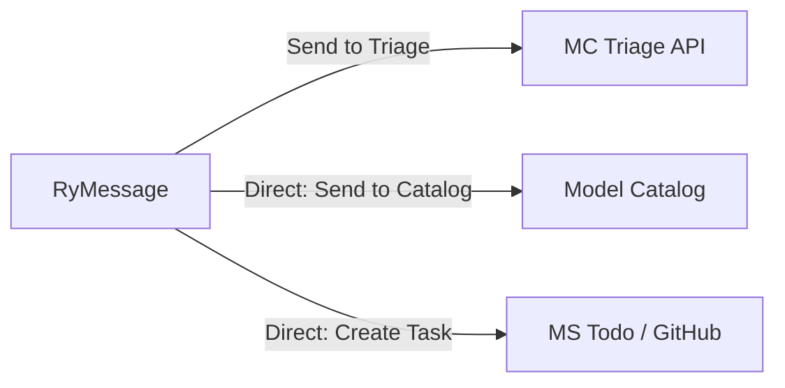
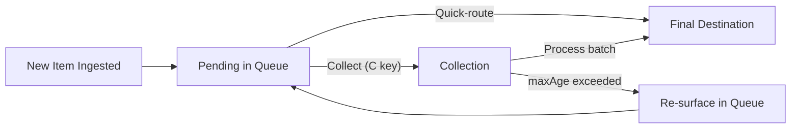

# Triage Queue — Feature Design Spec

## Summary

A unified **Triage Queue** in Mission Control that aggregates "saved for later" content from multiple platforms (Reddit, Instagram, Facebook, X/Twitter, GitHub Stars, plus an iOS Share Sheet and browser extension as universal capture tools) into a single prioritized inbox. The user processes items via fast keyboard-driven actions: send to Karakeep, create tasks, save to Model Catalog, dismiss, or trigger advanced workflows.

Triage is the review surface for **content**, not a second task inbox. Mission
Control's Inbox quick view contains records that are already tasks and need
clarification, placement, or metadata review. A triage item is source material:
the user may dismiss it, route it outside Tasks, or create zero, one, or
multiple tasks from it. Intelligent agents such as Scout must classify task
candidates separately from content before applying confidence-based routing.

---

## Problem Statement

Across a typical day, the user saves/bookmarks items across 5+ platforms. Each platform has its own "saved" bucket with no unified view, no reminders, and no way to act on items cross-platform. The result:

- **Items are forgotten** — saved content piles up with no resurfacing mechanism
- **Context switching** — processing requires opening each app individually
- **No triage workflow** — items are either "keep forever" or "forget forever" with nothing in between
- **No cross-system actions** — can't easily turn a Reddit post into a GitHub issue or a 3D model idea

---

## User Stories

| # | As a... | I want to... | So that... |
|---|---------|-------------|-----------|
| 1 | Power user | See all my saved/bookmarked content in one queue | I don't have to remember to check 7 different apps |
| 2 | Power user | Get smart suggestions on what to do with each item | I can triage faster without decision fatigue |
| 3 | Power user | Send items to Karakeep with one keypress | Good links are archived permanently |
| 4 | Power user | Create tasks in GitHub/MS Todo from saved items | Actionable items become tracked tasks |
| 5 | Power user | Save 3D model links to Model Catalog | Print ideas don't get lost in bookmarks |
| 6 | Power user | Dismiss items I no longer care about | The queue stays relevant |
| 7 | Power user | Capture things from my phone instantly | My workflow doesn't slow down when I'm mobile |

---

## Architecture



---

## Ingestion Sources (MVP)

### Tier 1 — API-Native (Automated Sync)

| Source | Method | Frequency | Confidence |
|--------|--------|-----------|-----------|
| **Reddit** | OAuth API (`/user/{username}/saved`) | Every 15 min | High — fully supported |
| **GitHub Stars** | REST API (`/user/starred`) | Every 30 min | High — already prototyped |
| **YouTube** | YouTube Data API v3 (`playlistItems` for Watch Later / Liked / custom playlists) | Every 30 min | High — official API |

### Tier 2 — Export/Fallback (Periodic Sync)

| Source | Method | Frequency | Confidence |
|--------|--------|-----------|-----------|
| **Instagram** | Meta data download + Instaloader fallback | Daily/manual trigger | Medium — fragile |
| **Facebook** | Accounts Center export + browser automation | Daily/manual trigger | Medium — fragile |
| **X/Twitter** | Archive for likes + `twitter-web-exporter` for bookmarks | Daily/manual trigger | Low — highest maintenance |

### Tier 3 — Universal Capture (Real-Time)

| Source | Method | Latency |
|--------|--------|---------|
| **iOS Share Sheet** | Custom iOS Shortcut → `POST /api/triage/capture` | Instant |
| **Browser Extension** | Chrome/Firefox extension → `POST /api/triage/capture` | Instant |

---

## Data Model

### TriageItem

```typescript
interface TriageItem {
  id: string;                        // UUID
  
  // Source metadata
  source_platform: SourcePlatform;   // 'reddit' | 'instagram' | 'facebook' | 'twitter' | 'github' | 'youtube' | 'ios_share' | 'browser_ext'
  source_id: string;                 // Platform-native ID for dedup
  source_url: string;                // Original URL on the platform
  captured_at: Date;                 // When saved on the source platform
  ingested_at: Date;                 // When MC ingested it
  
  // Content (normalized)
  title: string;
  description?: string;
  thumbnail_url?: string;
  content_type: ContentType;         // 'link' | 'image' | 'video' | 'text_post' | 'repo' | 'model_3d'
  canonical_url?: string;            // Resolved/cleaned destination URL
  extracted_links?: ExtractedLink[]; // Links parsed from description/body (YouTube, Reddit posts, etc.)
  raw_metadata: Record<string, any>; // Platform-specific fields
  
  // AI enrichment
  ai_summary?: string;               // 1-2 sentence summary
  ai_categories: string[];           // Inferred categories
  ai_suggested_actions: SuggestedAction[];
  ai_relevance_score: number;        // 0-100, based on user history
  ai_urgency: 'time_sensitive' | 'trending' | 'evergreen';
  
  // State
  status: TriageStatus;              // 'pending' | 'snoozed' | 'actioned' | 'dismissed'
  snoozed_until?: Date;
  actions_taken: ActionRecord[];
}

type ContentType = 'link' | 'image' | 'video' | 'text_post' | 'repo' | 'model_3d' | 'article' | 'product';

type TriageStatus = 'pending' | 'snoozed' | 'actioned' | 'dismissed';

interface SuggestedAction {
  action_type: ActionType;
  confidence: number;                // 0-1
  reason: string;                    // Why this suggestion
  pre_filled: Partial<ActionPayload>; // Pre-populated fields
}

type ActionType = 
  | 'save_karakeep'
  | 'create_task_github'
  | 'create_task_todo'
  | 'save_model_catalog'
  | 'trigger_workflow'
  | 'dismiss'
  | 'snooze';
```

---

## Smart Recommendations Engine

The AI enrichment engine scores and suggests actions based on:

### Signals

| Signal | Weight | Example |
|--------|--------|---------|
| **Content type match** | High | 3D model URL → suggest Model Catalog |
| **Historical patterns** | High | "User always Karakeeps Reddit links about Rust" |
| **Source subreddit/hashtag** | Medium | r/3Dprinting → Model Catalog; r/homeautomation → HA task |
| **Temporal relevance** | Medium | Sale ending soon → boost urgency |
| **Engagement signals** | Low | High upvotes/likes → slight relevance boost |
| **Content freshness** | Low | Old items decay in relevance score |

### Inference Rules (Configurable)

```yaml
rules:
  - match:
      content_type: repo
      source_platform: github
    suggest:
      - action: save_karakeep
        confidence: 0.9
        tags_from: [language, topics]
      - action: create_task_github
        confidence: 0.3
        when: topics_contain(['tool', 'cli', 'framework'])

  - match:
      content_type: model_3d
    suggest:
      - action: save_model_catalog
        confidence: 0.95
        mode: link_only

  - match:
      source_platform: reddit
      subreddit_in: ['3Dprinting', 'functionalprint', 'ender3']
    suggest:
      - action: save_model_catalog
        confidence: 0.8
      - action: save_karakeep
        confidence: 0.6
        list: "3D Printing"

  - match:
      source_platform: reddit
      subreddit_in: ['homeassistant', 'selfhosted']
    suggest:
      - action: create_task_todo
        confidence: 0.7
        list: "Home Automation"
      - action: save_karakeep
        confidence: 0.5
```

---

## Actions

### Multi-Action Support

**Items can be sent to multiple destinations in one triage pass.** This is a core design principle — triage doesn't mean "pick one place." Common combos:

- Save to Karakeep **AND** create a Todo task (bookmark it + remind yourself to act)
- Save to Model Catalog **AND** Karakeep (capture the idea + archive the source)
- Create a GitHub Issue **AND** save to Karakeep (track the work + save the reference)

**UX for multi-action:**
- Each action button works independently — pressing `K` saves to Karakeep but does NOT dismiss the item
- Item stays in "pending" until explicitly dismissed or snoozed
- A **checkmark appears** next to each completed action on the card (e.g., ✓ Karakeep, ✓ Todo)
- The item card transitions to an "actioned" state showing what was done, with a final "Done / Dismiss" to clear it
- Shortcut: `Shift+Enter` = "execute all suggestions and dismiss"

### Zero-to-Many Task Extraction

A single content item may contain several independent actions, especially for
email threads, meeting notes, documents, and agent-curated research. Triage
supports extracting candidate actions and allowing the user to create any
subset:

- Zero tasks when the content is reference-only, dismissed, or routed elsewhere.
- One task for a single concrete next action.
- Multiple tasks when the source contains distinct commitments or follow-ups.

Every created task retains provenance back to the triage item and its original
source identity. Each extracted action uses a stable child identity so retrying
extraction or creation does not duplicate that task. Creating one task does not
implicitly dismiss the content or prevent additional tasks from being created.

### Suggestions, Confirmation, and Autonomy

AI suggestions have three explicit execution states:

| State | Triage behavior |
|---|---|
| `recommend` | Display the suggestion, confidence, reasoning, destination, and expected effect |
| `confirm` | Prepare the exact operation and expose a prominent one-tap or conversational confirmation |
| `execute` | Run only an explicitly allowlisted, scoped, low-risk action and record the result |

A high-confidence suggestion should be faster to accept, not silently more
powerful. Strong suggestions use a primary CTA that states the effect, such as
`Create 3 tasks`, `Save to Karakeep`, or `Snooze until Monday`. Confirmation
must bind to the displayed proposal so a changed payload requires new approval.

Default autonomy boundaries:

- Classification, tagging, collection assignment, and bounded snooze may be
  eligible for opt-in autonomous execution.
- Creating open tasks may be enabled by an explicit Scout landing policy.
- Creating multiple tasks from content defaults to one confirmation over a
  previewable proposal.
- Completion, cancellation, dismissal, deletion, external writes, messaging,
  purchases, and dispatch to agents always require confirmation unless a
  separate user-authored automation policy explicitly permits them.
- Sensitive, ambiguous, or `reviewRequired` items cannot auto-execute.

Executed actions need durable history, idempotency, clear failure reporting,
and undo where the destination supports it. Confidence alone never grants
execution authority.

```
┌─────────────────────────────────────────────────────┐
│ ✓ Saved to Karakeep → "3D Printing" list            │
│ ✓ Created Todo → "3D Printing" / "Print snap case"  │
│                                                     │
│ [Done ✓]  [Undo last]  [+ More actions]            │
└─────────────────────────────────────────────────────┘
```

### Overriding Suggestions

When the AI suggestion isn't what you want:

1. **Ignore it** — just press a different action key. Suggestions are hints, not gates.
2. **Manual target selection** — pressing `T` (Task) opens a quick picker:
   - Shows inferred target with `(suggested)` label
   - Full list of available targets below (all Todo lists, GitHub repos, etc.)
   - Type-to-filter for fast selection
   - System learns from overrides to improve future suggestions
3. **Karakeep list override** — pressing `K` with `Shift` opens a list picker instead of using the inferred list
4. **"More actions" overflow** — `Tab` key reveals all possible actions including n8n workflows, custom handlers, etc.

The system **learns from overrides**: if you consistently route r/homeassistant items to "Home Automation" instead of the suggested "Self-Hosted," it adjusts the rule confidence.

### Quick Actions (One-Key)

| Key | Action | Behavior |
|-----|--------|----------|
| `K` | Save to Karakeep | Creates bookmark with auto-inferred tags + list |
| `Shift+K` | Karakeep (pick list) | Opens list picker before saving |
| `T` | Create Task | Opens inline task picker (pre-selects target system + list) |
| `M` | Save to Model Catalog | Captures as Idea in Model Catalog sidecar |
| `C` | Collect | Add to a Collection (interim holding stage) |
| `D` | Dismiss | Marks as dismissed, removes from queue |
| `S` | Snooze | Reschedule (1h, tomorrow, next week, custom) |
| `Enter` | Accept AI suggestion | Executes the top-confidence suggestion |
| `Shift+Enter` | Accept ALL suggestions | Executes all suggestions + dismiss |
| `↑` / `↓` | Next / Prev item | Navigate queue (stream/focus mode) |
| `←` / `→` / `↑` / `↓` | Navigate grid | Navigate cards (gallery mode) |
| `G` | Toggle Gallery | Switch between Stream ↔ Gallery view |
| `Space` | Expand/Preview | Toggle expanded view inline |
| `O` | Open in browser | Opens source URL in new tab |
| `R` | Refile in source | Refile/re-categorize in original platform |
| `Tab` | More actions | Show all available actions overflow |

### Extended Actions

| Action | Target | Details |
|--------|--------|---------|
| **Save to Karakeep** | Karakeep API | Auto-tag from content, assign to list based on rules |
| **Create GitHub Issue** | GitHub API | Infer repo from content, pre-fill title/body |
| **Create MS Todo Task** | MS Graph API | Infer list (e.g., "Home Improvement", "3D Printing") |
| **Save to Model Catalog** | Model Catalog sidecar | Capture as Idea, optionally add to print queue |
| **Refile in Source** | Platform API | Move to a different collection/folder in the source platform |
| **Trigger n8n Workflow** | n8n webhook | Pass normalized item payload, user picks workflow |
| **Custom Code Action** | User-defined scripts | Run a custom handler (e.g., "download media and archive") |

### Task Creation Intelligence

When creating a task, the system infers:

| Field | Inference Method |
|-------|-----------------|
| **Target system** | Content type + historical patterns (repos → GitHub, home stuff → Todo) |
| **List/Project** | Category mapping rules + NLP on title/description |
| **Title** | Cleaned content title or AI summary |
| **Body** | Source URL + description + any AI context |
| **Priority** | Urgency signal from enrichment |
| **Tags** | Platform tags/topics + AI categories |

User can always override any inferred field before confirming.

---

## Dismiss & Re-Triage Prevention

### How Dismiss Works

Dismissed items are **soft-archived**, not deleted:

```typescript
interface DismissedItem {
  item_id: string;
  dismissed_at: Date;
  dismiss_reason?: 'not_relevant' | 'already_handled' | 'batch_dismiss' | 'expired';
  source_platform: SourcePlatform;
  source_id: string;            // Used for dedup — never re-ingest this
  canonical_url?: string;       // Secondary dedup key
}
```

### Dedup Contract

Once an item is dismissed (or actioned), it is **never re-ingested**:

1. **By source ID** — `reddit:t3_abc123` dismissed → that Reddit post never reappears even if it's still in your "saved" list
2. **By canonical URL** — if you dismiss a Thingiverse link from Reddit, and the same URL appears in a Twitter bookmark later, it's auto-suppressed (shown as "previously dismissed" if you dig into history)
3. **TTL** — Dismissed items are retained for 90 days for dedup purposes, then hard-deleted (the source ID remains in a lightweight blocklist indefinitely)

### Viewing Dismissed History

- Sidebar filter: "Dismissed" shows dismissed items with date + reason
- Search works across all statuses including dismissed
- "Undo dismiss" available for 90 days
- Analytics: "You dismissed 45 items this month — 80% were from r/memes (consider removing that sync?)"

---

## Source Refile (Write-Back)

Some platforms support moving saved items between collections/folders. MC can optionally write back:

| Platform | Refile Capability | Method |
|----------|------------------|--------|
| **Instagram** | Move between Saved Collections | ⚠️ No official API — would require fallback tool |
| **Reddit** | Unsave / move between multireddits | ✅ OAuth API supports `unsave` |
| **YouTube** | Move between playlists / remove from Watch Later | ✅ YouTube Data API v3 |
| **Facebook** | Move between Saved Collections | ⚠️ No official API |
| **GitHub** | Remove star / add to GitHub List | ✅ REST API |
| **X/Twitter** | Remove bookmark | ⚠️ No official API for bookmarks |

### Refile UX

When pressing `R` (Refile):
1. Shows available collections/folders from the source platform
2. User picks target collection (or "Remove from saved")
3. MC executes the API call
4. Item is updated locally to reflect new location

**Use case**: "I saved this Instagram post to my general Saved — now I want it in my '3D Printing Ideas' collection."

**Practical note**: Since Instagram/Facebook don't have APIs for this, the MVP refile would only work for Reddit, GitHub, and YouTube. Others would show "Refile not available for this platform."

---

## YouTube Integration & Description Parsing

YouTube is a **Tier 1** source because the Data API v3 gives full access to:
- Watch Later playlist
- Liked Videos playlist
- Any custom playlist (e.g., "To Review", "Print Ideas")

### YouTube-Specific Enrichment

YouTube video descriptions are gold mines of linked resources. The AI enrichment engine performs **deep description parsing**:

```typescript
interface YouTubeEnrichment {
  video_id: string;
  channel_name: string;
  duration_seconds: number;
  view_count: number;
  
  // Parsed from description
  extracted_links: ExtractedLink[];
  chapters?: VideoChapter[];
  affiliate_links_detected: boolean;
}

interface ExtractedLink {
  url: string;
  label?: string;                    // Text around the link or AI-inferred label
  category: LinkCategory;            // Classified by AI
  confidence: number;
  position_in_description: number;   // For ordering
}

type LinkCategory = 
  | '3d_model'        // Thingiverse, Printables, MakerWorld links
  | 'github_repo'     // GitHub repository links
  | 'product'         // Amazon, AliExpress, direct shop links
  | 'tool_software'   // Software download / SaaS links
  | 'tutorial'        // Blog posts, docs, other video links
  | 'social'          // Creator's social links (less relevant)
  | 'sponsor'         // Sponsor/affiliate (flag but lower priority)
  | 'other';
```

### How Description Parsing Works

1. **Fetch full description** via YouTube Data API v3 (`snippet.description`)
2. **Extract all URLs** with regex + handle YouTube's shortened formats
3. **Classify each link** using AI:
   - Domain heuristics (thingiverse.com → `3d_model`, github.com → `github_repo`)
   - Context from surrounding text ("Get the STL here:" → `3d_model`)
   - Affiliate pattern detection (Amazon associate tags, bit.ly tracking)
4. **Surface sub-items** — each high-value extracted link can become its own triage suggestion

### YouTube Triage Card UX

A YouTube video card in the triage queue shows:

```
┌─────────────────────────────────────────────────────────┐
│ 🎬 YouTube · Watch Later · 12h ago              Score 85│
│                                                         │
│ [thumbnail]  "Building a Smart Home Dashboard with      │
│              ESPHome + E-Ink Display"                    │
│              @TechWithTim · 23:14 · 45k views           │
│                                                         │
│ 📎 Description Links (4 detected):                      │
│   🧊 printables.com/model/892341 — E-ink case STL      │
│   💻 github.com/techwt/esphome-eink — Source code       │
│   🛒 amazon.com/dp/B09X... — Waveshare 7.5" display    │
│   📄 esphome.io/components/... — Docs reference         │
│                                                         │
│ 💡 Suggested:                                           │
│   Save to Model Catalog (STL link) — 90%                │
│   Karakeep → "Home Automation" — 75%                    │
│   Todo: "Build e-ink dashboard" → "Home Automation" 60% │
│                                                         │
│ [M] Catalog  [K] Karakeep  [T] Task  [D] Dismiss       │
└─────────────────────────────────────────────────────────┘
```

**Key feature**: Individual description links can be triaged independently. Pressing `M` on the card would offer "Which link to catalog?" with the 3D model pre-selected.

---

## Content Preview & Expand

Users need to see more detail before deciding. The system supports three levels of preview:

### Level 1: Card Summary (Default)

What's shown on the compact card:
- Title (truncated to 2 lines)
- 1-2 line description/summary
- Thumbnail (72×72)
- Source metadata (subreddit, channel name, etc.)
- Extracted links count badge

### Level 1b: Inline Media Embed (Automatic)

For media-rich content types, the card automatically renders a richer preview using **oEmbed / link unfurling** rather than just a static thumbnail:

| Content Type | Inline Embed Behavior |
|-------------|----------------------|
| **YouTube / TikTok video** | Embedded player (click-to-play, muted autoplay on hover in Gallery mode) |
| **Instagram post/reel** | Instagram embed card (image carousel or video) via oEmbed |
| **X/Twitter post** | Embedded tweet card with media attachments |
| **GitHub repo** | Rich repo card with README excerpt, language bar, activity sparkline |
| **3D Model (Printables/MakerWorld)** | Model thumbnail with angle rotation on hover (if available) |
| **Product link** | Product image + price + availability badge |

**Implementation approach:** Use `metascraper` or `unfurl.js` server-side to resolve oEmbed/Open Graph metadata at ingestion time. Store resolved embed data in `rawMetadata.embed`:

```typescript
interface EmbedMetadata {
  type: 'video' | 'rich' | 'photo' | 'link';
  provider_name: string;           // "YouTube", "Instagram", etc.
  thumbnail_url?: string;          // Best-quality thumbnail
  thumbnail_width?: number;
  thumbnail_height?: number;
  html?: string;                   // oEmbed HTML for iframe embed
  aspect_ratio?: number;           // For responsive sizing
  media_urls?: string[];           // Direct media URLs (images in carousel, etc.)
  duration_seconds?: number;       // For video content
  blurhash?: string;               // Placeholder while loading
}
```

**Performance considerations:**
- Embeds are resolved asynchronously post-ingestion (don't block capture) ✅ Implemented
- ~~Thumbnail `blurhash` is generated at ingest for instant placeholder rendering~~ → Deferred to Phase 3
- Video embeds use `loading="lazy"` and only initialize player on interaction ✅ Implemented (via `sandbox` + `loading="lazy"` on rebuilt iframes)
- Gallery mode uses thumbnail-only by default; embed activates on hover/click ✅ Implemented
- ~~Configurable: user can disable inline embeds globally or per-source~~ → Deferred to Phase 3

**Security considerations (implemented):**
- All embed HTML is sanitized at ingest: only `<iframe>` tags from trusted provider domains are preserved
- Rebuilt iframes include `sandbox="allow-scripts allow-same-origin allow-popups"` and `referrerpolicy="no-referrer"`
- SSRF protection blocks fetches to private networks, loopback, and cloud metadata endpoints
- YouTube embeds use `youtube-nocookie.com` privacy domain

### Level 2: Inline Expand (`Space` key)

Pressing `Space` expands the card **in place** without navigation:

- Full description/post text (scrollable, max ~500px height)
- Larger thumbnail / image gallery
- All extracted links with classifications
- Full YouTube description with parsed links highlighted
- Reddit: full post text + top comments
- Instagram: caption + tagged accounts
- For videos: embedded player (optional, configurable)

```
┌─────────────────────────────────────────────────────┐
│ [Expanded card - full height]                        │
│                                                     │
│ ┌─────────────────────────────────────────────────┐ │
│ │ [Large thumbnail / embedded video player]        │ │
│ │                                                 │ │
│ │         ▶  23:14                                │ │
│ └─────────────────────────────────────────────────┘ │
│                                                     │
│ Full description text here, including all the       │
│ details, links, etc. Scrollable if too long.        │
│                                                     │
│ ── Extracted Links ──────────────────────────────── │
│ 🧊 Printables: E-ink case STL        [→ Catalog]   │
│ 💻 GitHub: esphome-eink source        [→ Karakeep]  │
│ 🛒 Amazon: Waveshare display          [→ Todo]      │
│                                                     │
│ ── Actions ──────────────────────────────────────── │
│ [K] Karakeep  [M] Catalog  [T] Task  [D] Dismiss   │
└─────────────────────────────────────────────────────┘
```

### Level 3: Open in Browser (`O` key)

Opens the source URL in a new browser tab for full platform experience. Useful when you need to:
- Watch the actual video
- Read Reddit comments
- See Instagram in full resolution
- Check GitHub repo README

### Level 3b: Side Panel Preview (Future)

For desktop, a split-pane view where the right panel shows a mini browser/webview of the source content while the left panel keeps the triage queue visible. Similar to email preview panes.

### Preview Behavior by Content Type

| Content Type | Inline Expand Shows | Open Does |
|-------------|--------------------|-----------| 
| **Reddit post** | Full text + top 3 comments + all links | Opens reddit.com thread |
| **YouTube video** | Thumbnail + full description + parsed links + chapters | Opens youtube.com |
| **Instagram post** | Full caption + image(s) at medium resolution | Opens instagram.com |
| **GitHub repo** | README excerpt + stats + recent activity | Opens github.com repo |
| **X/Twitter** | Full tweet + thread (if applicable) + media | Opens x.com |
| **Generic link** | OG metadata + page excerpt (fetched) | Opens the URL |

### Layout: Triage Queue View

The triage queue is a new top-level nav item in MC. It uses a **card-stream** layout optimized for rapid sequential processing (think: email triage meets Tinder's decisiveness).

```
┌─────────────────────────────────────────────────────────────────────┐
│ ⚡ Mission Control          [Dashboard] [Kanban] [▶ Triage] [AI]    │
├──────────┬──────────────────────────────────────────────────────────┤
│ SOURCES  │  TRIAGE QUEUE                              12 pending    │
│          │                                                          │
│ ● All 47 │  ┌─────────────────────────────────────────────────────┐ │
│   Reddit  │  │ 🔥 r/3Dprinting · 2h ago                    Score 92│ │
│   IG      │  │                                                     │ │
│   FB      │  │ "This magnetic snap-fit case design is insane"      │ │
│   X       │  │ [thumbnail]  ─ Thingiverse link in comments         │ │
│   GitHub  │  │                                                     │ │
│   Shared  │  │ 💡 Suggested: Save to Model Catalog (95%)           │ │
│          │  │              Save to Karakeep (60%)                  │ │
│ ──────── │  │                                                     │ │
│ FILTERS  │  │ [K] Karakeep  [M] Catalog  [T] Task  [D] Dismiss   │ │
│          │  └─────────────────────────────────────────────────────┘ │
│ Pending  │                                                          │
│ Snoozed  │  ┌─────────────────────────────────────────────────────┐ │
│ Actioned │  │ ⭐ GitHub Star · 4h ago                     Score 78 │ │
│          │  │                                                     │ │
│ ──────── │  │ "valkey-io/valkey" — Redis fork, active dev          │ │
│ CONTENT  │  │ ★ 18.2k · Go · Last push: 2d ago                    │ │
│          │  │                                                     │ │
│ 🔗 Links  │  │ 💡 Suggested: Save to Karakeep (90%)                │ │
│ 🖼️ Media │  │              Create Task: "Evaluate Valkey" (45%)    │ │
│ 📦 Repos │  │                                                     │ │
│ 🎨 3D    │  │ [K] Karakeep  [M] Catalog  [T] Task  [D] Dismiss   │ │
│          │  └─────────────────────────────────────────────────────┘ │
│          │                                                          │
│          │  ┌─────────────────────────────────────────────────────┐ │
│          │  │ 📸 Instagram · 6h ago                       Score 65 │ │
│          │  │                                                     │ │
│          │  │ [saved reel thumbnail]                               │ │
│          │  │ "LED underglow desk setup tutorial"                   │ │
│          │  │                                                     │ │
│          │  │ 💡 Suggested: Create Todo Task (70%)                  │ │
│          │  │              list: "Home Office"                      │ │
│          │  └─────────────────────────────────────────────────────┘ │
└──────────┴──────────────────────────────────────────────────────────┘
```

### Interaction Modes

**1. Stream Mode (Default)** — Vertical card list, scroll through, act on any.

**2. Focus Mode** — Single item fills the viewport. Arrow keys cycle. Great for batch processing. Shows expanded preview + all action options.

**3. Batch Mode** — Multi-select with checkboxes, apply same action to many items (e.g., "dismiss all Facebook items older than 7 days").

**4. Gallery Mode** — Visual grid layout optimized for browsing media-rich content. Inspired by bookmark managers like Stasht that prioritize visual browsing over sequential processing.

#### Gallery Mode Details

Gallery mode presents items as a responsive CSS Grid with content-type-aware card templates:

```
┌──────────────────────────────────────────────────────────────────────┐
│ ⚡ Triage Queue    [Stream ▼] [Focus] [▶ Gallery] [Batch]     12 items│
├──────────────────────────────────────────────────────────────────────┤
│                                                                      │
│ ┌─────────────┐  ┌─────────────┐  ┌─────────────┐  ┌─────────────┐ │
│ │ ┌─────────┐ │  │ ┌─────────┐ │  │ ┌─────────┐ │  │ ┌─────────┐ │ │
│ │ │  🧊 3D  │ │  │ │  ▶ vid  │ │  │ │  📸 img │ │  │ │ ⭐ repo │ │ │
│ │ │ thumb   │ │  │ │  thumb  │ │  │ │  thumb  │ │  │ │  README │ │ │
│ │ └─────────┘ │  │ └─────────┘ │  │ └─────────┘ │  │ └─────────┘ │ │
│ │ snap-fit    │  │ ESPHome     │  │ LED desk    │  │ valkey-io/  │ │
│ │ case design │  │ E-Ink Dash  │  │ underglow   │  │ valkey      │ │
│ │ ─────────── │  │ ─────────── │  │ ─────────── │  │ ─────────── │ │
│ │ 🟢92 Reddit │  │ 🟢85 YT    │  │ 🟡65 IG    │  │ 🔵78 GH    │ │
│ │ [M] [K] [D] │  │ [M] [K] [T] │  │ [T] [K] [D] │  │ [K] [T] [D] │ │
│ └─────────────┘  └─────────────┘  └─────────────┘  └─────────────┘ │
│                                                                      │
│ ┌─────────────┐  ┌─────────────┐  ┌─────────────┐  ┌─────────────┐ │
│ │ ...         │  │ ...         │  │ ...         │  │ ...         │ │
│ └─────────────┘  └─────────────┘  └─────────────┘  └─────────────┘ │
└──────────────────────────────────────────────────────────────────────┘
```

**Card templates by content type:**

| Content Type | Thumbnail Treatment | Overlay |
|-------------|--------------------|---------| 
| **Video** (YouTube, IG Reel, TikTok) | Video thumbnail at 16:9, play button overlay | Duration badge bottom-right |
| **3D Model** | Model preview image or source thumbnail | 🧊 badge top-left |
| **Image** (Instagram post, screenshot) | Full-bleed image crop | Platform icon top-left |
| **Repository** | Language-colored header bar + stats | Star count badge |
| **Article/Link** | OG image or domain favicon enlarged | Reading time estimate |
| **Product** | Product image | Price / sale badge if detected |

**Gallery-specific behaviors:**
- Hover reveals full title + quick-action bar (fade-in, 150ms)
- Click opens Focus Mode for that item (full detail + actions)
- `G` key toggles between Stream ↔ Gallery views
- Respects same keyboard shortcuts when item is focused
- Masonry layout option for mixed-aspect-ratio content
- Configurable grid density: compact (5 cols), default (4 cols), spacious (3 cols)

### Triage Speed UX

The design optimizes for **items processed per minute**:

- **Zero-click suggestions**: Top AI suggestion is pre-highlighted. Hit `Enter` to accept.
- **Keyboard-first**: Every action has a single-key shortcut visible on the card.
- **Undo toast**: Every action shows a 5-second undo toast (Sonner) — encourages fast decisions.
- **Auto-advance**: After an action, next item auto-focuses (configurable).
- **Batch dismiss**: `Shift+D` dismisses all items below a relevance threshold.

---

## iOS Share Sheet Integration

### Setup

A custom iOS Shortcut that:
1. Accepts share sheet input (URL, text, image)
2. POSTs to MC API endpoint with auth token
3. Shows confirmation banner

### API Endpoint

```
POST /api/triage/capture
Authorization: Bearer <MC_TRIAGE_CAPTURE_KEY>

{
  "url": "https://...",
  "title": "Optional title override",
  "description": "Optional note or context",
  "sharedText": "Full shared text from the source app",
  "client": "ios",
  "sourcePlatform": "ios_share"
}
```

Field notes:
- `sourcePlatform` can also be set explicitly by the client; if omitted, the server infers it from `client`
- `sharedText` captures the raw text passed via the share sheet (may include the URL itself plus surrounding context)
- `title` is optional; if omitted, the server resolves it from the URL's hostname

### Response
```json
{
  "item": {
    "id": "uuid",
    "title": "Resolved page title",
    "status": "pending",
    "aiRelevanceScore": 72,
    "aiSuggestedActions": [...]
  }
}
```

---
## Browser Extension

Minimal Chrome MV3 extension (`clients/browser-extension/`):
- Click icon to open popup with page preview, optional note, and **Save to Triage** button
- `Ctrl+Shift+S` (`Cmd+Shift+S` on Mac) keyboard shortcut for instant capture without popup
- Configuration stored in `chrome.storage.sync` (API URL + capture key)
- Badge feedback: green `checkmark` on success, red `!` on error
- Filters `chrome://`, `edge://`, `about:` pages (cannot be captured)
- Same `POST /api/triage/capture` API as iOS share sheet
- Pending triage count badge on the toolbar icon (Phase 3)

---
## n8n Advanced Workflows

Items can trigger custom n8n workflows via webhook:

| Workflow | Trigger | Example Use |
|----------|---------|-------------|
| **Download & Archive** | User selects "Archive Media" | Downloads video/images, stores in NAS |
| **Cross-post to Notes** | User selects "Save to Obsidian" | Creates markdown note with metadata |
| **Price Watch** | Item detected as product link | Adds to price tracking workflow |
| **Share with Partner** | User selects "Share" | Sends formatted message via preferred channel |

Configuration:
```yaml
workflows:
  - id: archive-media
    name: "Archive Media"
    icon: "download"
    webhook_url: "https://n8n.local/webhook/archive-media"
    applicable_when:
      content_type_in: [video, image]
    payload_template: |
      { "url": "{{canonical_url}}", "title": "{{title}}" }
```

---

## Sync & Freshness

| Source | Sync Strategy | Dedup Key |
|--------|--------------|-----------|
| Reddit | OAuth poll every 15min, paginated | `reddit:{thing_id}` |
| GitHub Stars | REST poll every 30min | `github:star:{repo_full_name}` |
| YouTube | Data API v3 poll every 30min | `youtube:{video_id}` |
| Instagram | Manual trigger / daily cron | `instagram:{media_id}` |
| Facebook | Manual trigger / daily cron | `facebook:{saved_item_id}` |
| X/Twitter | Manual trigger / daily cron | `twitter:{tweet_id}` |
| iOS Share | Real-time push | `share:{url_hash}` |
| Browser Ext | Real-time push | `ext:{url_hash}` |

### Deduplication

Items are deduped by:
1. `source_platform` + `source_id` (exact platform match)
2. `canonical_url` normalization (same URL from different platforms)
3. Fuzzy title match + URL domain (catches reposts across platforms)

---

## Dashboard Integration

The triage queue surfaces on the MC dashboard as:

- **Badge on nav**: "Triage (12)" showing pending count
- **Dashboard widget**: "Triage Queue" card showing top 3 highest-relevance items with quick-action buttons
- **Alert generation**: If queue > 20 items or items > 3 days old without action → MC alert

---

## Phased Rollout

### Phase 1: Foundation
- Triage queue data model + API
- iOS Share Sheet capture endpoint
- Browser extension capture
- Basic UI (stream mode, manual actions only)
- GitHub Stars ingestion (reuse existing sync) ✅ — includes configurable scheduled auto-sync (#162)
- Reddit OAuth ingestion

### Phase 2: Visual Experience + Intelligence
- AI enrichment engine (summarize, categorize, score)
- Smart action suggestions
- Configurable inference rules
- Auto-advance + keyboard shortcuts
- **Gallery view mode** — responsive grid with content-type-aware card templates
- **View mode toggle** — Stream / Gallery / Focus switcher (`G` key)
- **Inline media embeds** — oEmbed resolution via `metascraper`/`unfurl.js`, thumbnail blurhash, lazy video players

### Phase 3: Full Source Coverage + Collections
- Instagram fallback ingestion
- Facebook fallback ingestion
- X/Twitter fallback ingestion
- Dedup across platforms
- **Collections** — interim holding stage with `C` key quick-add, sidebar section, staleness resurfacing
- **Auto-collections** — rule-based auto-grouping by content type/category
- **Collection batch processing** — "Route All" toolbar actions within collection view

### Phase 4: Advanced Actions + Polish
- Model Catalog integration
- n8n workflow triggers
- Batch mode
- Custom code actions
- "Triage Coach" — learns from your decisions, improves suggestions over time
- **Gallery enhancements** — masonry layout, configurable density, hover-to-play video
- **AI-suggested collections** — clustering of related pending items into proposed groups

---

## Success Metrics

| Metric | Target |
|--------|--------|
| Items triaged per session | > 20 in under 5 minutes |
| Suggestion acceptance rate | > 60% within 30 days |
| Queue staleness | < 5 items older than 3 days |
| Source coverage | All 7 sources ingesting within 90 days |
| Capture-to-triage latency | < 2 min for real-time sources |

---

## Open Questions

1. **Should dismissed items be permanently deleted or soft-archived?** (Recommend: soft-archive with 30-day TTL)
2. **Should the triage queue have a "daily digest" email/push?** (Recommend: yes, morning summary of top 5 items)
3. **Should Karakeep integration be bidirectional?** (i.e., items saved in Karakeep feed back as "already triaged")
4. **Rate limiting for social platform fallback tools** — acceptable risk tolerance?
5. **Should the browser extension also capture highlighted text as context?** (Recommend: yes)

---

---

## Design Decision: Why Mission Control, Not RyMessage?

### The Question

RyMessage already has:
- Multi-source inbox (iMessage, Reddit DMs, Printables, MakerWorld)
- Action Center with AI action extraction
- Task Provider architecture (MS Todo, Model Catalog adapters)
- Artifact Provider model for "send to" workflows
- Persisted extracted actions in SQLite

Should triage live in RyMessage instead?

### Recommendation: **Mission Control is the correct home.** RyMessage can be a *capture channel*.

### Reasoning

| Dimension | RyMessage | Mission Control |
|-----------|-----------|-----------------|
| **Core metaphor** | Conversations & messages | Tasks, decisions & execution |
| **Input shape** | Message streams from people/services | Discrete items requiring action |
| **User intent** | "What did people say to me?" | "What should I do next?" |
| **Interaction pattern** | Read → React → Reply | Evaluate → Decide → Route |
| **Time model** | Chronological message flow | Priority-ranked work queue |
| **Action scope** | Reply, create task from message | Route to any system, batch process |

### The Key Distinction

**RyMessage's Action Center** detects actions *embedded in conversations* — "Hey can you grab milk" becomes a todo. The user's primary activity is *reading messages* and occasionally extracting work.

**Triage Queue** is the inverse — the user's primary activity *is* deciding what to do with items. There's no conversation context. It's a work-processing UI, not a communication UI.

### Where RyMessage Fits

RyMessage remains a **capture channel** (like iOS Share Sheet):



- If someone sends you a cool link in iMessage → RyMessage's existing "Send to Model Catalog" or "Create Task" flows handle it **in context**.
- If you want to batch-process your Reddit saved items, Instagram saves, and GitHub stars → that's Mission Control Triage.
- RyMessage could optionally "forward to triage" for items the user doesn't want to act on immediately but doesn't want to lose.

### Summary

| Use Case | Correct System |
|----------|---------------|
| Friend sends a 3D model link in iMessage | RyMessage → "Send to Catalog" (existing) |
| You save 15 Reddit posts in a day, triage later | MC Triage Queue |
| You star 5 GitHub repos, decide what to do with them | MC Triage Queue |
| A message contains a deadline/task | RyMessage Action Center → Todo |
| You share a URL from Instagram via iOS | iOS Share Sheet → MC Triage API |
| Batch "dismiss all items older than 7 days" | MC Triage Queue |

The rule: **If the item originated from a conversation and has conversational context, RyMessage handles it. If the item is a saved/bookmarked thing awaiting decision, Mission Control handles it.**

---

## Collections (Interim Holding Stage)

### Problem

The current triage model is binary: items are either "pending" (awaiting decision) or immediately routed to a final destination (Karakeep, Todo, Model Catalog, etc.). This misses a common pattern: **"I know this is valuable, but I'm not ready to decide where it goes yet."**

Stasht and similar bookmark managers solve this with folders/collections as a lightweight grouping mechanism between capture and final routing.

### Design: Triage Collections

Collections are **temporary holding lanes** within the triage queue. They're NOT a permanent storage destination — they're a staging area that helps batch related items for later processing.

```typescript
interface TriageCollection {
  id: string;
  name: string;                    // "3D Print Ideas This Week", "Home Lab Research"
  icon?: string;                   // Emoji or icon identifier
  color?: string;                  // Accent color for visual grouping
  createdAt: string;
  itemCount: number;
  autoRules?: CollectionAutoRule[]; // Optional: auto-add matching items
  maxAge?: number;                 // Days before items are surfaced for re-triage (default: 14)
}

interface CollectionAutoRule {
  match: {
    contentType?: ContentType[];
    sourcePlatform?: SourcePlatform[];
    categories?: string[];
    minRelevanceScore?: number;
  };
  autoAdd: boolean;                // Add matching items automatically
  notify: boolean;                 // Show badge when items auto-added
}
```

### Collection Lifecycle



1. **Item arrives** → sits in pending queue
2. **User presses `C`** → quick-picker shows existing collections + "Create new"
3. **Item moves to collection** → status becomes `collected`, removed from main pending view
4. **Later:** user opens a collection → sees all items grouped together → batch-processes them
5. **Staleness guard:** if items sit in a collection beyond `maxAge` (default 14 days), they resurface in the main queue with a "stale collection item" badge

### UX Integration

**Keyboard shortcut:** `C` — Collect (add to collection)

**Sidebar addition:**
```
SOURCES
● All Sources     12
  Reddit           4
  ...

COLLECTIONS         ← new section
📦 3D Print Ideas   5
🏠 Home Lab Research 3
🛒 Deals to Review  2
  + New Collection

STATUS
● Pending          12
...
```

**Quick-add flow (pressing `C`):**
```
┌────────────────────────────────┐
│ Add to Collection              │
│ ───────────────────────────── │
│ 📦 3D Print Ideas         (5) │  ← recent/suggested first
│ 🏠 Home Lab Research       (3) │
│ 🛒 Deals to Review         (2) │
│ ───────────────────────────── │
│ + Create "___________"         │  ← type to create inline
└────────────────────────────────┘
```

**Collection view:**
- Opens in the same triage layout (stream or gallery mode)
- Shows all items in that collection
- Toolbar: "Route All → Karakeep" / "Route All → Todo" for batch processing
- Items can still be individually triaged with normal keyboard shortcuts

### Auto-Collections (Smart Folders)

Power users can define rules that auto-collect items:

```yaml
collections:
  - name: "3D Print Ideas"
    icon: "🧊"
    auto_rules:
      - match:
          content_type: [model_3d]
        auto_add: true
      - match:
          categories: ["3d-printing"]
          min_relevance_score: 60
        auto_add: true
        notify: true

  - name: "Home Lab Research"
    icon: "🏠"
    auto_rules:
      - match:
          categories: ["homelab", "self-hosted"]
        auto_add: true
```

### Why Collections ≠ Karakeep Lists

| Aspect | Triage Collections | Karakeep Lists |
|--------|-------------------|----------------|
| **Purpose** | Temporary staging before routing | Permanent archive/reference |
| **Lifetime** | Days to weeks (maxAge resurfaces) | Indefinite |
| **Metadata** | Full triage context (suggestions, score) | Bookmark metadata only |
| **Actions** | Full triage actions available | Read/organize only |
| **Mental model** | "I'll deal with these together soon" | "I might need this someday" |

Collections fill the gap between "act now" and "archive forever" — they're the "let me think about it" stage.

---

## Competitive Context: Stasht & Similar Tools

This triage queue design was informed by analysis of bookmark/save managers in the space, particularly **Stasht** (social media post saver). Key takeaways incorporated:

| Stasht Feature | Our Adaptation | Differentiator |
|---------------|----------------|----------------|
| Visual gallery with thumbnails | Gallery Mode (view mode 4) | We add AI scoring + action overlay |
| Folders/collections | Collections as interim holding stage | Auto-rules + staleness resurfacing |
| Cross-platform save (IG, TikTok, X, YT) | Multi-source ingestion architecture | We also ingest from APIs, not just manual save |
| Inline video/image preview | oEmbed inline embeds | We classify and suggest actions on embedded content |
| Share sheet "save for later" | iOS Shortcut + browser extension capture | Same, plus RyMessage as capture channel |
| Search by keyword/tag | FTS + semantic search + AI categories | Semantic understanding, not just keyword match |

**Where we exceed Stasht:**
- AI triage suggestions (Stasht is purely manual organize)
- Cross-system routing to actionable destinations (Stasht is a dead-end archive)
- Keyboard-driven batch processing (Stasht is tap-oriented mobile UX)
- Dedup across platforms (same URL from different sources detected)
- Staleness/urgency surfacing (items don't just pile up forgotten)

**Where Stasht's UX patterns inform us:**
- Visual density matters for media-heavy content → Gallery Mode
- Users want a "not yet decided" bucket → Collections
- Instant preview without leaving the app → Inline embeds
- Mobile share-to-app must be < 2 seconds → Optimized capture API

---

## See Also

- [Social Platform Saved Export Research](../../social-platform-saved-export/SUMMARY.md)
- [GitHub Starred → Karakeep Sync](../../github-starred-karakeep/README.md)
- [RyMessage: Message to Model Catalog](../../../computing/rymessage/docs/design/tasks/MESSAGE-TO-MODEL-CATALOG.md)
- [RyMessage: Action Center Persisted Actions](../../../computing/rymessage/docs/design/action-center/ACTION-CENTER-PERSISTED-ACTIONS-SPEC.md)
- [RyMessage: Artifact Provider Model](../../../computing/rymessage/docs/design/artifacts/ARTIFACT-PROVIDER-MODEL.md)
- [MC Future Integrations](./FUTURE-INTEGRATIONS.md)
- [MC PRODUCT.md — AI Triage roadmap item](../../PRODUCT.md)
