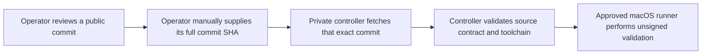

# iOS Release Handoff

Mission Control separates public iOS source from private build operations. This
document defines the public side of that boundary. It intentionally does not
identify runner hosts, accounts, signing assets, provisioning profiles, secret
names, or distribution credentials.

## Repository ownership

| Concern | Public Mission Control repository | Private release controller |
|---|---|---|
| Swift source and tests | Owns | Consumes an approved commit |
| Generated Xcode project | Owns | Verifies regeneration is clean |
| Xcode and XcodeGen requirements | Declares | Verifies before execution |
| Unsigned build contract | Declares in `ios/release-contract.json` | Validates and executes |
| Runner selection and operation | Does not control | Owns |
| Signing and provisioning | Does not contain | Owns when implemented |
| Archives and distribution | Does not perform | Owns when implemented |

The repositories are not connected by a submodule, mirror, reusable workflow,
or automatic synchronization. The public repository cannot trigger the private
controller.

## Pull-based handoff

The handoff identifier is a full Git commit SHA from the public repository. The
private controller fetches that exact commit into a temporary detached checkout.
It validates the expected project, scheme, destination, signing mode, generated
project, and audited source structure before running source code. A branch name
such as `main` is not a release input, and a later branch update cannot change
an already selected commit.

`ios/release-contract.json` is a closed, source-controlled declaration of the
unsigned build interface. It is not release authorization and cannot select a
runner, command, credential, or distribution destination.

## Current capability

The implemented controller path performs unsigned simulator generation, build,
and tests. It does not currently:

- create or retain an `.xcarchive` or `.ipa`;
- import signing identities or provisioning profiles;
- access App Store Connect credentials;
- upload to TestFlight; or
- submit an App Store release.

Those capabilities require a separately reviewed private design with isolated
signing, protected approval, temporary credential handling, immutable artifact
promotion, and failure recovery. Public source documentation must not imply that
this signed release path already exists.

## Changes that require controller review

The private controller fails closed when its audited source expectations no
longer match. Coordinate a controller review before attempting validation after
changing:

- `ios/release-contract.json`;
- `.xcode-version`, `Mintfile`, or the XcodeGen version;
- `project.yml` or the generated `MissionControl.xcodeproj`;
- project, scheme, simulator destination, or signing-mode declarations;
- build phases, scripts, package dependencies, entitlements, or target layout;
- production configuration interfaces; or
- any source file covered by controller content locks.

Ordinary public source changes remain public pull requests. The private
controller independently decides whether a reviewed public commit is eligible
to execute on its macOS runner.

## Public validation

Run the unsigned checks in
[Mobile iOS Device Validation](mobile-ios-device-validation.md) before handing a
commit to the private controller. A successful simulator run does not replace
physical-device validation or authorize distribution.

Keep all runner lifecycle instructions, build evidence, signing material,
provisioning details, release approvals, and distribution records in the private
release system.
