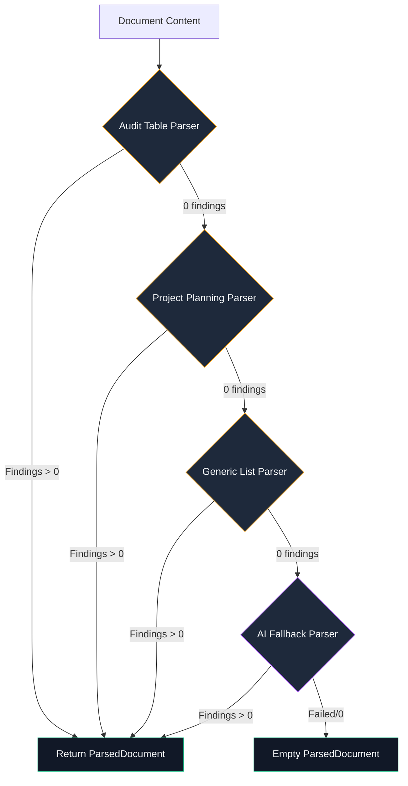

# Document Intake

A structured document parser that converts planning docs, audit reports, and task lists into Mission Control projects with issues, phases, and tags.

## Purpose

Paste or link a structured document → preview what will be created → execute to generate a full project with GitHub issues, phases, and tags. Eliminates manual task-by-task entry when migrating from planning docs.

## Layout

```
┌─────────────────────────────────────────────────────────────┐
│  Steps: [1. Input] → [2. Preview] → [3. Executing] → [4. Done] │
├─────────────────────────────────────────────────────────────┤
│                                                              │
│  Input Step:                                                 │
│  ┌─────────────────────────────────────────────────────────┐│
│  │  [Paste document content]                                ││
│  │  or                                                      ││
│  │  [Document URL]                                          ││
│  │                                                          ││
│  │  Project Name: ________  Repo: [dropdown]                ││
│  │                                [Analyze →]               ││
│  └─────────────────────────────────────────────────────────┘│
│                                                              │
│  Preview Step:                                               │
│  ┌─────────────────────────────────────────────────────────┐│
│  │  KPIs: [Findings: N] [Phases: N] [Tags: N] [Project: X] ││
│  │                                                          ││
│  │  Priority Groups    (expandable)                         ││
│  │  Proposed Phases    (expandable with finding details)    ││
│  │  Tags to Create     (editable add/remove)                 ││
│  │  Findings Table     (include toggle + finding details)    ││
│  │                                                          ││
│  │  [← Back]  [▷ Execute — Create N Tasks + Project]        ││
│  └─────────────────────────────────────────────────────────┘│
└─────────────────────────────────────────────────────────────┘
```

## Parsing Architecture

Document parsing uses a **cascade of parsers**, trying each in order until one produces results:



### Parser 1: Audit Table Format

Recognizes structured audit reports with:
- `## Priority N: Title` section headers
- Markdown tables with columns: `ID | Area | Issue | Impact | Suggested Fix | Effort`
- `## Recommended Fix Order` section with numbered phases

**Example input:**
```markdown
## Priority 1: Critical Issues
| ID | Area | Issue | Impact | Suggested Fix | Effort |
|---|---|---|---|---|---|
| SEC-1 | Auth | No rate limiting | Brute force | Add limiter | Low |
```

### Parser 2: Project Planning Format

Recognizes phased project plans with:
- `### Phase N — Name` or `### Phase N: Name` headers
- `- [ ]` / `- [x]` checklist items as work items
- `🟠 P1` style priority markers in the title
- `**Issues:** #911, #568` references
- `**Estimated Effort:** 3-4 weeks` metadata

**Example input:**
```markdown
## Project 1: Insights Platform 🟠 P1
### Phase 1 — Core MVP
- [ ] Create route /insights with period selector
- [ ] Add 5 summary KPIs
### Phase 2 — Polish
- [ ] Add animations
```

### Parser 3: Generic List Format

Catches any document with bullet/numbered lists:
- `- item`, `* item` bullet lists
- `1. item`, `2) item` numbered lists
- `## Section` headers used as area/phase groupings
- Issue refs `#NNN` extracted from items

**Example input:**
```markdown
# Sprint Tasks
## Frontend
- Fix login redirect bug
- Add error boundary (#234)
## Backend
- Update API rate limiting
```

### Parser 4: AI Fallback

When all deterministic parsers find 0 items, the system calls the configured LLM via `generateObject` (Vercel AI SDK) with a structured Zod schema to extract findings from any format.

**Characteristics:**
- 2-5s latency (LLM call)
- Uses configured AI provider (OpenAI, Anthropic, etc.)
- Structured output via Zod schema ensures type safety
- Gracefully degrades if AI is not configured
- Returns `parseMethod: 'ai'` in preview response

## Data Model

```typescript
type Finding = {
  id: string;           // e.g., "SEC-1" or "F-1" (auto-generated)
  area: string;         // Category / section / phase name
  issue: string;        // Description of the work item
  impact: string;       // Why it matters
  suggestedFix: string; // Implementation hints or issue refs
  effort: string;       // Effort estimate
  priorityOrder: number;
  priorityTitle: string;
  priorityLabel: string;
};

type PhaseDefinition = {
  name: string;
  description: string;
  estimatedDays: number | null;
  sortOrder: number;
  findingIds: string[];  // References to Finding.id
};

type ParsedDocument = {
  title: string | null;
  findings: Finding[];
  phases: PhaseDefinition[];
  priorityGroups: PriorityGroup[];
};
```

## Execution Flow

When the user clicks "Execute":

1. **Create Tasks** — POST to `/api/tasks` for each finding (synced to GitHub via write-through)
2. **Create Project** — POST to `/api/hub-projects` with metadata
3. **Create Phases** — POST to `/api/project-phases` in order
4. **Create Tags** — POST to `/api/tags` for new tag names
5. **Assign Tasks** — Link tasks to project + phases

## API

### POST `/api/ai/intake-document`

**Body (provide ONE of document, documentUrl, or filePath):**
| Field | Type | Description |
|-------|------|-------------|
| `document` | string | Direct markdown content |
| `documentUrl` | string | URL to fetch document from |
| `filePath` | string | Local filesystem path |
| `repo` | string | Target repo (owner/repo) — required for execute |
| `mode` | `'preview' \| 'execute'` | Preview or create |
| `projectName` | string? | Custom project name override |
| `projectColor` | string? | Project color hex |

**Preview response** includes `parseMethod: 'deterministic' | 'ai'` to indicate which parser succeeded.

## File Structure

```
src/lib/intake/
├── document-intake.ts  # Core parsers + execution logic
├── ai-parser.ts        # AI fallback (generateObject + Zod schema)
└── index.ts            # Public exports

src/app/intake/
└── page.tsx            # Client UI (steps wizard)

src/app/api/ai/intake-document/
└── route.ts            # API endpoint

src/mcp/tools/
└── intake.ts           # MCP tool for AI agents

src/lib/ai/tools/
└── intake-tools.ts     # Chat AI tool definition
```

## Access Points

- **Web UI** — `/intake` page with paste/URL input
- **AI Chat** — `intakeDocument` tool via natural language
- **MCP** — `mc_intake_document` tool for external AI agents
- **API** — Direct POST to `/api/ai/intake-document`
