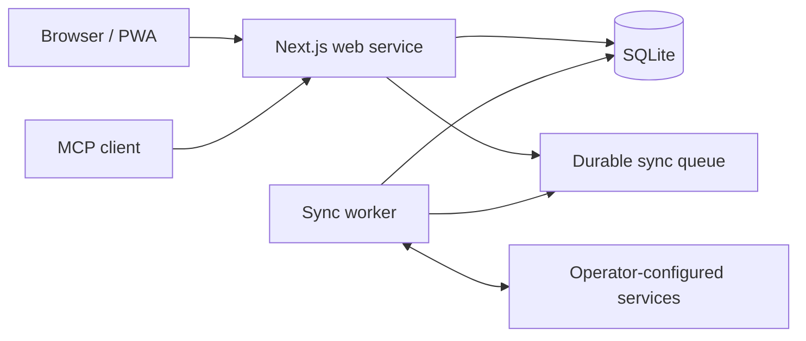

# Public Architecture Guide

Mission Control is a local-first task aggregation service. A browser or MCP
client communicates with a Next.js web process. Connector synchronization may
run in a separate worker process. Both processes use the same SQLite database.

## Trust boundaries

- Browser input, connector payloads, webhooks, and pull-request content are
  untrusted.
- Credentials remain outside source control and are available only to the
  process that needs them.
- Connectors receive least-privilege upstream permissions and own their
  read/write behavior.
- The worker claims durable jobs and records results in SQLite.
- Public CI uses GitHub-hosted infrastructure and must not receive protected
  secrets from untrusted pull requests.

This diagram is intentionally deployment-neutral. Operators choose their own
hostnames, accounts, and providers and should not copy production identifiers
into documentation or issues.
