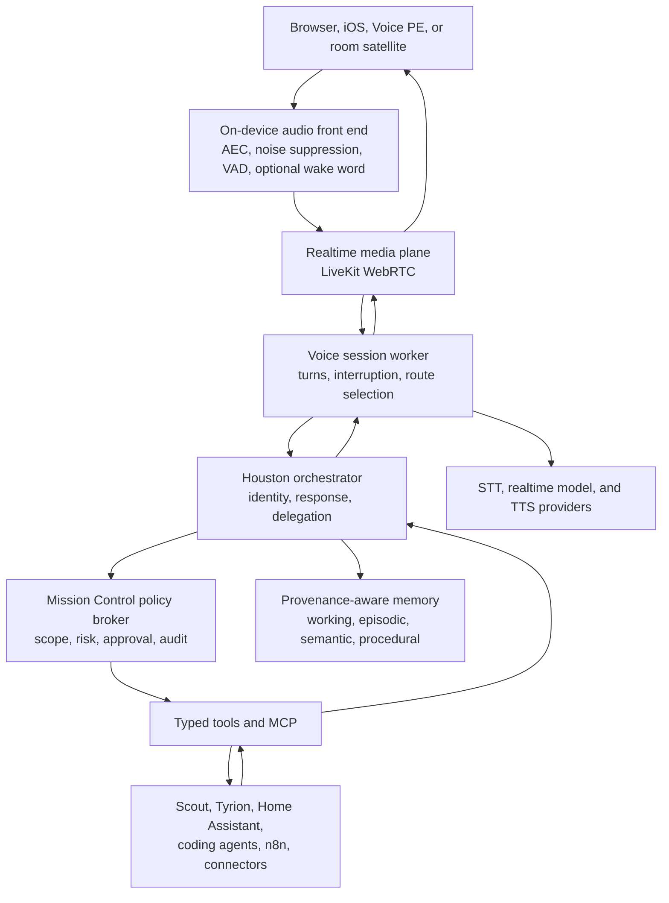
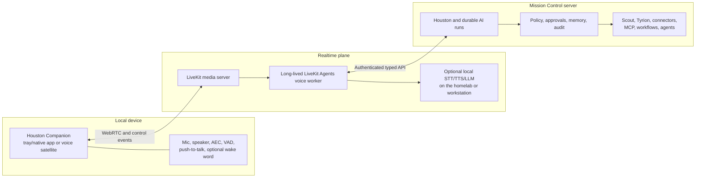

# JARVIS-Style Assistants: Landscape, Architecture, and Mission Control Strategy

**Research date:** 2026-08-08  
**Evidence cutoff:** 2026-08-08 ET / 2026-08-09 UTC  
**Decision:** Build a Mission Control-native voice and ambient assistant experience by adopting proven voice and home-automation infrastructure. Do not replace Mission Control with an existing "JARVIS" project.

**Proposed design:** [Houston Voice and Flight Director UI](../design/proposed/houston-voice-and-operations-ui.md)

## Executive decision

There is no credible single project that combines all of the following at production quality:

- Far-field, interruptible voice interaction
- Durable and trustworthy personal memory
- Proactive behavior without notification fatigue
- Broad home, work, finance, and development integrations
- Safe execution across external systems
- Local/private operation
- A polished multi-device experience

The best systems specialize:

- **Home Assistant Assist** has the strongest household device, wake-word, and local voice foundation.
- **LiveKit Agents** has the strongest production realtime voice and media framework.
- **Pipecat** offers the most provider-neutral pipeline composition.
- **ElevenLabs Agents** offers the fastest path to premium speech and authorized voice cloning.
- **LocalAI** offers the broadest local inference substrate.
- **Leon, Letta, Khoj, and GLaDOS** contain valuable memory, context, and proactivity patterns.
- **Agent TARS** is a credible desktop-control component, but only in a sandbox.

Mission Control already owns the parts that most JARVIS projects struggle to build:

- A durable control plane and task system of record
- Houston as the user-facing orchestrator
- Scout as a business-M365 reasoning and execution peer
- Tyrion as a specialized finance intelligence service
- A broad connector architecture
- MCP tools for external agents
- Durable AI runs, redacted event history, cancellation, and retries
- Risk-tiered confirmation, review, and undo designs
- Mobile capture, including browser speech recognition

The recommended product is therefore not a separate assistant named JARVIS. It is **Houston with voice**, supported by specialist agents and bounded execution planes:

> **Houston is the relationship and orchestration layer. Voice is one interface. Mission Control is the policy and memory boundary. Scout, Tyrion, Home Assistant, coding agents, and workflows are specialist capabilities.**

### Recommended adoption

| Need | Decision |
|---|---|
| Realtime voice transport and turn handling | **Adopt LiveKit Agents** in a separate long-lived worker; prototype Python first and retain TypeScript as a supported option |
| Household voice endpoints and device control | **Adopt Home Assistant Assist + Voice PE/Wyoming** |
| Default speech architecture | **Build a cascaded STT -> Houston/tools -> TTS route** |
| Natural low-risk conversation | Add hosted speech-to-speech later behind a route and feature flag |
| Premium synthetic voice | Evaluate Cartesia and ElevenLabs; use only licensed or explicitly consented voices |
| Fully local mode | Evaluate LocalAI with local STT/TTS; do not require it for the first release |
| Memory | Build provenance-aware memory in Mission Control; borrow Letta/Leon patterns |
| Proactivity | Build a bounded governor; borrow Leon and GLaDOS cooldown/coalescing patterns |
| External tools | Continue MCP plus typed first-party tools; Mission Control remains the policy host |
| PC actions | Build a narrow Tauri capability broker; route durable work to Scout, Copilot, or n8n and keep open-ended computer use sandbox-only |

## What has actually been solved

### Solved well

1. **Voice capture**
   - Streaming STT is a commodity capability.
   - Local and hosted options are both viable.
   - Mission Control already supports Web Speech API capture in Quick Add and Capture.

2. **High-quality speech output**
   - Hosted TTS can produce natural, low-latency speech.
   - Voice design and authorized cloning are commercially accessible.
   - Local TTS is usable, though voice quality and language support vary.

3. **Realtime media transport**
   - WebRTC frameworks now handle browser/mobile audio, rooms, interruption, telephony, and worker dispatch.
   - LiveKit treats media, job lifecycle, testing, and observability as production concerns.

4. **Smart-home execution**
   - Home Assistant provides mature state, automation, devices, services, local voice, and supported hardware.
   - It is the clear system of record for household state.

5. **Tool and integration protocols**
   - MCP is a strong tool boundary.
   - A2A is useful for independently deployed agents.
   - Typed internal tools remain safer for sensitive first-party operations.

6. **Personal knowledge retrieval**
   - Khoj, AnythingLLM, Open WebUI, Letta, and similar systems demonstrate viable document RAG, profile memory, and scheduled research.

7. **Remote coding and operations**
   - Messaging-to-agent, issue-to-PR, and remote session-control workflows are real and useful.
   - Mission Control's external-agent and durable-run architecture is already moving in this direction.

### Partly solved

1. **Natural turn-taking**
   - VAD, semantic endpointing, and barge-in are available.
   - Real rooms, long pauses, television audio, backchannels, and speaker routing still require tuning.

2. **Long-term memory**
   - Storage and retrieval are straightforward.
   - Deciding what deserves to become memory, what has expired, who may access it, and how to correct it remains difficult.

3. **Proactivity**
   - Cron, heartbeats, event triggers, and periodic reasoning are easy.
   - Useful timing, suppression, deduplication, cost control, and trust are not.

4. **Multi-agent delegation**
   - Frameworks support handoffs.
   - User-facing responsibility, shared context, failure ownership, and auditability are still application problems.

5. **Desktop operation**
   - Visual agents can browse and click.
   - Reliability and prompt-injection safety are not sufficient for unrestricted operation.

### Not solved generally

1. Secure household identity and private/shared memory across multiple people
2. Reliable always-on voice across arbitrary rooms and noisy environments
3. Safe autonomous purchases, messages, locks, deletion, and deployments
4. Trustworthy ambient screen/audio capture with acceptable privacy and retention
5. Cheap, useful, non-annoying continuous proactivity
6. One portable assistant brain that works equally well across local, cloud, mobile, home, and work systems

## Landscape assessment

### Platforms and frameworks

| Candidate | Category | Strength | Main limitation | Recommendation |
|---|---|---|---|---|
| [Home Assistant Assist](https://www.home-assistant.io/voice_control/) | Household platform | Devices, automations, local speech, wake word, supported hardware | Shallow general personal memory | **Adopt for home/device plane** |
| [LiveKit Agents](https://github.com/livekit/agents) | Realtime framework | WebRTC, turns, interruption, clients, telephony, MCP | Memory and policy are application-owned | **Adopt for realtime plane** |
| [Pipecat](https://github.com/pipecat-ai/pipecat) | Voice pipeline framework | Provider-neutral, highly composable, multimodal | More assembly and operational complexity | Alternative if pipeline control dominates |
| [ElevenLabs Agents](https://elevenlabs.io/docs/eleven-agents/overview) | Managed voice platform | Premium voice, cloning, deployment speed | Cost, cloud governance, lock-in | Use selectively for voice/TTS |
| [OpenAI Realtime](https://developers.openai.com/api/docs/guides/realtime) | Hosted speech-to-speech | Natural speech interaction and audio understanding | Provider coupling and weaker exact-output control | Add later for low-risk conversation |
| [LocalAI](https://github.com/mudler/LocalAI) | Local inference substrate | LLM, vision, STT, TTS, VAD, realtime, RAG, MCP | Hardware and backend complexity | Evaluate for local/private mode |
| [OpenVoiceOS](https://github.com/OpenVoiceOS/ovos-core) | Smart-speaker framework | Hackable local skills and provider plugins | Fragmented ecosystem | Reuse plugin patterns |
| [Leon](https://github.com/leon-ai/leon) | Personal assistant preview | Layered memory, context, skills, satellite, bounded pulse | Version 2 remains a developer preview | Reuse architecture patterns |
| [AnythingLLM](https://github.com/Mintplex-Labs/anything-llm) | Local assistant product | MIT, RAG, agents, schedules, local/cloud models | Voice is an interface feature, not the core | Useful reference, not MC replacement |
| [Khoj](https://github.com/khoj-ai/khoj) | Personal knowledge product | Self-hosted second brain and scheduled research | Not a low-latency voice platform; AGPL | Reuse knowledge/proactivity patterns |
| [Letta Code](https://github.com/letta-ai/letta-code) | Stateful agent harness | Explicit identity, editable memory, heartbeats, skills | Coding-oriented and voice-free | Reuse memory model |
| [GLaDOS](https://github.com/dnhkng/GLaDOS) | Multimodal hobby/research assistant | Vision, autonomy queues, MCP, interruption | Demo-level household evidence | Reuse autonomy patterns |
| [Agent TARS](https://github.com/bytedance/UI-TARS-desktop) | Desktop agent | MCP-oriented browser and desktop operation | GUI brittleness and high privilege | Sandbox only, later |
| [Screenpipe](https://github.com/screenpipe/screenpipe) | Ambient context sensor | Searchable screen/audio timeline | Extreme privacy, storage, and licensing concerns | Opt-in sensor only, if ever |

### Legacy or misleading candidates

- Mycroft Core and Rhasspy 3 are archived. Their useful descendants are OpenVoiceOS and the Home Assistant/OHF Wyoming ecosystem.
- Vocode's repository has been largely inactive since 2024 and asks for maintainers.
- Open Interpreter is now primarily a coding-agent harness, not a complete voice assistant.
- Many repositories titled "JARVIS" are thin wrappers around Whisper, an LLM, TTS, and shell commands. They are useful demonstrations, not platforms.
- GitHub stars and cinematic demos are not evidence of daily reliability, security, or maintainability.

## How successful systems are architected

Credible systems separate concerns rather than granting one process universal authority:



## Server, realtime service, and local companion boundary

Mission Control is a server-side control plane. That should not change. A useful voice assistant does, however, need software near the microphone and speaker. The target is therefore a three-part deployment:



### What the local companion is

The companion is a **trusted peripheral**, not a second autonomous agent. It owns device-local concerns:

- Microphone and speaker access
- Acoustic echo cancellation, noise suppression, and gain control
- Push-to-talk and global shortcut handling
- Local VAD and an optional local wake word
- A short pre-roll audio buffer so the first word is not clipped
- Playback, interruption, and physical/visible mute state
- Secure device pairing and short-lived session credentials
- Tray/menu-bar UI, notifications, and offline capture outbox
- Optional local STT/TTS fallback where the device can support it

It must not own:

- Connector credentials
- Mission Control business rules
- Durable personal memory
- Final authorization for tools
- Unrestricted shell, filesystem, or desktop control
- A separate Houston prompt or agent state that can drift from the server

### Recommended client surfaces

| Surface | Recommended role | Always listening? |
|---|---|---|
| Browser/PWA | Fastest prototype; foreground push-to-talk in Houston and Capture | No |
| Existing iOS wrapper | Foreground Houston conversation, microphone playback, push notifications, deep links, Siri/App Intent entry points later | No continuous background listening |
| Windows Tauri tray app | Primary desktop companion: global push-to-talk shortcut, tray status, audio session, notifications, offline capture | Optional local wake word only after explicit opt-in |
| macOS/Linux companion | Reuse the Tauri core after Windows validates the interaction | Same policy as desktop |
| Home Assistant Voice PE/Wyoming satellite | Far-field room endpoint and deterministic household-command fast path | Yes, with wake word processed locally |
| Headset/phone accessory | Private context and interruption controls | User activated |

The existing proposed **Desktop Quick Add** Tauri application is the correct seed. Its tray lifecycle, global shortcut, pairing, secure storage, bounded outbox, and server-owned business rules already match this boundary. Evolve it into **Houston Companion** rather than creating another desktop stack. Voice remains outside its MVP, then adds audio as a narrowly permissioned module.

The existing iOS wrapper already has a trusted-origin bridge, microphone permission boundary, push integration, deep links, and separated native credentials. It can host foreground voice sessions. iOS should use a button, Action Button/App Intent, Siri, or notification entry point; it should not attempt a permanently listening background process.

### What "local AI" means for Mission Control

Other JARVIS projects often combine endpoint, models, tools, and memory on one PC. Mission Control should support locality without collapsing those responsibilities:

1. **Local endpoint only:** audio preprocessing and wake word run on the device; hosted STT/LLM/TTS perform inference.
2. **Homelab-local inference:** LocalAI, faster-whisper, and local TTS run beside Mission Control/LiveKit; clients stream only across the private network.
3. **Workstation-local inference:** a capable desktop companion reaches models on the same workstation, but Mission Control still authorizes tools and owns memory.
4. **Offline capture mode:** the companion records/transcribes or queues a bounded request, then submits it idempotently when Mission Control is reachable. Full offline agent execution is not an initial goal.

This preserves the privacy and resilience benefits people mean by "local AI" while retaining one policy, memory, and integration authority.

### Deployment profiles

| Profile | Runs locally | Runs remotely | Best fit |
|---|---|---|---|
| Managed voice | Companion audio front end | LiveKit, STT/TTS/realtime model, Mission Control | Fastest quality prototype |
| Private homelab | Companion plus local wake/VAD | Self-hosted LiveKit, voice worker, LocalAI/speech, Mission Control on the private server | Recommended private target |
| Hybrid | Wake/VAD and possibly STT/TTS local | Premium LLM or realtime model plus Mission Control | Practical quality/privacy balance |
| Degraded/offline | Wake/VAD, capture queue, optional local transcription | Mission Control when connectivity returns | Resilient capture, not full autonomous operation |

### Architectural practices worth adopting

1. **Voice is a replaceable interface**
   - It does not own credentials, tools, authority, or durable memory.
   - Text, mobile, CLI, and voice should all reach the same Houston policies.

2. **Use a hybrid voice route**
   - Cascaded STT -> agent -> TTS is the default for tools, names, dates, money, and auditable work.
   - Native speech-to-speech is optional for coaching, brainstorming, and natural conversation.
   - A half-cascade can use audio understanding while retaining exact TTS output.

3. **Keep wake word and audio preprocessing at the edge**
   - Do not stream ambient audio to cloud services before activation.
   - Always provide push-to-talk and a visible/physical mute state.

4. **Treat interruption as a state machine**
   - Stop playback, cancel generation, truncate assistant state to audio actually played, discard late packets, and preserve the new user audio.

5. **Separate memory types**
   - Working memory: current conversation and tools.
   - Episodic memory: timestamped summaries linked to source events.
   - Semantic/profile memory: confirmed preferences and facts.
   - Procedural memory: agent instructions and workflows.

6. **Use bounded proactivity**
   - Event or schedule triggers create candidates.
   - A governor applies urgency, cooldowns, quiet hours, notification budgets, deduplication, and a `do_nothing` option.
   - Repeated successful agent behavior should become deterministic automation.

7. **Put policy between the model and every side effect**
   - Validate schema.
   - Resolve authenticated user and tenant.
   - Authorize connector, action, and resource.
   - Classify risk.
   - Collect approval where required.
   - Execute idempotently.
   - Validate/redact output.
   - Write an audit event.

## Voice architecture decision

### Why cascaded voice should be the default

| Criterion | Cascaded STT -> Houston -> TTS | Native speech-to-speech |
|---|---|---|
| Naturalness | Good | Best |
| Exact transcript | Best | Variable or delayed |
| Tool auditability | Best | Provider-dependent |
| Deterministic wording | Best | Weaker |
| Model/provider choice | Broad | Narrower |
| Existing Houston integration | Direct | Requires adapter |
| Branded voice control | Broad TTS choice | Provider voice set |
| Sensitive actions | Preferred | Avoid as sole route |

The target should be hybrid routing, not an ideological choice between local and cloud or between cascade and realtime.

### Initial component choices

| Layer | First choice | Local/private option |
|---|---|---|
| Client media | LiveKit WebRTC | Self-hosted LiveKit |
| Voice worker | LiveKit Agents in a separate service; Python first | Same |
| VAD | Silero VAD | Silero VAD |
| Turn detection | LiveKit semantic/acoustic detector | Local LiveKit turn model |
| STT | Deepgram Flux/Nova evaluation | faster-whisper or whisper.cpp |
| TTS | Cartesia versus ElevenLabs evaluation | Kokoro; Piper where GPL implications are acceptable |
| Realtime model | OpenAI Realtime or Gemini Live experiment | LocalAI realtime where hardware permits |
| Tool boundary | Existing typed tools and MCP | Same |
| Memory | Mission Control database plus vector/full-text retrieval | Same |
| Telemetry | Existing OpenTelemetry foundation | Same |

Provider performance numbers are vendor claims, not directly comparable benchmarks. The prototype should measure complete user-turn latency on actual devices and networks.

### Initial service-level objectives

- End of user turn to first audible response: p50 <= 700 ms; p95 <= 1.2 s
- User speech onset to assistant audio stopped: p95 <= 150 ms
- No high-risk operation authorized by spoken confirmation alone
- Raw audio retention disabled by default
- Every tool proposal, approval, execution, and result correlated to one durable run/session

## Mission Control fit

### Built strengths to preserve

| Built capability | Relevance to a Houston voice system |
|---|---|
| Houston web/mobile surfaces and identity | Provides one consistent conversational relationship |
| Durable `ai_runs` and event stream | Supports reconnect, cancellation, retry, tracing, and redacted history |
| MCP server | Exposes task, project, phase, tag, sync, and intake capabilities |
| Connector registry and source authority | Prevents a voice layer from bypassing source ownership rules |
| External-agent registry, dispatch service, and transports | Provide infrastructure for bounded delegation, although conversational Houston dispatch is not wired |
| Scout connector and scoped MCP tools | Bring curated business-M365 work into the correct trust boundary |
| Tyrion finance bridge | Provides specialized finance reasoning and controlled write-back |
| Task-level undo infrastructure | Supplies a reusable pattern, but not yet a complete AI-run receipt or rollback contract |
| Mobile Houston tab and Capture flow | Give the voice interface an existing mobile home |
| Browser voice capture | Provides a working, tested push-to-talk baseline |

### Designed foundations that must be implemented

| Designed capability | Gap before voice can depend on it |
|---|---|
| Houston specialist attribution | The identity and role model is documented, but a complete delegation/attribution experience is not shipped |
| Houston-to-Scout and general conversational dispatch | External dispatch exists below the conversation layer; Houston still needs explicit tools and result presentation |
| Tiered agent confirmation | Safe, moderate, destructive, item-level approval, and visual handoff remain design work |
| AI-run receipts and undo | Generic task undo is not sufficient for multi-tool or external agent execution |
| Unified proactivity policy | Scout autonomy is scoped, but a cross-agent notification and interruption governor does not yet exist |

The distinction is safety-critical: **designed confirmation and undo must not be treated as available controls**. Voice-triggered writes remain blocked until the relevant policy, approval, receipt, and rollback paths are implemented and tested.

### Current voice baseline

Mission Control is farther along than the older voice-capture design document implies:

- `useVoiceCapture` implements continuous Web Speech API recognition, interim results, cancellation, permission errors, and an Edge installed-PWA microphone preflight.
- Voice input is wired into both Quick Add and the Capture page.
- Hook tests cover ordinary tabs, installed Edge PWAs, overlapping starts, cancellation, denial, and retry.

This is **voice capture**, not yet a conversational voice agent. It has no server-controlled STT, realtime media plane, wake word, speaker output, barge-in, voice session, or voice-specific telemetry.

### Runtime assumption and documentation drift

The first cascaded prototype should call Mission Control's current provider-neutral Houston/tool boundary, not hard-code either OpenClaw or Copilot. Repository documents currently describe the Tier-2 executor in two different ways: the consolidated architecture emphasizes bounded providers plus a separate direct Copilot SDK runtime, while the AI-assistant completion draft still describes OpenClaw. Resolve that naming and ownership before production voice routing. Realtime voice must consume the chosen executor through a typed adapter and the durable-run contract rather than becoming a third competing agent runtime.

### Product scope decision: solo operator or household

Mission Control is currently designed for a solo operator. Shared-room voice introduces identity, authorization, and privacy requirements that the current product model does not provide.

Phase 0 must decide between:

1. **Solo-operator first:** room endpoints expose only household-safe tools and never disclose private work, finance, or memory.
2. **Household expansion:** design authenticated people, guests, devices, rooms, private/shared memory, and per-person capabilities as a separate product foundation.

Phase 4 cannot enable person-specific shared-room context until that decision and its identity model are implemented.

### Recommended identity model

Do not introduce a second top-level personality called JARVIS.

- **Houston** remains the user-facing orchestrator and voice.
- **Scout** handles business-M365 reasoning and execution.
- **Tyrion** handles finance attribution and related intelligence.
- **Flight/CAPCOM/Relay/Beacon/Orbit/Atlas** can remain attributed internal roles.
- **Home Assistant** owns household state and deterministic device actions.
- **Coding agents** own repository execution in explicit local or cloud environments.
- **n8n** owns deterministic cross-system workflows.

Houston should say which specialist acted:

> "Tyrion found three transactions needing review."  
> "Scout prepared the follow-ups from today's meetings."  
> "Relay sent the repository task to the cloud coding agent."  
> "Home Assistant locked the back door after you approved it."

This is more trustworthy than pretending a single omniscient personality performed every action.

## The strongest use cases

### High-confidence, near-term value

1. **Push-to-talk Houston**
   - Ask about Today, projects, deadlines, notifications, and connector health.
   - Add, clarify, schedule, and triage tasks.
   - Hear concise answers while mobile or hands-busy.

2. **Ramble/brain-dump capture**
   - Speak freely for one or two minutes.
   - Extract multiple tasks, notes, dates, projects, and follow-ups.
   - Present a structured preview before creating anything.

3. **Morning mission briefing**
   - Calendar constraints, Today plan, overdue risk, Scout work signals, GitHub activity, household events, and selected finance exceptions.
   - Adapt duration to available time.
   - Deliver as text, speech, or both.

4. **Meeting and communication follow-through**
   - Scout identifies business commitments.
   - Houston reconciles them with existing tasks and projects.
   - The user approves reminders, messages, or dispatches.

5. **Hands-busy household operation**
   - Timers, lights, scenes, media, shopping capture, routines, and status queries.
   - Use deterministic Home Assistant intents for common actions.
   - Escalate ambiguous requests to Houston.

6. **Remote development control**
   - Ask for coding-agent status, hear failures, approve a retry, or dispatch a bounded task.
   - Never stream repository secrets into the voice session.

### Differentiating Mission Control opportunities

1. **The cross-domain "Now Brief"**
   - Most assistants operate inside one ecosystem.
   - Mission Control can explain what matters now across tasks, work communications, code, household state, and finance without merging their trust boundaries.

2. **Specialist delegation with visible custody**
   - Houston can route to Scout, Tyrion, Home Assistant, or a coding agent and preserve who knew what, who acted, and where execution occurred.

3. **Workflow solidification**
   - Detect repeated successful voice/agent sequences.
   - Offer to convert them into reviewed, deterministic n8n or first-party workflows.
   - This lowers cost and increases reliability over time.

4. **Mission replay**
   - Answer "Why did you do that?" with the triggering request, source evidence, proposed action, approval, execution receipt, and rollback state.
   - This is more valuable than opaque conversational memory.

5. **Proactivity budget**
   - Give all agents one shared interruption budget.
   - Combine related events into a briefing rather than letting each integration notify independently.

6. **Context-sensitive response mode**
   - At a desk: rich card plus concise speech.
   - Driving: speech-first, read-only or reversible actions.
   - In a room: household-safe shared context only.
   - In headphones: personal context allowed.

7. **Control-room mode**
   - During deployments, incidents, travel, or a busy day, Houston narrates only state changes and decisions requiring attention.
   - It can suppress routine chatter while preserving a timeline.

8. **Commitment reconciliation**
   - Compare promises found by Scout, tasks in Mission Control, calendar time, open PRs, and external statuses.
   - Surface commitments that have no execution plan or have already been satisfied elsewhere.

9. **Personal operations reviews**
   - Weekly spoken review of completed work, blocked projects, habits, finance exceptions, and upcoming constraints.
   - Every statement links back to evidence.

10. **Accessibility and cognitive offloading**
    - Voice capture, read-back, short prompts, repetition, "what was I doing?", and reduced context switching.
    - This is a practical benefit, not merely a cinematic interface.

## Memory strategy

Do not begin with continuous recording or a universal vector store.

### Memory record requirements

Every durable memory should include:

- Owner and allowed audience
- Agent namespace
- Type: episodic, semantic/profile, or procedural
- Source provenance
- Confidence
- Whether a human confirmed it
- Valid-from and valid-until timestamps
- Sensitivity classification
- Retention or expiry
- Correction and deletion history

### Memory promotion rules

- Conversation content remains session history by default.
- Model-inferred preferences are suggestions, not facts.
- Repeated behavior can create a memory candidate.
- Sensitive identity, health, household, child, and financial facts require explicit confirmation.
- Tool results should normally remain linked evidence rather than being copied into free-floating memory.
- Users need "What do you remember?", correction, export, and deletion controls.

## Proactivity strategy

The common failed pattern is an unbounded heartbeat asking a premium model what to do every few minutes.

Use a candidate-and-governor model:

```text
Events and schedules
  -> specialist candidates
  -> deduplication and correlation
  -> urgency/relevance scoring
  -> quiet hours and interruption budget
  -> act, ask, digest, defer, or do nothing
  -> feedback and audit
```

Required controls:

- Quiet hours and calendar-aware suppression
- Per-channel and global notification budgets
- Cooldowns for repeated topics
- Cross-agent deduplication
- Digest mode
- Escalation thresholds
- Cost ceilings
- Explicit `do_nothing`
- Feedback such as useful, too early, too noisy, or never notify this way

## Voice and cloning policy

The desired experience can be calm, capable, and cinematic without copying a living actor's voice.

Do not clone or distribute Paul Bettany's JARVIS voice without an appropriate license and explicit consent. A public-figure or actor imitation also creates avoidable product, legal, and abuse risk.

Preferred approach:

1. Design an original **Houston voice** with a licensed voice actor or a provider's licensed synthetic voice.
2. Record explicit consent covering purpose, applications, retention, and revocation.
3. Disclose that speech is AI-generated.
4. Prevent public voice enumeration, sample export, and unauthorized reuse.
5. Keep voice identity separate from authentication.
6. Never accept a spoken "yes" or a recognized voice as the only approval for purchases, messages, locks, deletion, or deployment.

## Security and privacy boundaries

### Action policy

| Class | Examples | Voice behavior |
|---|---|---|
| Read-only | Briefings, search, status, summaries | Execute and answer |
| Reversible local write | Add task, tag, snooze | Confirm based on user policy; show receipt and undo |
| External write | Send message, change source task, trigger workflow | Preview in UI and require explicit confirmation |
| High risk | Purchase, lock, delete, deploy, financial action | Mandatory out-of-band visual confirmation |

### Non-negotiable controls

- Short-lived room credentials; no provider keys in clients
- Raw audio retention off by default
- Separate consent for memory and ambient sensors
- Signed callbacks, replay protection, idempotency, and bounded retries
- Tool allowlists and connector/action/resource scopes
- MCP output treated as untrusted content
- Egress restrictions and SSRF protection
- Per-tool timeout, cancellation, and output-size limits
- Full audit correlation without storing unrestricted prompts or secrets
- No unrestricted shell in the voice-facing agent
- Open-ended desktop or browser control only in a sandbox

## Cross-check against reference implementations

The proposed split is not an invented topology. It is the intersection of patterns that have held up across current voice, home, agent, and computer-use systems:

| Reference | Pattern worth using | Where it stops short of Mission Control |
|---|---|---|
| [LiveKit Agents](https://github.com/livekit/agents) | Long-lived realtime workers, WebRTC participants, interruptions, typed plugins, handoffs, tests, and web/Swift clients | A room or job is not a durable business run; Mission Control must own approvals, replay, and side effects |
| [Home Assistant Assist](https://developers.home-assistant.io/docs/voice/pipelines/) + [Wyoming](https://github.com/OHF-Voice/wyoming) | Central voice pipeline, device-aware runs, capability discovery, local wake/STT/TTS services, and inexpensive satellites | Its LAN-oriented PCM protocol and deterministic home intent model are not a complete mobile/WAN assistant control plane |
| [Pipecat](https://github.com/pipecat-ai/pipecat) | Typed audio/text/control frames, ordered pipelines, parallel branches, and a high-priority interruption lane | It is a media pipeline framework, not a durable task, policy, or memory system |
| [OpenClaw](https://github.com/openclaw/openclaw) | One gateway with paired desktop, mobile, and headless nodes; closest reference for companion topology | Gateway events are not a replayable durable ledger; it should not replace Mission Control persistence |
| [Leon 2.0](https://github.com/leon-ai/leon/tree/develop) | Profile-isolated runtimes, deterministic and agent modes, progressive tool disclosure, persisted human-in-the-loop pause/resume | The current branch is a developer preview and does not provide Mission Control's mature source/connector model |
| [GLaDOS](https://github.com/dnhkng/GLaDOS) | Local low-latency queues, pre-roll, barge-in, VAD, proactive subagents, and MCP | Process/thread-oriented architecture with weak durable approvals; character voice assets are not safe to reuse |
| [OpenVoiceOS](https://github.com/OpenVoiceOS/ovos-core) | Embedded smart-speaker lifecycle, plugin boundaries, local services, personas, and fallback pipelines | Less applicable to modern WebRTC, tool-calling durability, and rich approval flows |
| [Letta](https://github.com/letta-ai/letta-code) | Explicit editable memory, long-lived identity, background consolidation, and subagents | Agent-owned memory is too permissive for authoritative business evidence without Mission Control provenance |
| [Agent TARS](https://github.com/bytedance/UI-TARS-desktop) | Event-stream UI, MCP-driven operators, timing visibility, and sandbox integration | Broad computer control is too risky for direct host access and has no voice/control-plane architecture |
| [Microsoft UFO](https://github.com/microsoft/UFO) | Windows HostAgent/AppAgent split, UIA + Win32 + COM grounding, FSM control, and visual fallback | Too broad to embed in Houston Companion; valuable as a Windows automation study target |
| [Magentic-UI](https://github.com/microsoft/magentic-ui) | Orchestrator/browser separation, user takeover, critical-action approval, and browser VM isolation | A heavyweight computer-use environment, not the default execution route |
| [Graphiti](https://github.com/getzep/graphiti) | Temporal facts, validity windows, hybrid retrieval, and traceability from derived facts to source episodes | Requires graph infrastructure and LLM extraction; use only as a derived index, never as the authoritative record |

### Patterns that recur across successful systems

1. **A long-lived service owns the live session.** It is not implemented in serverless request handlers.
2. **Cascaded STT -> tools/model -> TTS remains the controllable default.** Native speech-to-speech is an optional low-risk route.
3. **Typed frames and events separate transport from application state.**
4. **User interruption has a priority path.** Barge-in cannot wait behind synthesis or background work.
5. **Edge devices are capability providers, not independent brains.**
6. **Local and hosted models sit behind adapters.**
7. **Specialists receive scoped handoffs and return attributed evidence.**
8. **Realtime sessions are ephemeral; durable actions are not.**

The important divergence is that most JARVIS implementations still expose tools directly to an agent and treat memory as convenient retrieval. Mission Control should retain its stricter proposal, confirmation, source provenance, retry, cancellation, receipt, and correction semantics. That is a differentiator, not overhead to remove.

## Reusable libraries and code

### Adopt or extend

| Need | Library or existing code | Decision |
|---|---|---|
| Realtime media | [LiveKit server](https://github.com/livekit/livekit), [LiveKit Agents](https://github.com/livekit/agents), and [LiveKit React components](https://github.com/livekit/components-js) | Adopt the server and worker; reuse room/audio hooks and controls rather than a starter application's whole UI |
| iOS media | [LiveKit Swift SDK](https://github.com/livekit/client-sdk-swift) | Adopt in the existing native wrapper; let platform audio processing handle initial AEC and routing |
| Voice activity and turn-taking | [Silero VAD](https://github.com/snakers4/silero-vad) plus LiveKit turn detection | Adopt in the worker; tune on actual microphones and do not mistake VAD for semantic end-of-turn |
| Local wake word | [openWakeWord](https://github.com/dscripka/openWakeWord) and [microWakeWord](https://github.com/OHF-Voice/micro-wake-word) | Adopt openWakeWord for opted-in desktop/home use; use microWakeWord as an embedded reference |
| Optional local speech | [whisper.cpp](https://github.com/ggml-org/whisper.cpp) or [sherpa-onnx](https://github.com/k2-fsa/sherpa-onnx) | Support behind the same worker interfaces; pilot sherpa-onnx where cross-platform streaming matters |
| Local TTS | [Kokoro](https://github.com/hexgrad/Kokoro-82M) and [Piper](https://github.com/OHF-Voice/piper1-gpl) | Evaluate as optional services; review voice-weight terms separately and keep Piper's GPL implications isolated |
| Desktop shell | [Tauri 2](https://github.com/tauri-apps/tauri), global shortcut, deep-link, notification, and secure-storage plugins | Adopt for Houston Companion with minimal renderer privileges and signed updates |
| Windows native boundary | [windows-rs](https://github.com/microsoft/windows-rs) | Adopt behind a small Rust wrapper for process identity, job objects, credential storage, and selected Win32/COM calls |
| Browser automation | [Playwright](https://github.com/microsoft/playwright) | Adopt for deterministic, domain-scoped browser workflows in ephemeral profiles before considering vision agents |
| Graph UI | Existing `@xyflow/react` and `ProjectStructureGraph` patterns | Reuse for deterministic run/dependency graphs and locality swimlanes |
| Historical exploration | Existing `react-force-graph-2d`, `UniverseGraph`, and `TagGalaxy` patterns | Reuse only for optional ecosystem/history exploration, not current execution state |
| Structured agent UI | Existing `ToolCard`, `AgentPanel`, and `AgentAttribution` | Extend into proposal, approval, progress, evidence, receipt, and reversal cards |
| Telemetry | Existing OpenTelemetry packages and GenAI semantic conventions | Extend with voice and execution spans; exclude raw transcripts and tool payloads by default |
| Memory | [Graphiti](https://github.com/getzep/graphiti) | Pilot on copied/redacted episodes as a derived provenance-aware index |

### Study before adding

- [Vercel AI Elements](https://ai-sdk.dev/elements) for sources, tool states, plans, and approval components. It aligns with the existing Vercel AI SDK but should be mined for primitives rather than forcing a full UI rewrite.
- [assistant-ui](https://github.com/assistant-ui/assistant-ui) for a complete accessible chat-shell reference. It is unnecessary if Houston's existing shell remains the product surface.
- [Pipecat Voice UI Kit](https://github.com/pipecat-ai/voice-ui-kit) for mic/session/transcript patterns. Do not couple the client to Pipecat solely for presentation.
- [CopilotKit](https://github.com/CopilotKit/CopilotKit) for generative UI and human-in-the-loop agent state only if its protocol materially reduces work.
- [FlaUI](https://github.com/FlaUI/FlaUI) for a separate, short-lived Windows UI Automation helper if direct `windows-rs` UIA work proves too expensive.
- [Cua](https://github.com/trycua/cua), Agent TARS, Microsoft UFO, and Magentic-UI for isolated computer-use patterns, not host embedding.

### Avoid or isolate

- Do not copy Open WebUI code without resolving its custom branding license.
- Do not ship LiveKit's starter shader aura without resolving its PolyForm Noncommercial license; build a simpler original canvas/WebGL effect.
- Do not embed Piper directly without accepting GPLv3 distribution obligations.
- Do not adopt WinAppDriver as a new production automation foundation; its maintenance signal is weak.
- Do not bundle Sandboxie Plus without a separate kernel-driver, update, and mixed-license review.
- Do not use Portal/GLaDOS or actor-derived voice assets, regardless of the surrounding code license.
- Do not adopt a broad agent framework merely to gain a pulse animation, graph, or chat layout.

## Houston Companion and PC action architecture

Houston Companion should be a **capability broker, not a general-purpose local agent runtime**:

```text
Houston UI or voice
  -> typed intent
  -> Tauri Rust capability broker
       -> deterministic local handler
       -> one-shot restricted helper
       -> Mission Control durable dispatch
            -> Scout | Copilot worker/cloud agent | n8n
       -> disposable sandbox or VM
            -> browser agent | computer use | generated code
```

The model chooses a versioned capability ID. It never chooses an executable path, constructs a shell command, or passes an arbitrary URI:

```ts
interface LocalCapability {
  id: "open_mc" | "launch_app" | "open_uri" | "run_diagnostic";
  version: 1;
  risk: "safe" | "confirm" | "delegated" | "sandbox";
  argumentSchema: JSONSchema;
  allowedTargets: string[];
  timeoutMs: number;
  requiresForeground: boolean;
  audit: boolean;
}
```

### Execution routing

| Route | Appropriate work | Boundary |
|---|---|---|
| Direct Companion action | Show status, open Houston, notify, start capture, launch a known app, open an exact allowlisted URL/deep link, reveal a Companion-created export | Deterministic capability IDs and schema-validated arguments only |
| Scout | Outlook, Teams, meetings, Planner, and Work IQ reasoning or execution | Always dispatch through Mission Control; Scout is not a PC controller |
| Copilot cloud agent | Repository research, branches, commits, and pull requests in GitHub | Best default for GitHub-only work; no local-PC access |
| Isolated Copilot SDK worker | Private/local repository analysis, editing, builds, and tests | Run server-side in an isolated clone/worktree with native tools denied by default and exact Mission Control tools registered |
| n8n or first-party workflow | Repeatable API workflows with known inputs and effects | Prefer over UI automation whenever an API exists |
| Playwright browser worker | Web-only workflow without an API | Isolated profile, domain/network allowlist, and approval before submit, send, purchase, or download |
| Windows UI Automation helper | Native app without an API but with stable accessibility elements | One approved PID/application; semantic elements rather than coordinates; supervised mutations |
| Vision/pixel computer use | Custom or inaccessible controls | Last resort, disposable sandbox only, no ordinary browser profile or broad host access |

### Risk tiers

| Tier | Examples | Policy |
|---|---|---|
| T0 passive | Show Companion status, stop playback | Direct local execution and operational telemetry |
| T1 safe local | Exact Mission Control URL, notification, allowlisted app without arguments, start/stop recording | Direct local execution with visible history and undo where possible |
| T2 local confirmed | User-selected document, reviewed workspace deep link, Companion export, fixed diagnostic | Foreground on-device confirmation, short-lived single-use grant, and audit |
| T3 durable delegated | External message, M365 mutation, n8n workflow, code edit/build/commit/PR, web-form submission | Mission Control durable run with exact executor, locality, disclosure, side effects, approval, and receipt |
| T4 sandbox-only | Generated script, package install, downloaded executable, broad browser/desktop agent, write-capable UI automation | Disposable VM/sandbox with no host credentials, clipboard, microphone, broad network, or writable host mounts |
| T5 prohibited | Security-control bypass, credential harvesting, voice-generated shell, persistence, unrestricted deletion, silent purchase or transfer | Reject and require the user to perform it manually |

For constrained diagnostics, resolve a compiled action ID to an absolute signed executable, build arguments from typed fields, use a clean environment, forbid shell interpreters, cap output, apply a restricted token and Job Object, kill the process tree on timeout, and verify the declared postcondition. Anything broader belongs in an isolated Copilot workspace or disposable VM.

An approval must bind the proposal and run IDs, device, capability/version, executor and locality, target identity, normalized arguments, disclosed data, expected effects, expiry, nonce, and payload hash. Voice alone is never sufficient for destructive, credential-bearing, external-send, purchase, deployment, or irreversible actions.

## UI direction: Houston Flight Director

The UI should feel advanced because it reveals real system state, not because it imitates an Iron Man screen.

### Recommended three-level experience

1. **Conversational surface**
   - A compact Houston pulse in chat communicates only `idle`, `listening`, `end-of-turn`, `thinking`, `speaking`, `waiting for approval`, `degraded`, or `disconnected`.
   - Show live and final transcript states, interruption controls, the current specialist, and concise dispatch chips.
   - Use a small audio-level signal while listening or speaking; never display an unbound fake waveform.

2. **Flight Director operations surface**
   - Deterministic locality swimlanes: This PC, Mission Control host, Microsoft 365 or other tenant, GitHub Cloud, external service, and sandbox.
   - Typed nodes distinguish human, orchestrator, specialist, workflow, connector, device, and sandbox.
   - Every node shows lifecycle, elapsed time, executor, current step, capability grants, and errors.
   - A span timeline exposes the critical path and voice/tool latency.
   - Selecting a node opens evidence, policy decision, disclosed data, receipt, and reversal details.
   - Provide a virtualized table/list alternative for keyboard access and large runs.

3. **Houston Companion tray surface**
   - Microphone and connection state, global push-to-talk, active local actions, pending visual approvals, offline outbox, and a prominent "stop all local actions."
   - It links to Mission Control for reasoning, evidence, approvals, and full run history rather than duplicating them.

The pulse is a **living status indicator**, not a logo animation. The graph is a **causal execution map**, not a free-floating agent cloud. A force-directed constellation can be useful as an optional historical view of agents, integrations, and recurring handoffs, but known active execution paths should remain deterministic.

### Useful visual references

| Reference | Borrow | Do not borrow |
|---|---|---|
| LiveKit agent starter | Clean voice-session control and transcript/audio hooks | Its shader aura without a license review, or a voice-only full-screen product shell |
| OpenAI Realtime Agents demo | Compact waveform, tool events, handoff visibility, and logs | A demo-centric layout that hides durable execution ownership |
| Agent TARS | Tool timeline, event streaming, status labels, and takeover concept | Broad host computer control |
| Open WebUI | Responsive call controls and provider status | Custom-licensed branded code or monolithic workspace architecture |
| Langfuse/Phoenix/Grafana | Span timelines, durations, critical path, and evidence drill-down | Exposing internal traces without user-oriented explanation |
| Mission Control's existing graphs | React Flow interactions, zoom, selection, force layout for exploration | Force-directed layout for a current run with known causal ordering |

### Reusable 3D constellation core

This visual is partially solved. Production Houston should not retain a large hand-written canvas renderer if the prototype graduates into the application.

| Candidate | Decision | Reusable contribution | Caveat |
|---|---|---|---|
| [Three.js](https://github.com/mrdoob/three.js) + [connected-particle example](https://threejs.org/examples/#webgl_buffergeometry_drawrange) | **Adopt** | Mature MIT WebGL engine plus an official points, distance-link, additive-blending, rotation, and draw-range implementation | Precompute adjacency or keep the point count bounded rather than copying its per-frame O(n²) search |
| [React Three Fiber](https://github.com/pmndrs/react-three-fiber) 9 | **Adopt** | React 19-compatible Three.js renderer with Next.js guidance, demand rendering, shared resources, instancing, and adaptive performance patterns | Dynamically import the client-only core so ordinary Mission Control routes do not pay the Three.js startup cost |
| [Drei](https://github.com/pmndrs/drei) | **Adopt selectively** | Tree-shakeable `Points`, `Sparkles`, `Line`, instancing, `AdaptiveDpr`, and `PerformanceMonitor` helpers | Use individual helpers, not a broad visual framework |
| [React Postprocessing](https://github.com/pmndrs/react-postprocessing) | **Optional** | GPU bloom and restrained glow | Disable on low-power devices and avoid glow that obscures topology or state |
| [Three.js Orb Visualizer](https://codepen.io/filipz/pen/yyyRgry) | **Port selected concepts** | MIT CodePen with a displaced wireframe icosahedron, Fresnel shell, particles, Web Audio FFT metrics, radial rings, and state-like pulses | Preserve the license notice; do not copy remote music, fonts, backgrounds, or unrelated dashboard code without separate review |
| [JARVIS Neural Interface AI](https://github.com/vijaym2k6/Jarvis-Neural-Interface-AI) | **Port algorithms, not dependency** | MIT R3F clustered nodes, proximity links, instanced glow shells, moving link particles, and expanding pulse rings | Small one-shot React 18/R3F 8 project; consolidate its per-edge objects into one `LineSegments` buffer |
| [r3f-forcegraph](https://github.com/vasturiano/r3f-forcegraph) | **Conditional** | MIT interactive 3D graph inside an R3F scene | Use only when the core represents actual agents, tasks, or memories; force simulation is unnecessary for a voice-state ornament |
| [openclaw-jarvis-ui](https://github.com/jincocodev/openclaw-jarvis-ui) | **Reference** | ISC voice-state orb, audio response, TTS, and power-save ideas | Vanilla Vite, no tests, and an inefficient 1,000-element DOM particle field; source the underlying MIT orb concepts directly instead |
| [Dix01/JARVIS](https://github.com/Dix01/JARVIS) | **Reference only** | MIT React HUD and a useful custom 2D neural-galaxy renderer | Contains explicit JARVIS, MARK, fan-art, and arc-reactor motifs that should not become Houston branding |
| [jarvis-hologram-desktop](https://github.com/bachlong12623/jarvis-hologram-desktop) | **Reference only** | Layered R3F shells, rings, bloom, demand rendering, and hidden-tab suspension | The repository did not expose the license file claimed by its README; do not copy until licensing is resolved |
| [tsParticles](https://github.com/tsparticles/tsparticles) | **Fallback only** | Maintained MIT 2D particle engine with React support | Appropriate for a low-power background, not the primary 3D core |
| [Vanta](https://github.com/tengbao/vanta), [Arwes](https://github.com/arwes/arwes), and [Butterchurn](https://github.com/jberg/butterchurn) | **Avoid for the core** | Generic effects, sci-fi panels, or audio visualization | Respectively aging/generic, explicitly unmaintained and React-incompatible, or a MilkDrop engine rather than a controllable identity |

Recommended production component:

```text
HoustonVoiceCore3D (dynamic client import)
  THREE.Points              constellation nodes
  THREE.LineSegments        precomputed connections
  InstancedMesh             orbiting geometric fragments
  Shader uniforms           state color, pulse, smoothed RMS/FFT bands
  Optional bloom            capable-device quality tier only
  DOM outside Canvas        state label, transcript, approvals, controls
  Existing 2D canvas        WebGL/reduced-motion/low-power fallback
```

Pause rendering on hidden tabs, cap device pixel ratio around 1–1.5, expose 30/60 fps quality tiers, and use smoothed microphone RMS or FFT bands rather than random animation when audio is active. The WebGL scene remains decorative and `aria-hidden`; every meaningful state remains available in semantic DOM text.

The enhanced static mockup now demonstrates the intended topology with a perspective constellation, linked points, depth-sorted particles, orbiting geometric fragments, a morphing luminous core, state colors, and reduced-motion behavior. It remains a dependency-free design proof. The production path should replace that renderer with the R3F component above while preserving the surrounding Houston UI.

Code licenses such as MIT or ISC allow licensed code reuse with attribution; they do not grant rights to Marvel trademarks, film frames, production assets, actor voices, fonts, music, or distinctive branded motifs. Even if an internal stakeholder accepts direct copying, that does not clear third-party rights. Houston can achieve the same cinematic qualities through original geometry, motion, and state semantics without using JARVIS names, MARK labels, helmet imagery, or a recognizable arc-reactor replica.

Avoid Matrix rain, fake radar, constant particles, radial gauges without thresholds, and circles whose size or movement has no defined meaning. Offer reduced motion and keep state changes readable without color.

An interactive static mockup is available at [Houston Flight Director mockup](../mockups/mockup-houston-operations.html). It includes the operations canvas, voice-state pulse, and Windows tray companion concepts. It is a design study, not production code.

## Delivery roadmap

### Phase 0: Decision spike

- Add end-to-end voice telemetry to the existing browser capture path.
- Prototype a Python LiveKit Agents worker as a separate service and record the integration tradeoff against the TypeScript worker.
- Specify the versioned companion-to-realtime and realtime-to-Mission-Control contracts.
- Extend the Desktop Quick Add responsibility model into a Houston Companion design without expanding client authority.
- Compare two hosted STT and two hosted TTS providers with real devices.
- Define voice-session, transcript, consent, and retention contracts.
- Define the Houston voice and licensing policy.
- Resolve the Tier-2 executor contract and stale OpenClaw/Copilot documentation.
- Decide whether the first product remains solo-operator-only or introduces a household identity foundation.
- Establish per-session, per-day, and monthly spend limits before provider trials.

**Exit criteria:** Measured latency, quality, cost, and privacy tradeoffs are sufficient to select the first production route; the executor and identity assumptions are explicit.

### Phase 1: Conversational Houston, read-only

- Manual push-to-talk in Houston chat.
- Cascaded STT -> existing Houston route -> streaming TTS.
- Transcript and interruption UI.
- Read-only tools for Today, projects, notifications, connector status, and agent runs.
- OTel spans for every voice stage.
- Use the browser/PWA and foreground iOS wrapper first; do not wait for a desktop installer.

**Exit criteria:** Reliable read-only conversation on desktop and mobile with a complete trace and no duplicate tool execution.

### Phase 2: Houston Companion, capture, and briefings

- Extend the Windows-first Tauri tray app with global push-to-talk, speaker playback, mute state, and voice-session status.
- Preserve its existing pairing, secure-storage, server-owned rules, and durable outbox boundaries.
- Add the typed capability broker with T0/T1 actions only; keep shell, arbitrary file access, and UI Automation unavailable.
- Ramble-to-structured-task preview.
- Morning and on-demand mission briefings.
- Concise spoken response formatter separate from rich visual cards.
- Session memory and asynchronous memory candidates.
- Proactivity governor in recommend-only mode.

**Exit criteria:** Users repeatedly choose voice for capture or briefings and correct few extracted actions.

### Phase 3: Controlled execution

- Implement tiered agent confirmation, exact action previews, durable receipts, and AI-run rollback/compensation.
- Add reversible task actions only after those controls pass failure, replay, cancellation, and duplicate-execution tests.
- Add T2 on-device grants and T3 Mission Control dispatch to Scout, Copilot, and deterministic workflows.
- Visual approval handoff for external and destructive writes.
- Named-agent delegation and attribution.
- Voice receipts: what changed, where, and how to undo.

**Exit criteria:** No voice path bypasses connector authority, durable-run, approval, receipt, or rollback policy. Spoken confirmation alone cannot release external or high-risk writes.

### Phase 4: Home and multi-device

- Home Assistant Assist integration.
- Voice PE or equivalent room endpoints.
- Local wake word and VAD.
- Add opt-in local wake word to desktop only after push-to-talk reliability and privacy controls are proven.
- Enforce household-safe tools for shared rooms.
- Add shared-room versus private-device context only if the household identity foundation is approved and implemented.
- Deterministic fast path for common home commands.

**Exit criteria:** Household commands are faster and more reliable than routing every request through an LLM.

### Phase 5: Advanced routes

- Feature-flagged speech-to-speech and half-cascade modes.
- LocalAI privacy/offline route.
- Long-term provenance-aware memory.
- External A2A federation where independently deployed agents justify it.
- Sandboxed desktop operation only for narrow workflows.

## Evaluation plan

### Voice metrics

- Wake false accepts per hour and false rejects
- First partial transcript latency
- End-of-turn early/late error
- End-of-turn to first audio latency
- Barge-in stop latency and false interruption rate
- Word error rate by device, accent, language, and noise condition
- TTS accuracy for names, dates, IDs, money, and code

### Agent metrics

- Tool-selection and argument correctness
- Unauthorized-action prevention
- Duplicate execution rate
- User correction and undo rate
- Task success rate
- Time saved per successful workflow
- Cost per successful task
- Proactive suggestion acceptance and dismissal rate
- Notification-budget violations

### Cost gates for a solo operator

Provider prices and included quotas change too often for a static dollar forecast to be a reliable decision input. The spike should instead record a reproducible cost envelope:

- Cost per minute of captured speech, generated speech, and open realtime session
- Cost per successful read-only turn, tool turn, ramble extraction, and briefing
- Daily and monthly cost at observed p50 and p95 usage
- Managed-service cost versus amortized local hardware and operations
- Idle-session, speculative-generation, and failed-turn waste

Set explicit go/no-go budgets before testing. Enforce hard per-session, per-day, and monthly limits in the prototype rather than relying on provider dashboards.

### Test corpus

Include:

- Long pauses and self-correction
- Backchannels such as "uh-huh"
- Television and competing speakers
- Overlapping speech and interruption
- Accents and code-switching
- Names, dates, prices, issue numbers, and repository paths
- Prompt injection spoken by a user or contained in tool output
- Network loss and delayed provider packets
- Cancellation during STT, reasoning, tools, and TTS
- Replayed or synthetic voices attempting approval

## What not to do

- Do not fork Mission Control around a hobby JARVIS repository.
- Do not make a realtime provider the owner of tools or credentials.
- Do not run persistent audio sessions in ordinary Next.js request handlers.
- Do not begin with always-on ambient recording.
- Do not create one undifferentiated memory store.
- Do not let every agent notify independently.
- Do not use speaker recognition as authorization.
- Do not expose unrestricted shell or desktop control to the voice agent.
- Do not claim sub-500 ms performance without end-to-end measurements.
- Do not use an actor's cloned voice without licensing and consent.

## Research source notes

Repository activity and release observations are point-in-time signals, not quality guarantees. Vendor latency and scale claims were not independently reproduced.

### Primary architecture and platform sources

- [Home Assistant voice control](https://www.home-assistant.io/voice_control/)
- [Home Assistant Voice Preview Edition](https://www.home-assistant.io/voice-pe/)
- [Home Assistant local voice pipeline](https://www.home-assistant.io/voice_control/voice_remote_local_assistant/)
- [Home Assistant Wyoming integration](https://www.home-assistant.io/integrations/wyoming/)
- [LiveKit Agents](https://docs.livekit.io/agents/)
- [LiveKit turn handling](https://docs.livekit.io/agents/logic/turns/)
- [LiveKit AgentsJS](https://github.com/livekit/agents-js)
- [Pipecat](https://github.com/pipecat-ai/pipecat)
- [OpenAI Realtime](https://developers.openai.com/api/docs/guides/realtime)
- [OpenAI Agents voice pipeline](https://openai.github.io/openai-agents-python/voice/quickstart/)
- [Gemini Live API](https://ai.google.dev/gemini-api/docs/live-api)
- [ElevenLabs Agents](https://elevenlabs.io/docs/eleven-agents/overview)
- [LocalAI](https://github.com/mudler/LocalAI)
- [OpenVoiceOS](https://github.com/OpenVoiceOS/ovos-core)
- [OpenClaw architecture](https://docs.openclaw.ai/concepts/architecture)
- [Leon](https://github.com/leon-ai/leon)
- [AnythingLLM](https://github.com/Mintplex-Labs/anything-llm)
- [Khoj](https://github.com/khoj-ai/khoj)
- [Letta Code](https://github.com/letta-ai/letta-code)
- [GLaDOS](https://github.com/dnhkng/GLaDOS)
- [Agent TARS](https://github.com/bytedance/UI-TARS-desktop)
- [Microsoft UFO](https://github.com/microsoft/UFO)
- [Microsoft Magentic-UI](https://github.com/microsoft/magentic-ui)
- [Screenpipe](https://github.com/screenpipe/screenpipe)

### Voice component sources

- [Silero VAD](https://github.com/snakers4/silero-vad)
- [openWakeWord](https://github.com/dscripka/openWakeWord)
- [microWakeWord](https://github.com/kahrendt/microWakeWord)
- [Deepgram Flux](https://developers.deepgram.com/docs/flux/quickstart.md)
- [faster-whisper](https://github.com/SYSTRAN/faster-whisper)
- [whisper.cpp](https://github.com/ggml-org/whisper.cpp)
- [sherpa-onnx](https://github.com/k2-fsa/sherpa-onnx)
- [pyannote audio](https://github.com/pyannote/pyannote-audio)
- [Kokoro](https://github.com/hexgrad/kokoro)
- [WebRTC Audio Processing Module](https://webrtc.googlesource.com/src/+/refs/heads/main/modules/audio_processing/)

### Protocol, security, and observability sources

- [MCP specification](https://modelcontextprotocol.io/specification/2026-07-28)
- [MCP security guidance](https://modelcontextprotocol.io/docs/2026-07-28/tutorials/security/security_best_practices.md)
- [A2A specification](https://a2a-protocol.org/latest/specification/)
- [OpenTelemetry GenAI semantic conventions](https://github.com/open-telemetry/semantic-conventions-genai)
- [Langfuse](https://github.com/langfuse/langfuse)
- [Promptfoo](https://github.com/promptfoo/promptfoo)
- [OWASP GenAI security project](https://owasp.org/www-project-top-10-for-large-language-model-applications/)
- [Tauri capabilities](https://v2.tauri.app/security/capabilities/)
- [Windows UI Automation](https://learn.microsoft.com/en-us/windows/win32/winauto/entry-uiauto-win32)
- [Windows Sandbox](https://learn.microsoft.com/en-us/windows/security/application-security/application-isolation/windows-sandbox/)
- [Windows restricted tokens](https://learn.microsoft.com/en-us/windows/win32/secauthz/restricted-tokens)
- [Windows Job Objects](https://learn.microsoft.com/en-us/windows/win32/procthread/job-objects)

### Field-use evidence

- [Home Assistant continuous Claude conversation](https://community.home-assistant.io/t/atom-echo-with-claude-and-continuous-conversation/973502)
- [Home Assistant local LLM voice journey](https://community.home-assistant.io/t/building-a-house-you-can-actually-talk-to-my-local-llm-voice-journey-and-the-wall-i-keep-hitting/1013174)
- [Home Assistant agentic Friday](https://community.home-assistant.io/t/building-an-agentic-ai-friday-in-home-assistant/855862)
- [Home Assistant voice command latency discussion](https://community.home-assistant.io/t/voice-command-latency/889423)
- [Wyoming Voice Match](https://github.com/jxlarrea/wyoming-voice-match)
- [Agent Second Brain](https://github.com/smixs/agent-second-brain)
- [Omi](https://github.com/BasedHardware/omi)
- [MacStories personal assistant report](https://www.macstories.net/stories/clawdbot-showed-me-what-the-future-of-personal-ai-assistants-looks-like/)
- [Hacker News household assistant discussion](https://news.ycombinator.com/item?id=46760237)
- [Hacker News agent-use discussion](https://news.ycombinator.com/item?id=47783940)

## Agent Finder discovery

GitHub Agent Finder returned only component-level skills for this query, not a complete JARVIS platform:

1. [Speech](https://github.com/openai/skills/blob/main/skills/.curated/speech/SKILL.md) — `application/ai-skill` — relevance score 70
2. [Nemotron Speech](https://github.com/NVIDIA/skills/blob/main/skills/nemotron-speech/SKILL.md) — `application/ai-skill` — relevance score 60

These scores represent search relevance only, not trust, safety, quality, or an adoption recommendation.

## Final recommendation

Build **Houston Voice** as a new realtime interface and policy-preserving capability of Mission Control.

Adopt:

- LiveKit for realtime media and voice-session workers
- Tauri for a thin Houston Companion with local audio, pairing, tray controls, and a typed capability broker
- Home Assistant for household voice endpoints and device authority
- Hosted STT/TTS initially, selected by measured quality, latency, cost, and governance
- LocalAI later where privacy or offline operation justifies the hardware
- Playwright for deterministic browser workflows in isolated profiles

Borrow:

- Leon's layered context and bounded pulse
- Letta's explicit memory blocks and identity
- GLaDOS's autonomy queues, cooldowns, and interruption handling
- Home Assistant's deterministic fast path
- LiveKit's turn and media lifecycle
- Pipecat's typed frames and priority interruption lane
- OpenClaw's paired-device and gateway topology, but not its non-replayable event model
- Microsoft UFO and Magentic-UI's semantic automation, takeover, and isolation patterns
- Screenpipe's provenance concept without default ambient capture

Keep:

- Mission Control as the system of record and policy broker
- Houston as the one user-facing orchestrator
- Scout, Tyrion, Home Assistant, coding agents, and workflows as visible specialists
- Existing durable runs, connector authority, MCP, confirmation, review, and undo boundaries
- Local PC actions limited to versioned, allowlisted capabilities; durable work delegated to Scout, Copilot, or workflows; open-ended computer use isolated in a sandbox

This path produces something more useful and defensible than another generic JARVIS clone: a voice-capable personal operations control plane that can explain, delegate, execute safely, and improve repeated workflows without pretending one model should own everything.
